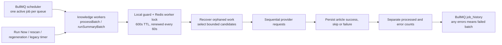
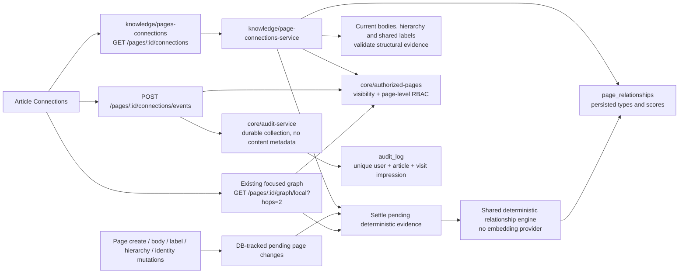
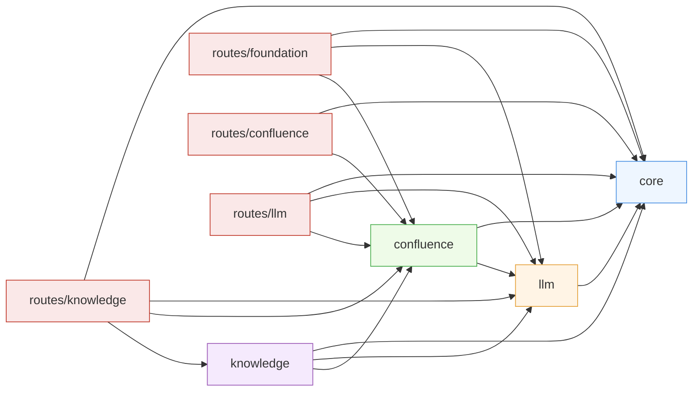
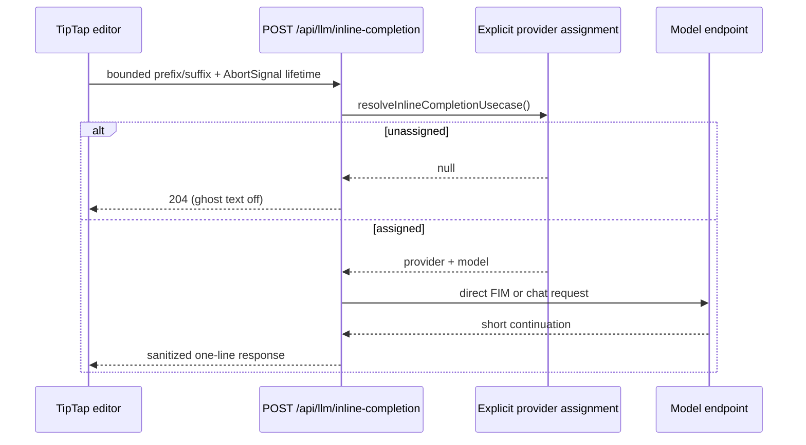
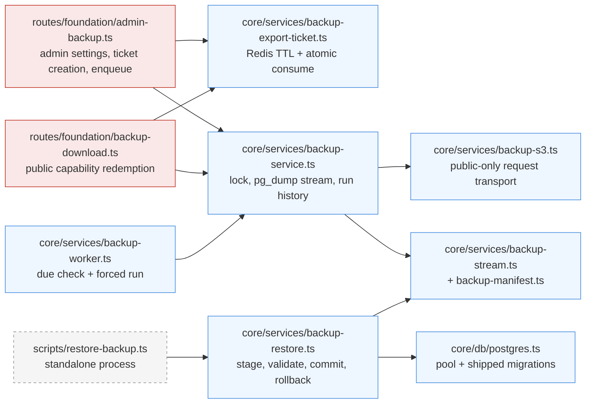

# 3. Backend Domains (C4 Level 3 — Components)

Zooms into the `backend` container. The code is organized by domain with
imports enforced by `eslint-plugin-boundaries` (see
`backend/eslint.config.js`).

## Domain map

```mermaid
flowchart LR
    subgraph routes["routes/ (HTTP entry points)"]
        direction TB
        rF["foundation<br/>health, auth, settings,<br/>admin, admin-embedding-locks,<br/>backup admin + public download,<br/>rbac, notifications, setup"]
        rC["confluence<br/>spaces, sync, attachments"]
        rL["llm<br/>llm-ask (SSE), improve, generate,<br/>summarize, diagram, conversations,<br/>inline-completion, embeddings,<br/>embedding-shadow, models,<br/>admin, pdf, prepare-image"]
        rK["knowledge<br/>pages CRUD, relocate, versions, tags,<br/>embeddings, duplicates, pinned,<br/>templates, comments, search,<br/>analytics, export/import,<br/>notion connection, tree, and import,<br/>pages-collab (WS gateway)"]
    end

    subgraph domains["domains/"]
        direction TB
        dC["<b>confluence</b><br/>confluence-client<br/>sync-service<br/>attachment-handler (download/cache)<br/>attachment-sweep-service (#1349 orphan sweep)<br/>subpage-context<br/>sync-overview-service"]
        dL["<b>llm</b><br/>openai-compatible-client<br/>inline-completion-client<br/>llm-provider-service<br/>llm-provider-resolver<br/>llm-provider-bootstrap<br/>embedding-service<br/>shadow-migration-service<br/>shadow-compare-service<br/>rag-service<br/>retrieval-confidence<br/>sibling-assembly<br/>identifier-shortcircuit<br/>rerank-client<br/>llm-cache + cache-bus<br/>vision-probe<br/>model-capabilities<br/>image-analysis-client<br/>image-analysis-worker<br/>image-analysis-compose<br/>image-intake<br/>retrieved-images<br/>lexical-chunk-resolution<br/>derived-provenance<br/>page-identity"]
        dK["<b>knowledge</b><br/>auto-tagger<br/>quality-worker<br/>summary-worker<br/>version-tracker<br/>duplicate-detector<br/>page-relocate-service<br/>notion-client<br/>notion-token-service<br/>notion-tree<br/>notion-block-converter<br/>notion-import-service (#1459)<br/>notion-import-job"]
    end

    subgraph core["core/ (infrastructure)"]
        direction TB
        cDB["db/ — pg pool, migrations,<br/>vector-column-tier, with-lock-retry"]
        cPlug["plugins/ — auth, correlation-id, redis"]
        cSvc["services/ — redis-cache, audit,<br/>error-tracker, content-converter,<br/>circuit-breaker, image-references,<br/>rbac, notifications, pdf,<br/>admin-settings, version-snapshot,<br/>sse-stream-limiter, queue-service,<br/>data-retention, rate-limit,<br/>ssrf-allowlist-bus, admin-user-service,<br/>image-validator, image-staging,<br/>local-attachment-service, attachment-store,<br/>page-icon-store, standalone-attachment-cleanup,<br/>image-analysis-dirty,<br/>backup-service/stream/manifest/restore,<br/>backup-settings/S3/worker/export-ticket,<br/>collab-room-service, collab-flag,<br/>collab-tombstone, collab-guard"]
        cUtil["utils/ — crypto (AES-GCM),<br/>logger (pino), sanitize-llm-input,<br/>ssrf-guard, tls-config, llm-config"]
        cEnt["enterprise/ — types, noop,<br/>loader, features"]
    end

    rF --> core
    rC --> core
    rC --> dC
    rL --> core
    rL --> dL
    rL --> dC
    rK --> core
    rK --> dK
    rK --> dL
    rK --> dC

    dC --> core
    dC --> dL
    dL --> core
    dK --> core
    dK --> dL
    dK --> dC
```

### Quality and summary batch execution

```mermaid
flowchart LR
    schedule["BullMQ scheduler<br/>one active job per queue"] --> batch["knowledge workers<br/>processBatch / runSummaryBatch"]
    manual["Run Now / rescan / regeneration / legacy timer"] --> batch
    batch --> lease["Local guard + Redis worker lock<br/>600s TTL, renewed every 60s"]
    lease --> candidates["Recover orphaned work<br/>select bounded candidates"]
    candidates --> inference["Sequential provider requests"]
    inference --> pages["Persist article success, skip or failure"]
    pages --> result["Separate processed and error counts"]
    result --> history["BullMQ job_history<br/>any errors means failed batch"]
```

The exported batch entrypoints own the lease and `isProcessing` state, not
only the manual/timer wrappers. This prevents a scheduled run from reclaiming
an article still being processed by a manual run. A configured Redis acquisition
failure refuses the run; a deployment without a Redis client retains the local
guard. Lease loss stops the loop before the next article, and release compares
the ownership token. Batch size is `admin_settings.quality_batch_size` /
`summary_batch_size` (Settings → AI Models → Workers), read once at the start of each
batch; cadence stays on the interval env vars, and there is no automatic
backlog-draining loop. Operator recovery:
[Background Workers](../ADMIN-GUIDE.md#background-workers).

### Article Connections (#1314)

```mermaid
flowchart LR
    panel["Article Connections"] --> read["knowledge/pages-connections<br/>GET /pages/:id/connections"]
    read --> service["knowledge/page-connections-service"]
    service --> evidence["page_relationships<br/>persisted types and scores"]
    service --> materialize["Settle pending deterministic evidence"]
    changes["Page create / body / label / hierarchy / identity mutations"] --> dirty["DB-tracked pending page changes"]
    dirty --> materialize
    materialize --> engine["Shared deterministic relationship engine<br/>no embedding provider"]
    engine --> evidence
    service --> live["Current bodies, hierarchy and shared labels<br/>validate structural evidence"]
    service --> access["core/authorized-pages<br/>visibility + page-level RBAC"]
    panel --> collect["POST /pages/:id/connections/events"]
    collect --> access
    collect --> audit["core/audit-service<br/>durable collection, no content metadata"]
    audit --> store["audit_log<br/>unique user + article + visit impression"]
    panel --> local["Existing focused graph<br/>GET /pages/:id/graph/local?hops=2"]
    local --> access
    local --> materialize
```

Authorization removes inaccessible source/target pages before panel ranking and
before local-graph traversal, limits, and counts. Unavailable intermediate pages
cannot expose second-hop neighbors. The global graph and its navigation remain
unchanged. Explicit links and hierarchy do not depend on embeddings; current
bodies and parent IDs recover direction from canonical persisted pairs.
Recommendations remain bounded to five, ordered by persisted evidence score.

## ESLint-enforced boundary rules

Defined in `backend/eslint.config.js` with `eslint-plugin-boundaries`:

```mermaid
flowchart LR
    classDef core fill:#eef6ff,stroke:#4a90e2
    classDef llm fill:#fff4e5,stroke:#e5a23c
    classDef conf fill:#eefbe8,stroke:#4caf50
    classDef know fill:#f5eafd,stroke:#9b59b6
    classDef route fill:#fae8e8,stroke:#c0392b

    core[core]:::core
    llm[llm]:::llm
    conf[confluence]:::conf
    know[knowledge]:::know
    rF[routes/foundation]:::route
    rC[routes/confluence]:::route
    rL[routes/llm]:::route
    rK[routes/knowledge]:::route

    llm --> core
    conf --> core
    conf --> llm
    know --> core
    know --> llm
    know --> conf

    rF --> core
    rF --> llm
    rF --> conf
    rC --> core
    rC --> conf
    rL --> core
    rL --> llm
    rL --> conf
    rK --> core
    rK --> llm
    rK --> conf
    rK --> know
```

**Rules (mnemonic):**

- `core` imports **nothing** from domains/routes. It is pure infrastructure.
- `confluence` may use `llm` (for sync-time embedding).
- `llm` is self-contained (core only).
- `knowledge` is the integrator and may use all three other domains.
- `routes/foundation` may import `core` + `llm` + `confluence` — widened by
  #1347 (below) for the provider health check, list-models, the LLM
  concurrency/queue-depth admin knobs, the confidence-basis resolver
  (`admin.ts`, `health.ts`, `setup.ts`), and the Confluence connection
  test/sync overview (`settings.ts`). It does **not** import `knowledge`.
- `routes/confluence` may import `core` + `confluence`.
- `routes/llm` may import `core` + `llm` + `confluence` (sub-page context,
  `getClientForUser`) — this allowance predates #1347.
- `routes/knowledge` is the top-level aggregator and may import anything.

**Realtime collab (#1444).** Yjs, `y-protocols`, and the collab room/flag/guard/tombstone
helpers live in `core` plus the `GET /api/collab/:pageId` gateway in
`routes/knowledge`. Do **not** put Yjs in `domains/llm`. `assertNoLiveCollabRoom`
is in `core` so `routes/llm` can 409 Apply while a room is live (wired in a
later PR).

Adding a new import across these lines without updating the ESLint config is
a build failure — update the config *and* this diagram together.

**The rule above was not enforced for any route file until #1347.**
`boundaries/elements` patterned each route element as `src/routes/<x>/*`
(`mode: 'folder'`), which classifies a SUBFOLDER of that directory, not a
file sitting directly in it — and every route file lives directly in
`src/routes/<x>/`, so no route file ever matched an element and
`boundaries/dependencies` silently never fired for any of them. Domain
folders (`src/core`, `src/domains/*`) have no direct files today, which is
why *their* rules were already firing correctly. The fix is bare folder
patterns (`src/core`, `src/routes/foundation`, …), which `mode: 'folder'`
classifies whether the file is direct or nested, plus
`boundaries/no-unknown-files: error` so a file that maps to no element fails
lint outright instead of silently opting out of every rule (this caught
`src/telemetry-register.ts`, now mapped into the `app` element).
`backend/src/eslint-boundaries.test.ts` lints synthetic probe source through
ESLint's Node API to pin both directions — a disallowed cross-boundary
import fails, an allowed one does not — so a future config regression is a
red test rather than a silent no-op. Enforcing the rule as originally
written reported 7 real violations, all `routes/foundation` reaching into
`domains/llm`/`domains/confluence`; the allow-list above reflects the
widening decided in #1347 rather than re-homing those call sites (rejected
as an L-size change to route registration, out of scope for a lint fix).
`boundaries/no-unknown` (which flags an unresolvable *dependency target*,
not an unmapped source file) stays off — `@compendiq/contracts` resolves
outside `src/` and would be pure noise.

## Inline completion (#1417)

`routes/llm/llm-inline-completion.ts` is the authenticated, permission-checked
HTTP boundary for TipTap ghost text. It validates a small request contract,
sanitizes prefix, suffix, title, space key, and language independently, and
returns `204` when the `inline_completion` use case is unassigned. Unlike chat
and background jobs, the route does not emit a content-bearing LLM audit row;
it records only fixed-field aggregate counts in Redis.

`domains/llm/services/inline-completion-client.ts` is intentionally separate
from `openai-compatible-client.ts`. It keeps provider authentication, TLS,
OpenTelemetry, and the per-provider circuit breaker, but its undici request
bypasses the general LLM queue so a short editor completion cannot wait behind
a long generation. The request's disconnect signal is passed directly to
undici. Recognized coder models use a FIM prompt on `/completions`; other
models use `/chat/completions`. Both paths share the bounded-token, one-line
normalizer.

```mermaid
sequenceDiagram
    participant E as TipTap editor
    participant R as POST /api/llm/inline-completion
    participant P as Explicit provider assignment
    participant M as Model endpoint
    E->>R: bounded prefix/suffix + AbortSignal lifetime
    R->>P: resolveInlineCompletionUsecase()
    alt unassigned
        P-->>R: null
        R-->>E: 204 (ghost text off)
    else assigned
        P-->>R: provider + model
        R->>M: direct FIM or chat request
        M-->>R: short continuation
        R-->>E: sanitized one-line response
    end
```

This introduces no domain-boundary edge: the route still composes
`routes/llm → domains/llm + core`, and the client remains `llm → core`.

## Image input (#1154)

`core/services/image-validator.ts` (magic-byte sniffing, dimension ceilings)
and `core/services/image-staging.ts` (per-user Redis staging, content-addressed
by sha256) live in `core` because neither depends on an LLM concept — they are
generic upload-handling, the same layer `content-converter.ts` and
`document-extractor.ts` already occupy. `domains/llm/services/vision-probe.ts`
(sends a known-content image, judges the reply) and `model-capabilities.ts`
(persists/reads the verdict) live in `llm` because probing *is* an LLM
concern. Neither imports the two `core` image modules — that composition
happens one layer up, in `routes/llm`. Their only imports outside `domains/llm`
itself are `core/db/postgres.ts` and `core/utils/logger.ts`, well inside the
existing `llm → core` rule, so no new rule is needed.

`routes/llm/prepare-image.ts` composes the two `core` image modules alone
(validate, then stage). `resolveImagePart`, shared by `routes/llm/llm-generate.ts`
/ `llm-improve.ts` (defined in `routes/llm/_helpers.ts`), is what actually joins
`core` (`image-staging.ts`'s `loadStagedImage`) with `llm`
(`model-capabilities.ts`'s `getVisionCapability`) — the same `core` + `llm`
composition every other `routes/llm` file already does — so no new arrow, and
in particular no `llm → confluence` edge.

`domains/llm/services/shadow-migration-service.ts` (#1116) owns the
zero-downtime embedding-model change: it issues **runtime DDL** for the
`embedding_next` / `page_avg_embedding_next` shadow columns, runs the backfill
worker behind the `shadow-reembed` queue, and performs the rename-swap,
rollback and cleanup. Its arrows stay inside `llm → core`
(`core/db/postgres.ts`, `core/services/queue-service.ts`,
`core/services/redis-cache.ts` for the graph-cache invalidation,
`core/enterprise/loader.ts` for the org-policy precedence check). It also
reaches `embedding-service.ts` — its own domain sibling — through a **dynamic**
import, because `embedding-service` imports it for the dual-write and a static
edge would close the cycle at module-init time. `routes/llm/llm-embedding-shadow.ts`
is the admin surface (start / status / swap / rollback / cleanup / backfill),
`requireAdmin` on every route.

The guard it exports the other way round, `assertNoShadowMigration` /
`assertShadowRollbackWindowClear` in `embedding-service.ts`, is called from
`routes/knowledge/pages-crud.ts` and `routes/foundation/admin.ts` as well as
`routes/llm` — the same `routes/* → domains/llm` composition those files
already do for `processDirtyPages`.

`domains/llm/services/shadow-compare-service.ts` (#1260) runs during that
migration's `ready` window — the only time both models' vectors exist on the
same chunk rows. It samples the most frequent `search_analytics` queries
(`eval/analytics-query-sampler.ts`, ONE sampler shared with the production
benchmark so the two harnesses' normalisation cannot drift; only the ORDER
differs), embeds each query once per model with the #1114 instruction prefix
applied per model, and retrieves top-K pages from `embedding` and
`embedding_next` through `vectorSearch`'s allow-listed `column` option — the
same SQL, ACL predicate and `ef_search` discipline as the live probe, never a
sibling function. An unfilled candidate row must never enter the top-K —
`embedding_next` is nullable by construction, `NULL <=> $2` is NULL, and
`1 - null` is 1 in JS, i.e. a perfect match that would inflate every figure
computed from it. What guarantees that is the `distance !== null` filter in
JS, which also covers the LIVE column between a swap and its cleanup; the
shadow arm's `AND embedding_next IS NOT NULL` is a NARROWING beside it (ASC
ordering puts NULLs last, so such a row cannot displace a scored one under
the LIMIT), not the guarantee. A transient embedding or retrieval failure
costs its own query, not the run: the query is skipped, counted on the report
as `failedQueries`, and only a majority of failures fails the whole
comparison.

Run records reuse `retrieval_benchmark_runs` with
`config.kind = 'shadow-compare'`, through the SHARED
`eval/benchmark-run-lifecycle.ts` — insert, claim, progress + heartbeat,
complete, fail, the kind-aware stale sweep and the kind-guarded fetch, one
copy for both kinds. A comparison and a production benchmark exclude each
other on the 091 one-active index. Mode 2 judgements persist in
`embedding_compare_judgements` (migration 101), keyed by provider AND model on
each side AND by the JUDGE (`judged_by`, migration 109 / #1527 — the stored
page-id arrays carry the judging admin's visibility, so a key without it let
one admin overwrite another's evidence). The read collapses to ONE judgement
per query — `DISTINCT ON (query_hash) … ORDER BY query_hash, created_at DESC,
id DESC`, the newest judgement, taken whole — so one query stays one McNemar
trial while every judge's row survives on disk. The verdict is computed from
`eval/metrics.ts`
(`pairedSignificance`, `recallAtK`, `meanReciprocalRank`) — never re-derived;
the p-value floor counts the live/candidate PICKS, not ties. The admin surface
is five more routes on `routes/llm/llm-embedding-shadow.ts`
(`POST …/compare`, `GET …/compare` for the latest run, `GET …/compare/:id`,
`POST/GET …/compare/:id/judgements`), all `requireAdmin`, all scoped to the
admin who started the run, results carrying page ids and titles only.

## The image-embedding leg — RETIRED (#1115 P1–P4, removed by #1618 stage 2)

Six modules in `domains/llm/services`, two in `core/services` and two rules in
`core/db` implemented ADR-025's separate image vector space:
`vl-embedding-client.ts` (vLLM's chat-embeddings extension),
`image-embedding-probe.ts`, `image-embedding-index.ts` (the runtime DDL that
retyped `page_image_embeddings.embedding` to the probed width),
`image-embedding-service.ts` (`embedPageImages`, the `image_embedding_dirty`
backlog under `worker:lock:image-embedding-index`), `image-leg-search.ts` (the
third RRF leg) and `core/services/image-embedding-target-dimensions.ts` (the
MRL truncation width). **All of them are deleted** — migration 118 drops the
table, the column, the two `admin_settings` rows and the `image_embedding`
assignment — on the authorisation **"Remove it, nobody was using it in
production."**: unused in production plus maintenance burden, explicitly not a
measurement (ADR-027 A-5). `docs/runbooks/image-embedding-retirement.md` is
the cutover and its rollback.

Three things survive the deletion and are described below:

- **`core/services/image-analysis-dirty.ts`** — the same module, renamed with
  its column (`pages.image_analysis_dirty`, ADR-027 D6.2). It still exists in
  `core` for the same reason: `core` may not import a domain, and its
  ATTACHMENT-writer callers — the two sync attachment writers,
  `fetchAndCachePageImage`, `writeAttachmentCache`, `cleanPageAttachments`
  (all `domains/confluence`) and `putLocalAttachment` (`core`) — include one
  that lives there. The **body** writers still do not go through it: each is
  already issuing an UPDATE (or INSERT) on the row and raises the column
  inline as one more clause — **unconditionally** where the statement rewrites
  the body wholesale (the sync upsert in `sync-service.ts`, both relocate
  directions in `page-relocate-service.ts`, both create arms in
  `routes/knowledge/pages-crud.ts`), and **gated on
  `body_html IS DISTINCT FROM $n`** so a title-only save costs nothing, on the
  edit paths (the conflict-policy update, the four `body_html` writers in
  `routes/knowledge/pages-crud.ts`, `restoreVersion` in
  `domains/knowledge/services/version-tracker.ts`, and both branches of
  `POST /llm/improvements/apply`). Audit the column, not this module's
  importers.
- **`core/services/image-references.ts`** — `extractImageReferencesFromHtml`
  reads the STORED body rather than Confluence's storage format, because a
  standalone page has no `body_storage` and a relocated one still carries a
  stale copy describing attachments its body no longer points at. The image
  analysis intake reads it exactly as the embedder did.
- **`retrieved-images.ts` (P4)** — the answer-time byte pick, rewired by
  #1617 to take its candidates from derived provenance; see below.

### Image analysis in the text index (ADR-027, #1616 — ingestion half)

The ADR-027 candidate's ingestion side lives in `domains/llm/services/`, all
of it `llm` → `core` only; the vision assignment, identity and client modules
it consumes are #1615's and reach it through one import point:

- **`image-analysis-provider.ts`** — a PURE re-export of #1615's
  `image-analysis-identity.ts` (the resolved and retained identity),
  `image-analysis-client.ts` (`analyzeImage` and its failure classing),
  `getImageAnalysisMaxOutputTokens` and the `@compendiq/contracts` payload
  types. It holds no logic: while the two packages were in flight it carried
  local stand-ins with the agreed signatures, and #1615's merge replaced every
  one of them.
- **`image-analysis-validity.ts`** — D5's ONE validity predicate
  (`validitySql` / `isValidAnalysisRow`) with the prompt and schema versions
  bound from code. With nothing retained the predicate is unsatisfiable, so a
  never-assigned instance composes and counts nothing.
- **`image-intake.ts`** — the raster intake both image pipelines share
  (resolve bytes, sniff, `MAX_IMAGE_BYTES` / `MAX_IMAGE_DIMENSION`, sha256),
  moved out of `image-embedding-service.ts` under #1616's ownership. Its
  outcomes separate the corpus from the disk: `skipped` (absent, unsupported,
  oversized, …) is a verdict, `unavailable` is a read failure that is NOT an
  absence (`EACCES`, `EIO`, …) and carries no skip reason.
- **`image-analysis-reconcile.ts`** — D4/D6.2: claim `image_analysis_dirty`
  BEFORE enumerating, upsert `page_image_analyses` rows from the body's
  current references (new → `pending`; changed hash → `pending`, fresh
  budget; gone → deleted; absent file → row kept, `missing` only when never
  rowed; unreadable file → no row for that reference, an existing one kept,
  the page's other references still written, the page left dirty and counted
  in the batch's `pagesFailed`; policy → `skipped`), and bump `image_analysis_revision` +
  `embedding_dirty` in one statement only when the VALID derived set changed
  (an `analyzed` row deleted, re-pended or skipped — D6.3); a new
  `pending`/`skipped` row bumps nothing.
- **`image-analysis-worker.ts`** — D13: `runImageAnalysisBatch()` on the
  #1612 pattern (`worker:lock:image-analysis`, 600 s / 60 s, `assertLockHeld`
  before every write, the last-run line included). Step 1 sweep (+ inverse
  `reused`, stale-failed return, `truncated:<ceiling>` re-open), step 2
  reconcile, step 3 analyze behind the three-term gate; a work row whose file
  is ABSENT at call time → `skipped (missing)`, out of the work window, one
  that is there but unreadable → `failed (unavailable:bytes)` with an attempt
  charged and never terminal; backoff
  `LEAST(15 min × 2^LEAST(attempts, 7), 24 h)` (clamped exponent),
  `IMAGE_ANALYSIS_MAX_ATTEMPTS` = 5, provider-status and uniform-rejection
  stops with re-probe; `retryFailedImageAnalyses`, `reanalyzeAllImages` (409
  under the one-active-run rule) and `readImageAnalysisLastRun` for #1618's
  card. Queue `image-analysis` (concurrency 1, sync cadence) in
  `core/services/queue-service.ts` is its one scheduled trigger; sync does
  not kick it.
- **`image-analysis-serialize.ts`** — D8's deterministic
  `serializeImageAnalysis(payload, context)` (fixed labels, bounded context
  lines, ≤ 3 parts over `CHUNK_HARD_LIMIT`) and `substantiveChars`.
- **`image-analysis-compose.ts`** — D9: `planDerivedChunks` reads the valid
  rows and the page's `image_analysis_revision`; `embedPage` appends them
  after every authored index with `metadata.source = 'image_analysis'` +
  provenance, excludes them from both page averages, dual-writes them under a
  shadow, and clears `embedding_dirty` only if the revision is unchanged.
- **`image-analysis-readiness.ts`** — the pure readiness function
  (`none | complete | partial | pending | failed | skipped`) and the corpus
  counts #1618 renders.
- **`lexical-chunk-resolution.ts`** (#1617) — D10's query-time SQL, as
  fragments rather than a second copy: the derived candidate arm
  (`MAX(ts_rank(chunk_tsv, q)) GROUP BY page_id`, carrying the caller's
  `visiblePagesPredicate`), the per-page `LATERAL` best-chunk resolution, and
  the mapper that turns its columns into `chunkText`/`chunkIndex`/
  `sectionTitle`/`derived`. `keywordSearch` and `lookupIdentifier` are its two
  callers and differ in ONE argument — the pin adopts the resolved chunk only
  on a real `chunk_tsv @@ q` hit (erratum #1617/Q1). One definition, the
  `image-analysis-validity.ts` precedent.
- **`derived-provenance.ts`** (#1617) — D9.4's `metadata` → `SearchResult.
  derived` reader (TOTAL and STRICT: a partial shape yields `undefined`, never
  a half-populated object, because D12 requires the four citation fields to
  travel together), the `(pageId, attachment_source, attachment_key)` dedup
  and fused-rank ordering, and `buildDerivedImageSources` — the D12
  `kind: 'image'` citations, whose one batched `pages` read supplies the three
  columns `buildPageImageUrl` needs and which soft-fails to no citations
  rather than 500 an answerable turn. It is the only reader of that metadata:
  neither the route nor the byte pick touches raw `metadata`, and nothing on
  the query path joins `page_image_analyses`.
- **`page-identity.ts`** (#1617 review r1) — the memoized
  `(id, confluence_id, source)` reader both of the above need
  (`buildPageImageUrl` and `resolveAttachmentBytes` each require all three and
  refuse to infer `source`). `/llm/ask` builds ONE per request and hands it to
  the citation append and the byte pick, so a turn that cites a picture and
  shows it to the model takes one `pages` read, not two identical ones.
  No visibility predicate, deliberately: the ids come from retrieval, which
  already applied it (D14), so a reader must never be given a page id from a
  request.

`core/services/image-analysis-dirty.ts` and every inline `image_analysis_dirty`
writer raise the flag in the same statement; `rag-service.ts`'s
coverage query counts a page with a valid analysis and its sibling window never
crosses the authored/derived boundary. The FTS-language PUT rebuilds
`page_embeddings.chunk_tsv` in the same transaction as `pages.tsv`.

**`retrieved-images.ts` (P4, rewired by #1617)** turns the pictures the
answer's rows came from into `image_url` parts on the user turn:
`pickRetrievedImages` selects round-robin across pages with a byte-identity
dedupe, re-runs `validateImage` unforked and stops at a derived base64 budget.
Since #1617 its candidates come from `SearchResult.derived` through
`derived-provenance.ts` (ADR-027 D11) — so it imports no `ImageHit` and there
is no per-image score to order by: the carrying row's fused rank decides, then
`part`. #1617's whole-set fallback to ADR-025's `imageHits` is **gone** (#1618 stage
2 deleted it with the leg it read): a set with no derived provenance attaches
no picture, and the module names no legacy hit type at all. **The vision gate is the
CALLER's, not this module's** — `routes/llm/llm-ask.ts` reads the stored #1154
verdict and calls the pick only on an exact `true` (09's "Four gates, cheapest
first"). So the pick loads bytes unconditionally, and nothing that has not
already applied that gate may reach it. **It is a service because of the P0
guard, not despite it.** `resolveAttachmentBytes` applies no ACL and
`attachment-store.test.ts` fails if any file under `src/routes` names it, so
the read is legal only where retrieval has already applied
`visiblePagesPredicate` and the EE per-page filter — and that argument is what
the module boundary records. `routes/llm/llm-ask.ts` reaches
`pickRetrievedImages`, never the store.

`core/db/vector-column-tier.ts` (`columnTypeFor`, `HNSW_PARAMS`) and
`core/db/with-lock-retry.ts` are **moves, not additions**: the tiering rule was
stated identically in `shadow-migration-service.ts`, `embedding-service.ts` and
`eval/seed.ts`, and the bounded-lock DDL transaction lived in the first of
those. Both are now imported by all their callers, image path included. They are
in `core/db` because they are facts about Postgres and pgvector, not about LLMs,
and because `domains/llm` may import `core` and nothing else.

All arrows stay inside `llm → core`. Two admin surfaces, both `requireAdmin`
throughout: `routes/llm/llm-usecases.ts` owns the CONFIGURATION (the
probe-gated `image_analysis` assignment PUT), and
`routes/llm/llm-image-analysis.ts` owns the WORK (`GET
/admin/embedding/image-analysis` for the status the Embeddings-tab card renders,
plus `…/rescan` and `…/process`, both of which start a detached scan and answer
immediately — a corpus-wide run outlives every proxy timeout in the path).

**Nothing in `domains/llm/eval/` is part of the running server**, and the image
axis is five modules there — `images-axis.ts` (flag parsing and the run's
refusals), `seed-images.ts` (the corpus through the REAL intake),
`runner-images.ts` (both arms, paired), `images-metrics.ts` and
`images-report.ts` — plus `corpus-images.ts` for the manifest. They import the
same `hybridSearch` and `embedPageImages` the product runs, which is the point:
a harness with its own copy measures its own copy. Recipe and report fields:
`docs/runbooks/retrieval-eval.md`, "Image axis (`--images`)".

The ADR-027 arm axis (#1614 PR2) adds three modules beside them and two
entrypoints, still nothing the server loads: `arms.ts` (the `--arm B|C`
flag — arm A is refused like any unknown arm since #1618 stage 2 retired its
index — `ArmRunReportSchema`, the provenance the ADR refuses a report
without, `assertComparableArms` over the "Held fixed" list, the per-arm
evidence rule reading D11's `derived.attachmentKey`, and the owner decisions
O1–O7 as constants), `answers.ts` (one arm's answers through the real
`POST /api/llm/ask` — `buildApp()` + `inject`, `rag_answer_max_images = 0`,
SSE parsed — written arm-blinded with a structural key walk that refuses a
leak) and `judgments.ts` (`JudgmentRowSchema`, the blinded sheet merge with
its pre-judging hashes, the `--unblind` refusal until every item carries
exactly one judgment by one judge, and the paired verdict: McNemar exact,
the page-cluster bootstrap from `metrics.ts`, the one-sided margins and the
three-part decision rule, labelled single-judge). `runner-images.ts` gains
the single-arm `runArmEval`; `seed-images.ts` seeds the text half and the
attachment bytes only — the state both surviving arms start from. `scripts/run-arm-answers.ts` and
`scripts/judge-arms.ts` are the entrypoints; `eval/artifacts/1611/` is where
captured runs live (none yet — its README says why).

## Image analysis: assignment, identity and the inference client (#1615, ADR-027)

The candidate that replaces the leg above (ADR-027; epic #1611). #1615 lands the
configuration half — the use case, its probe-gated assignment, the retained
identity, the settings ceiling and the pure inference client — and nothing that
writes a `page_image_analyses` row (the worker, the reconcile and the sweep are
#1616's). Two modules in `domains/llm/services`, both `llm → core` only:

- **`image-analysis-identity.ts`** — the ONE place that hashes (ADR-027 D5):
  `computeIdentityHash({providerId, model, baseUrl})` =
  `sha256(providerId + '\n' + model + '\n' + baseUrl)`; `resolveImageAnalysisIdentity()`
  (the live assignment through `resolveImageAnalysisUsecase`, null when
  unassigned); `resolveCandidateImageAnalysisIdentity({providerId, model?})` (the
  PUT's resolution rule — assignment model, else `default_model`, else the typed
  `no_provider` / `no_model` refusal — shared with the scope preview so the two
  cannot disagree); the retained identity's read
  (`getRetainedImageAnalysisIdentity`, `admin_settings.image_analysis_identity`,
  JSON `{providerId, model, baseUrl, identityHash, assignedAt}`, never seeded)
  and its ONLY writer (`retainImageAnalysisIdentity`, D7: equal hash → resume,
  different → replace and count the analyzed rows that fail D5's validity
  predicate under the new one — `countRowsInvalidatedBy` /
  `reanalysisScopeFor`, both constants bound from code). It re-exports
  `IMAGE_ANALYSIS_PROMPT_VERSION` so the worker binds the predicate from one
  import.
- **`image-analysis-client.ts`** — `analyzeImage(...)`, pure: no row is read or
  written, no page context enters the prompt, nothing of the reply or the bytes
  is logged (D14). One chat completion through `chatCompletion()` (the
  `openai-compatible-client.ts` sibling of `chat()` that also answers
  `finish_reason` and `usage`; `chat()` is now a one-line wrapper over it) with
  `temperature: 0`, `max_tokens` = the ceiling, no `tools`, no
  `response_format`, the image as a `data:` URL. It validates the first JSON
  object of the reply against `imageAnalysisPayloadSchema(T)` from
  `@compendiq/contracts` and answers one of D8's six classes on failure —
  `malformed`, `refused` (matched against `REFUSAL_PATTERNS`, which live HERE
  and not in `sanitize-llm-input.ts`, ADR-027 erratum; on the bare reply when
  no JSON parsed, else on the parsed `description` BEFORE the substantive
  floor, so a polite wrapped refusal cannot pass as a description — never on
  `visibleText`, which transcribes the image, and only when nothing outside
  the description observed the image either, so a description OF a refusal
  or error screenshot with the transcription or the `structured` block beside
  it stays an analysis), `empty` (below the floor),
  `truncated` (with the ceiling), `rejected` (exactly 400/413/415/422, with
  the status) and `unavailable` (408, 429, 5xx and non-HTTP failures keep the
  batch running; every other 4xx is the provider-level default arm,
  `providerLevel: true`).
  `encodeImageAnalysisError` spells the row's `error` column
  (`truncated:8192`, `rejected:413`, `unavailable:405`). It refuses to post
  bytes at a provider whose `base_url` differs from the identity it was handed.
  `IMAGE_ANALYSIS_PROMPT_VERSION` is defined here, beside the prompt it versions.

`vision-probe.ts` / `model-capabilities.ts` gained an optional `timeoutMs`
(`refreshVisionCapability(providerId, model, { timeoutMs })`): the assignment PUT
runs the known-content probe synchronously inside an admin request and bounds it
at `vision-probe.ts`'s own `VISION_PROBE_TIMEOUT_MS`; the chat path's
fire-and-forget refresh is unchanged. `core/services/admin-settings-service.ts`
gained `getImageAnalysisMaxOutputTokens()` (`image_analysis_max_output_tokens`,
default 8192, range [4096, 16384], strict-shape read — an unparseable or
out-of-range row is the DEFAULT, never clamped — 60 s TTL, invalidated by the
admin PUT's key table), the ceiling the worker reads once per batch and the
client sizes the payload schema from.

Two admin surfaces, all `requireAdmin`. `routes/llm/llm-usecases.ts` owns the
CONFIGURATION: the pre-write probe branch in `PUT /admin/llm-usecases` (four
422 reasons — `no_provider`, `no_model`, `text_only`, `unconfirmed` — each
leaving the previous row AND the retained identity untouched; `true` pins the
resolved model, commits, then retains the identity and answers
`{ ok, reanalyzeRows }`), `GET /admin/llm-usecases/image_analysis/capability`
(`ImageAnalysisCapabilityDetailSchema`: the chat detail plus `identity`,
`identityDrift` — resolved hash ≠ retained hash, the state a provider
`base_url` edit produces — and, on the re-check only, `reanalyzeRows`),
`POST …/image_analysis/recheck` (D7's second writer: a `true` verdict on a
drifted identity adopts it; `false`/`null` touch nothing) and
`GET …/image_analysis/reanalysis-scope?providerId&model` (the D7 scope preview:
resolves by the PUT's rule, hashes, counts — no probe, no write, no call; 422
with the PUT's two resolution reasons, never the probe's). The new
**`routes/llm/llm-page-image-analyses.ts`** owns the D14 diagnostic:
`GET /admin/pages/:id/image-analyses[?payload=1]` — page visibility through
`visiblePagesPredicate` BEFORE any row is read (404 either way, so a shared
`content_hash` grants nothing), rows without `payload` unless asked, `error` as
the D8 class, and `valid` as D5's predicate evaluated against the retained
identity and the running constants.

**`routes/llm/llm-image-analysis.ts`** (#1618 stage 1) is the operator's
processing surface, `requireAdmin` + the admin rate limit, and it adds no SQL
of its own (`llm-image-index.ts`, which it was mounted beside, went with the
retired leg in stage 2) — it is four HTTP routes over
reads and actions #1616 shipped without one. `GET /admin/embedding/image-analysis`
(`ImageAnalysisStatusSchema`) composes `readImageAnalysisCorpusCounts()`, the
retained identity, `resolveImageAnalysisIdentity()`, `readImageAnalysisLastRun()`
and the worker lock into four facts none of which may be inferred from another:
assignment, retained identity, whether those agree
(`identityMatchesAssignment`, D13's third gate — `null` only when nothing is
assigned, because an unassigned instance is PAUSED, not mismatched), and the
last batch. `POST …/process`, `…/retry-failed` and `…/reanalyze-all` each kick
`runImageAnalysisBatch()` **detached** and report `started` / `alreadyRunning`
read from the lock BEFORE the kick: a batch is bounded by
`image_analysis_batch_size` (seeded 50) at up to 120 s per image, so awaiting it
would hold the request past every proxy timeout in the path. The two bulk
actions' row counts ARE awaited — one bounded statement each, and the count is
what the toast quotes. `reanalyzeAllImages()` owns the one-active-run rule it
shares with text Re-embed all and the #1116 shadow backfill and throws the 409;
the route does not restate it.

Migration `115_page_image_analyses.sql` (the ADR's SQL verbatim): the table,
the two indexes, the use-case CHECK re-added with `image_analysis`, the NULL
assignment row and the `image_analysis_max_output_tokens = '8192'` seed. The
worker-side columns (`pages.image_analysis_dirty` / `_revision`,
`page_embeddings.chunk_tsv`) are migration 116, #1616.

## Attachment bytes: one reader in `core`, the writers in `confluence` (#1115)

`core/services/attachment-store.ts` holds the path resolution and the READ half
of what used to be `domains/confluence/services/attachment-handler.ts`:
`safeAttachmentPath` and its traversal guards, `readAttachment`,
`attachmentCacheDir` / `listCachedAttachments` / `readCachedAttachmentFile`,
`getMimeType`, plus one new `resolveAttachmentBytes`. Everything that talks to
Confluence or writes to disk — `cacheAttachment`, the draw.io and cross-page
image sync, `writeAttachmentCache`, the relocate writers — stayed in the
confluence domain, which re-exports the moved names so its six importers did not
change.

**#1349 moved the DELETERS into `core` too, and the split runs by CALLER, not
by verb.** `attachment-store.ts` now also exports `attachmentsRootNow`,
`removeCachedAttachmentDirectory` / `removeCachedAttachmentFile` and
`ATTACHMENT_ROOT_RESERVED_DIRNAMES` (`local/`, `page-icons/`, and
`client-models/` for #1418 operator-supplied ONNX/Hunspell on the attachments
volume). `GET /api/models/client-assets` (`routes/llm/llm-client-assets.ts`,
authenticated `llm:query`) streams those files; there is no upload. Reserved
dirnames sit beside `local-attachment-service.ts`'s
`removeLocalAttachmentDirectory` / `removeLocalAttachmentFileForSweep` and
`page-icon-store.ts`'s `discardPageIconForDeletedPage`, because
`core/services/data-retention-service.ts` is one of the callers and `core` may
not import a domain — the sentence above is therefore no longer true of
*writes* in general: the sanctioned, path-validated removals for both stores
live in `core`, and so does `core/services/standalone-attachment-cleanup.ts`,
which is the event-driven half (a standalone hard delete or purge drops
`local/<pk>/` and `page-icons/<pk>/` unconditionally, and the shared-keyspace
`<pk>/` only when no page claims that `confluence_id` and the directory has
aged past a 5-minute grace, consulting no keep-set). What stayed in
`domains/confluence` is the *sweep*: `attachment-sweep-service.ts` needs
`getExpectedAttachmentFilenames` for the storage-format half of its global
keep-set — both `pages.body_storage` and, since #1525, the unpublished
`pages.draft_body_storage` — which is a Confluence-format parser, so composing
it in the domain is the only legal direction.
`routes/confluence/attachments-sweep.ts` is the
operator surface (`requireAdmin`, dry-run first); the card is Settings →
Knowledge → Spaces & Sync. Its rules are stated once in that module's header,
with the operator view in `docs/ADMIN-GUIDE.md` and the stores in
[`06-data-model.md`](./06-data-model.md).

**Why the split runs there.** `llm` may import `core` and nothing else, and
Phase 2's image-embedding worker (`domains/llm`) needs attachment bytes off
disk. Copying the resolver into `llm` would have produced a second
implementation of the traversal guard; hoisting it keeps one. The direction is
also the only legal one: `core → confluence` is forbidden, `confluence → core`
is what the domain already does.

**`resolveAttachmentBytes` is a SYSTEM read — no ACL, and that is a boundary,
not an omission.** It resolves either store from a page's identity and answers
bytes plus the sniffed format. Which store is the CALLER's decision and follows
the URL prefix in `body_html` — `/api/attachments/` is the Confluence cache,
`/api/local-attachments/` the local store, and both really occur there, because
`relocateToLocal` moves the bytes into the local store and persists the
rewritten body. Inside the Confluence cache the directory key is
`pages.source === 'confluence' && confluence_id ? confluence_id : String(id)`,
the same rule `parentKeyFor` and the paste/import writer use, which is why
`pageSource` is a required input rather than something inferred from a null
`confluence_id`. It exists for the embedding worker, which runs outside
any request, and for the answer path *after* retrieval has applied the
visibility predicate. Routes must keep using the gated readers —
`getLocalAttachment` (which calls `assertLocalPageAccess`) or `readAttachment`
behind `routes/confluence/attachments.ts`'s own page-access check. A test walks
`src/routes` and fails if any file there so much as names the function, so a
route added later inherits the rule rather than the bypass.

## Background workers

Content workers live inside `domains/*/services/`; the cross-cutting backup
worker lives in `core/services/backup-worker.ts`. All are started from
`backend/src/index.ts`. See [`08-flow-sync.md`](./08-flow-sync.md) and
[`09-flow-rag-chat.md`](./09-flow-rag-chat.md) for the content-worker runtime
behaviour, and the backup ownership map below for backup execution.

## Backup ownership (#1420)

Backup crosses PostgreSQL, Redis, the attachment filesystem, and public S3, so
its implementation belongs to `core/services` rather than to a content
domain. The foundation routes and standalone script only compose those
owners:

```mermaid
flowchart LR
    classDef core fill:#eef6ff,stroke:#4a90e2
    classDef route fill:#fae8e8,stroke:#c0392b
    classDef cli fill:#f5f5f5,stroke:#999,stroke-dasharray: 4 4

    rAdmin["routes/foundation/admin-backup.ts<br/>admin settings, ticket creation, enqueue"]:::route
    rDownload["routes/foundation/backup-download.ts<br/>public capability redemption"]:::route
    cTicket["core/services/backup-export-ticket.ts<br/>Redis TTL + atomic consume"]:::core
    cWorker["core/services/backup-worker.ts<br/>due check + forced run"]:::core
    cBackup["core/services/backup-service.ts<br/>lock, pg_dump stream, run history"]:::core
    cS3["core/services/backup-s3.ts<br/>public-only request transport"]:::core
    cArchive["core/services/backup-stream.ts<br/>+ backup-manifest.ts"]:::core
    cRestore["core/services/backup-restore.ts<br/>stage, validate, commit, rollback"]:::core
    cDb["core/db/postgres.ts<br/>pool + shipped migrations"]:::core
    cli["scripts/restore-backup.ts<br/>standalone process"]:::cli

    rAdmin --> cTicket
    rAdmin --> cBackup
    rDownload --> cTicket
    rDownload --> cBackup
    cWorker --> cBackup
    cBackup --> cS3
    cBackup --> cArchive
    cli --> cRestore
    cRestore --> cArchive
    cRestore --> cDb
```

`admin-backup.ts` remains authenticated and admin-gated. The separately
registered `backup-download.ts` route intentionally has no authentication
hook: it accepts only a syntactically valid 256-bit ticket and asks
`backup-export-ticket.ts` to consume it once. `backup-worker.ts` owns schedule
polling/forced execution, while `backup-service.ts` owns the cluster lock,
`pg_dump` lifecycle, encrypted stream creation, S3 run history, and S3
handoff.

Restore has no Fastify route. `scripts/restore-backup.ts` runs outside the
server, and `backup-restore.ts` exclusively owns its on-disk stage/validation
and commit/rollback phases. It reuses the archive implementation and calls
`core/db/postgres.ts` only after `pg_restore` succeeds so shipped migrations
run from the same standalone process.
