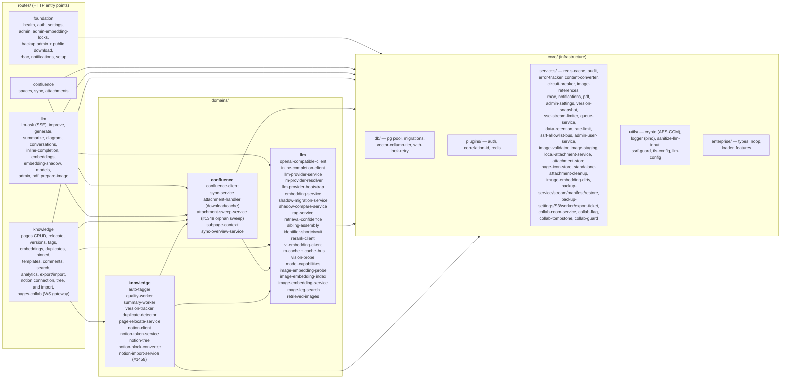
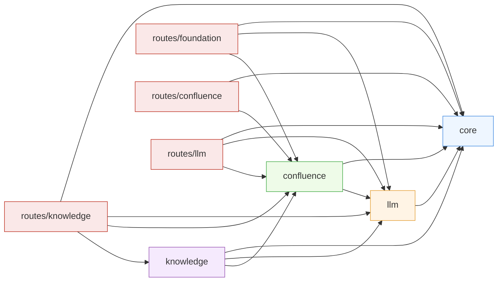
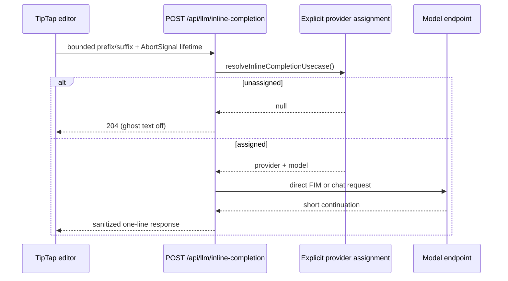
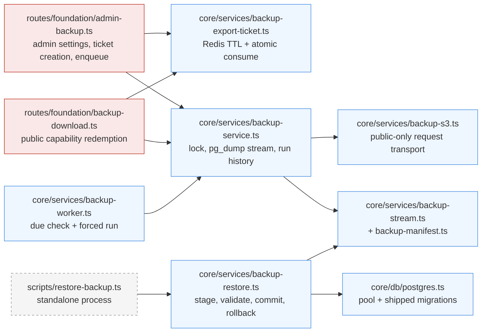

# 3. Backend Domains (C4 Level 3 — Components)

Zooms into the `backend` container. The code is organized by domain with
imports enforced by `eslint-plugin-boundaries` (see
`backend/eslint.config.js`).

## Domain map

```mermaid
flowchart LR
    subgraph routes["routes/ (HTTP entry points)"]
        direction TB
        rF["foundation<br/>health, auth, settings,<br/>admin, admin-embedding-locks,<br/>backup admin + public download,<br/>rbac, notifications, setup"]
        rC["confluence<br/>spaces, sync, attachments"]
        rL["llm<br/>llm-ask (SSE), improve, generate,<br/>summarize, diagram, conversations,<br/>inline-completion, embeddings,<br/>embedding-shadow, models,<br/>admin, pdf, prepare-image"]
        rK["knowledge<br/>pages CRUD, relocate, versions, tags,<br/>embeddings, duplicates, pinned,<br/>templates, comments, search,<br/>analytics, export/import,<br/>notion connection, tree, and import,<br/>pages-collab (WS gateway)"]
    end

    subgraph domains["domains/"]
        direction TB
        dC["<b>confluence</b><br/>confluence-client<br/>sync-service<br/>attachment-handler (download/cache)<br/>attachment-sweep-service (#1349 orphan sweep)<br/>subpage-context<br/>sync-overview-service"]
        dL["<b>llm</b><br/>openai-compatible-client<br/>inline-completion-client<br/>llm-provider-service<br/>llm-provider-resolver<br/>llm-provider-bootstrap<br/>embedding-service<br/>shadow-migration-service<br/>shadow-compare-service<br/>rag-service<br/>retrieval-confidence<br/>sibling-assembly<br/>identifier-shortcircuit<br/>rerank-client<br/>vl-embedding-client<br/>llm-cache + cache-bus<br/>vision-probe<br/>model-capabilities<br/>image-embedding-probe<br/>image-embedding-index<br/>image-embedding-service<br/>image-leg-search<br/>retrieved-images"]
        dK["<b>knowledge</b><br/>auto-tagger<br/>quality-worker<br/>summary-worker<br/>version-tracker<br/>duplicate-detector<br/>page-relocate-service<br/>notion-client<br/>notion-token-service<br/>notion-tree<br/>notion-block-converter<br/>notion-import-service (#1459)"]
    end

    subgraph core["core/ (infrastructure)"]
        direction TB
        cDB["db/ — pg pool, migrations,<br/>vector-column-tier, with-lock-retry"]
        cPlug["plugins/ — auth, correlation-id, redis"]
        cSvc["services/ — redis-cache, audit,<br/>error-tracker, content-converter,<br/>circuit-breaker, image-references,<br/>rbac, notifications, pdf,<br/>admin-settings, version-snapshot,<br/>sse-stream-limiter, queue-service,<br/>data-retention, rate-limit,<br/>ssrf-allowlist-bus, admin-user-service,<br/>image-validator, image-staging,<br/>local-attachment-service, attachment-store,<br/>page-icon-store, standalone-attachment-cleanup,<br/>image-embedding-dirty,<br/>backup-service/stream/manifest/restore,<br/>backup-settings/S3/worker/export-ticket,<br/>collab-room-service, collab-flag,<br/>collab-tombstone, collab-guard"]
        cUtil["utils/ — crypto (AES-GCM),<br/>logger (pino), sanitize-llm-input,<br/>ssrf-guard, tls-config, llm-config"]
        cEnt["enterprise/ — types, noop,<br/>loader, features"]
    end

    rF --> core
    rC --> core
    rC --> dC
    rL --> core
    rL --> dL
    rL --> dC
    rK --> core
    rK --> dK
    rK --> dL
    rK --> dC

    dC --> core
    dC --> dL
    dL --> core
    dK --> core
    dK --> dL
    dK --> dC
```

## ESLint-enforced boundary rules

Defined in `backend/eslint.config.js` with `eslint-plugin-boundaries`:

```mermaid
flowchart LR
    classDef core fill:#eef6ff,stroke:#4a90e2
    classDef llm fill:#fff4e5,stroke:#e5a23c
    classDef conf fill:#eefbe8,stroke:#4caf50
    classDef know fill:#f5eafd,stroke:#9b59b6
    classDef route fill:#fae8e8,stroke:#c0392b

    core[core]:::core
    llm[llm]:::llm
    conf[confluence]:::conf
    know[knowledge]:::know
    rF[routes/foundation]:::route
    rC[routes/confluence]:::route
    rL[routes/llm]:::route
    rK[routes/knowledge]:::route

    llm --> core
    conf --> core
    conf --> llm
    know --> core
    know --> llm
    know --> conf

    rF --> core
    rF --> llm
    rF --> conf
    rC --> core
    rC --> conf
    rL --> core
    rL --> llm
    rL --> conf
    rK --> core
    rK --> llm
    rK --> conf
    rK --> know
```

**Rules (mnemonic):**

- `core` imports **nothing** from domains/routes. It is pure infrastructure.
- `confluence` may use `llm` (for sync-time embedding).
- `llm` is self-contained (core only).
- `knowledge` is the integrator and may use all three other domains.
- `routes/foundation` may import `core` + `llm` + `confluence` — widened by
  #1347 (below) for the provider health check, list-models, the LLM
  concurrency/queue-depth admin knobs, the confidence-basis resolver
  (`admin.ts`, `health.ts`, `setup.ts`), and the Confluence connection
  test/sync overview (`settings.ts`). It does **not** import `knowledge`.
- `routes/confluence` may import `core` + `confluence`.
- `routes/llm` may import `core` + `llm` + `confluence` (sub-page context,
  `getClientForUser`) — this allowance predates #1347.
- `routes/knowledge` is the top-level aggregator and may import anything.

**Realtime collab (#1444).** Yjs, `y-protocols`, and the collab room/flag/guard/tombstone
helpers live in `core` plus the `GET /api/collab/:pageId` gateway in
`routes/knowledge`. Do **not** put Yjs in `domains/llm`. `assertNoLiveCollabRoom`
is in `core` so `routes/llm` can 409 Apply while a room is live (wired in a
later PR).

Adding a new import across these lines without updating the ESLint config is
a build failure — update the config *and* this diagram together.

**The rule above was not enforced for any route file until #1347.**
`boundaries/elements` patterned each route element as `src/routes/<x>/*`
(`mode: 'folder'`), which classifies a SUBFOLDER of that directory, not a
file sitting directly in it — and every route file lives directly in
`src/routes/<x>/`, so no route file ever matched an element and
`boundaries/dependencies` silently never fired for any of them. Domain
folders (`src/core`, `src/domains/*`) have no direct files today, which is
why *their* rules were already firing correctly. The fix is bare folder
patterns (`src/core`, `src/routes/foundation`, …), which `mode: 'folder'`
classifies whether the file is direct or nested, plus
`boundaries/no-unknown-files: error` so a file that maps to no element fails
lint outright instead of silently opting out of every rule (this caught
`src/telemetry-register.ts`, now mapped into the `app` element).
`backend/src/eslint-boundaries.test.ts` lints synthetic probe source through
ESLint's Node API to pin both directions — a disallowed cross-boundary
import fails, an allowed one does not — so a future config regression is a
red test rather than a silent no-op. Enforcing the rule as originally
written reported 7 real violations, all `routes/foundation` reaching into
`domains/llm`/`domains/confluence`; the allow-list above reflects the
widening decided in #1347 rather than re-homing those call sites (rejected
as an L-size change to route registration, out of scope for a lint fix).
`boundaries/no-unknown` (which flags an unresolvable *dependency target*,
not an unmapped source file) stays off — `@compendiq/contracts` resolves
outside `src/` and would be pure noise.

## Inline completion (#1417)

`routes/llm/llm-inline-completion.ts` is the authenticated, permission-checked
HTTP boundary for TipTap ghost text. It validates a small request contract,
sanitizes prefix, suffix, title, space key, and language independently, and
returns `204` when the `inline_completion` use case is unassigned. Unlike chat
and background jobs, the route does not emit a content-bearing LLM audit row;
it records only fixed-field aggregate counts in Redis.

`domains/llm/services/inline-completion-client.ts` is intentionally separate
from `openai-compatible-client.ts`. It keeps provider authentication, TLS,
OpenTelemetry, and the per-provider circuit breaker, but its undici request
bypasses the general LLM queue so a short editor completion cannot wait behind
a long generation. The request's disconnect signal is passed directly to
undici. Recognized coder models use a FIM prompt on `/completions`; other
models use `/chat/completions`. Both paths share the bounded-token, one-line
normalizer.

```mermaid
sequenceDiagram
    participant E as TipTap editor
    participant R as POST /api/llm/inline-completion
    participant P as Explicit provider assignment
    participant M as Model endpoint
    E->>R: bounded prefix/suffix + AbortSignal lifetime
    R->>P: resolveInlineCompletionUsecase()
    alt unassigned
        P-->>R: null
        R-->>E: 204 (ghost text off)
    else assigned
        P-->>R: provider + model
        R->>M: direct FIM or chat request
        M-->>R: short continuation
        R-->>E: sanitized one-line response
    end
```

This introduces no domain-boundary edge: the route still composes
`routes/llm → domains/llm + core`, and the client remains `llm → core`.

## Image input (#1154)

`core/services/image-validator.ts` (magic-byte sniffing, dimension ceilings)
and `core/services/image-staging.ts` (per-user Redis staging, content-addressed
by sha256) live in `core` because neither depends on an LLM concept — they are
generic upload-handling, the same layer `content-converter.ts` and
`document-extractor.ts` already occupy. `domains/llm/services/vision-probe.ts`
(sends a known-content image, judges the reply) and `model-capabilities.ts`
(persists/reads the verdict) live in `llm` because probing *is* an LLM
concern. Neither imports the two `core` image modules — that composition
happens one layer up, in `routes/llm`. Their only imports outside `domains/llm`
itself are `core/db/postgres.ts` and `core/utils/logger.ts`, well inside the
existing `llm → core` rule, so no new rule is needed.

`routes/llm/prepare-image.ts` composes the two `core` image modules alone
(validate, then stage). `resolveImagePart`, shared by `routes/llm/llm-generate.ts`
/ `llm-improve.ts` (defined in `routes/llm/_helpers.ts`), is what actually joins
`core` (`image-staging.ts`'s `loadStagedImage`) with `llm`
(`model-capabilities.ts`'s `getVisionCapability`) — the same `core` + `llm`
composition every other `routes/llm` file already does — so no new arrow, and
in particular no `llm → confluence` edge.

`domains/llm/services/shadow-migration-service.ts` (#1116) owns the
zero-downtime embedding-model change: it issues **runtime DDL** for the
`embedding_next` / `page_avg_embedding_next` shadow columns, runs the backfill
worker behind the `shadow-reembed` queue, and performs the rename-swap,
rollback and cleanup. Its arrows stay inside `llm → core`
(`core/db/postgres.ts`, `core/services/queue-service.ts`,
`core/services/redis-cache.ts` for the graph-cache invalidation,
`core/enterprise/loader.ts` for the org-policy precedence check). It also
reaches `embedding-service.ts` — its own domain sibling — through a **dynamic**
import, because `embedding-service` imports it for the dual-write and a static
edge would close the cycle at module-init time. `routes/llm/llm-embedding-shadow.ts`
is the admin surface (start / status / swap / rollback / cleanup / backfill),
`requireAdmin` on every route.

The guard it exports the other way round, `assertNoShadowMigration` /
`assertShadowRollbackWindowClear` in `embedding-service.ts`, is called from
`routes/knowledge/pages-crud.ts` and `routes/foundation/admin.ts` as well as
`routes/llm` — the same `routes/* → domains/llm` composition those files
already do for `processDirtyPages`.

`domains/llm/services/shadow-compare-service.ts` (#1260) runs during that
migration's `ready` window — the only time both models' vectors exist on the
same chunk rows. It samples the most frequent `search_analytics` queries
(`eval/analytics-query-sampler.ts`, ONE sampler shared with the production
benchmark so the two harnesses' normalisation cannot drift; only the ORDER
differs), embeds each query once per model with the #1114 instruction prefix
applied per model, and retrieves top-K pages from `embedding` and
`embedding_next` through `vectorSearch`'s allow-listed `column` option — the
same SQL, ACL predicate and `ef_search` discipline as the live probe, never a
sibling function. An unfilled candidate row must never enter the top-K —
`embedding_next` is nullable by construction, `NULL <=> $2` is NULL, and
`1 - null` is 1 in JS, i.e. a perfect match that would inflate every figure
computed from it. What guarantees that is the `distance !== null` filter in
JS, which also covers the LIVE column between a swap and its cleanup; the
shadow arm's `AND embedding_next IS NOT NULL` is a NARROWING beside it (ASC
ordering puts NULLs last, so such a row cannot displace a scored one under
the LIMIT), not the guarantee. A transient embedding or retrieval failure
costs its own query, not the run: the query is skipped, counted on the report
as `failedQueries`, and only a majority of failures fails the whole
comparison.

Run records reuse `retrieval_benchmark_runs` with
`config.kind = 'shadow-compare'`, through the SHARED
`eval/benchmark-run-lifecycle.ts` — insert, claim, progress + heartbeat,
complete, fail, the kind-aware stale sweep and the kind-guarded fetch, one
copy for both kinds. A comparison and a production benchmark exclude each
other on the 091 one-active index. Mode 2 judgements persist in
`embedding_compare_judgements` (migration 101), keyed by provider AND model on
each side, and the verdict is computed from `eval/metrics.ts`
(`pairedSignificance`, `recallAtK`, `meanReciprocalRank`) — never re-derived;
the p-value floor counts the live/candidate PICKS, not ties. The admin surface
is five more routes on `routes/llm/llm-embedding-shadow.ts`
(`POST …/compare`, `GET …/compare` for the latest run, `GET …/compare/:id`,
`POST/GET …/compare/:id/judgements`), all `requireAdmin`, all scoped to the
admin who started the run, results carrying page ids and titles only.

## The image-embedding leg (#1115 P1–P4)

Six modules in `domains/llm/services`, two in `core/services`, and two rules
hoisted into `core/db`:

- **`vl-embedding-client.ts`** — the only thing in the tree that speaks vLLM's
  chat-embeddings extension: `POST {baseUrl}/embeddings` with a `messages`
  array and a trailing empty `assistant` turn. It sits beside
  `rerank-client.ts` for the same reason that one exists — a differently-shaped
  endpoint that still inherits `providerRequestInfra` (queue, per-provider
  breaker, bearer headers, TLS dispatcher) — and **not** as a branch inside
  `openai-compatible-client.ts`'s `generateEmbedding`, whose `{model, input}`
  body bypasses the chat template. Its module header carries the non-support
  list (TEI, LM Studio, `llama-server`'s non-OpenAI route, the plain shape) and
  the pinned-vLLM-version rule, so nobody re-derives them.
- **`image-embedding-probe.ts`** — `vision-probe.ts`'s sibling. It embeds a
  known image *and* a text through the client, requires equal widths, and
  persists the verdict in `admin_settings.image_embedding_probe`. Its `error`
  is the provider's own body, so it is admin-only (#1184's rule). It also
  sends the configured MRL truncation width on both calls and requires it
  back — see the core reader below — and it classifies a failure by status:
  the four `VL_SHAPE_REFUSAL_STATUSES` are `shape_rejected`, everything else
  with an HTTP answer is `provider_error`.
- **`image-embedding-index.ts`** — `ensureImageEmbeddingColumn(dims, pair)`, the
  runtime DDL migration 093 deliberately left out: it retypes
  `page_image_embeddings.embedding` to the probed width, builds the HNSW index
  for that tier, and truncates + re-dirties when the width or the assigned
  `provider:model@baseUrl#dims` changes. The base URL is in the identity because
  a provider row's endpoint can move without its id changing (ADR-025 D12), the
  `#dims` half is the requested MRL truncation width, and the model half is the
  **resolved** one, which `llm-usecases.ts` pins into
  `llm_usecase_assignments.model` at probe time so it cannot drift with
  `provider.default_model`.
- **`image-embedding-service.ts` (P2)** — the consumer for all three.
  `embedPageImages(pageId)` enumerates the page's `body_html`, resolves each
  image's bytes through `core/services/attachment-store.ts`, skips-and-counts
  what it cannot embed, reuses an unchanged file's row by sha256, upserts the
  rest and reconciles away the rows the body no longer references — in one
  transaction that re-reads the index identity after its DELETE, mirroring
  `embedPage`'s shadow-epoch recheck. `processDirtyPageImages()` drives that
  over the `image_embedding_dirty` backlog under its own
  `worker:lock:image-embedding-index` — **not** the per-user
  `embedding:lock:*`, whose holders `processDirtyPages` backs off from, so
  borrowing it would have made an image scan block every text embed.

Two `core` modules complete the P2 half. `core/services/image-embedding-dirty.ts`
raises `pages.image_embedding_dirty` for the ATTACHMENT writers — the two sync
attachment writers, `fetchAndCachePageImage`, `writeAttachmentCache`,
`cleanPageAttachments` (all `domains/confluence`) and `putLocalAttachment`
(`core`) — which is why it is in `core`: `core` may not import a domain, and one
of its callers lives there. The **body** writers do not go through it; each is
already issuing an UPDATE (or INSERT) on the row and raises the column inline as
one more clause. **Unconditionally** where the statement is rewriting the body
wholesale and has nothing to diff against: the sync upsert (`sync-service.ts`),
both relocate directions (`page-relocate-service.ts`) and both create arms in
`routes/knowledge/pages-crud.ts`. **Gated on `body_html IS DISTINCT FROM $n`**,
so a title-only save costs nothing, on the edit paths: the conflict-policy
update (`sync-service.ts`), the four `body_html` writers in
`routes/knowledge/pages-crud.ts`, `restoreVersion`
(`domains/knowledge/services/version-tracker.ts`) and both branches of
`POST /llm/improvements/apply` (`routes/llm/llm-conversations.ts`). Audit the
column, not this module's importers. And
`core/services/image-references.ts` gained `extractImageReferencesFromHtml`,
which reads the STORED body rather than Confluence's storage format, because a
standalone page has no `body_storage` and a relocated one still carries a stale
copy describing attachments its body no longer points at.

`core/services/image-embedding-target-dimensions.ts` holds the MRL truncation
width (`admin_settings.image_embedding_target_dimensions`), in `core` because
`routes/foundation/admin.ts` writes it through `PUT /admin/settings` and
`routes/foundation` may not import a domain. `dimensions` is a **per-request**
vLLM parameter, so this is what makes the ≤ 4000 remedy the settings row and the
422 both name actually performable — and one reader is what keeps the probe, the
column type, the image embedder (P2) and — from P3 — the query side sending the
same number.

**`image-leg-search.ts` (P3)** is the reader the index had been waiting for:
the gate, one VL query embed and one kNN over `page_image_embeddings`,
answering a page-denominated hit list that `rag-service.ts` fuses as a third
RRF leg. It is a sibling of `rag-service.ts` rather than part of it only
because `hybridSearch` is already the longest function in the backend — every
FUSION decision (how the ranks combine, what an image-only page gets as text,
what the stable head reconstructs) stayed in `rag-service.ts`, beside the other
two legs' ranking rules. Its visibility predicate is
`core/services/page-visibility.ts`'s shared fragment, the same one the vector
leg uses; an image row carries no ACL of its own.

**`retrieved-images.ts` (P4)** turns the hits the leg attached to the returned
pages into `image_url` parts on the user turn: `pickRetrievedImages` selects
round-robin across pages with a byte-identity dedupe, re-runs `validateImage`
unforked and stops at a derived base64 budget. **The vision gate is the
CALLER's, not this module's** — `routes/llm/llm-ask.ts` reads the stored #1154
verdict and calls the pick only on an exact `true` (09's "Four gates, cheapest
first"). So the pick loads bytes unconditionally, and nothing that has not
already applied that gate may reach it. **It is a service because of the P0
guard, not despite it.** `resolveAttachmentBytes` applies no ACL and
`attachment-store.test.ts` fails if any file under `src/routes` names it, so
the read is legal only where retrieval has already applied
`visiblePagesPredicate` and the EE per-page filter — and that argument is what
the module boundary records. `routes/llm/llm-ask.ts` reaches
`pickRetrievedImages`, never the store.

`core/db/vector-column-tier.ts` (`columnTypeFor`, `HNSW_PARAMS`) and
`core/db/with-lock-retry.ts` are **moves, not additions**: the tiering rule was
stated identically in `shadow-migration-service.ts`, `embedding-service.ts` and
`eval/seed.ts`, and the bounded-lock DDL transaction lived in the first of
those. Both are now imported by all their callers, image path included. They are
in `core/db` because they are facts about Postgres and pgvector, not about LLMs,
and because `domains/llm` may import `core` and nothing else.

All arrows stay inside `llm → core`. Two admin surfaces, both `requireAdmin`
throughout: `routes/llm/llm-usecases.ts` owns the leg's CONFIGURATION (the
probe-gated assignment PUT plus `GET`/`POST`
`/admin/llm-usecases/image_embedding/probe` / `…/reprobe`), and
`routes/llm/llm-image-index.ts` owns its WORK (`GET
/admin/embedding/image-index` for the status the Embeddings-tab card renders,
plus `…/rescan` and `…/process`, both of which start a detached scan and answer
immediately — a corpus-wide run outlives every proxy timeout in the path).

**Nothing in `domains/llm/eval/` is part of the running server**, and the image
axis is five modules there — `images-axis.ts` (flag parsing and the run's
refusals), `seed-images.ts` (the corpus through the REAL intake),
`runner-images.ts` (both arms, paired), `images-metrics.ts` and
`images-report.ts` — plus `corpus-images.ts` for the manifest. They import the
same `hybridSearch` and `embedPageImages` the product runs, which is the point:
a harness with its own copy measures its own copy. Recipe and report fields:
`docs/runbooks/retrieval-eval.md`, "Image axis (`--images`)".

## Attachment bytes: one reader in `core`, the writers in `confluence` (#1115)

`core/services/attachment-store.ts` holds the path resolution and the READ half
of what used to be `domains/confluence/services/attachment-handler.ts`:
`safeAttachmentPath` and its traversal guards, `readAttachment`,
`attachmentCacheDir` / `listCachedAttachments` / `readCachedAttachmentFile`,
`getMimeType`, plus one new `resolveAttachmentBytes`. Everything that talks to
Confluence or writes to disk — `cacheAttachment`, the draw.io and cross-page
image sync, `writeAttachmentCache`, the relocate writers — stayed in the
confluence domain, which re-exports the moved names so its six importers did not
change.

**#1349 moved the DELETERS into `core` too, and the split runs by CALLER, not
by verb.** `attachment-store.ts` now also exports `attachmentsRootNow`,
`removeCachedAttachmentDirectory` / `removeCachedAttachmentFile` and
`ATTACHMENT_ROOT_RESERVED_DIRNAMES` (`local/`, `page-icons/`, and
`client-models/` for #1418 operator-supplied ONNX/Hunspell on the attachments
volume). `GET /api/models/client-assets` (`routes/llm/llm-client-assets.ts`,
authenticated `llm:query`) streams those files; there is no upload. Reserved
dirnames sit beside `local-attachment-service.ts`'s
`removeLocalAttachmentDirectory` / `removeLocalAttachmentFileForSweep` and
`page-icon-store.ts`'s `discardPageIconForDeletedPage`, because
`core/services/data-retention-service.ts` is one of the callers and `core` may
not import a domain — the sentence above is therefore no longer true of
*writes* in general: the sanctioned, path-validated removals for both stores
live in `core`, and so does `core/services/standalone-attachment-cleanup.ts`,
which is the event-driven half (a standalone hard delete or purge drops
`local/<pk>/` and `page-icons/<pk>/` unconditionally, and the shared-keyspace
`<pk>/` only when no page claims that `confluence_id` and the directory has
aged past a 5-minute grace, consulting no keep-set). What stayed in
`domains/confluence` is the *sweep*: `attachment-sweep-service.ts` needs
`getExpectedAttachmentFilenames` for the storage-format half of its global
keep-set — both `pages.body_storage` and, since #1525, the unpublished
`pages.draft_body_storage` — which is a Confluence-format parser, so composing it in the domain is
the only legal direction. `routes/confluence/attachments-sweep.ts` is the
operator surface (`requireAdmin`, dry-run first); the card is Settings →
Knowledge → Spaces & Sync. Its rules are stated once in that module's header,
with the operator view in `docs/ADMIN-GUIDE.md` and the stores in
[`06-data-model.md`](./06-data-model.md).

**Why the split runs there.** `llm` may import `core` and nothing else, and
Phase 2's image-embedding worker (`domains/llm`) needs attachment bytes off
disk. Copying the resolver into `llm` would have produced a second
implementation of the traversal guard; hoisting it keeps one. The direction is
also the only legal one: `core → confluence` is forbidden, `confluence → core`
is what the domain already does.

**`resolveAttachmentBytes` is a SYSTEM read — no ACL, and that is a boundary,
not an omission.** It resolves either store from a page's identity and answers
bytes plus the sniffed format. Which store is the CALLER's decision and follows
the URL prefix in `body_html` — `/api/attachments/` is the Confluence cache,
`/api/local-attachments/` the local store, and both really occur there, because
`relocateToLocal` moves the bytes into the local store and persists the
rewritten body. Inside the Confluence cache the directory key is
`pages.source === 'confluence' && confluence_id ? confluence_id : String(id)`,
the same rule `parentKeyFor` and the paste/import writer use, which is why
`pageSource` is a required input rather than something inferred from a null
`confluence_id`. It exists for the embedding worker, which runs outside
any request, and for the answer path *after* retrieval has applied the
visibility predicate. Routes must keep using the gated readers —
`getLocalAttachment` (which calls `assertLocalPageAccess`) or `readAttachment`
behind `routes/confluence/attachments.ts`'s own page-access check. A test walks
`src/routes` and fails if any file there so much as names the function, so a
route added later inherits the rule rather than the bypass.

## Background workers

Content workers live inside `domains/*/services/`; the cross-cutting backup
worker lives in `core/services/backup-worker.ts`. All are started from
`backend/src/index.ts`. See [`08-flow-sync.md`](./08-flow-sync.md) and
[`09-flow-rag-chat.md`](./09-flow-rag-chat.md) for the content-worker runtime
behaviour, and the backup ownership map below for backup execution.

## Backup ownership (#1420)

Backup crosses PostgreSQL, Redis, the attachment filesystem, and public S3, so
its implementation belongs to `core/services` rather than to a content
domain. The foundation routes and standalone script only compose those
owners:

```mermaid
flowchart LR
    classDef core fill:#eef6ff,stroke:#4a90e2
    classDef route fill:#fae8e8,stroke:#c0392b
    classDef cli fill:#f5f5f5,stroke:#999,stroke-dasharray: 4 4

    rAdmin["routes/foundation/admin-backup.ts<br/>admin settings, ticket creation, enqueue"]:::route
    rDownload["routes/foundation/backup-download.ts<br/>public capability redemption"]:::route
    cTicket["core/services/backup-export-ticket.ts<br/>Redis TTL + atomic consume"]:::core
    cWorker["core/services/backup-worker.ts<br/>due check + forced run"]:::core
    cBackup["core/services/backup-service.ts<br/>lock, pg_dump stream, run history"]:::core
    cS3["core/services/backup-s3.ts<br/>public-only request transport"]:::core
    cArchive["core/services/backup-stream.ts<br/>+ backup-manifest.ts"]:::core
    cRestore["core/services/backup-restore.ts<br/>stage, validate, commit, rollback"]:::core
    cDb["core/db/postgres.ts<br/>pool + shipped migrations"]:::core
    cli["scripts/restore-backup.ts<br/>standalone process"]:::cli

    rAdmin --> cTicket
    rAdmin --> cBackup
    rDownload --> cTicket
    rDownload --> cBackup
    cWorker --> cBackup
    cBackup --> cS3
    cBackup --> cArchive
    cli --> cRestore
    cRestore --> cArchive
    cRestore --> cDb
```

`admin-backup.ts` remains authenticated and admin-gated. The separately
registered `backup-download.ts` route intentionally has no authentication
hook: it accepts only a syntactically valid 256-bit ticket and asks
`backup-export-ticket.ts` to consume it once. `backup-worker.ts` owns schedule
polling/forced execution, while `backup-service.ts` owns the cluster lock,
`pg_dump` lifecycle, encrypted stream creation, S3 run history, and S3
handoff.

Restore has no Fastify route. `scripts/restore-backup.ts` runs outside the
server, and `backup-restore.ts` exclusively owns its on-disk stage/validation
and commit/rollback phases. It reuses the archive implementation and calls
`core/db/postgres.ts` only after `pg_restore` succeeds so shipped migrations
run from the same standalone process.
