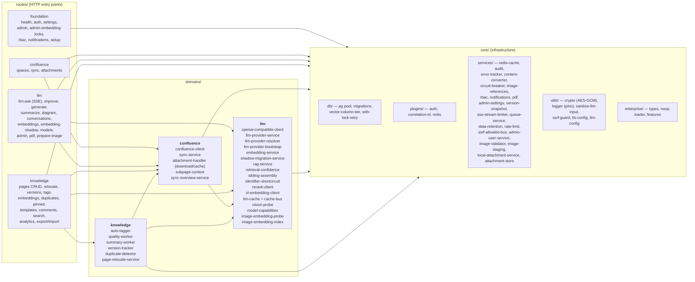
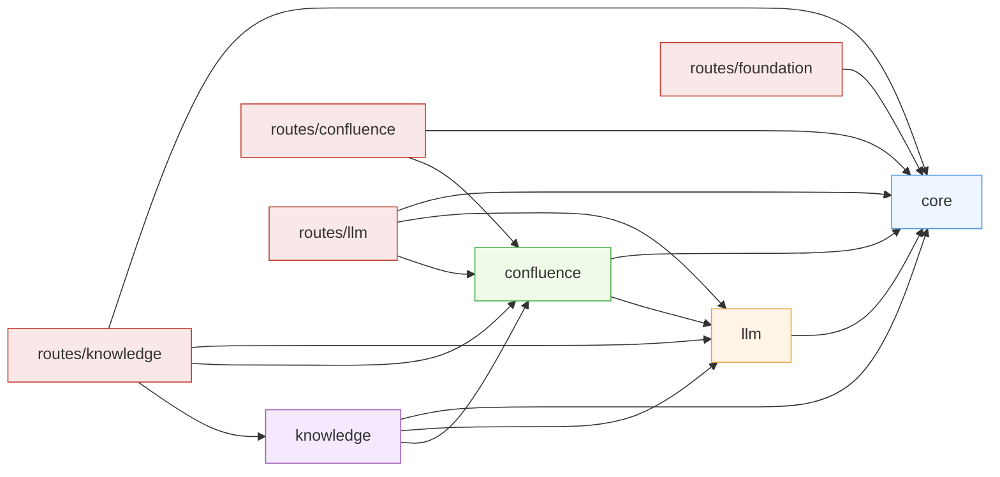

# 3. Backend Domains (C4 Level 3 — Components)

Zooms into the `backend` container. The code is organized by domain with
imports enforced by `eslint-plugin-boundaries` (see
`backend/eslint.config.js`).

## Domain map

```mermaid
flowchart LR
    subgraph routes["routes/ (HTTP entry points)"]
        direction TB
        rF["foundation<br/>health, auth, settings,<br/>admin, admin-embedding-locks,<br/>rbac, notifications, setup"]
        rC["confluence<br/>spaces, sync, attachments"]
        rL["llm<br/>llm-ask (SSE), improve, generate,<br/>summarize, diagram, conversations,<br/>embeddings, embedding-shadow, models,<br/>admin, pdf, prepare-image"]
        rK["knowledge<br/>pages CRUD, relocate, versions, tags,<br/>embeddings, duplicates, pinned,<br/>templates, comments, search,<br/>analytics, export/import"]
    end

    subgraph domains["domains/"]
        direction TB
        dC["<b>confluence</b><br/>confluence-client<br/>sync-service<br/>attachment-handler (download/cache)<br/>subpage-context<br/>sync-overview-service"]
        dL["<b>llm</b><br/>openai-compatible-client<br/>llm-provider-service<br/>llm-provider-resolver<br/>llm-provider-bootstrap<br/>embedding-service<br/>shadow-migration-service<br/>rag-service<br/>retrieval-confidence<br/>sibling-assembly<br/>identifier-shortcircuit<br/>rerank-client<br/>vl-embedding-client<br/>llm-cache + cache-bus<br/>vision-probe<br/>model-capabilities<br/>image-embedding-probe<br/>image-embedding-index"]
        dK["<b>knowledge</b><br/>auto-tagger<br/>quality-worker<br/>summary-worker<br/>version-tracker<br/>duplicate-detector<br/>page-relocate-service"]
    end

    subgraph core["core/ (infrastructure)"]
        direction TB
        cDB["db/ — pg pool, migrations,<br/>vector-column-tier, with-lock-retry"]
        cPlug["plugins/ — auth, correlation-id, redis"]
        cSvc["services/ — redis-cache, audit,<br/>error-tracker, content-converter,<br/>circuit-breaker, image-references,<br/>rbac, notifications, pdf,<br/>admin-settings, version-snapshot,<br/>sse-stream-limiter, queue-service,<br/>data-retention, rate-limit,<br/>ssrf-allowlist-bus, admin-user-service,<br/>image-validator, image-staging,<br/>local-attachment-service, attachment-store"]
        cUtil["utils/ — crypto (AES-GCM),<br/>logger (pino), sanitize-llm-input,<br/>ssrf-guard, tls-config, llm-config"]
        cEnt["enterprise/ — types, noop,<br/>loader, features"]
    end

    rF --> core
    rC --> core
    rC --> dC
    rL --> core
    rL --> dL
    rL --> dC
    rK --> core
    rK --> dK
    rK --> dL
    rK --> dC

    dC --> core
    dC --> dL
    dL --> core
    dK --> core
    dK --> dL
    dK --> dC
```

## ESLint-enforced boundary rules

Defined in `backend/eslint.config.js` with `eslint-plugin-boundaries`:

```mermaid
flowchart LR
    classDef core fill:#eef6ff,stroke:#4a90e2
    classDef llm fill:#fff4e5,stroke:#e5a23c
    classDef conf fill:#eefbe8,stroke:#4caf50
    classDef know fill:#f5eafd,stroke:#9b59b6
    classDef route fill:#fae8e8,stroke:#c0392b

    core[core]:::core
    llm[llm]:::llm
    conf[confluence]:::conf
    know[knowledge]:::know
    rF[routes/foundation]:::route
    rC[routes/confluence]:::route
    rL[routes/llm]:::route
    rK[routes/knowledge]:::route

    llm --> core
    conf --> core
    conf --> llm
    know --> core
    know --> llm
    know --> conf

    rF --> core
    rC --> core
    rC --> conf
    rL --> core
    rL --> llm
    rL --> conf
    rK --> core
    rK --> llm
    rK --> conf
    rK --> know
```

**Rules (mnemonic):**

- `core` imports **nothing** from domains/routes. It is pure infrastructure.
- `confluence` may use `llm` (for sync-time embedding).
- `llm` is self-contained (core only).
- `knowledge` is the integrator and may use all three other domains.
- Each `routes/*` group may import `core` plus the domains it exposes;
  `routes/knowledge` is the top-level aggregator and may import anything.

Adding a new import across these lines without updating the ESLint config is
a build failure — update the config *and* this diagram together.

## Image input (#1154)

`core/services/image-validator.ts` (magic-byte sniffing, dimension ceilings)
and `core/services/image-staging.ts` (per-user Redis staging, content-addressed
by sha256) live in `core` because neither depends on an LLM concept — they are
generic upload-handling, the same layer `content-converter.ts` and
`document-extractor.ts` already occupy. `domains/llm/services/vision-probe.ts`
(sends a known-content image, judges the reply) and `model-capabilities.ts`
(persists/reads the verdict) live in `llm` because probing *is* an LLM
concern. Neither imports the two `core` image modules — that composition
happens one layer up, in `routes/llm`. Their only imports outside `domains/llm`
itself are `core/db/postgres.ts` and `core/utils/logger.ts`, well inside the
existing `llm → core` rule, so no new rule is needed.

`routes/llm/prepare-image.ts` composes the two `core` image modules alone
(validate, then stage). `resolveImagePart`, shared by `routes/llm/llm-generate.ts`
/ `llm-improve.ts` (defined in `routes/llm/_helpers.ts`), is what actually joins
`core` (`image-staging.ts`'s `loadStagedImage`) with `llm`
(`model-capabilities.ts`'s `getVisionCapability`) — the same `core` + `llm`
composition every other `routes/llm` file already does — so no new arrow, and
in particular no `llm → confluence` edge.

`domains/llm/services/shadow-migration-service.ts` (#1116) owns the
zero-downtime embedding-model change: it issues **runtime DDL** for the
`embedding_next` / `page_avg_embedding_next` shadow columns, runs the backfill
worker behind the `shadow-reembed` queue, and performs the rename-swap,
rollback and cleanup. Its arrows stay inside `llm → core`
(`core/db/postgres.ts`, `core/services/queue-service.ts`,
`core/services/redis-cache.ts` for the graph-cache invalidation,
`core/enterprise/loader.ts` for the org-policy precedence check). It also
reaches `embedding-service.ts` — its own domain sibling — through a **dynamic**
import, because `embedding-service` imports it for the dual-write and a static
edge would close the cycle at module-init time. `routes/llm/llm-embedding-shadow.ts`
is the admin surface (start / status / swap / rollback / cleanup / backfill),
`requireAdmin` on every route.

The guard it exports the other way round, `assertNoShadowMigration` /
`assertShadowRollbackWindowClear` in `embedding-service.ts`, is called from
`routes/knowledge/pages-crud.ts` and `routes/foundation/admin.ts` as well as
`routes/llm` — the same `routes/* → domains/llm` composition those files
already do for `processDirtyPages`.

## The image-embedding leg (#1115 P1)

Three new modules in `domains/llm/services`, and two rules hoisted into
`core/db`:

- **`vl-embedding-client.ts`** — the only thing in the tree that speaks vLLM's
  chat-embeddings extension: `POST {baseUrl}/embeddings` with a `messages`
  array and a trailing empty `assistant` turn. It sits beside
  `rerank-client.ts` for the same reason that one exists — a differently-shaped
  endpoint that still inherits `providerRequestInfra` (queue, per-provider
  breaker, bearer headers, TLS dispatcher) — and **not** as a branch inside
  `openai-compatible-client.ts`'s `generateEmbedding`, whose `{model, input}`
  body bypasses the chat template. Its module header carries the non-support
  list (TEI, LM Studio, `llama-server`'s non-OpenAI route, the plain shape) and
  the pinned-vLLM-version rule, so nobody re-derives them.
- **`image-embedding-probe.ts`** — `vision-probe.ts`'s sibling. It embeds a
  known image *and* a text through the client, requires equal widths, and
  persists the verdict in `admin_settings.image_embedding_probe`. Its `error`
  is the provider's own body, so it is admin-only (#1184's rule). It also
  sends the configured MRL truncation width on both calls and requires it
  back — see the core reader below — and it classifies a failure by status:
  the four `VL_SHAPE_REFUSAL_STATUSES` are `shape_rejected`, everything else
  with an HTTP answer is `provider_error`.
- **`image-embedding-index.ts`** — `ensureImageEmbeddingColumn(dims, pair)`, the
  runtime DDL migration 093 deliberately left out: it retypes
  `page_image_embeddings.embedding` to the probed width, builds the HNSW index
  for that tier, and truncates + re-dirties when the width or the assigned
  `provider:model@baseUrl#dims` changes. The base URL is in the identity because
  a provider row's endpoint can move without its id changing (ADR-025 D12), the
  `#dims` half is the requested MRL truncation width, and the model half is the
  **resolved** one, which `llm-usecases.ts` pins into
  `llm_usecase_assignments.model` at probe time so it cannot drift with
  `provider.default_model`.

`core/services/image-embedding-target-dimensions.ts` holds the MRL truncation
width (`admin_settings.image_embedding_target_dimensions`), in `core` because
`routes/foundation/admin.ts` writes it through `PUT /admin/settings` and
`routes/foundation` may not import a domain. `dimensions` is a **per-request**
vLLM parameter, so this is what makes the ≤ 4000 remedy the settings row and the
422 both name actually performable — and one reader is what keeps the probe, the
column type and (from P2) the image embedder and the query side sending the same
number.

`core/db/vector-column-tier.ts` (`columnTypeFor`, `HNSW_PARAMS`) and
`core/db/with-lock-retry.ts` are **moves, not additions**: the tiering rule was
stated identically in `shadow-migration-service.ts`, `embedding-service.ts` and
`eval/seed.ts`, and the bounded-lock DDL transaction lived in the first of
those. Both are now imported by all their callers, image path included. They are
in `core/db` because they are facts about Postgres and pgvector, not about LLMs,
and because `domains/llm` may import `core` and nothing else.

All arrows stay inside `llm → core`. `routes/llm/llm-usecases.ts` is the admin
surface: the probe-gated assignment PUT plus `GET`/`POST`
`/admin/llm-usecases/image_embedding/probe` / `…/reprobe`, `requireAdmin` on
all of them.

## Attachment bytes: one reader in `core`, the writers in `confluence` (#1115)

`core/services/attachment-store.ts` holds the path resolution and the READ half
of what used to be `domains/confluence/services/attachment-handler.ts`:
`safeAttachmentPath` and its traversal guards, `readAttachment`,
`attachmentCacheDir` / `listCachedAttachments` / `readCachedAttachmentFile`,
`getMimeType`, plus one new `resolveAttachmentBytes`. Everything that talks to
Confluence or writes to disk — `cacheAttachment`, the draw.io and cross-page
image sync, `writeAttachmentCache`, the relocate writers — stayed in the
confluence domain, which re-exports the moved names so its six importers did not
change.

**Why the split runs there.** `llm` may import `core` and nothing else, and
Phase 2's image-embedding worker (`domains/llm`) needs attachment bytes off
disk. Copying the resolver into `llm` would have produced a second
implementation of the traversal guard; hoisting it keeps one. The direction is
also the only legal one: `core → confluence` is forbidden, `confluence → core`
is what the domain already does.

**`resolveAttachmentBytes` is a SYSTEM read — no ACL, and that is a boundary,
not an omission.** It resolves either store from a page's identity and answers
bytes plus the sniffed format. Which store is the CALLER's decision and follows
the URL prefix in `body_html` — `/api/attachments/` is the Confluence cache,
`/api/local-attachments/` the local store, and both really occur there, because
`relocateToLocal` moves the bytes into the local store and persists the
rewritten body. Inside the Confluence cache the directory key is
`pages.source === 'confluence' && confluence_id ? confluence_id : String(id)`,
the same rule `parentKeyFor` and the paste/import writer use, which is why
`pageSource` is a required input rather than something inferred from a null
`confluence_id`. It exists for the embedding worker, which runs outside
any request, and for the answer path *after* retrieval has applied the
visibility predicate. Routes must keep using the gated readers —
`getLocalAttachment` (which calls `assertLocalPageAccess`) or `readAttachment`
behind `routes/confluence/attachments.ts`'s own page-access check. A test walks
`src/routes` and fails if any file there so much as names the function, so a
route added later inherits the rule rather than the bypass.

## Background workers

Workers live inside the `domains/*/services/` layer and are started from
`backend/src/index.ts`. See [`08-flow-sync.md`](./08-flow-sync.md) and
[`09-flow-rag-chat.md`](./09-flow-rag-chat.md) for the runtime behaviour.
