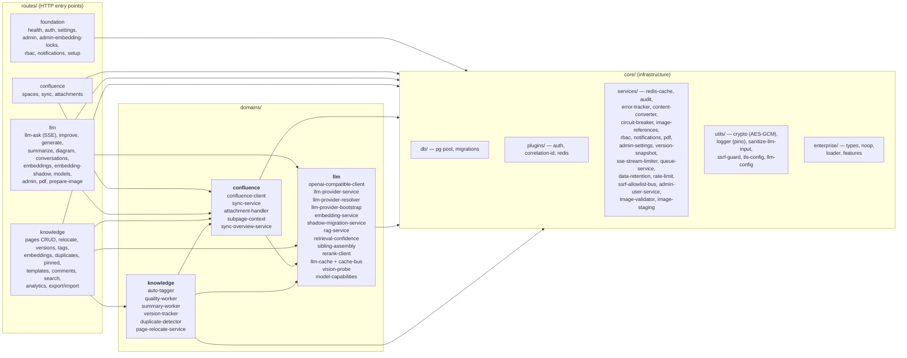
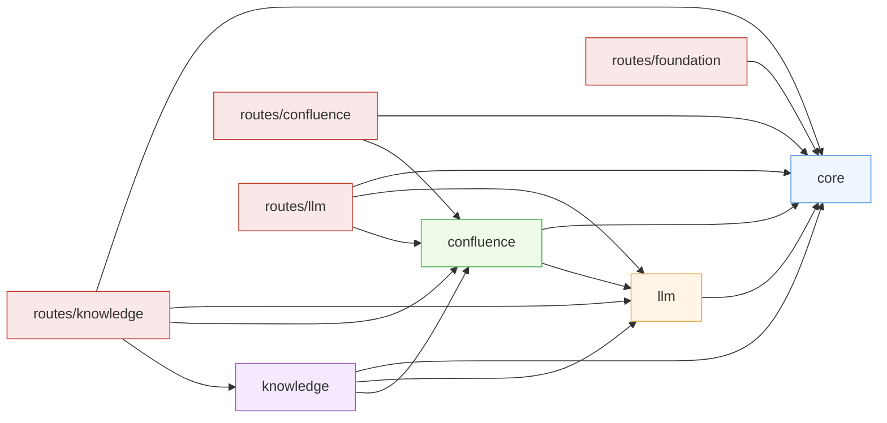

# 3. Backend Domains (C4 Level 3 — Components)

Zooms into the `backend` container. The code is organized by domain with
imports enforced by `eslint-plugin-boundaries` (see
`backend/eslint.config.js`).

## Domain map

```mermaid
flowchart LR
    subgraph routes["routes/ (HTTP entry points)"]
        direction TB
        rF["foundation<br/>health, auth, settings,<br/>admin, admin-embedding-locks,<br/>rbac, notifications, setup"]
        rC["confluence<br/>spaces, sync, attachments"]
        rL["llm<br/>llm-ask (SSE), improve, generate,<br/>summarize, diagram, conversations,<br/>embeddings, embedding-shadow, models,<br/>admin, pdf, prepare-image"]
        rK["knowledge<br/>pages CRUD, relocate, versions, tags,<br/>embeddings, duplicates, pinned,<br/>templates, comments, search,<br/>analytics, export/import"]
    end

    subgraph domains["domains/"]
        direction TB
        dC["<b>confluence</b><br/>confluence-client<br/>sync-service<br/>attachment-handler<br/>subpage-context<br/>sync-overview-service"]
        dL["<b>llm</b><br/>openai-compatible-client<br/>llm-provider-service<br/>llm-provider-resolver<br/>llm-provider-bootstrap<br/>embedding-service<br/>shadow-migration-service<br/>rag-service<br/>retrieval-confidence<br/>sibling-assembly<br/>rerank-client<br/>llm-cache + cache-bus<br/>vision-probe<br/>model-capabilities"]
        dK["<b>knowledge</b><br/>auto-tagger<br/>quality-worker<br/>summary-worker<br/>version-tracker<br/>duplicate-detector<br/>page-relocate-service"]
    end

    subgraph core["core/ (infrastructure)"]
        direction TB
        cDB["db/ — pg pool, migrations"]
        cPlug["plugins/ — auth, correlation-id, redis"]
        cSvc["services/ — redis-cache, audit,<br/>error-tracker, content-converter,<br/>circuit-breaker, image-references,<br/>rbac, notifications, pdf,<br/>admin-settings, version-snapshot,<br/>sse-stream-limiter, queue-service,<br/>data-retention, rate-limit,<br/>ssrf-allowlist-bus, admin-user-service,<br/>image-validator, image-staging"]
        cUtil["utils/ — crypto (AES-GCM),<br/>logger (pino), sanitize-llm-input,<br/>ssrf-guard, tls-config, llm-config"]
        cEnt["enterprise/ — types, noop,<br/>loader, features"]
    end

    rF --> core
    rC --> core
    rC --> dC
    rL --> core
    rL --> dL
    rL --> dC
    rK --> core
    rK --> dK
    rK --> dL
    rK --> dC

    dC --> core
    dC --> dL
    dL --> core
    dK --> core
    dK --> dL
    dK --> dC
```

## ESLint-enforced boundary rules

Defined in `backend/eslint.config.js` with `eslint-plugin-boundaries`:

```mermaid
flowchart LR
    classDef core fill:#eef6ff,stroke:#4a90e2
    classDef llm fill:#fff4e5,stroke:#e5a23c
    classDef conf fill:#eefbe8,stroke:#4caf50
    classDef know fill:#f5eafd,stroke:#9b59b6
    classDef route fill:#fae8e8,stroke:#c0392b

    core[core]:::core
    llm[llm]:::llm
    conf[confluence]:::conf
    know[knowledge]:::know
    rF[routes/foundation]:::route
    rC[routes/confluence]:::route
    rL[routes/llm]:::route
    rK[routes/knowledge]:::route

    llm --> core
    conf --> core
    conf --> llm
    know --> core
    know --> llm
    know --> conf

    rF --> core
    rC --> core
    rC --> conf
    rL --> core
    rL --> llm
    rL --> conf
    rK --> core
    rK --> llm
    rK --> conf
    rK --> know
```

**Rules (mnemonic):**

- `core` imports **nothing** from domains/routes. It is pure infrastructure.
- `confluence` may use `llm` (for sync-time embedding).
- `llm` is self-contained (core only).
- `knowledge` is the integrator and may use all three other domains.
- Each `routes/*` group may import `core` plus the domains it exposes;
  `routes/knowledge` is the top-level aggregator and may import anything.

Adding a new import across these lines without updating the ESLint config is
a build failure — update the config *and* this diagram together.

## Image input (#1154)

`core/services/image-validator.ts` (magic-byte sniffing, dimension ceilings)
and `core/services/image-staging.ts` (per-user Redis staging, content-addressed
by sha256) live in `core` because neither depends on an LLM concept — they are
generic upload-handling, the same layer `content-converter.ts` and
`document-extractor.ts` already occupy. `domains/llm/services/vision-probe.ts`
(sends a known-content image, judges the reply) and `model-capabilities.ts`
(persists/reads the verdict) live in `llm` because probing *is* an LLM
concern. Neither imports the two `core` image modules — that composition
happens one layer up, in `routes/llm`. Their only imports outside `domains/llm`
itself are `core/db/postgres.ts` and `core/utils/logger.ts`, well inside the
existing `llm → core` rule, so no new rule is needed.

`routes/llm/prepare-image.ts` composes the two `core` image modules alone
(validate, then stage). `resolveImagePart`, shared by `routes/llm/llm-generate.ts`
/ `llm-improve.ts` (defined in `routes/llm/_helpers.ts`), is what actually joins
`core` (`image-staging.ts`'s `loadStagedImage`) with `llm`
(`model-capabilities.ts`'s `getVisionCapability`) — the same `core` + `llm`
composition every other `routes/llm` file already does — so no new arrow, and
in particular no `llm → confluence` edge.

`domains/llm/services/shadow-migration-service.ts` (#1116) owns the
zero-downtime embedding-model change: it issues **runtime DDL** for the
`embedding_next` / `page_avg_embedding_next` shadow columns, runs the backfill
worker behind the `shadow-reembed` queue, and performs the rename-swap,
rollback and cleanup. Its arrows stay inside `llm → core`
(`core/db/postgres.ts`, `core/services/queue-service.ts`,
`core/services/redis-cache.ts` for the graph-cache invalidation,
`core/enterprise/loader.ts` for the org-policy precedence check). It also
reaches `embedding-service.ts` — its own domain sibling — through a **dynamic**
import, because `embedding-service` imports it for the dual-write and a static
edge would close the cycle at module-init time. `routes/llm/llm-embedding-shadow.ts`
is the admin surface (start / status / swap / rollback / cleanup / backfill),
`requireAdmin` on every route.

The guard it exports the other way round, `assertNoShadowMigration` /
`assertShadowRollbackWindowClear` in `embedding-service.ts`, is called from
`routes/knowledge/pages-crud.ts` and `routes/foundation/admin.ts` as well as
`routes/llm` — the same `routes/* → domains/llm` composition those files
already do for `processDirtyPages`.

## Background workers

Workers live inside the `domains/*/services/` layer and are started from
`backend/src/index.ts`. See [`08-flow-sync.md`](./08-flow-sync.md) and
[`09-flow-rag-chat.md`](./09-flow-rag-chat.md) for the runtime behaviour.
