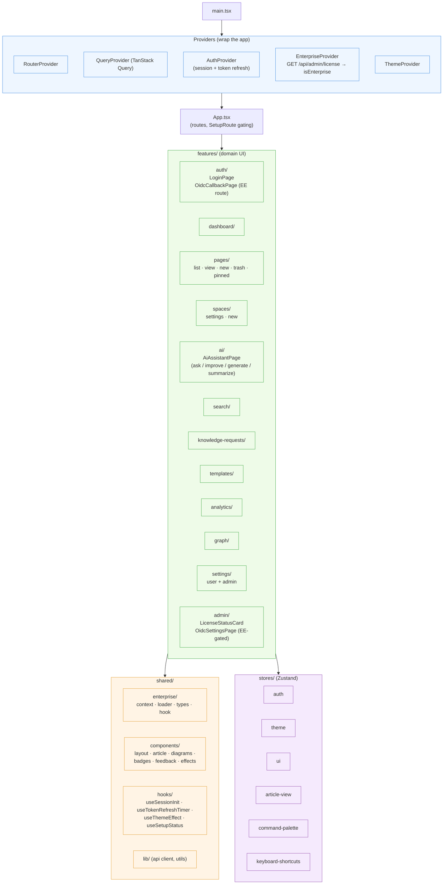
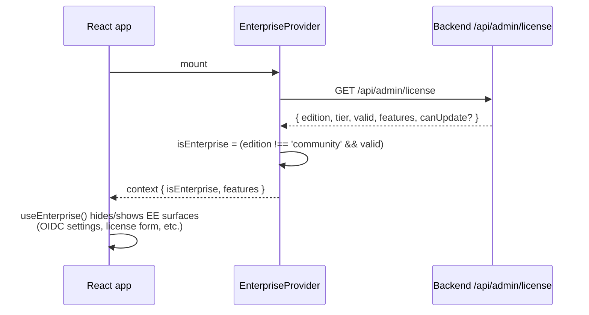

# 4. Frontend Structure

Zooms into the `frontend` container. React 19 SPA built with Vite, served
statically in production.

## Provider & feature layout

## Enterprise gating

The frontend ships **one image** for both CE and EE. Enterprise UI is gated
at runtime:

See [`10-flow-enterprise-license.md`](./10-flow-enterprise-license.md) for
the backend side.

## Styling

- **TailwindCSS 4** with CSS variables for theming (light/dark/custom).
- **Glassmorphic** dashboard aesthetic (ADR-010): `bg-card/80 backdrop-blur-md border-white/10`.
- **Framer Motion** for entrance animations, wrapped in `LazyMotion`;
  all animations respect `prefers-reduced-motion`.
- **Radix UI** primitives for all interactive elements (menus, dialogs,
  tooltips, dropdowns).
