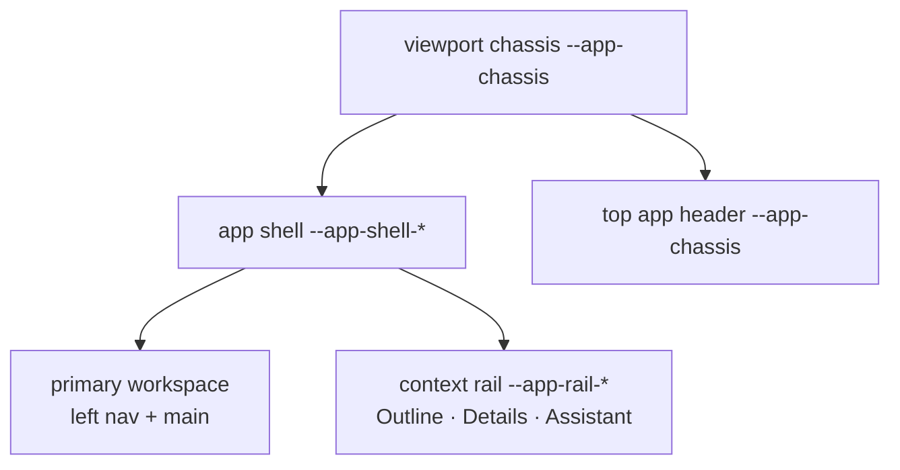
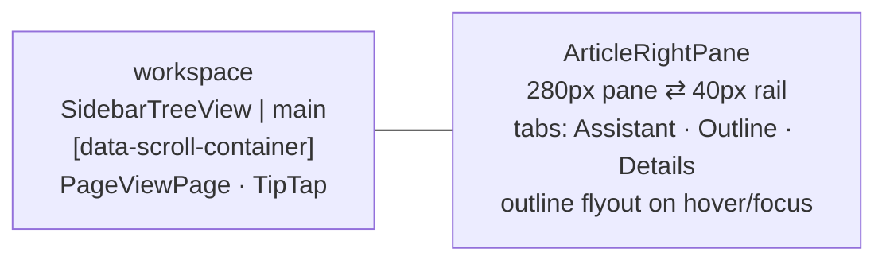
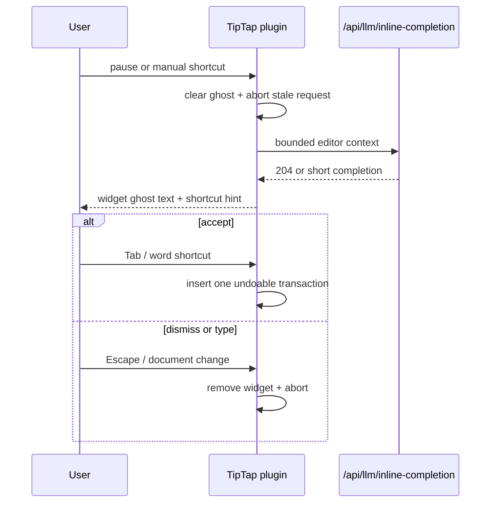
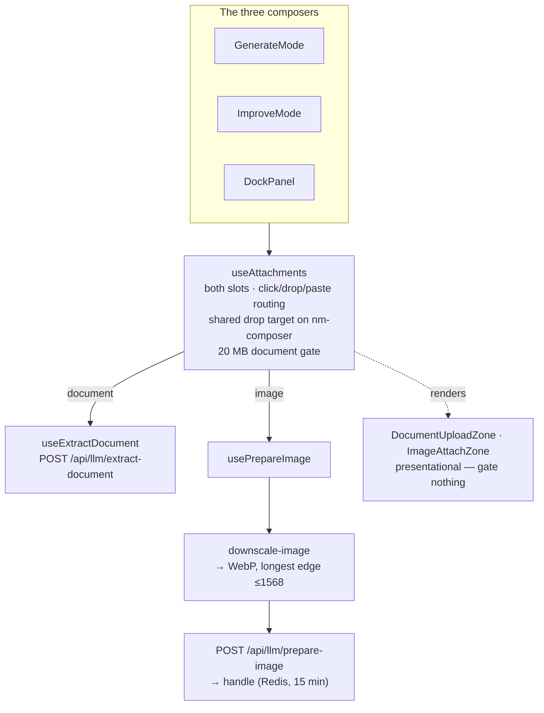
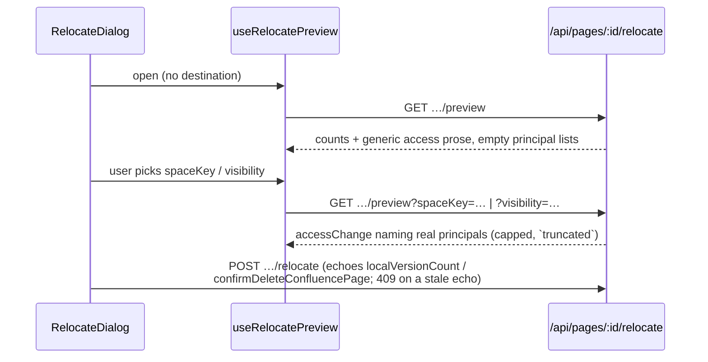
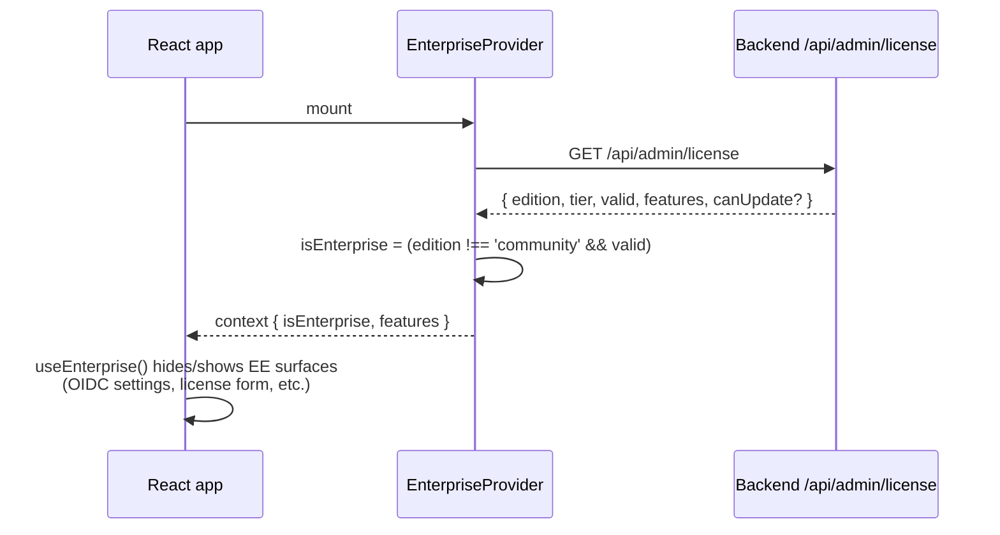

# 4. Frontend Structure

Zooms into the `frontend` container. React 19 SPA built with Vite, served
statically in production.

## Provider & feature layout

```mermaid
flowchart TB
    main["main.tsx"]

    subgraph providers["Providers (wrap the app)"]
        direction TB
        qp["QueryClientProvider (TanStack Query)"]
        rp["BrowserRouter"]
        ep["EnterpriseProvider<br/>GET /api/admin/license → isEnterprise"]
    end

    main --> providers
    providers --> app["App.tsx<br/>(routes, SetupRoute gating;<br/>session + token refresh + theme via<br/>useSessionInit · useTokenRefreshTimer · useThemeEffect)"]

    subgraph features["features/ (domain UI)"]
        direction LR
        fAuth["auth/<br/>OidcCallbackPage (EE route)"]
        fPages["pages/<br/>list · view · new · trash · pinned<br/>bulk actions · 404 catch-all<br/>RelocateDialog (#1123) · VersionHistory (#1404)"]
        fSpaces["spaces/<br/>settings · new"]
        fAI["ai/<br/>AiAssistantPage (/ai and /ai/c/:id — no-document home)<br/>conversations/ AiConversationsSidebar · ConversationList · ConversationRow (#1361)<br/>ai-routes.ts (shared/lib) · assistant-actions.ts<br/>dock/ DockPanel · DockDiffCard (#1126)<br/>tab inside ArticleRightPane; mobile inspector sheet below md<br/>SourceCitations · CitationChips · SourceThumbnail (#1115 P3)<br/>image-source.ts · source-target.ts · source-confidence.ts"]
        fGraph["graph/"]
        fSettings["settings/<br/>LoginPage · user + admin"]
        fAdmin["admin/<br/>LicenseStatusCard<br/>OidcSettingsPage (EE-gated)<br/>analytics/ (AnalyticsPage)"]
    end

    app --> shell["AppLayout (authenticated shell)<br/>mounts AiProvider above the routes (#1126):<br/>dock threads keyed by page, /ai threads by conversation (#1361),<br/>12 retained, inert until an AI surface consumes it"]
    shell --> features

    subgraph shared["shared/"]
        direction LR
        sEnt["enterprise/<br/>context · loader · types · hook"]
        sComp["components/<br/>layout · article · diagrams · effects ·<br/>banners (TrialBanner) · feedback ·<br/>badges/ VisionBadge (#1154) ·<br/>upload/ DocumentUploadZone (#1131) ·<br/>ImageAttachZone · composer-row (#1154)"]
        sHooks["hooks/<br/>useSessionInit · useTokenRefreshTimer ·<br/>useThemeEffect · useSetupStatus ·<br/>useAttachments · usePrepareImage (#1154)"]
        sLib["lib/ (api client, utils)<br/>downscale-image (#1154)"]
    end

    features --> shared

    subgraph stores["stores/ (Zustand)"]
        zAuth["auth"]
        zTheme["theme"]
        zUI["ui (persisted)"]
        zAV["article-view<br/>read-only mirrors"]
        zDock["ai-dock (ephemeral)"]
        zCmd["command-palette"]
        zKb["keyboard-shortcuts"]
    end

    features --> stores

    classDef prov fill:#eef6ff,stroke:#4a90e2
    classDef feat fill:#eefbe8,stroke:#4caf50
    classDef sh fill:#fff4e5,stroke:#e5a23c
    classDef st fill:#f5eafd,stroke:#9b59b6
    class providers,qp,rp,ep,shell prov
    class features,fAuth,fPages,fSpaces,fAI,fGraph,fSettings,fAdmin feat
    class shared,sEnt,sComp,sHooks,sLib sh
    class stores,zAuth,zTheme,zUI,zAV,zDock,zCmd,zKb st
```

## Authenticated inset shell

`AppLayout` paints a viewport **chassis** (`--app-chassis`, inset on `md+`)
around a rounded **app shell**. The top app header also paints the chassis, so
the outer frame is continuous on all four sides; internal panel toolbars paint
Chrome (`--app-header-bg`). The composition is:

```mermaid
flowchart TB
    chassis["viewport chassis --app-chassis"]
    shell["app shell --app-shell-*"]
    header["top app header --app-chassis"]
    workspace["primary workspace<br/>left nav + main"]
    rail["context rail --app-rail-*<br/>Outline · Details · Assistant"]

    chassis --> header
    chassis --> shell
    shell --> workspace
    shell --> rail
```

Mobile (`<md`) is edge-to-edge: inset, shell radius and rail gap are 0.

## Article route panels (#1126)

On `/pages/:id` the shell renders the **workspace** (left nav + main) and a
**detached context rail** as siblings in one flex row, so each region scrolls
independently and the editor column shrinks around the rail rather than
having anything float above it.

```mermaid
flowchart LR
    workspace["workspace<br/>SidebarTreeView | main<br/>[data-scroll-container]<br/>PageViewPage · TipTap"]
    rail["ArticleRightPane<br/>280px pane ⇄ 40px rail<br/>tabs: Assistant · Outline · Details<br/>outline flyout on hover/focus"]

    workspace --- rail
```

- **The assistant is a tab, not a third column.** #1126 shipped it as its own
  column beside `ArticleRightPane`; on a 1440px screen that drew three vertical
  rules across the window and squeezed the article — the thing the route exists
  for — between two slabs of chrome. It is now the first of three tabs inside
  the inspector, switching instantly like Outline and Details. One right-hand
  edge, one interaction to learn.
- The tab choice is **local `useState`** in `ArticleRightPane`, not a store: it
  is a per-visit view, and persisting it would open pages onto an AI panel
  nobody asked for. It defaults to Outline, or Details when the page has no
  headings.
- **"Show me the assistant" is consumed by `AppLayout`.** `openDock()` is still
  what Alt+I and the inspector's rail button raise. On an
  article route at every width an effect turns it into
  `requestInspectorView('assistant')` plus an expand (desktop) or the inspector
  sheet (below `md`), and lowers the flag in the same tick — `open` is a
  request, not a second layout state. Skipping that step is not a no-op: an
  unconsumed flag used to collapse the inspector to a rail at ≥1100px and make
  the right side vanish between 768 and 1099px. Guarded across those widths and
  below `md` in `AppLayout.test.tsx`.
- `.` toggles the inspector: the sheet below `md`, the detached rail at `md`
  and up.
- JS *width* queries exist only where the component tree changes:
  `useIsMobileLayout` (`md`), `useIsDockWideLayout` (`1100px`, dock vs rail),
  and `useIsInspectorWideLayout` (`xl`, expanded inspector vs 40px rail).
  `use-can-hover` and three one-shot checks read `matchMedia` for pointer and
  motion capability; every other responsive layout decision is a Tailwind class.
- Below `md` there is no right side to dock into, so the same inspector
  (`ArticleRightPane` with `presentation="sheet"`) is a right-hand slide-over
  — Outline, Details and Assistant together, matching the left nav drawer.
  Chassis **AI** is the full-page `/ai` chat (`aria-label="AI chat, full page"`);
  the inspector tab is **Assistant**. The laptop-width force-collapse of the
  page tree is gone: 768–1439 keeps the user's tree preference.
- `Apply` on a proposed change goes through **`POST /llm/improvements/apply`**,
  not a client-side write into the editor. That route runs `protectMedia` /
  `restoreMedia` (#723) and the column-layout realignment that returns **422**
  when the layout is unrecoverable (#781). Those guards live in
  `backend/src/core/services/content-converter.ts` and have no frontend
  counterpart, so a client-side Markdown→HTML round-trip would silently strip
  Confluence macros and media — see
  [`11-content-pipeline.md`](./11-content-pipeline.md). What the dock changes
  is *where the decision happens* — inline in the thread, beside the document —
  not how it is applied. Consequently Apply is unavailable while the editor is
  open: it rewrites the saved page, which an open editor would overwrite on its
  next save. `article-view` therefore stays a set of read-only mirrors.
- `/ai` offers Q&A, Generate and the five #1401 create skills; the dock offers
  all of that plus the five standalone rewrite skills and Diagram — `/ai` has
  neither because page scope was retired there and it has no document to act
  on. Since #1361 those are two named lists in one leaf module,
  `features/ai/assistant-actions.ts` (`AI_HOME_ACTIONS` / `DOCK_ACTIONS`), and
  `AssistantActionSelect` takes the list as an `actions` prop rather than the
  old `includeGenerate` boolean. The module is a leaf on purpose: it holds the
  `AssistantAction` type, so `AiContext` can read the allow-list without
  importing `AssistantActionSelect`, which imports `AiContext`.
- **No tree clears a mode any more, and the allow-list is what makes a stale
  deep link fall back.** `SidebarTreeView` used to navigate to `/ai?pageId=…`
  with `replace: true` on AI routes, which *dropped* any `mode=` already in the
  URL — an accident that read like a feature. #1361 took the Pages tree off
  `/ai` entirely and with it all three `/ai?pageId=` producers, so nothing
  rewrites the URL on a click. What makes `?mode=improve|diagram` land on Q&A
  is now explicit: `AiContext`'s URL-mode parser accepts, on an AI route, only
  `ask` or `generate` (`isAiHomeAction`) — narrower than the `AI_HOME_ACTIONS`
  menu list, because a create skill is picked in-app and never appears in a
  URL — exactly as the retired `summarize` / `quality` values already fell
  back. Old bookmarks therefore open the Ask
  composer instead of a document screen with no action selected and no way
  back except the URL bar.
- **Opening the assistant runs nothing (#1176).** The rail icon, the expanded
  pane's row and `Alt+I` (`ai-assistant` in the shortcut registry) call
  `openDock()` and stop there. #1126 had them seed `'improve'`, which `DockPanel`
  fired as soon as a model and the page resolved — so one click started a
  full-page rewrite of an improvement type nobody had picked, with no stop
  control and no abort on close. `DockSeed` / `seedPageId` / `consumeSeed` and
  the effect that consumed them are gone, and with them the page-mismatch guard
  that existed only to keep a pending seed from firing at whatever document
  loaded next. Every request now starts at a chip or the composer.

## Article-editor inline completion (#1417)

`InlineCompletionExtension` is a TipTap/ProseMirror extension mounted by the
shared `Editor`. Its plugin state is the single owner of the active suggestion,
document range, loading state, and request abort controller. Suggestions render
as `Decoration.widget` ghost text (`aria-hidden`) rather than document content,
so a response cannot alter the article until the user accepts it. Accepting is
one undoable transaction; dismissing or receiving stale text changes nothing.

The extension sends roughly 800 tokens before and 200 after the cursor after a
personal debounce. Its persisted default mode either requests and displays one
word (8 output tokens) or a full one-line suggestion (48 output tokens). Tab
accepts the visible completion; in full mode, Option+] on macOS or Ctrl+]
elsewhere accepts one word. Escape dismisses, and Option+\ or
Command+Shift+Space on macOS (Alt+\ elsewhere) requests manually.
Ordinary Tab behavior is preserved when there is no suggestion. Automatic
requests are suppressed during IME composition, inside tables, on coarse
pointers, and outside code blocks when **Code blocks only** is enabled.

```mermaid
sequenceDiagram
    participant U as User
    participant T as TipTap plugin
    participant API as /api/llm/inline-completion
    U->>T: pause or manual shortcut
    T->>T: clear ghost + abort stale request
    T->>API: bounded editor context
    API-->>T: 204 or short completion
    T-->>U: widget ghost text + shortcut hint
    alt accept
        U->>T: Tab / word shortcut
        T->>T: insert one undoable transaction
    else dismiss or type
        U->>T: Escape / document change
        T->>T: remove widget + abort
    end
```

Personal controls live at **Settings → Personal → Editor**. The frontend also
checks the authenticated use-case-default endpoint; an unassigned admin model
therefore disables requests even when the user's preference remains enabled.

## Composer attachments (#1131 documents, #1154 images)

The three AI composer surfaces — `/ai` Generate, `/ai` Improve and the dock's
`DockPanel` — do not each hold their own attachment state. All three mount one
`useAttachments` (`shared/hooks/`), which owns **both** slots and every way a
file can arrive.

```mermaid
flowchart TB
    subgraph surfaces["The three composers"]
        gen["GenerateMode"]
        imp["ImproveMode"]
        dock["DockPanel"]
    end

    surfaces --> hook["useAttachments<br/>both slots · click/drop/paste routing<br/>shared drop target on nm-composer<br/>20 MB document gate"]

    hook -->|document| ext["useExtractDocument<br/>POST /api/llm/extract-document"]
    hook -->|image| prep["usePrepareImage"]
    prep --> down["downscale-image<br/>→ WebP, longest edge ≤1568"]
    down --> api["POST /api/llm/prepare-image<br/>→ handle (Redis, 15 min)"]

    hook -.renders.-> zones["DocumentUploadZone · ImageAttachZone<br/>presentational — gate nothing"]
```

- **The hook decides, the zones display.** Whether a dropped file is a document
  or an image is answered once, in the only place that sees both halves; the
  zones report the file they were handed. A shared drop target makes this
  structural rather than stylistic — if both zones listened, which one claimed a
  dropped PNG would be emergent rather than designed.
- Passing **`isDragOver`** into `DocumentUploadZone` is the signal that an
  ancestor owns the drop target; the component then binds no drag handlers of its
  own. Omitting it while the hook listens double-fires every drop.
- Every image is re-encoded in the browser before staging, so the server only
  ever receives WebP inside the edge cap. **SVG is refused client-side** and never
  rasterized. See [`11-content-pipeline.md`](./11-content-pipeline.md) for the
  server contract.
- Attaching an image requires `AiContext`'s **`chatVision`** to be exactly
  `true`. It is a tri-state (`true` / `false` / `null`) and must not be collapsed
  to a boolean: `false` is "probed and refused", `null` is "not established" —
  which is usually *not probed yet*, since `getVisionCapability` is a cache read
  that schedules a refresh and returns `null` on the spot — and `VisionBadge`
  (`shared/components/badges/`, also shown on the Settings → AI → AI Models chat assignment)
  renders them as different words. No copy may claim a probe ran.
- The verdict is about the **chat use-case default**, never the model dropdown.
  `/llm/generate` and `/llm/improve` both gate on `resolveUsecase('chat')` and
  ignore the body's `model`, so refusal copy interpolates `AiContext`'s
  **`chatVisionModel`** — and `ImageAttachZone` names the prop `visionModel` to
  keep it apart from `model`. On `/ai` the two differ on screen the moment the
  user changes the dropdown.
- **In the dock, neither attachment reaches Send.** `ask()` posts to `/llm/ask`,
  which accepts no `referenceText` and no `imageHandle` — wiring either in would
  be a 400, not a feature. Only the Improve chip consumes them, so both zones say
  so in their trigger label and on their card (`triggerLabel` / `usageHint`).
  Improve also re-checks `isBusy` **inside** `runChip` rather than only on the
  chip's `disabled`: `DockDiffCard`'s "Re-run Improve" reaches it directly and is
  not disabled while an attachment stages. (#1154 listed a second such caller,
  the seed effect that ran Improve on open; #1176 deleted it — see "Opening the
  assistant runs nothing" under *Article route panels* above.)
- Both `isExtracting` and `isPreparing` are **depth counters**, not booleans. The
  shared drop target accepts a second file mid-flight, and a boolean would clear
  on the first `finally` — re-enabling the trigger and unblocking Send while the
  second attachment was still being prepared (#940). Removing or clearing a slot
  also bumps its request id, so an in-flight result that lands afterwards is
  discarded rather than re-attaching itself to whatever page the user moved to.
- Each zone contributes **one flex row holding its own card and trigger**
  (`composer-row.ts`). `order-*` moves boxes without moving the tab sequence, so
  the reordering convention that predated this is gone from the zones and all
  three hosts; `expectComposerFocusOrder` (`test-utils.ts`) fails on any `order-*`
  inside a composer (WCAG 2.4.3).

## Image retrieval on the frontend (#1115)

Three surfaces, and they answer three different questions.

**On an answer, a matched picture is a SOURCE.** `/llm/ask` emits
`kind: 'image'` entries with `attachmentUrl` and `similarity: null`, appended
after the page and web ones. `SourceCitations` (the cards),
`CitationChips` (the inline chips, which is also what the dock renders) and
`SourceThumbnail` render them; `image-source.ts` holds the shared derivation.
Four rules are load-bearing:

- **The thumbnail is decorative on every surface** — `alt=""` + `aria-hidden`,
  with the accessible name on the control that wraps it. It fetches through
  `useAuthenticatedSrc` because both attachment routes sit behind
  `fastify.authenticate` and a bare `` 401s, and it renders **nothing**
  while loading or on failure, so the citation degrades to its title-only shape
  rather than a broken-image box.
- **The name has to reach the PICTURE, not only the page.** One page contributes
  up to three of these entries and every other field on them is identical, so a
  decorative thumbnail left three indistinguishable citations — the tree's
  twenty-identical-"Expand"-buttons problem, on the surface whose subject is
  *which* picture matched. `imageSourceFileName` decodes the last segment of
  `attachmentUrl` into the chip's `aria-label` and a truncating span beside the
  card's `Image` label, and answers `null` rather than a placeholder when there
  is no usable segment — the unqualified label is the right name for a page
  contributing one picture.
- **Neutral, per ADR-010.** A source is a category, so the word "Image" is the
  channel; no status hue is borrowed.
- **The byte cost is bounded by the cap, not mitigated.** Chips render on every
  answer, each thumbnail fetches the FULL attachment (ADR-025 adds no
  server-side resize), so the worst case is `MAX_IMAGE_SOURCES` (4) ×
  `MAX_IMAGE_BYTES` **per assistant turn on screen**, held down by both
  attachment routes' `max-age=3600` — and `AiAssistantPage` renders chips for
  every turn in the thread (Action runs append to one thread), so an N-turn
  thread multiplies it by N whether the turns were asked live or reopened.
  This is not a #1361 regression: a five-question live session already pays
  5 × 4 thumbnails today, with `useAuthenticatedSrc` holding one blob per
  chip and no dedupe. **#1361 only makes that state reachable in one
  gesture** — a reopen replays the whole history at once instead of one turn
  at a time — so #1361 bounded it inside `SourceThumbnail` itself rather than
  behind a per-surface flag: the component observes a zero-footprint sentinel
  with `IntersectionObserver` and hands `useAuthenticatedSrc` `null` until that
  sentinel has intersected once, after which the observer disconnects. A
  thumbnail therefore costs a fetch only when it is scrolled into view, and the
  14px chip and the 32px card, live and reopened alike, inherit the gate.
  Nothing with layout renders before intersection, while loading or on failure,
  so the "loading and failure both render nothing" rule above is kept and there
  is no layout shift. "Only the last N turns" was the alternative and was not
  taken: it is a rule about history length that a reader scrolling back
  defeats, while the viewport gate is exact.
  Lower the cap if the single-answer case stops holding.

**In Settings → AI Models, the leg has three admin surfaces**, one per question
an operator actually asks. *Can it run?* — the **Image embedding** row on **LLM
providers** (`UsecaseAssignmentsSection` + `ImageEmbeddingCapability`: the
assignment, the MRL truncation field, the **Last probe** chip and **Re-check**).
*Is it running?* — the **Image index** card on **Embeddings**
(`ImageIndexCard`: status, counters, last run by skip reason, **Process now**,
**Re-scan all**). *How should it behave?* — the **Image retrieval** group on
**Retrieval** (`RetrievalTab`: **Image leg**, **Images per page**, **Index
external images**, **Images shown to the model**). Splitting them that way is
deliberate: a row count and a last run are the honest answer to "is it
working?", which is why the probe row **points at** the Embeddings card instead
of claiming an index it cannot see, and why the Retrieval group's unassigned
notice **points back at** LLM providers while leaving its own controls enabled —
they are settings, not actions.

**A text-only chat model is invisible here, on purpose** (ADR-025 D8). Nothing
on an answer, in the sources or in the announcement says a picture was withheld;
the fact is stated exactly once, under **Images shown to the model**, and that
copy points at the chat row where the verdict and its **Re-check** live.

## Relocating an article across the Confluence boundary (#1123)

`RelocateDialog` (`features/pages/`) is the only surface that moves a page
between `source: 'standalone'` and `source: 'confluence'`. Its entry point is a
single control in the article action strip, gated on
`usePermission('pages:relocate')` and **hidden** when denied — CE ships no UI
for granting permissions, so a denied user has no in-product path to earning
one, and the preview endpoint is gated on the same permission.

```mermaid
sequenceDiagram
    participant D as RelocateDialog
    participant Q as useRelocatePreview
    participant API as /api/pages/:id/relocate

    D->>Q: open (no destination)
    Q->>API: GET …/preview
    API-->>Q: counts + generic access prose, empty principal lists
    D->>Q: user picks spaceKey / visibility
    Q->>API: GET …/preview?spaceKey=… | ?visibility=…
    API-->>Q: accessChange naming real principals (capped, `truncated`)
    D->>API: POST …/relocate  (echoes localVersionCount /<br/>confirmDeleteConfluencePage#59; 409 on a stale echo)
```

- The preview is a **dependent query** keyed on the destination, not a manual
  refetch. Only the → Confluence direction sends `spaceKey`: the route
  authorises a caller-supplied space key against the user's role-assigned
  *Confluence* spaces (it feeds a membership enumeration), so a local space key
  would 403 for a non-admin.
- Changing the destination **clears the acknowledgements**, and so does the
  409 "reload preview" recovery — a still-ticked box would otherwise re-confirm
  a roster or a version count the user never saw.
- Backend contract and transactional guarantees:
  [`03-backend-domains.md`](./03-backend-domains.md),
  `backend/src/domains/knowledge/services/page-relocate-service.ts`. Design of
  record: `docs/superpowers/specs/2026-07-29-relocate-dialog-design.md`.

## Enterprise gating

The frontend ships **one image** for both CE and EE. Enterprise UI is gated
at runtime:

```mermaid
sequenceDiagram
    participant UI as React app
    participant EP as EnterpriseProvider
    participant API as Backend /api/admin/license

    UI->>EP: mount
    EP->>API: GET /api/admin/license
    API-->>EP: { edition, tier, valid, features, canUpdate? }
    EP->>EP: isEnterprise = (edition !== 'community' && valid)
    EP-->>UI: context { isEnterprise, features }
    UI->>UI: useEnterprise() hides/shows EE surfaces<br/>(OIDC settings, license form, etc.)
```

See [`10-flow-enterprise-license.md`](./10-flow-enterprise-license.md) for
the backend side.

## Styling

- **TailwindCSS 4** with CSS variables for theming. Two themes ship —
  **Graphite** (dark, `#0F0F10` workspace / `#161617` pane / `#09090A` canvas) and **Paper**
  (light, `#F7F7F8` workspace / `#FAFAFB` pane / `#EEEFF0` canvas) — a neutral flat system
  carrying one Steel accent (`#86AEC8` / `#3F627C`) as the single brand and
  interaction colour, amber reserved for warning/attention, and violet for AI
  ornament (operable things stay Steel). Surfaces are **flat
  colours**: `--surface-backdrop`, `--surface-card` and
  `--surface-card-elevated` are plain values, so a `hover:bg-*` utility
  composes normally — the gradient-as-background-image trap of the previous
  palette is designed out. See ADR-010 v0.7 for the current values and roles;
  its structural rules continue v0.6, which superseded
  the neumorphic depth model of v0.4/v0.5 and the v0.3-era glassmorphic
  surfaces before it.
- **The frame, workspace, Chrome, and Pane each have one job.** Canvas paints
  the outer frame and top app header, Workspace paints navigation, Chrome
  paints internal panel toolbars, and the content pane sits one value step up.
  This is why the document is the brightest thing on screen and navigation recedes.
  Both themes are the same token-driven ladder — there are deliberately **no**
  `[data-theme-type="light"]` shell overrides, and a test fails if one returns.
- **Two border weights, split by role.** `--color-border` is the quiet
  hairline for separators, panes and prose rules;
  `--color-border-interactive` is the visible edge of anything operable and
  is measured ≥3:1 against every surface it lands on (WCAG 1.4.11). With the
  extrusion gone there is no shadow to fall back on, so this border is the
  whole of what survives `forced-colors: active`.
- **Flat surface system** (ADR-010 v0.6): the sixteen `nm-*` `@utility`
  classes are kept by name — `nm-card`, `nm-card-elevated`,
  `nm-card-interactive`, `nm-card-hover`, `nm-toolbar`, `nm-sidebar`,
  `nm-header`, `nm-pill-active`, `nm-button-primary`, `nm-button-destructive`,
  `nm-button-ghost`, `nm-icon-button`, `nm-composer`, `nm-input`, `nm-select`,
  `nm-select-md` — because 107 files reference them and redefining them in
  place reskins every route at once. Each is now a flat definition: value step
  plus 1px border, no extrusion, no lift, no press scale. **Exactly one real
  shadow exists** (`--shadow-overlay`, on `nm-card-elevated` only) for content
  that genuinely floats above the page: popovers, dialogs, the command palette.
- **Theme preference follows the OS by default** (`system | dark | light`). The
  preference is persisted; the resolved palette is not, so a stale value cannot
  outrank the live OS reading.
- **Framer Motion** for entrance animations, wrapped in `LazyMotion`;
  all animations respect `prefers-reduced-motion`.
- **Radix UI** primitives for all interactive elements (menus, dialogs,
  tooltips, dropdowns).

## Version History (#1404)

`VersionHistory` (`features/pages/`) opens an enlarged dialog (`w-[96vw] sm:w-[92vw] max-w-5xl max-h-[90vh]`) allowing users to inspect historical page revisions.
- **Rich Document Preview**: Renders formatted HTML using `ArticleViewer` inside a `FeatureErrorBoundary` fallback wrapper, preserving headings, tables, panels, diagrams, and image attachments.
- **View Mode Toggle**: Users can toggle between **Formatted View** (rich TipTap rendering) and **Raw Text View** (monospaced `<pre>` view).
- **Graceful Fallback**: Automatically falls back to plain `bodyText` if `bodyHtml` is absent or fails to parse.
- **Side-by-Side Diff**: `CompareView` / `DiffView` and AI semantic diff render with comfortable reading widths within the expanded modal window.
