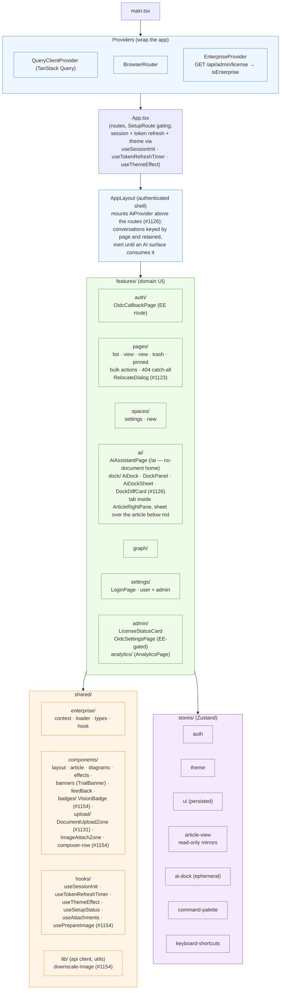
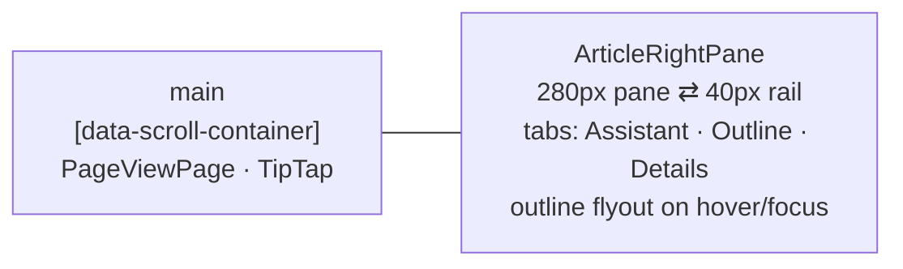
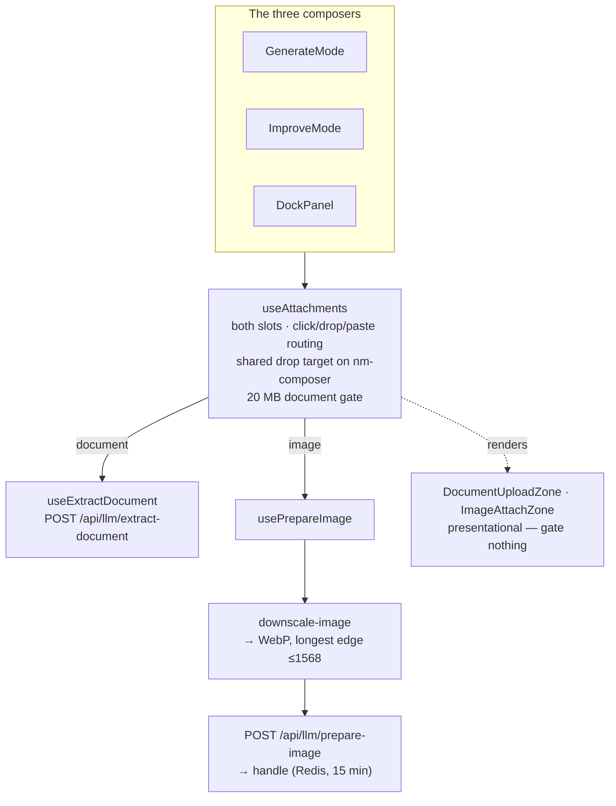
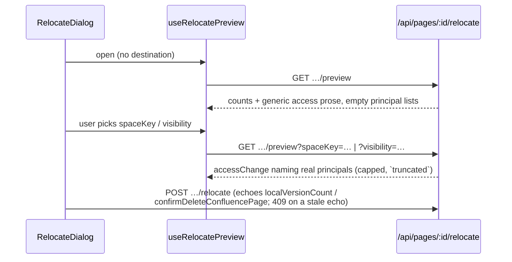
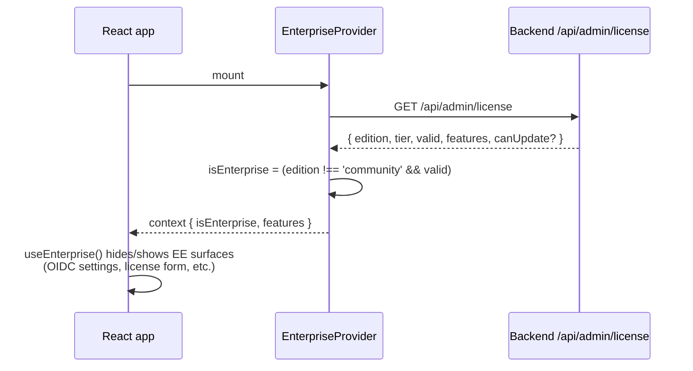

# 4. Frontend Structure

Zooms into the `frontend` container. React 19 SPA built with Vite, served
statically in production.

## Provider & feature layout

```mermaid
flowchart TB
    main["main.tsx"]

    subgraph providers["Providers (wrap the app)"]
        direction TB
        qp["QueryClientProvider (TanStack Query)"]
        rp["BrowserRouter"]
        ep["EnterpriseProvider<br/>GET /api/admin/license → isEnterprise"]
    end

    main --> providers
    providers --> app["App.tsx<br/>(routes, SetupRoute gating;<br/>session + token refresh + theme via<br/>useSessionInit · useTokenRefreshTimer · useThemeEffect)"]

    subgraph features["features/ (domain UI)"]
        direction LR
        fAuth["auth/<br/>OidcCallbackPage (EE route)"]
        fPages["pages/<br/>list · view · new · trash · pinned<br/>bulk actions · 404 catch-all<br/>RelocateDialog (#1123)"]
        fSpaces["spaces/<br/>settings · new"]
        fAI["ai/<br/>AiAssistantPage (/ai — no-document home)<br/>dock/ AiDock · DockPanel · AiDockSheet · DockDiffCard (#1126)<br/>tab inside ArticleRightPane, sheet over the article below md"]
        fGraph["graph/"]
        fSettings["settings/<br/>LoginPage · user + admin"]
        fAdmin["admin/<br/>LicenseStatusCard<br/>OidcSettingsPage (EE-gated)<br/>analytics/ (AnalyticsPage)"]
    end

    app --> shell["AppLayout (authenticated shell)<br/>mounts AiProvider above the routes (#1126):<br/>conversations keyed by page and retained,<br/>inert until an AI surface consumes it"]
    shell --> features

    subgraph shared["shared/"]
        direction LR
        sEnt["enterprise/<br/>context · loader · types · hook"]
        sComp["components/<br/>layout · article · diagrams · effects ·<br/>banners (TrialBanner) · feedback ·<br/>badges/ VisionBadge (#1154) ·<br/>upload/ DocumentUploadZone (#1131) ·<br/>ImageAttachZone · composer-row (#1154)"]
        sHooks["hooks/<br/>useSessionInit · useTokenRefreshTimer ·<br/>useThemeEffect · useSetupStatus ·<br/>useAttachments · usePrepareImage (#1154)"]
        sLib["lib/ (api client, utils)<br/>downscale-image (#1154)"]
    end

    features --> shared

    subgraph stores["stores/ (Zustand)"]
        zAuth["auth"]
        zTheme["theme"]
        zUI["ui (persisted)"]
        zAV["article-view<br/>read-only mirrors"]
        zDock["ai-dock (ephemeral)"]
        zCmd["command-palette"]
        zKb["keyboard-shortcuts"]
    end

    features --> stores

    classDef prov fill:#eef6ff,stroke:#4a90e2
    classDef feat fill:#eefbe8,stroke:#4caf50
    classDef sh fill:#fff4e5,stroke:#e5a23c
    classDef st fill:#f5eafd,stroke:#9b59b6
    class providers,qp,rp,ep,shell prov
    class features,fAuth,fPages,fSpaces,fAI,fGraph,fSettings,fAdmin feat
    class shared,sEnt,sComp,sHooks,sLib sh
    class stores,zAuth,zTheme,zUI,zAV,zDock,zCmd,zKb st
```

## Article route panels (#1126)

On `/pages/:id` the shell renders **two** siblings in one flex row, so each
panel scrolls independently and the editor column shrinks around them rather
than having anything float above it.

```mermaid
flowchart LR
    main["main<br/>[data-scroll-container]<br/>PageViewPage · TipTap"]
    rail["ArticleRightPane<br/>280px pane ⇄ 40px rail<br/>tabs: Assistant · Outline · Details<br/>outline flyout on hover/focus"]

    main --- rail
```

- **The assistant is a tab, not a third column.** #1126 shipped it as its own
  column beside `ArticleRightPane`; on a 1440px screen that drew three vertical
  rules across the window and squeezed the article — the thing the route exists
  for — between two slabs of chrome. It is now the first of three tabs inside
  the inspector, switching instantly like Outline and Details. One right-hand
  edge, one interaction to learn. `AiDock` still exists but renders the mobile
  sheet or nothing: `return mobile ? <AiDockSheet /> : null`.
- The tab choice is **local `useState`** in `ArticleRightPane`, not a store: it
  is a per-visit view, and persisting it would open pages onto an AI panel
  nobody asked for. It defaults to Outline, or Details when the page has no
  headings.
- **"Show me the assistant" is consumed by `AppLayout`.** `openDock()` is still
  what Alt+I, the AI layout preset and the inspector's rail button raise. Below
  `md` that opens the sheet. On an article route at `md` and up there is no
  dock, so an effect turns it into `requestInspectorView('assistant')` plus an
  expand, and lowers the flag in the same tick — `open` keeps meaning exactly
  "the mobile sheet is up". Skipping that step is not a no-op: `ArticleRightPane`
  ORs `open` into its own `collapsed`, so an unconsumed flag collapsed the
  inspector to a rail at ≥1100px and made the right side vanish entirely
  between 768 and 1099px, i.e. the keystroke destroyed the panel it was meant
  to open. Guarded across all four widths in `AppLayout.test.tsx`.
- `.` closes the sheet while it is open, so the key is never dead; at `md` and
  up it plainly toggles the pane.
- `useIsDockWideLayout` (`min-width: 1100px`) and `useIsMobileLayout` are the
  app's only JS *width* queries — `use-can-hover` and three one-shot checks
  read `matchMedia` for pointer and motion capability, but every other
  responsive layout decision is a Tailwind class.
- Below `md` (`useIsMobileLayout`) there is no right side to dock into, so
  `AiDock` swaps containers: `AiDockSheet` renders the same `DockPanel` as a
  drag-to-expand bottom sheet over the article, the way the left sidebar
  already becomes a slide-over there. Two detents (52% / 92% of the viewport),
  dragged with a hand-rolled Pointer Events handler because the app's
  `LazyMotion features={domAnimation}` excludes framer's `drag` feature bundle.
  Unlike the inspector tab, the sheet **is** modal — backdrop, `aria-modal`, Tab trap
  — because it occludes the document rather than sitting beside it.
- `Apply` on a proposed change goes through **`POST /llm/improvements/apply`**,
  not a client-side write into the editor. That route runs `protectMedia` /
  `restoreMedia` (#723) and the column-layout realignment that returns **422**
  when the layout is unrecoverable (#781). Those guards live in
  `backend/src/core/services/content-converter.ts` and have no frontend
  counterpart, so a client-side Markdown→HTML round-trip would silently strip
  Confluence macros and media — see
  [`11-content-pipeline.md`](./11-content-pipeline.md). What the dock changes
  is *where the decision happens* — inline in the thread, beside the document —
  not how it is applied. Consequently Apply is unavailable while the editor is
  open: it rewrites the saved page, which an open editor would overwrite on its
  next save. `article-view` therefore stays a set of read-only mirrors.
- `/ai` keeps only the Ask and Generate tabs. The four document actions are
  dock chips; their mode screens still render for `?mode=…` deep links, but
  nothing offers them and nothing in the app builds one — only bookmarks and
  links made before #1126. `SidebarTreeView` is not a source of them and never
  was: its `isAiRoute` clicks navigate to `/ai?pageId=…` with `replace: true`,
  which *drops* any `mode=` already in the URL, and `AiContext` reads the
  mode-less result as Ask (deliberately — a sticky `improve` carried onto a
  plain `/ai` would render a document screen with no tab selected and no way
  back except the URL bar). It is what clears a mode deep link, not what makes
  one.
- **Opening the assistant runs nothing (#1176).** The rail icon, the expanded
  pane's row and `Alt+I` (`ai-assistant` in the shortcut registry) call
  `openDock()` and stop there. #1126 had them seed `'improve'`, which `DockPanel`
  fired as soon as a model and the page resolved — so one click started a
  full-page rewrite of an improvement type nobody had picked, with no stop
  control and no abort on close. `DockSeed` / `seedPageId` / `consumeSeed` and
  the effect that consumed them are gone, and with them the page-mismatch guard
  that existed only to keep a pending seed from firing at whatever document
  loaded next. Every request now starts at a chip or the composer.

## Composer attachments (#1131 documents, #1154 images)

The three AI composer surfaces — `/ai` Generate, `/ai` Improve and the dock's
`DockPanel` — do not each hold their own attachment state. All three mount one
`useAttachments` (`shared/hooks/`), which owns **both** slots and every way a
file can arrive.

```mermaid
flowchart TB
    subgraph surfaces["The three composers"]
        gen["GenerateMode"]
        imp["ImproveMode"]
        dock["DockPanel"]
    end

    surfaces --> hook["useAttachments<br/>both slots · click/drop/paste routing<br/>shared drop target on nm-composer<br/>20 MB document gate"]

    hook -->|document| ext["useExtractDocument<br/>POST /api/llm/extract-document"]
    hook -->|image| prep["usePrepareImage"]
    prep --> down["downscale-image<br/>→ WebP, longest edge ≤1568"]
    down --> api["POST /api/llm/prepare-image<br/>→ handle (Redis, 15 min)"]

    hook -.renders.-> zones["DocumentUploadZone · ImageAttachZone<br/>presentational — gate nothing"]
```

- **The hook decides, the zones display.** Whether a dropped file is a document
  or an image is answered once, in the only place that sees both halves; the
  zones report the file they were handed. A shared drop target makes this
  structural rather than stylistic — if both zones listened, which one claimed a
  dropped PNG would be emergent rather than designed.
- Passing **`isDragOver`** into `DocumentUploadZone` is the signal that an
  ancestor owns the drop target; the component then binds no drag handlers of its
  own. Omitting it while the hook listens double-fires every drop.
- Every image is re-encoded in the browser before staging, so the server only
  ever receives WebP inside the edge cap. **SVG is refused client-side** and never
  rasterized. See [`11-content-pipeline.md`](./11-content-pipeline.md) for the
  server contract.
- Attaching an image requires `AiContext`'s **`chatVision`** to be exactly
  `true`. It is a tri-state (`true` / `false` / `null`) and must not be collapsed
  to a boolean: `false` is "probed and refused", `null` is "not established" —
  which is usually *not probed yet*, since `getVisionCapability` is a cache read
  that schedules a refresh and returns `null` on the spot — and `VisionBadge`
  (`shared/components/badges/`, also shown on the Settings → AI → AI Models chat assignment)
  renders them as different words. No copy may claim a probe ran.
- The verdict is about the **chat use-case default**, never the model dropdown.
  `/llm/generate` and `/llm/improve` both gate on `resolveUsecase('chat')` and
  ignore the body's `model`, so refusal copy interpolates `AiContext`'s
  **`chatVisionModel`** — and `ImageAttachZone` names the prop `visionModel` to
  keep it apart from `model`. On `/ai` the two differ on screen the moment the
  user changes the dropdown.
- **In the dock, neither attachment reaches Send.** `ask()` posts to `/llm/ask`,
  which accepts no `referenceText` and no `imageHandle` — wiring either in would
  be a 400, not a feature. Only the Improve chip consumes them, so both zones say
  so in their trigger label and on their card (`triggerLabel` / `usageHint`).
  Improve also re-checks `isBusy` **inside** `runChip` rather than only on the
  chip's `disabled`: `DockDiffCard`'s "Re-run Improve" reaches it directly and is
  not disabled while an attachment stages. (#1154 listed a second such caller,
  the seed effect that ran Improve on open; #1176 deleted it — see "Opening the
  assistant runs nothing" under *Article route panels* above.)
- Both `isExtracting` and `isPreparing` are **depth counters**, not booleans. The
  shared drop target accepts a second file mid-flight, and a boolean would clear
  on the first `finally` — re-enabling the trigger and unblocking Send while the
  second attachment was still being prepared (#940). Removing or clearing a slot
  also bumps its request id, so an in-flight result that lands afterwards is
  discarded rather than re-attaching itself to whatever page the user moved to.
- Each zone contributes **one flex row holding its own card and trigger**
  (`composer-row.ts`). `order-*` moves boxes without moving the tab sequence, so
  the reordering convention that predated this is gone from the zones and all
  three hosts; `expectComposerFocusOrder` (`test-utils.ts`) fails on any `order-*`
  inside a composer (WCAG 2.4.3).

## Relocating an article across the Confluence boundary (#1123)

`RelocateDialog` (`features/pages/`) is the only surface that moves a page
between `source: 'standalone'` and `source: 'confluence'`. Its entry point is a
single control in the article action strip, gated on
`usePermission('pages:relocate')` and **hidden** when denied — CE ships no UI
for granting permissions, so a denied user has no in-product path to earning
one, and the preview endpoint is gated on the same permission.

```mermaid
sequenceDiagram
    participant D as RelocateDialog
    participant Q as useRelocatePreview
    participant API as /api/pages/:id/relocate

    D->>Q: open (no destination)
    Q->>API: GET …/preview
    API-->>Q: counts + generic access prose, empty principal lists
    D->>Q: user picks spaceKey / visibility
    Q->>API: GET …/preview?spaceKey=… | ?visibility=…
    API-->>Q: accessChange naming real principals (capped, `truncated`)
    D->>API: POST …/relocate  (echoes localVersionCount /<br/>confirmDeleteConfluencePage#59; 409 on a stale echo)
```

- The preview is a **dependent query** keyed on the destination, not a manual
  refetch. Only the → Confluence direction sends `spaceKey`: the route
  authorises a caller-supplied space key against the user's role-assigned
  *Confluence* spaces (it feeds a membership enumeration), so a local space key
  would 403 for a non-admin.
- Changing the destination **clears the acknowledgements**, and so does the
  409 "reload preview" recovery — a still-ticked box would otherwise re-confirm
  a roster or a version count the user never saw.
- Backend contract and transactional guarantees:
  [`03-backend-domains.md`](./03-backend-domains.md),
  `backend/src/domains/knowledge/services/page-relocate-service.ts`. Design of
  record: `docs/superpowers/specs/2026-07-29-relocate-dialog-design.md`.

## Enterprise gating

The frontend ships **one image** for both CE and EE. Enterprise UI is gated
at runtime:

```mermaid
sequenceDiagram
    participant UI as React app
    participant EP as EnterpriseProvider
    participant API as Backend /api/admin/license

    UI->>EP: mount
    EP->>API: GET /api/admin/license
    API-->>EP: { edition, tier, valid, features, canUpdate? }
    EP->>EP: isEnterprise = (edition !== 'community' && valid)
    EP-->>UI: context { isEnterprise, features }
    UI->>UI: useEnterprise() hides/shows EE surfaces<br/>(OIDC settings, license form, etc.)
```

See [`10-flow-enterprise-license.md`](./10-flow-enterprise-license.md) for
the backend side.

## Styling

- **TailwindCSS 4** with CSS variables for theming. Two themes ship —
  **Graphite** (dark, `#0d0e11`) and **Paper** (light, `#fbfbfc`) — a neutral
  flat system carrying one teal accent (`#4dd0e1` / `#0e7490`) as the single
  brand and interaction colour, amber reserved for warning/attention, and
  violet for AI ornament (operable things stay teal). Surfaces are **flat
  colours**: `--surface-backdrop`, `--surface-card` and
  `--surface-card-elevated` are plain values, so a `hover:bg-*` utility
  composes normally — the gradient-as-background-image trap of the previous
  palette is designed out. See ADR-010 v0.6 for the decision, which supersedes
  the neumorphic depth model of v0.4/v0.5 and the v0.3-era glassmorphic
  surfaces before it.
- **Chrome is the ground, content is the pane.** Sidebar, header and toolbars
  paint `--color-background`; the content pane sits one value step up. This is
  why the document is the brightest thing on screen and navigation recedes.
  Both themes are the same token-driven ladder — there are deliberately **no**
  `[data-theme-type="light"]` shell overrides, and a test fails if one returns.
- **Two border weights, split by role.** `--color-border` is the quiet
  hairline for separators, panes and prose rules;
  `--color-border-interactive` is the visible edge of anything operable and
  is measured ≥3:1 against every surface it lands on (WCAG 1.4.11). With the
  extrusion gone there is no shadow to fall back on, so this border is the
  whole of what survives `forced-colors: active`.
- **Flat surface system** (ADR-010 v0.6): the sixteen `nm-*` `@utility`
  classes are kept by name — `nm-card`, `nm-card-elevated`,
  `nm-card-interactive`, `nm-card-hover`, `nm-toolbar`, `nm-sidebar`,
  `nm-header`, `nm-pill-active`, `nm-button-primary`, `nm-button-destructive`,
  `nm-button-ghost`, `nm-icon-button`, `nm-composer`, `nm-input`, `nm-select`,
  `nm-select-md` — because 107 files reference them and redefining them in
  place reskins every route at once. Each is now a flat definition: value step
  plus 1px border, no extrusion, no lift, no press scale. **Exactly one real
  shadow exists** (`--shadow-overlay`, on `nm-card-elevated` only) for content
  that genuinely floats above the page: popovers, dialogs, the command palette.
- **Theme preference follows the OS by default** (`system | dark | light`). The
  preference is persisted; the resolved palette is not, so a stale value cannot
  outrank the live OS reading.
- **Framer Motion** for entrance animations, wrapped in `LazyMotion`;
  all animations respect `prefers-reduced-motion`.
- **Radix UI** primitives for all interactive elements (menus, dialogs,
  tooltips, dropdowns).
