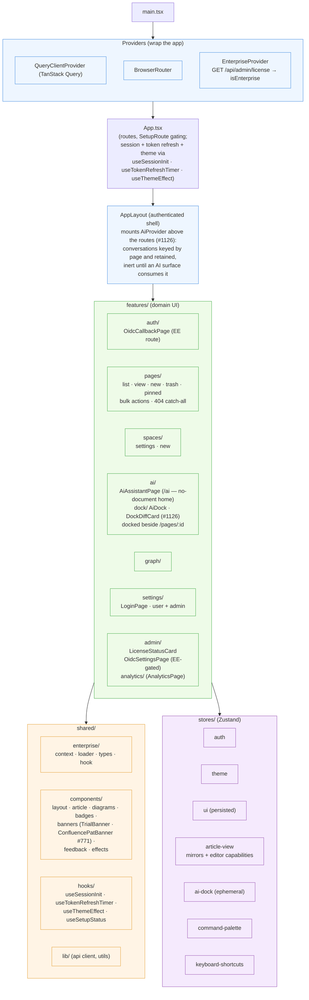
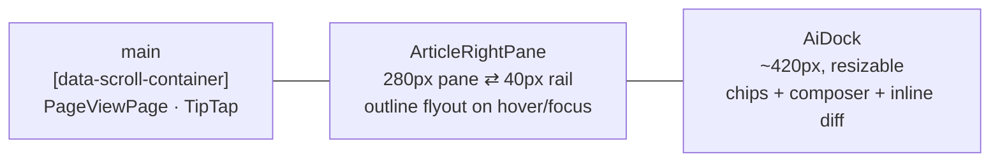
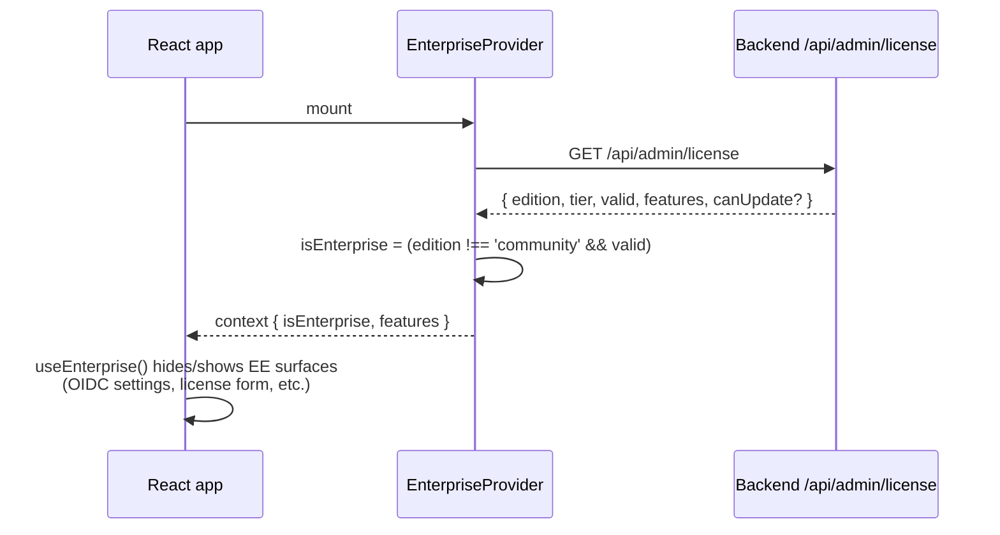

# 4. Frontend Structure

Zooms into the `frontend` container. React 19 SPA built with Vite, served
statically in production.

## Provider & feature layout

```mermaid
flowchart TB
    main["main.tsx"]

    subgraph providers["Providers (wrap the app)"]
        direction TB
        qp["QueryClientProvider (TanStack Query)"]
        rp["BrowserRouter"]
        ep["EnterpriseProvider<br/>GET /api/admin/license → isEnterprise"]
    end

    main --> providers
    providers --> app["App.tsx<br/>(routes, SetupRoute gating;<br/>session + token refresh + theme via<br/>useSessionInit · useTokenRefreshTimer · useThemeEffect)"]

    subgraph features["features/ (domain UI)"]
        direction LR
        fAuth["auth/<br/>OidcCallbackPage (EE route)"]
        fPages["pages/<br/>list · view · new · trash · pinned<br/>bulk actions · 404 catch-all"]
        fSpaces["spaces/<br/>settings · new"]
        fAI["ai/<br/>AiAssistantPage (/ai — no-document home)<br/>dock/ AiDock · DockDiffCard (#1126)<br/>docked beside /pages/:id"]
        fGraph["graph/"]
        fSettings["settings/<br/>LoginPage · user + admin"]
        fAdmin["admin/<br/>LicenseStatusCard<br/>OidcSettingsPage (EE-gated)<br/>analytics/ (AnalyticsPage)"]
    end

    app --> shell["AppLayout (authenticated shell)<br/>mounts AiProvider above the routes (#1126):<br/>conversations keyed by page and retained,<br/>inert until an AI surface consumes it"]
    shell --> features

    subgraph shared["shared/"]
        direction LR
        sEnt["enterprise/<br/>context · loader · types · hook"]
        sComp["components/<br/>layout · article · diagrams · badges ·<br/>banners (TrialBanner · ConfluencePatBanner #771) ·<br/>feedback · effects"]
        sHooks["hooks/<br/>useSessionInit · useTokenRefreshTimer ·<br/>useThemeEffect · useSetupStatus"]
        sLib["lib/ (api client, utils)"]
    end

    features --> shared

    subgraph stores["stores/ (Zustand)"]
        zAuth["auth"]
        zTheme["theme"]
        zUI["ui (persisted)"]
        zAV["article-view<br/>mirrors + editor capabilities"]
        zDock["ai-dock (ephemeral)"]
        zCmd["command-palette"]
        zKb["keyboard-shortcuts"]
    end

    features --> stores

    classDef prov fill:#eef6ff,stroke:#4a90e2
    classDef feat fill:#eefbe8,stroke:#4caf50
    classDef sh fill:#fff4e5,stroke:#e5a23c
    classDef st fill:#f5eafd,stroke:#9b59b6
    class providers,qp,rp,ep,shell prov
    class features,fAuth,fPages,fSpaces,fAI,fGraph,fSettings,fAdmin feat
    class shared,sEnt,sComp,sHooks,sLib sh
    class stores,zAuth,zTheme,zUI,zAV,zDock,zCmd,zKb st
```

## Article route panels (#1126)

On `/pages/:id` the shell renders three siblings in one flex row, so each
panel scrolls independently and the editor column shrinks around them rather
than having anything float above it.

```mermaid
flowchart LR
    main["main<br/>[data-scroll-container]<br/>PageViewPage · TipTap"]
    rail["ArticleRightPane<br/>280px pane ⇄ 40px rail<br/>outline flyout on hover/focus"]
    dock["AiDock<br/>~420px, resizable<br/>chips + composer + inline diff"]

    main --- rail --- dock
```

- Opening the dock **ORs** the pane into its rail; it never writes the user's
  persisted `articleSidebarCollapsed`. `.` closes the dock while it is open,
  so the key is never dead.
- Below `min-width: 1100px` (`useIsDockWideLayout`) the rail is not rendered
  and the dock is capped narrower — the only JS media query in the app;
  everything else is a Tailwind class.
- `Apply` on a proposed change goes through **`POST /llm/improvements/apply`**,
  not a client-side write into the editor. That route runs `protectMedia` /
  `restoreMedia` (#723) and the column-layout realignment that returns **422**
  when the layout is unrecoverable (#781). Those guards live in
  `backend/src/core/services/content-converter.ts` and have no frontend
  counterpart, so a client-side Markdown→HTML round-trip would silently strip
  Confluence macros and media — see
  [`11-content-pipeline.md`](./11-content-pipeline.md). What the dock changes
  is *where the decision happens* — inline in the thread, beside the document —
  not how it is applied. Consequently Apply is unavailable while the editor is
  open: it rewrites the saved page, which an open editor would overwrite on its
  next save. `article-view` therefore stays a set of read-only mirrors.
- `/ai` keeps only the Ask and Generate tabs. The four document actions are
  dock chips; their mode screens still render for `?mode=…` deep links (which
  `SidebarTreeView` and old bookmarks still produce), but nothing offers them.

## Enterprise gating

The frontend ships **one image** for both CE and EE. Enterprise UI is gated
at runtime:

```mermaid
sequenceDiagram
    participant UI as React app
    participant EP as EnterpriseProvider
    participant API as Backend /api/admin/license

    UI->>EP: mount
    EP->>API: GET /api/admin/license
    API-->>EP: { edition, tier, valid, features, canUpdate? }
    EP->>EP: isEnterprise = (edition !== 'community' && valid)
    EP-->>UI: context { isEnterprise, features }
    UI->>UI: useEnterprise() hides/shows EE surfaces<br/>(OIDC settings, license form, etc.)
```

See [`10-flow-enterprise-license.md`](./10-flow-enterprise-license.md) for
the backend side.

## Styling

- **TailwindCSS 4** with CSS variables for theming. Two themes ship —
  **Slate Steel** (dark, default, navy `#0E1220`) and **Frost Steel** (light,
  `#F4F6FA`) — a cool slate-and-steel system in one hue family, with steel
  (`#6EA8FF` / `#2F6BD8`) as the single brand and interaction accent, amber
  reserved for warning/attention, and violet for AI ornament (operable
  things stay steel). Both themes are gradient-lit via `--surface-backdrop`,
  `--surface-card` and `--surface-card-elevated`. Those are background
  *images*, so a `hover:bg-*` utility on a card surface is a silent no-op —
  use `nm-card-hover`. See ADR-010 v0.5 for the palette, and v0.4
  for the neumorphic surface rationale and the migration away from the
  v0.3-era glassmorphic surfaces. This palette replaces the Graphite Honey /
  Honey Linen pair and no longer mirrors the landing page's honey tokens.
- **Two border weights, split by role.** `--color-border` is the quiet
  hairline for separators, panes and prose rules;
  `--color-border-interactive` is the visible edge of anything operable and
  is measured ≥3:1 against every surface it lands on (WCAG 1.4.11). The
  neumorphic recipe leans on shadow for depth, and forced-colors mode
  discards shadow — this border is what survives.
- **Neumorphic** surface system (ADR-010 v0.4): sixteen `nm-*` `@utility`
  classes (`nm-card`, `nm-card-elevated`, `nm-card-interactive`,
  `nm-card-hover`, `nm-toolbar`, `nm-sidebar`, `nm-header`, `nm-pill-active`,
  `nm-button-primary`, `nm-button-destructive`, `nm-button-ghost`,
  `nm-icon-button`, `nm-composer`, `nm-input`, `nm-select`, `nm-select-md`)
  built on theme-tinted shadow recipes plus a mandatory 1px solid border
  for visibility under WCAG 1.4.11 and `forced-colors: active`.
- **Framer Motion** for entrance animations, wrapped in `LazyMotion`;
  all animations respect `prefers-reduced-motion`.
- **Radix UI** primitives for all interactive elements (menus, dialogs,
  tooltips, dropdowns).
