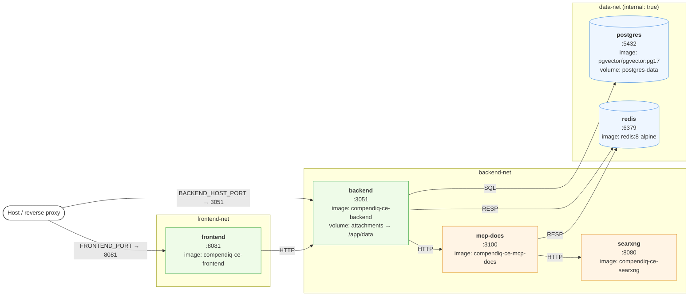

# 5. Docker Deployment

Physical layout derived from `docker/docker-compose.yml`. The compose file
defines three networks to keep internal services (`postgres`, `redis`) off
the public bridge.

## Compose topology

## Network rules

| Network       | internal | Members                         | Purpose |
|---------------|----------|---------------------------------|---------|
| `frontend-net`| no       | frontend, backend               | Browser → frontend, SPA → backend API |
| `backend-net` | no       | backend, mcp-docs, searxng      | Backend sidecar services |
| `data-net`    | **yes**  | postgres, redis (+ backend)     | No external exposure; DB/cache only reachable from backend |

`postgres` and `redis` **must not** publish host ports in production.
Development overrides (`docker/docker-compose.*.yml`) may expose them for
debugging — never merge that into production.

## Volumes

| Volume          | Mount                                  | Contents |
|-----------------|----------------------------------------|----------|
| `postgres-data` | `/var/lib/postgresql/data` (postgres)  | Primary data + embeddings |
| `attachments`   | `/app/data` (backend)                  | Cached Confluence attachments (images, drawio, PDFs) — also configurable via `ATTACHMENTS_DIR` |

## Additional compose files

- `docker-compose.confluence.yml` — spins up a throwaway Confluence DC for
  local integration testing.
- `docker-compose.test.yml` — CI services (Postgres on `:5433`, Redis
  ephemeral) used by `backend` tests and Playwright E2E.

## Enterprise image

`docker/Dockerfile.enterprise` is a multi-stage template that overlays the
`@compendiq/enterprise` package onto the backend image. It does **not**
modify the frontend image — the frontend is identical in CE and EE
deployments and gates Enterprise UI at runtime (see
[`04-frontend-structure.md`](./04-frontend-structure.md)).
