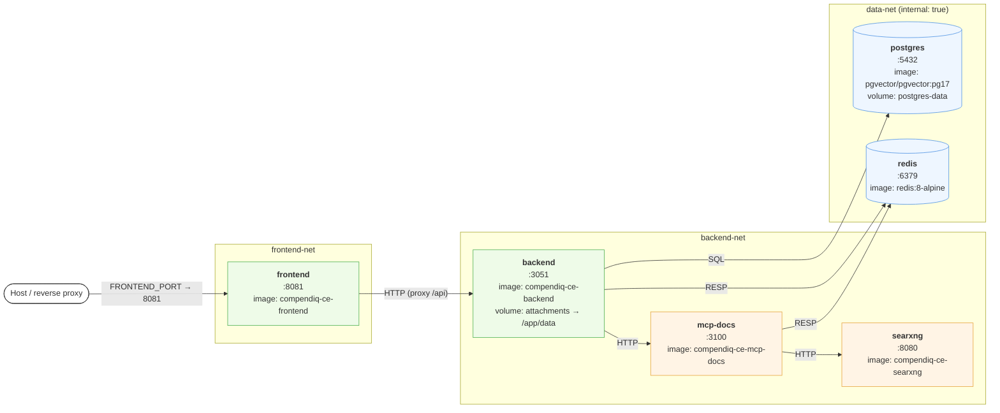
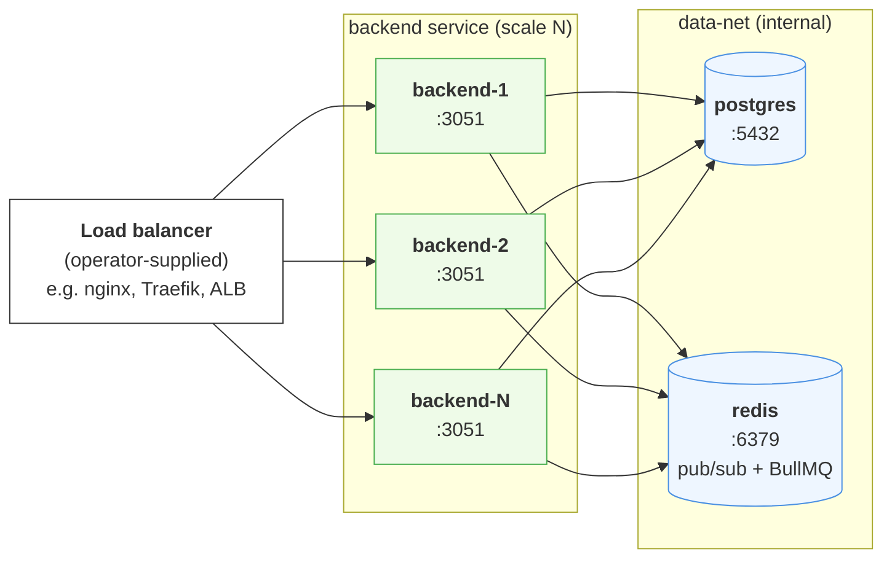

# 5. Docker Deployment

Physical layout derived from `docker/docker-compose.yml`. The compose file
defines three networks to keep internal services (`postgres`, `redis`) off
the public bridge.

## Compose topology



## Network rules

| Network       | internal | Members                         | Purpose |
|---------------|----------|---------------------------------|---------|
| `frontend-net`| no       | frontend, backend               | Browser → frontend, SPA → backend API |
| `backend-net` | no       | backend, mcp-docs, searxng      | Backend sidecar services |
| `data-net`    | **yes**  | postgres, redis (+ backend)     | No external exposure; DB/cache only reachable from backend |

The `backend` container publishes **no host port** — all API traffic goes
through the frontend nginx proxy, which applies the CSP / security headers
(`frontend/nginx-security-headers.conf`). `postgres` and `redis` **must
not** publish host ports in production. Development overrides
(`docker/docker-compose.*.yml`) may expose them for debugging — bound to
`127.0.0.1` only, and never merged into production.

`POSTGRES_PASSWORD` and `REDIS_PASSWORD` are required (`${VAR:?...}`) with
no baked-in defaults; `redis` runs with `maxmemory-policy noeviction`
because BullMQ stores queue/job state there and eviction would silently
drop jobs.

## Volumes

| Volume          | Mount                                  | Contents |
|-----------------|----------------------------------------|----------|
| `postgres-data` | `/var/lib/postgresql/data` (postgres)  | Primary data + embeddings |
| `attachments`   | `/app/data` (backend)                  | Cached Confluence attachments (images, drawio, PDFs) — also configurable via `ATTACHMENTS_DIR` |

## Additional compose files

- `docker-compose.confluence.yml` — spins up a throwaway Confluence DC for
  local integration testing.
- `docker-compose.test.yml` — CI services (Postgres on `:5433`, Redis
  ephemeral) used by `backend` tests and Playwright E2E.

## Enterprise image

`docker/Dockerfile.enterprise` is a multi-stage template that overlays the
`@compendiq/enterprise` package onto the backend image. It does **not**
modify the frontend image — the frontend is identical in CE and EE
deployments and gates Enterprise UI at runtime (see
[`04-frontend-structure.md`](./04-frontend-structure.md)).

## Multi-replica `backend` (v0.4+)

From v0.4 onward the `backend` service is safe to run with N≥2 replicas
behind a load balancer. The state-sharing primitives that make this work
are documented in [ADR-024](../ARCHITECTURE-DECISIONS.md#adr-024-multi-instance-readiness-horizontally-scaled-backend);
this section is the operator view.



### What's shared via Redis

| Concern | Mechanism | Channel / Key |
|---|---|---|
| Provider config invalidation | Pub/sub (advisory-only payloads) | `provider:cache:bump`, `provider:deleted` |
| LLM admin settings (concurrency, queue depth) | Pub/sub + cached getters | `admin:llm:settings` |
| IP allowlist hot-reload | Pub/sub | `ip_allowlist:changed` |
| Confluence SSRF allowlist | Dedicated `ssrf-allowlist-bus` | `confluence:allowlist:changed` |
| Sync conflict / PII / license / per-page-restriction policy | Pub/sub | `sync:conflict:policy:changed`, `pii:policy:changed`, `license:changed` |
| Recurring jobs (sync tick, retention prune, embedding tick, webhook outbox poll) | BullMQ `upsertJobScheduler` with stable IDs | Redis queue keys |
| Sync worker leadership | Redis SET-NX lock | `sync:worker:lock` |
| Embedding locks | Redis SET-NX | `embedding:lock:{userId}` (per-user fairness) and `embedding:lock:__reembed_all__` (global re-embed) |

### Operator requirements

1. **`trustProxy` MUST be set to your LB's CIDR — never `true`.**
   `trustProxy: true` lets any client forge `X-Forwarded-For`, breaking
   IP-allowlist enforcement and audit-log accuracy. The default
   loopback-only configuration (`127.0.0.1/32`, `::1/128`) is safe for
   single-replica dev. **There is no `TRUST_PROXY_CIDR` env var** — the
   trusted-proxy CIDRs are loaded from
   `admin_settings.ip_allowlist.trustedProxies` (a JSONB array of
   CIDR strings) at boot, with cluster-wide hot-reload via the
   `ip_allowlist:changed` cache-bus channel. Configure via the
   Settings → IP allowlist admin tab in Enterprise builds, or via a
   direct `admin_settings` row for CE-only deployments. See
   `docs/ADMIN-GUIDE.md` → IP Allowlist → Trust-proxy behaviour.

2. **`stop_grace_period: 60s` on the `backend` service** so SIGTERM has
   time to drain HTTP handlers + finish active BullMQ jobs before
   SIGKILL. Set in `docker/docker-compose.ee.yml` for EE; CE operators
   running multi-replica should set it on their compose. See ADR-024 →
   Graceful-shutdown order.

3. **Redis must be reachable from every replica** with low latency
   (single-digit ms LAN). Pub/sub is advisory at-most-once — the
   `redis-cache-bus` `onReconnect` hook cold-reloads cached settings
   after any disconnect, so a brief Redis blip costs a fan of
   uncached reads, not desync.

4. **Postgres connection sizing.** Each replica opens its own pool;
   default size × replicas should stay below `max_connections` at the
   Postgres side. Tune `PG_POOL_MAX` if scaling past 4 replicas.

5. **Redis kernel tuning (production hosts only).** On boot, Redis
   logs `WARNING Memory overcommit must be enabled!`. On dev/test
   machines this is harmless. For production deployments, set
   `vm.overcommit_memory=1` on the host
   (`sysctl vm.overcommit_memory=1`, then persist in
   `/etc/sysctl.conf`) so background saves don't fail under
   low-memory conditions.

6. **Health probes.** Use `GET /api/health` for the LB readiness probe
   (public, no auth). Use `GET /api/internal/health?token=<t>` for an
   external mgmt poller — token-gated, returns richer diagnostics
   (version, edition, dirty pages, last-sync timestamp, error rate).
   The token lives in `admin_settings.health_api_token` (seeded by
   migration 072). For v0.4 onward, rotate via
   `POST /api/admin/health-api/rotate` (admin-only) — that route ships
   in EE#113 sub-PR 1e (CE PR #613); until it merges, rotate manually
   via `UPDATE admin_settings SET setting_value = ... WHERE setting_key = 'health_api_token'`.

### Compose example (2 replicas)

```yaml
# docker/docker-compose.ee.yml — excerpt
services:
  backend:
    # `:latest` tracks the latest stable release on `main`; pin to a
    # versioned tag like `:0.4.0` for reproducible production deploys,
    # or `:dev` for staging environments that want dev-branch nightlies.
    image: ghcr.io/compendiq/compendiq-ee-backend:latest
    stop_grace_period: 60s   # SIGTERM → drain → SIGKILL
    environment:
      # Trusted-proxy CIDRs are NOT an env var — set them via
      # Settings → IP allowlist (admin UI) or by writing the
      # admin_settings.ip_allowlist row directly. See operator
      # requirement #1 above.
      POSTGRES_URL: "postgres://…"
      REDIS_URL: "redis://redis:6379"
      JWT_SECRET: "${JWT_SECRET}"
      PAT_ENCRYPTION_KEY: "${PAT_ENCRYPTION_KEY}"
```

Bring up two replicas with:

```bash
docker compose --env-file .env -f docker/docker-compose.ee.yml up -d --scale backend=2
```

Note: Compose's `deploy.replicas` is Docker Swarm syntax and is
**ignored** by `docker compose up` — use `--scale backend=N` on the
command line, or define the replicas in your orchestrator (Kubernetes
`replicas:`, ECS desired count, Nomad `count`, etc.) for production.

The same compose works for CE — replace the `ee-backend` image with
`compendiq-ce-backend` and remove EE-only environment variables.

### Out of scope (v0.4)

- Dedicated worker container (deferred to v0.5; current model has every
  replica run both HTTP and BullMQ workers).
- Active-active across regions (Redis pub/sub is single-cluster).
- Auto-scaling on queue depth (BullMQ exposes the metrics; orchestration
  is operator-defined).

