# 6. Data Model (ERD)

Focused ERD of the core tables. Only the most relevant columns are shown;
auxiliary tables (migrations log, rate-limit buckets, token blacklist,
per-feature settings) are omitted for readability. See
`backend/src/core/db/migrations/` for the full schema.

```mermaid
erDiagram
    users ||--o| user_settings : "has 1"
    users ||--o{ pages : "owns"
    users ||--o{ page_versions : "owns"
    users ||--o{ page_embeddings : "owns"
    users ||--o{ llm_conversations : "owns"
    users ||--o{ notifications : "receives"
    users ||--o{ audit_log : "generates"
    users ||--o{ comments : "authors"
    users ||--o{ knowledge_requests : "requests"
    users ||--o{ templates : "authors"

    pages ||--o{ page_versions : "versioned as"
    pages ||--o{ page_embeddings : "chunked into"
    pages ||--o{ comments : "annotated by"
    pages ||--o{ page_relationships : "related via"
    pages ||--o{ knowledge_requests : "fulfils"
    pages ||--o{ local_attachments : "owns (standalone pages only)"
    pages ||--o{ spaces : "is custom home of (#352)"

    roles ||--o{ group_memberships : "granted via"
    groups ||--o{ group_memberships : "has"
    users ||--o{ group_memberships : "member of"
    groups ||--o{ space_role_assignments : "assigned in"
    roles ||--o{ space_role_assignments : "used in"

    users {
        uuid id PK
        text username UK
        text password_hash
        text role "admin | user"
        text email
        text display_name
        text auth_provider "local | oidc"
        text oidc_sub
        timestamptz deactivated_at "non-null => account disabled (#304)"
        uuid deactivated_by FK "admin who disabled (#304)"
        text deactivated_reason "free-form note (#304)"
        timestamptz last_login_at "last successful login (#307)"
        timestamptz created_at
    }

    user_settings {
        uuid user_id PK,FK
        text confluence_url
        bytea confluence_pat "AES-256-GCM"
        text[] selected_spaces
        text ollama_model
        text theme
        int sync_interval_min
    }

    pages {
        int id PK
        uuid user_id FK
        text confluence_id
        text space_key
        text title
        text body_storage "XHTML"
        text body_html
        text body_text
        int version
        int parent_id FK
        text source "confluence | standalone"
        text visibility "private | shared"
        uuid created_by_user_id FK
        bool embedding_dirty
        timestamptz local_modified_at "non-null => local edit since last_synced (#305)"
        uuid local_modified_by FK "who last edited locally (#305)"
        timestamptz deleted_at
    }

    page_versions {
        uuid id PK
        uuid user_id FK
        text confluence_id
        int version_number
        text title
        text body_html
        text body_text
        timestamptz synced_at
    }

    page_embeddings {
        bigint id PK
        uuid user_id FK
        int page_id FK
        int chunk_index
        text chunk_text
        vector embedding "1024 dims (bge-m3)"
        jsonb metadata
    }

    page_relationships {
        bigint id PK
        int page_id_1 FK
        int page_id_2 FK
        text relationship_type "embedding_similarity | label_overlap | explicit_link | parent_child"
        double score
    }

    llm_conversations {
        uuid id PK
        uuid user_id FK
        text model
        text title
        jsonb messages
        timestamptz created_at
        timestamptz updated_at
    }

    comments {
        bigint id PK
        int page_id FK
        uuid user_id FK
        bigint parent_id FK
        text body
        bool is_resolved
        uuid resolved_by FK
        text anchor_type "selection | block"
        jsonb anchor_data
    }

    notifications {
        bigint id PK
        uuid user_id FK
        text type
        text title
        text body
        uuid source_user_id FK
        int source_page_id FK
        bool is_read
    }

    knowledge_requests {
        bigint id PK
        text title
        text description
        uuid requested_by FK
        uuid assigned_to FK
        text space_key
        text status
        int fulfilled_by_page_id FK
    }

    templates {
        bigint id PK
        text title
        text description
        text category
        jsonb body_json
        text body_html
        uuid created_by FK
        bool is_global
        text space_key
    }

    audit_log {
        uuid id PK
        uuid user_id FK
        text action
        text resource_type
        text resource_id
        jsonb metadata
        text ip_address
        timestamptz created_at
    }

    admin_settings {
        text key PK
        text value
        text type "json | text"
    }

    roles {
        bigint id PK
        text name
        jsonb permissions
    }

    groups {
        bigint id PK
        text name
    }

    group_memberships {
        uuid user_id FK
        bigint group_id FK
        bigint role_id FK
    }

    space_role_assignments {
        bigint id PK
        text space_key
        bigint role_id FK
        bigint group_id FK
    }

    local_attachments {
        bigint id PK
        int page_id FK
        text filename
        text content_type
        bigint size_bytes
        text sha256
        uuid created_by FK
        timestamptz created_at
        timestamptz updated_at
    }

    llm_providers ||--o{ llm_usecase_assignments : "referenced by"
    llm_providers {
        uuid id PK
        text name
        text base_url
        bytea api_key "AES-256-GCM"
        text auth_type "bearer | none"
        bool verify_ssl
        text default_model
        bool is_default
        timestamptz created_at
        timestamptz updated_at
    }

    llm_usecase_assignments {
        text usecase PK "chat|summary|quality|auto_tag|embedding"
        uuid provider_id FK
        text model "nullable; null = inherit provider default"
        timestamptz updated_at
    }
```

## Notable conventions

- **User ownership is pervasive.** Almost every table carries `user_id`
  (UUID, FK → `users.id`) — Compendiq is multi-tenant at the user level.
- **pgvector.** `page_embeddings.embedding` defaults to `vector(1024)` with
  an HNSW index (`m=16`, `ef_construction=200`) for cosine similarity, sized
  for `bge-m3`. The column type and index path are **dimension-driven** and
  rewritten by `enqueueReembedAll({ newDimensions })` when the admin switches
  the embedding model:

  | Dimensions  | Column type   | Index                                           |
  |-------------|---------------|-------------------------------------------------|
  | `n ≤ 2000`  | `vector(n)`   | HNSW `vector_cosine_ops` (default tier)         |
  | `2001–4000` | `halfvec(n)`  | HNSW `halfvec_cosine_ops` (float16, ~50% size)  |
  | `n > 4000`  | `vector(n)`   | no index (sequential scan; warning logged)      |

  pgvector 0.8 caps HNSW at 2000 dims for `vector` and 4000 dims for `halfvec`;
  larger models (e.g. `qwen3-embedding:8b` at 4096) fall to the seq-scan tier.
  Query-time `ef_search` is set per request. Source of truth:
  `backend/src/domains/llm/services/embedding-service.ts` (`enqueueReembedAll`).
- **Encryption at rest.** `user_settings.confluence_pat` is stored as a
  ciphertext blob (AES-256-GCM, key from `PAT_ENCRYPTION_KEY`). Never
  log or expose it to the frontend.
- **`admin_settings`** is a key-value bag used for server-wide config
  that must survive restarts and be editable at runtime — notably the
  `license_key` (populated by the EE plugin) and the `embedding_dimensions`
  row (read by the embedding service and rewritten when the admin probes +
  re-embeds against a different-dimensioned model).
- **LLM providers are rows, not env vars.** The `llm_providers` table
  stores one row per configured upstream endpoint (ADR-021). Exactly one
  row has `is_default = TRUE`. The `llm_usecase_assignments` table maps
  each of `chat | summary | quality | auto_tag | embedding` to a
  `(provider_id, model)` pair. `model` may be `NULL` to inherit the
  provider's `default_model`; the whole row may be absent to inherit the
  default provider + its default model. The resolver caches this lookup
  and invalidates on provider writes via `llm-cache-bus.ts`.
- **`audit_log`** captures auth events, license changes, RBAC mutations,
  and high-value LLM calls (prompt-injection flags, failed sanitization).
- **User FK policies on hard delete** (migration 062): `audit_log.user_id`,
  `error_log.user_id` and `comments.resolved_by` use `ON DELETE SET NULL`
  so historical rows survive a user delete with a null pointer.
  `templates.created_by` is `NOT NULL` and cannot use SET NULL, so the
  admin-CRUD `deleteUser()` service reassigns any templates authored by
  the target to the `__system__` sentinel user
  (`00000000-0000-0000-0000-000000000000`) inside the same transaction
  before issuing the `DELETE FROM users`.
- **Soft delete** on `pages.deleted_at` — the Trash feature filters on this.
