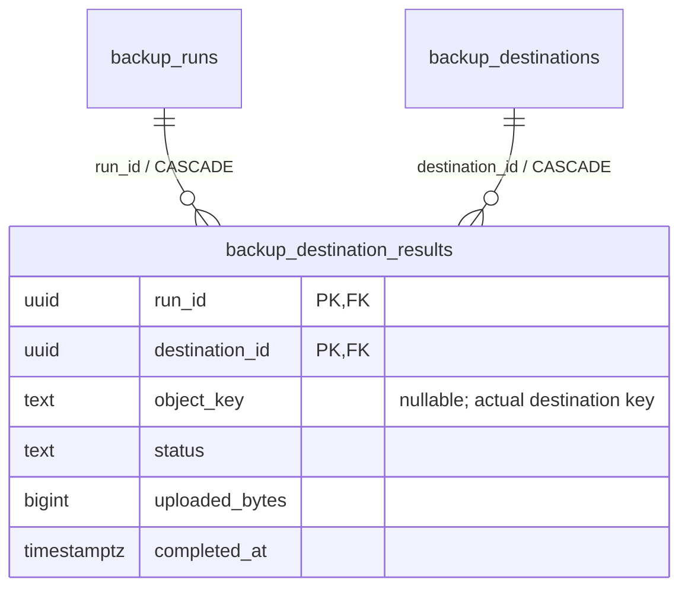

# 6. Data Model (ERD)

Focused ERD of the core tables. Only the most relevant columns are shown;
auxiliary tables (migrations log, rate-limit buckets, token blacklist,
per-feature settings) are omitted for readability. See
`backend/src/core/db/migrations/` for the full schema.

```mermaid
erDiagram
    users ||--o| user_settings : "has 1"
    users ||--o{ pages : "owns"
    users ||--o{ page_embeddings : "owns"
    users ||--o{ llm_conversations : "owns"
    users ||--o{ retrieval_benchmark_runs : "requests"
    users ||--o{ embedding_compare_judgements : "judges (#1260; SET NULL — the fixture outlives its author)"
    users ||--o{ notifications : "receives"
    users ||--o{ audit_log : "generates"
    users ||--o{ comments : "authors"
    users ||--o{ templates : "authors"
    users o|--o{ page_writer_runtimes : "fences; SET NULL"
    users o|--o{ page_runtime_admissions : "acts; SET NULL"
    users o|--o{ page_write_intents : "acts/settles; SET NULL"
    users o|--o{ page_baselines : "prepares/publishes; SET NULL"
    users o|--o{ page_baseline_history : "acts; SET NULL"
    users o|--o{ page_baseline_feature_state : "activates; SET NULL"
    users o|--o{ page_governance_policies : "updates; SET NULL"

    pages ||--o{ page_versions : "versioned as"
    pages ||--o{ page_embeddings : "chunked into"
    pages ||--o{ page_image_analyses : "#1615 (ADR-027, migration 115): one analysis row per referenced image; its text becomes derived page_embeddings rows (writer: #1616)"
    pages ||--o{ comments : "annotated by"
    pages ||--o{ page_relationships : "related via"
    pages ||--o{ local_attachments : "owns (standalone pages only)"
    pages ||--o{ spaces : "is custom home of (#352)"
    pages ||--o| page_collaborative_docs : "live CRDT state (#1411)"
    pages o|--o{ page_baselines : "live page locator; SET NULL"
    page_baselines o|--o{ pages : "active baseline; RESTRICT"
    pages o|--o{ page_baseline_history : "live page locator; SET NULL"
    page_writer_runtimes ||--o{ page_runtime_admissions : "owns; RESTRICT"
    page_writer_runtimes ||--o{ page_write_intents : "owns; RESTRICT"
    page_write_intents ||--o{ page_baselines : "preparation intent; RESTRICT"
    page_write_intents ||--o| page_relocation_preparations : "operation preparation; RESTRICT"
    pages ||--o{ page_relocation_preparations : "preserves source until settlement; RESTRICT"
    page_versions o|--o{ page_baselines : "snapshot locator; SET NULL"
    page_baselines ||--o{ page_baseline_history : "evidence; RESTRICT"

    roles ||--o{ group_memberships : "granted via"
    groups ||--o{ group_memberships : "has"
    users ||--o{ group_memberships : "member of"
    groups ||--o{ space_role_assignments : "assigned in (principal)"
    users ||--o{ space_role_assignments : "assigned in (principal)"
    roles ||--o{ space_role_assignments : "used in"

    users {
        uuid id PK
        text username UK
        text password_hash
        text role "admin | user"
        text email
        text display_name
        text auth_provider "local | oidc"
        text oidc_sub
        timestamptz deactivated_at "non-null => account disabled (#304)"
        uuid deactivated_by FK "admin who disabled (#304)"
        text deactivated_reason "free-form note (#304)"
        timestamptz last_login_at "last successful login (#307)"
        timestamptz created_at
    }

    user_settings {
        uuid user_id PK,FK
        text confluence_url
        bytea confluence_pat "AES-256-GCM"
        bool confluence_enabled "per-user Confluence integration toggle (#1623)"
        text[] selected_spaces
        text ollama_model
        text theme
        int sync_interval_min
        timestamptz confluence_pat_prompt_dismissed_at "PAT onboarding banner dismissed (#771)"
        bool inline_completion_enabled "personal ghost-text preference (#1417)"
        text inline_completion_delay "fast | balanced | deliberate | manual (#1417)"
        text inline_completion_mode "word | full (personal default)"
        bool inline_completion_code_only "suppress suggestions outside code blocks (#1417)"
        jsonb onboarding_state "checklist flags, merge-not-overwrite on write (#1402)"
        text notion_integration_token "AES-256-GCM Notion internal integration token (#1462)"
    }

    spaces {
        int id PK
        text space_key UK
        text space_name
        text source "confluence | local"
        timestamptz last_synced
        int custom_home_page_id FK
        int deletion_reconcile_cursor "last attempted pages.id; wraps across batches (#1439)"
    }

    pages {
        int id PK
        uuid user_id FK
        text confluence_id
        text space_key
        text title
        text body_storage "XHTML"
        text body_html
        text body_text
        int version
        text parent_id "source-aware parent key; deliberately no FK"
        text source "confluence | standalone"
        text notion_page_id "idempotency for one-shot Notion import (#1465); NULL unless imported. source stays standalone"
        text visibility "private | shared"
        uuid created_by_user_id FK
        bool embedding_dirty
        bool image_analysis_dirty "migration 116, #1616 (ADR-027 D4): re-enumerate this page's images; raised by every attachment and body writer"
        bigint image_analysis_revision "migration 116, #1616 (ADR-027 D6): bumped when the page's derived set changes; embedPage clears embedding_dirty only if unchanged"
        vector page_avg_embedding "materialized avg of chunk vectors, HNSW-indexed (#919)"
        timestamptz local_modified_at "non-null => local edit since last_synced (#305)"
        uuid local_modified_by FK "who last edited locally (#305)"
        text_array expected_image_files "cached asset filenames; NULL => recompute (#887)"
        text_array expected_drawio_files "cached draw.io filenames; NULL => recompute (#887)"
        timestamptz deleted_at
        bigint content_revision "migration 120; DEFAULT 0, monotonic protected payload revision"
        bigint lifecycle_revision "migration 120; DEFAULT 0, monotonic freeze/thaw revision"
        uuid baseline_id FK "active published baseline; nullable, ON DELETE RESTRICT"
        int frozen_version "nullable live projection"
        timestamptz frozen_at "nullable live projection"
        uuid frozen_by_user_id FK "nullable; ON DELETE SET NULL"
        text frozen_by_name "immutable display snapshot while frozen"
        text freeze_reason
        text freeze_provenance "manual_assertion | authenticated_approval"
        jsonb freeze_reported_signatories "caller assertions, not authenticated approvals"
        text freeze_reported_reference
    }

    page_collaborative_docs {
        int page_id PK,FK "ON DELETE CASCADE"
        bytea doc_state "Y.encodeStateAsUpdate persist form"
        bytea state_vector "nullable until first persist"
        int version "persistence generation NOT pages.version"
        timestamptz created_at
        timestamptz updated_at
    }

    page_versions {
        uuid id PK
        int page_id FK "universal FK since migration 030"
        int version_number
        text title
        text body_html
        text body_text
        timestamptz synced_at
        timestamptz edited_at "nullable; real Confluence edit time (migration 077)"
        text author "nullable; Confluence author display name (migration 077)"
        text message "nullable; Confluence version comment (migration 077)"
    }

    page_writer_runtimes {
        text runtime_id PK "one backend process epoch"
        jsonb deployment_identity "immutable host/pid/start identity"
        timestamptz started_at "DEFAULT NOW"
        timestamptz quiesced_at
        uuid quiescence_ack
        timestamptz fenced_at
        uuid fenced_by FK "users; ON DELETE SET NULL"
        text fence_reason
        jsonb fence_proof "closed server-verified proof kinds"
    }

    page_runtime_admissions {
        uuid id PK "DEFAULT gen_random_uuid"
        text runtime_id FK "page_writer_runtimes; ON DELETE RESTRICT"
        int page_id "deliberately no FK; durable identity after deletion"
        uuid actor_id FK "users; ON DELETE SET NULL"
        bigint lifecycle_revision "admission fence"
        timestamptz admitted_at "DEFAULT NOW"
        timestamptz released_at
        text release_kind "clean_disconnect | runtime_fenced"
    }

    page_write_intents {
        uuid id PK "DEFAULT gen_random_uuid"
        text runtime_id FK "page_writer_runtimes; ON DELETE RESTRICT"
        text kind "closed effect/recovery policy"
        uuid actor_id FK "users; ON DELETE SET NULL"
        int_array page_ids "sorted protected targets; no page FK"
        jsonb revisions "content + lifecycle revision per page"
        int_array deleted_page_ids "durable deletion tombstones"
        text recovery_mode "local_verified | remote_conditional | remote_terminal_only"
        jsonb effect "bounded, no secrets/full request content"
        text status "pending | completed | cancelled | reconciled_*"
        timestamptz effect_started_at
        timestamptz effect_finished_at
        timestamptz remote_effect_started_at "first mutating remote phase"
        timestamptz remote_effects_completed_at "all remote phases succeeded"
        jsonb remote_terminal_result "bounded server-owned terminal identity"
        boolean cache_invalidation_pending "retry until pages/search eviction succeeds"
        jsonb recovery_history "bounded transfer/repair record"
        timestamptz recovery_started_at "claimed before any verifier callback"
        timestamptz settled_at
        uuid settled_by FK "users; ON DELETE SET NULL"
        text settlement_reason
        jsonb settlement_proof
    }

    page_cache_invalidation_queue {
        int page_id PK "coalesced delivery identity; deliberately no FK"
        timestamptz queued_at "DEFAULT NOW; ordered delivery index"
    }

    page_relocation_preparations {
        uuid intent_id PK,FK "page_write_intents; ON DELETE RESTRICT"
        int page_id FK "pages; ON DELETE RESTRICT"
        text direction "to_confluence | to_local"
        uuid actor_id "original identity; not a live authority grant"
        text target_space_key
        text target_visibility
        text original_source
        text original_confluence_id
        text original_space_key
        text original_title
        text original_body_html
        text original_body_storage
        text original_body_text
        int original_version
        text original_visibility
        uuid original_created_by_user_id
        boolean original_inherit_perms
        timestamptz original_local_modified_at
        uuid original_local_modified_by
        boolean original_embedding_dirty
        boolean original_image_analysis_dirty
        text original_embedding_status
        timestamptz original_embedded_at
        text original_key
        int_array child_ids
        jsonb access_control_entries
        jsonb attachments
        text expected_remote_title_sha256
        text expected_remote_body_storage_sha256
        text parent_confluence_id
        text created_confluence_id "acknowledged before further provider work"
        jsonb created_page_receipt "nullable; bounded exact returned page identity"
        jsonb attachment_receipts "ordered acknowledged receipts; bounded by admitted inventory"
        timestamptz created_at "DEFAULT NOW"
    }

    page_baseline_feature_state {
        boolean singleton PK
        boolean creation_enabled "DEFAULT FALSE"
        timestamptz activated_at
        uuid activated_by_user_id FK "users; ON DELETE SET NULL"
        text activated_by_name "actor display snapshot"
        timestamptz updated_at "DEFAULT NOW"
    }

    page_baseline_capacity {
        boolean singleton PK
        bigint reserved_bytes "DEFAULT 0; retained rows until guarded cleanup"
        timestamptz updated_at "DEFAULT NOW"
    }

    page_baselines {
        uuid id PK "stable preparation/publication identity"
        int page_id FK "nullable live locator; pages ON DELETE SET NULL"
        int original_page_id "immutable; deliberately no FK"
        jsonb page_identity "source-aware offline identity"
        int version "ordinary page version"
        bigint content_revision "captured protected payload revision"
        bigint lifecycle_revision "captured pre-freeze lifecycle"
        int manifest_version "DEFAULT 1; constrained to 1"
        text manifest_digest "SHA-256 lowercase hex"
        jsonb manifest "canonical fixed array"
        bytea manifest_bytes "exact canonical framed bytes"
        text title "authored snapshot"
        text body_html "authored snapshot"
        text body_storage "authored snapshot"
        text body_text "authored snapshot"
        text_array labels "authored snapshot"
        jsonb parent_identity "source-aware, nullable"
        jsonb icon "raw-field tuple, nullable"
        jsonb attachments "retained inventory; DEFAULT []"
        bigint total_bytes
        bigint reserved_bytes
        text status "preparing | prepared | published | abandoned"
        uuid prepared_by_user_id FK "users; ON DELETE SET NULL"
        text prepared_by_name "immutable display snapshot"
        uuid preparation_intent_id FK "page_write_intents; ON DELETE RESTRICT"
        timestamptz prepared_at "DEFAULT NOW"
        uuid published_by_user_id FK "users; ON DELETE SET NULL"
        text published_by_name "immutable display snapshot"
        timestamptz published_at
        text provenance "manual_assertion | authenticated_approval"
        text freeze_reason
        jsonb reported_signatories "DEFAULT []; caller assertions"
        text reported_reference
        uuid version_snapshot_id FK "page_versions; ON DELETE SET NULL"
        timestamptz abandoned_at
    }

    page_baseline_history {
        uuid id PK "DEFAULT gen_random_uuid"
        int page_id FK "nullable live locator; pages ON DELETE SET NULL"
        int original_page_id "immutable; deliberately no FK"
        uuid baseline_id FK "page_baselines; ON DELETE RESTRICT"
        text action "freeze | thaw"
        int version "baseline version; mandatory for both actions"
        text manifest_digest "mandatory for both actions"
        bigint content_revision
        bigint lifecycle_revision "unique with original_page_id"
        text reason
        uuid actor_user_id FK "users; ON DELETE SET NULL"
        text actor_display_name "immutable snapshot"
        text provenance "manual_assertion | authenticated_approval"
        jsonb reported_signatories "DEFAULT []"
        text reported_reference
        timestamptz created_at "DEFAULT NOW"
    }

    page_governance_policies {
        text space_key PK
        boolean governance_enabled "DEFAULT FALSE"
        bigint policy_revision "DEFAULT 1"
        uuid updated_by_user_id FK "users; ON DELETE SET NULL"
        text updated_by_name "actor display snapshot"
        timestamptz updated_at "DEFAULT NOW"
    }

    page_lifecycle_outbox {
        uuid id PK "DEFAULT gen_random_uuid"
        int page_id "deliberately no FK; event survives page deletion"
        bigint lifecycle_revision "unique with page_id"
        jsonb event "typed page_lifecycle payload"
        int attempt_count "DEFAULT 0"
        timestamptz next_attempt_at "DEFAULT NOW"
        text last_error
        timestamptz delivered_at
        timestamptz claimed_at
        timestamptz created_at "DEFAULT NOW"
    }

    page_embeddings {
        bigint id PK
        uuid user_id FK
        int page_id FK
        int chunk_index
        text chunk_text
        vector embedding "vector(n) or halfvec(n) — n is the resolved model's width"
        jsonb metadata "page_title, section_title, space_key, confluence_id; derived rows add source = image_analysis + attachment provenance (#1616, ADR-027 D9)"
        tsvector chunk_tsv "migration 116, #1616 (ADR-027 D10): per-chunk lexical document in the configured FTS language, trigger-maintained, GIN-indexed"
    }


    page_image_analyses {
        bigint id PK "#1615 (ADR-027 D4, migration 115) — the derived-analysis store; rows are written by the #1616 worker"
        int page_id FK "ON DELETE CASCADE"
        text source "confluence | local — which attachment store the key resolves in"
        text attachment_key "URL-decoded filename inside that store"
        text content_hash "sha256 of the analyzed bytes; the reference revision (ADR-027 D6)"
        text format "sniffed: png | jpeg | webp | gif"
        text status "pending | analyzed | failed | failed_terminal | skipped"
        text skip_reason "missing | unsupported | oversized | too_large | external | capped"
        uuid provider_id FK "the RETAINED identity (ADR-027 D5/D7) with model and base_url, stamped per attempt; the worker refuses to call when the live assignment resolves elsewhere"
        text identity_hash "sha256 over the three identity fields; valid only while it equals the retained identity"
        int prompt_version "code constant at the attempt; valid only while it equals IMAGE_ANALYSIS_PROMPT_VERSION"
        int schema_version "code constant at the attempt; valid only while it equals IMAGE_ANALYSIS_SCHEMA_VERSION"
        jsonb payload "ImageAnalysisPayloadV1, validated at write time against the bounds of the ceiling then in force (never re-validated on read); kept across a sweep re-pend, NULLed on new bytes"
        int analysis_version "+1 per successful payload write"
        int attempts "failures since the last reset: success, Retry failed, new bytes, the sweep returning a failed/terminal row whose identity or versions changed, or the sweep re-opening a truncated row under a raised ceiling; deterministic classes go terminal at 5"
        timestamptz next_attempt_at "due time while failed (backoff, or NOW() on Retry failed / sweep return); NULL otherwise, by CHECK"
        text error "failure class + the number it needs read back (rejected:413, unavailable:404, truncated:8192 = the overrun ceiling; unavailable:bytes = the file was there but unreadable); admin-only"
    }

    page_relationships {
        bigint id PK
        int page_id_1 FK
        int page_id_2 FK
        text relationship_type "embedding_similarity | label_overlap | explicit_link | parent_child"
        double score
    }

    deterministic_relationship_dirty {
        int page_id PK "no FK; deleted identities survive; 0 means upgrade backfill"
        bigint revision "deterministic_relationship_revision sequence"
        boolean full_rebuild "identity changes can affect unrelated pairs"
    }

    llm_conversations {
        uuid id PK
        uuid user_id FK
        int page_ref FK "ON DELETE SET NULL — page a dock conversation started from (#1361)"
        text model
        text title
        text title_source "question | generated | user (#1361)"
        jsonb messages "[{role, content, refused?, sources?}]"
        timestamptz created_at
        timestamptz updated_at
    }

    retrieval_benchmark_runs {
        uuid id PK
        uuid requested_by FK
        text status "queued | running | completed | failed"
        jsonb config "query source and limits; kind=shadow-compare marks a #1260 comparison run"
        int progress_done
        int progress_total
        jsonb result "compact ids, titles and timings"
        text error
        timestamptz created_at
        timestamptz started_at
        timestamptz completed_at
    }

    embedding_compare_judgements {
        uuid id PK
        text query_hash "sha256 of LOWER(TRIM(query)) — respellings converge"
        text query_text
        text live_provider_id "by VALUE, no FK — must outlive the provider row"
        text live_model
        text candidate_provider_id
        text candidate_model
        text judged_side "live | candidate | neither | both"
        int_array live_page_ids "what was on screen when judged"
        int_array candidate_page_ids
        uuid judged_by FK "SET NULL — part of the unique key since 109 (#1527)"
        timestamptz created_at "the judged-at stamp; bumped on every re-judge"
    }

    comments {
        bigint id PK
        int page_id FK
        uuid user_id FK
        bigint parent_id FK
        text body
        bool is_resolved
        uuid resolved_by FK
        text anchor_type "selection | block"
        jsonb anchor_data
    }

    notifications {
        bigint id PK
        uuid user_id FK
        text type
        text title
        text body
        uuid source_user_id FK
        int source_page_id FK
        bool is_read
    }

    templates {
        bigint id PK
        text title
        text description
        text category
        jsonb body_json
        text body_html
        uuid created_by FK
        bool is_global
        text space_key
    }

    audit_log {
        uuid id PK
        uuid user_id FK
        text action
        text resource_type
        text resource_id
        jsonb metadata
        text ip_address
        timestamptz created_at
    }

    admin_settings {
        text setting_key PK "includes backup_s3_*, schedule, retention, last-run keys"
        text setting_value "S3 credentials are AES-256-GCM ciphertext"
        timestamptz updated_at
    }

    backup_runs {
        uuid id PK
        timestamptz created_at
        timestamptz finished_at
        text destination "download | s3"
        text status "running | success | failed"
        bigint bytes
        text object_key
        text error
        text triggered_by "nullable user id text; null for schedule"
        text job_id "nullable BullMQ job id"
    }

    roles {
        bigint id PK
        text name
        jsonb permissions
        text description
    }

    groups {
        bigint id PK
        text name
    }

    group_memberships {
        uuid user_id FK
        bigint group_id FK
        bigint role_id FK
    }

    space_role_assignments {
        bigint id PK
        text space_key
        bigint role_id FK
        text principal_type "user | group"
        text principal_id
    }

    local_attachments {
        bigint id PK
        int page_id FK
        text filename
        text content_type
        bigint size_bytes
        text sha256
        uuid created_by FK
        timestamptz created_at
        timestamptz updated_at
    }

    llm_providers ||--o{ llm_usecase_assignments : "referenced by"
    llm_providers {
        uuid id PK
        text name
        text base_url
        bytea api_key "AES-256-GCM"
        text auth_type "bearer | none"
        bool verify_ssl
        text default_model
        bool is_default
        timestamptz created_at
        timestamptz updated_at
    }

    llm_usecase_assignments {
        text usecase PK "chat|summary|quality|auto_tag|embedding|rerank|inline_completion|image_analysis (image_analysis since migration 115, #1615, ADR-027 D3 — non-inheriting, probe-gated before write; image_embedding DROPPED from the CHECK by migration 118, #1618 stage 2)"
        uuid provider_id FK
        text model "nullable; null = inherit provider default"
        timestamptz updated_at
    }

    llm_providers ||--o{ llm_model_capabilities : "probed for (CASCADE)"
    llm_model_capabilities {
        uuid provider_id PK,FK "ON DELETE CASCADE (#1154)"
        text model PK
        bool vision "NULL = probed, undetermined"
        timestamptz probed_at
        text probe_error "nullable"
    }

    users ||--o{ llm_audit_log : "may originate"
    llm_audit_log {
        bigint id PK
        uuid user_id FK "nullable; SET NULL on user delete"
        text action "chat|ask|improve|generate|summarize|embed|quality|tag|diagram"
        text model "snapshot at call time"
        text provider "snapshot — survives provider delete"
        int input_tokens "default 0"
        int output_tokens "default 0"
        int duration_ms "default 0"
        text status "success|error; default success"
        text error_message "nullable; populated on failures"
        text prompt_hash "SHA-256 hex; plaintext NEVER stored by CE writer"
        bool prompt_injection_detected "Compendiq/compendiq-ee#115 P0f; default FALSE"
        bool sanitized "Compendiq/compendiq-ee#115 P0f; default FALSE"
        timestamptz created_at
    }
```

**Immutable baseline foundation (migrations 120–121, #275).** Migration 120 is
additive: existing and new `pages` rows receive `content_revision = 0` and
`lifecycle_revision = 0`; the backfill deliberately invents no historical
freeze, approval or ledger entry. Migration 121 installs the protected-write
trigger after adding `baseline_id`, leaving legacy writers usable between the
separately committed migrations. That trigger rejects protected
title/body/storage/text/label/hierarchy/identity/icon/draft/deletion changes
while `baseline_id` is set and advances `content_revision` exactly once for an
editable protected update. Attachment-only writers explicitly touch the
revision under the same lifecycle lock. `lifecycle_revision` advances on
freeze/thaw; both revisions are non-negative `BIGINT`s and cross the API as
decimal strings.

`page_writer_runtimes` is one durable row per process epoch.
`page_runtime_admissions` retains writable-room tokens until clean disconnect
or proven runtime fencing. `page_write_intents` retains the exact target set,
content/lifecycle revisions, dispatch/finish markers, deletion tombstones and
settlement proof. Its `page_ids`/`deleted_page_ids` arrays intentionally have
no page FK: a local delete can commit before the intent settles, and a missing
row is accepted only when its ID appears in that intent's immutable tombstones.
Only `pending` intents block writes/freeze; uncertain outcomes remain pending
without TTL expiry. Runtime/admission/intent ownership uses `ON DELETE
RESTRICT`; nullable human actor/settler/fencer references use `ON DELETE SET
NULL`.
Recovery transfers `runtime_id` and stamps `recovery_started_at` before invoking
the verifier, not only before a local repair. That marker disqualifies no-start
fencing/cancellation even if the original effect never began; phase timestamps
and bounded recovery history remain intact across ownership changes.
Each recovery mutation also holds a current active system administrator row
on its transaction client; this does not substitute for original-writer access.
Quiescence records its authorized request before closing the local gate and
rechecks the administrator before persisting an acknowledgment.

The page-table publication trigger writes one
`page_cache_invalidation_queue` row per affected page in the same transaction.
It covers inserts, deletes, content/lifecycle revisions, visibility, ownership
and permission inheritance; unrelated telemetry updates do not enqueue work.
Its primary key coalesces repeated writes, its delivery index orders pending
work, and the deliberate absence of a page FK preserves hard-delete delivery.
The conflict arm updates the existing tuple without changing `queued_at`, holding
its lock through the new writer's commit. A conflict no-op that takes no tuple
lock would let delivery delete the old entry before the new change becomes visible.
Intent-owned publication also retains its terminal-only partial queue index.
Delivery clears either queue only after real cache invalidation succeeds.

`page_relocation_preparations` holds exact operation-owned rollback/publication
state outside the generic intent's 32 KiB metadata ceiling. Its source-page FK
prevents deletion while preparation remains necessary. Settlement removes it
in the transaction that settles the intent; failed recovery preserves it.
Its insertion is itself a gated local effect, so a crash on either side of
that commit cannot disguise a retained preparation as an unstarted intent.
The create identity is recorded before readback or uploads, and every successful
upload appends its own bounded receipt before the next provider call. Receipt
capacity scales with the admitted inventory; the generic terminal result holds
only its count and canonical ordered SHA-256, never a second full receipt array.

Migration 121 seeds exactly one feature-state row with
`creation_enabled = false` and one zeroed capacity row. Enabling creation is
separately gated by a registered deployment-readiness provider; the #275
foundation intentionally has none, so its blocker is
`protected_writer_enforcement_not_registered` until #276 supplies complete
writer readiness. This schema does not claim #276's remaining sync,
collaboration and cascade enforcement, #278's proposal/signature/archive
tables, or #277's UI.

A preview owns one stable `page_baselines.id`. The partial unique index on
`(original_page_id, prepared_by_user_id, content_revision,
lifecycle_revision)` for `preparing`/`prepared` rows makes concurrent or
retried previews reuse that preparation rather than reserve another copy.
Publishing one preview atomically abandons the page's other prepared previews.
Maintenance removes only these unpublished copies and releases their reservations;
published evidence is never a capacity-cleanup candidate.
Manifest v1 persists both its fixed JSON array and the exact UTF-8 bytes hashed
into `manifest_digest`; authored title/HTML/storage/text, sorted labels,
source-aware page/parent identity, raw icon tuple and complete attachment
inventory are independent of the mutable page. The inventory records
`local`/`confluence`/`icon` store identity, owner key, filename, byte count,
media type and SHA-256. `page_baseline_capacity.reserved_bytes` covers every
published, preparing, prepared or not-yet-cleaned abandoned row and is
serialized by its singleton row.

Retained media is stored outside live attachment keyspaces at
`ATTACHMENTS_DIR/page-baselines/<baseline UUID>/<attempt UUID>/`. The namespace
is reserved from the orphan sweep and hard-delete cleanup, and every path
segment is validated. Defaults are 512 attachments and 1 GiB per preparation,
50 GiB total retained bytes, and a 64 MiB free-space reserve. Preparation
capacity is committed with its `baseline.prepare` intent before streamed
copy/hash/fsync verification. Published evidence is never evicted or garbage
collected. Cleanup can delete only a committed `abandoned` preparation after
proving it was never published/referenced and its intent is terminal or safely
transferred; capacity is released only after byte removal succeeds.

The baseline row permits only `preparing → prepared|abandoned` and `prepared →
published|abandoned`, with immutable preparation fields. Its trigger otherwise
allows only FK-driven nulling of `page_id`, actor IDs and
`version_snapshot_id`; published content/evidence cannot be updated or deleted.
The live page points to the active baseline with `ON DELETE RESTRICT`.
`version_snapshot_id` is only a locator: publication inserts
`page_versions` with `ON CONFLICT DO NOTHING`, then links it only if the
existing same-version title/body are byte-equivalent. It never overwrites an
older snapshot, and the baseline remains authoritative when no link can be
made.

`page_baseline_history` is append-only except for FK-driven nulling of its live
page/actor pointers. Every freeze **and** thaw row retains the mandatory
baseline UUID, ordinary version, manifest digest, content/lifecycle revisions,
reason, provenance, original page ID and actor display snapshot. Consequently
page/user deletion removes neither the ledger nor its attribution snapshot;
the old page URL no longer authorizes it, while system-admin evidence/history
reads remain available by baseline identity. The unique
`(original_page_id, lifecycle_revision)` key prevents duplicate transitions.

Freeze/thaw also inserts one `page_lifecycle_outbox` row in the same
transaction, unique by `(page_id,lifecycle_revision)`. Outbox rows deliberately
have no page FK, survive deletion, and carry only the typed lifecycle event.
Delivery is at least once after commit with claim recovery/backoff; cache,
Redis event and optional EE webhook failure updates retry state instead of
rolling back or misreporting the committed transition. Enqueue is deduplicated,
but a retry may repeat or reorder delivery, so consumers compare the monotonic
lifecycle revision and ignore stale/already-observed events.

`page_governance_policies` is the durable CE fail-closed marker. An enabled
space cannot manually publish even when the enterprise plugin/license is
absent; the optional core hook must revalidate and finalize on the locked CE
transaction. Migration 121 provides the marker and extension point only.
Proposal requirements, votes, signatures and archive protection belong to
#278 and are not represented as delivered CE tables here. Operations and
rollout are documented in
[`immutable-page-baselines.md`](../runbooks/immutable-page-baselines.md).

**Deterministic relationship freshness (#1314, migration 111).** The
`pages_deterministic_relationship_dirty` trigger records committed content,
label, hierarchy and identity changes in `deterministic_relationship_dirty`.
There is deliberately no page FK: deletion must invalidate old references.
An upgrade inserts the full-rebuild sentinel. Authorized Connections and
focused-graph reads settle pending work through the same deterministic
materializer used by embedding recomputation; clean reads only check for
pending work. No embedding provider is needed. The transaction advisory lock
`RELATIONSHIP_ADVISORY_LOCK_ID` serializes materializers, and revision-matched
deletion preserves mutations committed during a rebuild. Failed production
rolls back both evidence and queue consumption. Semantic evidence is preserved.
`relationship_parent_key` follows the source-sensitive hierarchy key;
`relationship_parent_id` resolves exactly one live parent, never an ambiguous
cross-namespace match. Its live-page expression index supports that lookup.

Backup configuration is stored as rows in `admin_settings`, not as a separate
wide table. Migration 107 seeds `backup_s3_enabled`, `backup_s3_endpoint`,
`backup_s3_bucket`, `backup_s3_region`, `backup_s3_access_key`,
`backup_s3_secret_key`, `backup_s3_prefix`, `backup_s3_force_path_style`,
`backup_schedule_enabled`, `backup_interval_hours`,
`backup_retention_count`, and `backup_retention_days`;
`backup_last_run_at` is written after a successful S3 run. Access and secret
keys are encrypted before persistence. Updates write every provided backup
key through one PostgreSQL transaction, so a partial configuration cannot
commit.

`backup_runs` is written by scheduled and manually triggered S3 jobs and
drives the admin history/status view. Its destination constraint also admits
`download`, while current ticket-download outcomes are recorded in
`audit_log`. The row stores lifecycle status, byte count, S3 object key, error,
trigger attribution, and the exact BullMQ `job_id` used to correlate a queued
request with its history row. Migration 108 adds the nullable `job_id` column
and a partial lookup index; null remains valid for pre-migration history and
legacy scheduled runs. `triggered_by` is deliberately nullable text rather than
a user foreign key so scheduled runs and historical actor identifiers remain
representable. Because an in-flight S3 archive necessarily snapshots
its own row as `running`, offline restore reconciles every restored `running`
row to `failed` with a finish time and the error `Backup interrupted by restore`
after migrations and before reporting restore success.

Enterprise migration 900 adds `backup_destinations` and
`backup_destination_results`. The primary is a runtime mirror of the CE S3
settings with a unique partial `is_primary` index; additional destinations
store encrypted credentials. Migration 902 adds the nullable per-result
`object_key`, the exact key under that destination's prefix. Historical keys
stay null because a current prefix cannot reconstruct what was used earlier.
The service serializes creation to admit at most two secondaries, and refuses
over-limit legacy configurations before starting uploads.


```mermaid
erDiagram
    backup_runs ||--o{ backup_destination_results : "run_id / CASCADE"
    backup_destinations ||--o{ backup_destination_results : "destination_id / CASCADE"
    backup_destination_results {
        uuid run_id PK,FK
        uuid destination_id PK,FK
        text object_key "nullable; actual destination key"
        text status
        bigint uploaded_bytes
        timestamptz completed_at
    }
```

Enterprise migration 901 stores DR evidence in `backup_dr_verifications`.
Its nullable text `run_id` and `destination_id` are provenance, not foreign
keys. `rpo_seconds` is age from the authenticated manifest; `duration_ms` is
elapsed verification time. Unknown measurements remain null and report as
empty cells, never as retention counts/days or fabricated zeroes.

`llm_conversations` carries `llm_conversations_user_updated_idx (user_id,
updated_at DESC, id DESC)` for the keyset-paged list (migration 094).

`inline_completion` is one of three non-inheriting use cases, alongside
`rerank` and `image_analysis`. Its seeded assignment has null provider/model,
which means the feature is disabled until an administrator explicitly assigns
both a usable provider and model. The personal `user_settings` fields only
control when an already-assigned feature may run; they cannot select or
override a provider.

Inline-completion prompts and completions are intentionally absent from
`llm_audit_log`. Aggregate Redis telemetry keeps fixed request/token fields,
with no user, page, prefix, suffix or completion in its keys or values.
The inference audit hook additionally records user-attributed token counts for
EE quota accounting, never inline plaintext even when full-text auditing is on.

EE model registry migration 906 adds immutable `generation` and
`storage_location` to `enterprise_model_assets`, plus owner-scoped
`enterprise_model_uploads` for staged manifests. Publication changes the
registry pointer only after the entire generation is staged. Historical rows
have unknown storage identity and require re-import rather than reconstruction
from current settings. Migration 905's nullable audit artifact fields preserve
supplied observations; the report compares them with the current registry.
The asset ID is a logical reference, not a foreign key or execution attestation.

**`chunk_text` is what gets embedded, verbatim (#1108).** Prefixing the page
title and section into the embedded text was tried, measured, and **not
shipped** — but read what the measurement does and does not say before
re-proposing it.

What it says: on #1102's 262-page corpus and 144-query fixture, the prefix
produced **no credible benefit**. Recall@5 moved 5 wins / 3 losses on
Qwen3-Embedding-4B — McNemar exact p = 0.73, i.e. noise — and was flat on
`bge-m3`.

What it does **not** say: that the prefix is harmful. Recall@1 fell by exactly
four queries on each model (86→82 and 101→97). Four is below what any paired
test can call: `mcnemarExactTwoSided(0, 4)` is 0.125, and `metrics.ts` says so
by name. MRR moved with those same four queries, and `pairedSignificance`
returns no verdict for a graded score at all. So the honest conclusion is
"unproven, and not worth the cost", not "it hurts".

Three caveats mattered more than the numbers **at the time of that
measurement** (pre-#1265, when the chunker was dead code):

1. **The section half never fired.** `section_title === page_title` for all 488
   chunks, because `htmlToText` stripped the `#` markers before `chunkText`'s
   heading regex saw them — so what was measured was a bare page title, not
   `"{title} — {section}"`.
2. **The prefix was ~0.6% of the embedded text**, not the ~1.6% the configured
   chunk size implies, because most chunks reached `CHUNK_HARD_LIMIT` (6000)
   rather than the 1500-char target — same root cause.
3. **The corpus is OSS markdown documentation**, whose pages usually open with
   their own title. Real Confluence pages need not, which is exactly the case
   the prefix was meant to serve.

**The "re-measure after the chunker actually splits" trigger has fired:**
#1265 (PR #1266) made the structure-aware chunker live — the embedding input
is Markdown from `htmlToEmbeddingText(body_html)`, sections split at real
headings, `section_title` carries real (flattened) heading prose, and the
chunking change alone measured Recall@1 0.3889 → 0.5069 / MRR 0.5830 → 0.6501
on the #1102 fixture. The title-prefix question specifically (this section's
subject) remains open and re-measurable with real sections now; reproduce
with `backend/scripts/compare-embedding-variants.mts`. Note its Qwen arms now
build the query preamble from `query-instruction.ts`'s exported `RETRIEVAL_TASK`
rather than from a hardcoded copy of Qwen's stock web-search task, so a re-run
measures the prefix that ships and its absolute numbers may shift a little
against the ones recorded above. `query-instruction.test.ts` holds that by
pinning the call to two arguments — the task is reachable only through the
default parameter, so it cannot be overridden back to the stock wording while
the harness still calls the shipping formatter.

The invariant that work exposed is kept regardless: **every document-side embed
must send the model byte-identical text** — the live embed in `embedPage`, its
shadow dual-write, and #1116's backfill. A divergence changes the embedded text
and the model in the same swap, with identical dimensions and row counts to
show for it; `shadow-migration-service.integration.test.ts` pins the paths
together, which matters most for #1114's query-side prefix.

## Notable conventions

- **User ownership is pervasive.** Almost every table carries `user_id`
  (UUID, FK → `users.id`) — Compendiq is multi-tenant at the user level.
- **`retrieval_benchmark_runs` is shared by two run kinds (#1260), and ONE
  module owns its lifecycle.** The production benchmark writes its config
  as-is; the shadow comparison marks its rows `config.kind = 'shadow-compare'`.
  Insert, claim, progress + heartbeat, complete, fail, the stale sweep and the
  fetch all live in `domains/llm/eval/benchmark-run-lifecycle.ts`, and the
  fetch takes the expected `kind` as a REQUIRED argument — each surface answers
  null for the other's rows, in both directions. That symmetry is not
  decoration: a compare report has no `baseline`, so serving one through the
  benchmark GET throws in `BenchmarkSummary` and blanks the Retrieval panel,
  and it carries sampled production query text. The stale sweep is likewise
  kind-aware, because failing a comparison with "start a new benchmark" names
  a run its admin never started. A compare run is additionally scoped to
  `requested_by` on read: its report carries page titles retrieved under that
  admin's own ACL (`visiblePagesPredicate` admits their private standalone
  pages). The 091 one-active partial unique index is deliberately NOT scoped
  by kind: both runs spend the shared LLM queue, so one at a time is the
  point, and the 092 heartbeat recovery covers both.
- **`embedding_compare_judgements` is the accumulating fixture (#1260 Mode
  2).** One row per (normalised query hash, live PAIR, candidate PAIR, JUDGE)
  — provider id AND model on each side, because the same model name behind a
  different provider is a different index whose page-id arrays must not be
  pooled into the earlier migration's verdict, and because re-hosting one
  model would otherwise collapse both sides onto one row. Both are recorded by
  VALUE, with no FK to `llm_providers` and no FK to the run: a judgement must
  survive the run, the migration and the provider row that produced it, which
  is what makes the second evaluation of the same pair cheaper than the first.
  One admin re-judging their own query replaces their row (upsert on the unique
  key); the page-id arrays record what was on screen when the human judged and
  are deliberately not FK-checked against `pages`.
  **`judged_by` joined the unique key in migration 109 (#1527), and the
  one-trial-per-query invariant moved to the READ path.** Before 109 the key
  had no admin dimension, so the last judge of a query physically OVERWROTE the
  earlier judge's `live_page_ids` / `candidate_page_ids` / `judged_by` —
  irrecoverably, because those arrays come from `vectorSearch(adminUserId, …)`
  filtered through `visiblePagesPredicate`, i.e. they are that admin's view and
  nobody else's. Now every judge's row persists. The reason the key had no
  judge in the first place still holds — one query is one trial and McNemar
  counts trials, so reading two rows for one query would inflate both N and the
  significance drawn from it — so `judgementsForReport` collapses the read to
  `DISTINCT ON (query_hash) … ORDER BY query_hash, created_at DESC, id DESC`:
  exactly one row per query, the most recently judged one, taken WHOLE.
  `created_at` is the judged-at stamp (the upsert bumps it to `NOW()` on every
  re-judge; there is no `judged_at` column) and `id DESC` totals the order when
  two judgements share a microsecond. So the verdict reports ONE named judge's
  visibility scope per trial rather than a per-column blend of two admins'
  arrays, N stays the count of DISTINCT judged queries, and every other judge's
  row is retained on disk for audit and simply not read. The index is
  deliberately DEFAULT (NULLS DISTINCT), never `UNIQUE NULLS NOT DISTINCT`:
  `judged_by` is `ON DELETE SET NULL`, so under NULLS NOT DISTINCT deleting the
  second of two admins who judged one query would collide the SET NULL with the
  first orphan's key and make the admin undeletable. A cross-judge aggregation
  rule (majority? weighted?) remains a different feature; "newest wins" is the
  rule this schema implements.
- **pgvector — the column type is dimension-driven, not one model's shape.**
  `page_embeddings.embedding` always carries a *declared* width — 006 shipped
  `vector(768)`, 048 re-typed it to `vector(1024)` — but the schema does not
  *fix* one: that declaration is where the migrations leave a fresh install, and
  a model swap re-types the column. The embedding
  pair is resolved from `llm_usecase_assignments` (the `embedding` use case,
  ADR-021) and the width is **probed from the model**, not typed by an
  operator: the shadow migration embeds the literal text `probe` and takes
  `vectors[0].length`. That number is stored in
  `admin_settings.embedding_dimensions` and picks the column type and index
  path via `columnTypeFor`, rewritten by `enqueueReembedAll({ newDimensions })`
  (destructive) or by #1116's shadow swap (non-destructive):

  | Dimensions  | Column type   | Index                                           |
  |-------------|---------------|-------------------------------------------------|
  | `n ≤ 2000`  | `vector(n)`   | HNSW `vector_cosine_ops` (default tier)         |
  | `2001–4000` | `halfvec(n)`  | HNSW `halfvec_cosine_ops` (float16, ~50% size)  |
  | `n > 4000`  | `vector(n)`   | no index (sequential scan; warning logged)      |

  Both indexed tiers build with `m = 16`, `ef_construction = 200` for cosine
  similarity; only the opclass changes.

  pgvector 0.8 caps HNSW at 2000 dims for `vector` and 4000 dims for `halfvec`;
  larger models (e.g. `qwen3-embedding:8b` at 4096) fall to the seq-scan tier.
  Query-time `ef_search` is set per request, floored at
  `admin_settings.rag_ef_search` (#1285 — default 100, edited in
  Settings → AI Models → Retrieval; the `RAG_EF_SEARCH` environment variable it
  replaced is a deprecated bootstrap fallback). Source of truth:
  `backend/src/domains/llm/services/embedding-service.ts` (`enqueueReembedAll`).

  **Which model, in practice.** `bge-m3` at 1024 (`vector(1024)` + HNSW) is the
  **bootstrap shape**, and only the *width* half of it is shipped by the code:
  migration 048 types the column `vector(1024)` and writes
  `admin_settings.embedding_dimensions = '1024'`, with the deprecated
  `EMBEDDING_DIMENSIONS` env read only if that row goes missing. The *model* half
  is not — `EMBEDDING_MODEL` has had no effect since migration 054 (it is logged
  as deprecated and never read), nothing seeds a `bge-m3` assignment on a fresh
  install, and `resolveUsecase('embedding')` therefore falls through to the
  default provider's `default_model` until an admin assigns the use case in
  Settings → AI Models. `bge-m3` is the model `.env.example` tells an operator
  to pull, matching the width the schema ships.
  **Qwen3-Embedding-4B at 2560 native is the measured recommendation**
  for production (#1114): that lands on the `halfvec(2560)` +
  `halfvec_cosine_ops` tier — at that width fp16 is not a fallback but the only
  indexed representation pgvector offers, and it was measured harmless at the
  vector level. Ingest is ~10× slower per chunk, so the cutover is a scheduling
  decision, run through #1116's shadow path rather than the destructive one.
  The numbers, the caveats and the open operational items are in
  `docs/ARCHITECTURE-DECISIONS.md`, ADR-012's `#1114` amendment. Nothing in this
  file should be read as "the column is 1024 wide".
- **Shadow re-embed columns (#1116, transient).** During a zero-downtime model
  change (`shadow-migration-service.ts`), `page_embeddings.embedding_next` and
  `pages.page_avg_embedding_next` exist as **runtime-created** nullable columns
  typed at the server-probed dimension of the NEW model (same tier table as
  above; there is deliberately no numbered migration — the type is only known
  at probe time). `embedPage` dual-writes both columns while the backfill runs;
  the swap is one transaction of column/index RENAMEs under an explicit
  `lock_timeout` with bounded retries (live→`_prev`, `_next`→live, the prev
  column's NOT NULL dropped because post-swap inserts never provide it), which
  also repoints the `embedding` use-case assignment and `embedding_dimensions`.
  `_prev` columns hold the old vectors for rollback until cleanup drops them
  and restores the live column's NOT NULL. Migration state lives in
  `admin_settings.embedding_shadow_migration`. A schema snapshot can therefore
  legitimately contain `_next`/`_prev` variants of both vector columns; the
  destructive `enqueueReembedAll({newDimensions})` path refuses to run while
  that state row exists (and vice versa). Runbook:
  `docs/runbooks/shadow-reembed.md`.
- **The image index was a separate table (#1115) — RETIRED by #1618 stage 2.**
  `page_image_embeddings` held one vector per referenced image per page,
  produced by a *different* model from a *different* ADR-021 use case
  (`image_embedding`), with `pages.image_embedding_dirty` as its own dirty
  flag, a probe-time column type, an HNSW index built only once the probe
  answered, and `admin_settings.image_embedding_{dimensions,index_model,probe,
  target_dimensions}` recording what the live index was built for. **Migration
  118 drops the table, the column, those settings rows, the
  `rag_image_leg_enabled` row and the `image_embedding` assignment, and
  narrows the `llm_usecase_assignments` CHECK to the eight surviving use
  cases.** The basis was **"Remove it, nobody was using it in production."** —
  unused in production plus maintenance burden, explicitly not a measurement
  (ADR-027 A-5). Migration 093's history is retained, so a schema archaeology
  pass still finds the shape; what to expect on a rollback is
  `docs/runbooks/image-embedding-retirement.md`. The design of record, ADR-025,
  is **superseded in full**; the surviving design is the bullet below.
- **Image analysis in the text index (ADR-027; #1615–#1617 merged, #1618 stage 2 retired the legacy space).**
  #1615 landed the store, the use case and the settings rows (migration 115,
  `page_image_analyses`, the `image_analysis` assignment, the retained identity
  in `admin_settings.image_analysis_identity` — JSON `{providerId, model,
  baseUrl, identityHash, assignedAt}`, written only by the assignment PUT and
  the capability re-check after a `true` probe, never cleared by an unassign
  — and `image_analysis_max_output_tokens`); #1616 landed migration 116, the
  worker, the reconcile, `embedPage` composition, derived FTS, coverage and
  readiness. Retrieval over the derived rows landed in #1617 and the
  operator surfaces in #1618 stage 1; **stage 2 removed the legacy table, flag
  and leg** (migration 118), so this is now the only image design. The
  pre-registered measurement it was once gated behind is described after
  the #1619 gate.
  A generative vision model (`image_analysis`, a non-inheriting use case
  probed with the tri-state vision probe BEFORE its row is written) reads
  each referenced raster once at ingestion; the result is **derived data** in
  `page_image_analyses` (migration **115**, #1615): one row per
  `(page_id, source, attachment_key)`, keyed for reuse on
  `(content_hash, identity_hash, prompt_version, schema_version)` where the
  identity is `(provider_id, model, base_url)`, the two versions are code
  constants compared on every read, page context (title, caption, heading)
  never reaches the model — it is composed into the chunk at embed time — and
  the closed list of analysis-affecting `admin_settings` is empty (ADR-027 D5):
  in particular `image_analysis_max_output_tokens` — the vision reply's
  token ceiling, an admin setting (default 8,192, [4,096, 16,384]) that also
  sizes the payload schema's transcription bounds — is deliberately outside
  the identity and the cache key; changing it invalidates no row (payloads
  are validated at write time only), and raising it re-opens only rows that
  failed `truncated` under the lower value (ADR-027 D8/D13).
  `embedPage` — still the only writer of `page_embeddings` — composes the
  page's authored chunks **and** one chunk per valid analysis (status
  `analyzed`, `identity_hash` equal to the retained
  `admin_settings.image_analysis_identity`, versions equal to the running
  code's — ADR-027 D5's validity predicate), appended after every authored
  index with `metadata.source = 'image_analysis'` plus the attachment
  provenance, embedded by the ordinary text embedder, dual-written under a
  #1116 shadow, and **excluded from both page averages** by predicate
  (ADR-027 D2/D9). Migration **116** (#1616) adds `pages.image_analysis_dirty`
  (raised by every attachment and body writer, consumed by a
  claim-first reconcile), `pages.image_analysis_revision` (the token
  `embedPage` checks before clearing `embedding_dirty`, so neither worker
  loses the other's update) and `page_embeddings.chunk_tsv` — a per-chunk
  tsvector maintained by a trigger that reads `admin_settings.fts_language`
  like migration 049's, rebuilt in the SAME transaction as `pages.tsv` on a
  language change. The QUERY side of that column is #1617's: the keyword leg
  and the #1107 pin union `pages.tsv` with derived `chunk_tsv` matches, rank a
  page by the greater of the two, and resolve every hit to the matching chunk
  (ADR-027 D10, and see `09-flow-rag-chat.md`). #1617's own DDL is migration
  **117**, and it is ONE index: `page_embeddings_derived_chunk_tsv_idx`, a
  `gin (chunk_tsv) WITH (fastupdate = off) WHERE metadata->>'source' =
  'image_analysis'`. 116's full GIN plus its `page_id` btree partial served
  the derived arm through a `BitmapAnd` only while both were idle; after a
  corpus-wide analysis batch the full GIN's pending list re-priced that plan
  and the planner scanned every derived chunk behind a `chunk_tsv` filter
  (review r1: 8.9–10.4 ms against 0.021 ms; review r2 re-measured the full
  statement at 7.8–9.0 ms STEADY plus an 18–74 ms tail). A partial GIN
  WITHOUT `fastupdate = off` is already a 5–10× win, but a derived write
  burst pends it exactly like the full one, so its cost tracks the pending
  list and it keeps a bad window — the reloption is what makes the arm's cost
  independent of the burst, at ~38 µs per derived chunk on `embedPage`'s
  inserts. Both 116 indexes stay — the full GIN serves authored chunk
  resolution, the btree partial the `page_id`-keyed composition read.
  Citations read provenance from `page_embeddings.metadata` only, so the query
  path never joins `page_image_analyses`.
  No runtime DDL, no second vector width, no
  third RRF leg. The worker's batch is sweep →
  reconcile → analyze, and only the analyze step needs the assignment — and
  it needs the assignment to resolve to the SAME identity the settings row
  retains, or it skips with `identity_drift` and writes nothing (a provider
  `base_url` edit is a pause ended by the operator's re-check, never a
  per-batch loop): an unassigned or drifted instance still re-pends replaced
  images, drops rows for removed references, takes rows that fail the
  validity predicate (identity or version changed) out of composition and
  flips re-pended rows whose kept payload is valid again back to `analyzed`
  without a call (`reused`), so a pause never composes an obsolete
  description and a rollback loses nothing (ADR-027 D7/D13). Deterministic
  failures (`rejected` is exactly 400/413/415/422) stop at five attempts
  (`failed_terminal`); every other 4xx is `unavailable` and ends the batch
  with a re-probe, as do three identical `rejected` statuses at the head of
  a batch (a server fact such as `max_model_len`). Readiness is derived
  from the rows' status alone, never the clock
  (`none | pending | partial | complete | failed | skipped`) beside
  `NOT embedding_dirty` for "analysis complete, text embedding pending".
  Design of record: ADR-027 in `docs/ARCHITECTURE-DECISIONS.md`.
- **The attachment stores are filesystem-only, and #1349 gives them a
  reconciler.** Two trees under `ATTACHMENTS_DIR`:
  `<confluence_id | page id>/<file>` (the Confluence cache — pasted images on
  standalone pages land here keyed by PK, so the keyspace is SHARED with
  Confluence ids) and `local/<page_id>/<file>` (the local store, whose metadata
  rows are `local_attachments`). Three intake paths write and only page-scoped
  cleanups delete; `local_attachments`' CASCADE removes rows, never files. The
  standalone hard-delete and trash purge now remove both directories, plus the
  page's `page-icons/<pk>/` mark, which nothing but the icon route itself ever
  removed and which no sweep will ever collect
  (`core/services/standalone-attachment-cleanup.ts`). The mark is keyed by
  `pages.id` alone, so the same removal rides every other HARD delete too —
  the Confluence delete route (single and bulk), sync's 30-day
  `purgeDeletedPages` and `unsyncSpace`, through
  `discardPageIconForDeletedPage` — each of them behind its own COMMITTED row
  delete (`DELETE … RETURNING id`), never on a cleanup transaction's rollback
  branch, where the page still exists and the mark is its only copy. And never
  a soft delete, which is restorable. `<pk>/` in the shared tree, by contrast, is removed only when no
  page claims `confluence_id = <pk>` AND the directory is older than a 5-minute
  grace window, because deleting a shared-keyspace directory can evict a live
  Confluence page's whole cache, and during a FIRST sync the claim does not
  exist yet (attachments are downloaded before the `pages` INSERT). Everything else is
  the admin-triggered, dry-run-first orphan sweep
  (`domains/confluence/services/attachment-sweep-service.ts`, surfaced on
  Settings → Knowledge → Spaces & Sync → Sync schedule): the two stores are walked separately
  and the RESERVED root entries are skipped by name
  (`ATTACHMENT_ROOT_RESERVED_DIRNAMES` — `local/` and the page-icon store
  `page-icons/`; both match the Confluence tree's key pattern, so a naive walk
  lists a whole other store as one orphan and a live run deletes it), a directory is
  orphaned only when NO page row — trashed included — claims its key AND none
  of its files carries a kept filename (the keep-set outranks the directory
  verdict; a keep-intersecting pageless directory is skipped whole and
  counted as keep-protected), and a
  file only against a GLOBAL per-store keep-set fed from every body text in
  the system (pages `body_html`/`draft_body_html`/`body_storage`/
  `draft_body_storage` live and
  trashed, `page_versions`, `pending_sync_versions`, `templates`, `comments`,
  and `llm_conversations.messages` — #1361 persists a matched image's
  `attachmentUrl` per assistant turn),
  with BOTH page storage-format columns additionally run through
  `getExpectedAttachmentFilenames` (#1525 — storage format names Confluence
  attachments by `ri:filename`/`diagramName`, which no `/api/attachments/…`
  URL regex can match, so the enumerator is the only pass that can see those.
  Storage format is not URL-free, though: `htmlToConfluence` rewrites only
  `img[src^="/api/attachments/"]`, so an `/api/local-attachments/…` img
  survives conversion verbatim and the URL pass over the same column DOES
  find it — which is why the draft column gets BOTH halves, not just the
  enumerator. Forward protection either way, since no writer populates
  `draft_body_storage` today and a draft's diagram already reaches
  `draft_body_html` as an `/api/attachments/…` URL),
  because attachment URLs are copied verbatim between bodies. A 24h mtime
  grace window covers sync/paste races (both write files before the row that
  references them), only image-like files are per-file candidates in the
  Confluence tree (non-image lazily-cached attachments have no enumerator),
  local rows whose FILE is missing are counted, never deleted, and a live run
  refuses against an empty-on-disk store the database still references. Files
  a live run deletes take their `page_image_analyses` rows with them and
  re-raise `image_analysis_dirty` on the owning pages. State lives in two
  `admin_settings` JSON rows (`attachment_sweep_last_run`,
  `attachment_storage_stats`) — no new table.
- **Materialized page averages (#919).** `pages.page_avg_embedding` stores each
  page's average chunk vector, written by `embedPage` inside the same
  transaction as the chunk inserts, with its own HNSW index
  (`idx_pages_page_avg_embedding_hnsw`, same type/opclass/params as
  `page_embeddings.embedding`; kept in lockstep by `enqueueReembedAll`). The
  knowledge-graph relationship builder (`computePageRelationships`) serves
  top-K nearest-neighbour edges from this index scoped to the changed pages,
  instead of AVG-ing the whole `page_embeddings` table and doing an index-less
  pairwise scan on every embedding run.
- **The Confluence toggle is a mode, not a credential state (#1623,
  migration 119).** `user_settings.confluence_enabled` is `BOOLEAN NOT NULL
  DEFAULT TRUE`, so every row that predates the column keeps behaving exactly
  as it did and the no-row read path in `routes/foundation/settings.ts` emits
  the same `true`. `FALSE` means **standalone mode**: no scheduled or manual
  sync, no upstream push when a page is saved, moved or deleted, and no
  surface that asks for a URL or a PAT. It deliberately does **not** clear
  `confluence_url` or `confluence_pat` — re-enabling needs no re-paste — and
  previously synced rows keep their `pages.confluence_id` and their history,
  so the column is independent of the derived `confluenceConnected` (which
  answers only whether credentials exist). Do not confuse it with
  `pages.source = 'standalone'`, which classifies a single row's origin; this
  column is a per-user integration mode and says nothing about any page's
  provenance.
- **Encryption at rest.** `user_settings.confluence_pat` and
  `user_settings.notion_integration_token` (#1462) are stored as
  ciphertext blobs (AES-256-GCM, key from `PAT_ENCRYPTION_KEY`). Never
  log or expose them to the frontend (`hasConfluencePat` / `hasToken`
  only). The AES key is derived via HKDF-SHA256
  over the full passphrase (#738); pre-HKDF ciphertexts (`v{N}:` /
  unversioned) remain decryptable. The `smtp_pass` row in `admin_settings`
  uses the same versioned helpers — legacy plaintext rows are detected on
  startup and re-encrypted in place. Key rotation
  (`POST /admin/rotate-encryption-key`) sweeps the Notion token with the PAT.
- **`admin_settings`** is a key-value bag used for server-wide config
  that must survive restarts and be editable at runtime — notably the
  `license_key` (populated by the EE plugin) and the `embedding_dimensions`
  row (read by the embedding service and rewritten when the admin probes +
  re-embeds against a different-dimensioned model).
- **LLM providers are rows, not env vars.** The `llm_providers` table
  stores one row per configured upstream endpoint (ADR-021). Exactly one
  row has `is_default = TRUE`. The `llm_usecase_assignments` table maps
  each of `chat | summary | quality | auto_tag | embedding | rerank` (#1104; rerank disabled when unassigned, never defaulted) to a
  `(provider_id, model)` pair. `model` may be `NULL` to inherit the
  provider's `default_model`; the whole row may be absent to inherit the
  default provider + its default model. The resolver caches this lookup
  and invalidates on provider writes via `llm-cache-bus.ts`.
- **`llm_model_capabilities`** (migration 087, #1154) records a probed
  `vision` verdict per `(provider_id, model)` — never per provider, since one
  host commonly serves both a vision-capable and a text-only model. Unlike
  `llm_usecase_assignments`' `ON DELETE RESTRICT`, its FK to `llm_providers`
  is `ON DELETE CASCADE`: capability is derived data that should vanish with
  its provider, not user configuration that should block a delete. `vision`
  is nullable and `NULL` is a distinct, meaningful state ("probed, couldn't
  tell") from `FALSE` ("definitively rejected the image") — see ADR-021's
  `#1154` amendment for the full verdict table. `getVisionCapability`
  (`domains/llm/services/model-capabilities.ts`) reads this table without
  ever blocking on a probe; `refreshVisionCapability` writes it, called from
  the admin save path and the manual re-probe route (#1184). `probe_error`
  carries the provider's own error body and is readable only through
  admin-gated routes: `readVisionCapabilityDetail` backs
  `GET /admin/llm-usecases/chat/vision-capability` and
  `POST /admin/llm-usecases/chat/reprobe-vision`, while the non-admin
  `GET /llm/usecase-default` exposes the `vision` verdict alone.
- **`audit_log`** captures auth events, license changes, RBAC mutations,
  and high-value LLM calls (prompt-injection flags, failed sanitization).
- **User FK policies on hard delete** (migration 062): `audit_log.user_id`,
  `error_log.user_id` and `comments.resolved_by` use `ON DELETE SET NULL`
  so historical rows survive a user delete with a null pointer.
  `templates.created_by` is `NOT NULL` and cannot use SET NULL, so the
  admin-CRUD `deleteUser()` service reassigns any templates authored by
  the target to the `__system__` sentinel user
  (`00000000-0000-0000-0000-000000000000`) inside the same transaction
  before issuing the `DELETE FROM users`.
- **`page_collaborative_docs` is 1:1 with `pages` (#1411 / #1443).** `page_id`
  is the PK and an `ON DELETE CASCADE` FK. `doc_state` is the full
  `Y.encodeStateAsUpdate` persist form (Redis fan-out is incremental and
  never this column). `version` is the BYTEA write generation for crash
  recovery — it is **not** `pages.version` and is never shown to editors.
  Rows appear on first collab join; there is no backfill. The feature flag
  `admin_settings.collab_editing_enabled` defaults to `'0'`. Topology:
  [`12-realtime-collaboration.md`](./12-realtime-collaboration.md).
- **Soft delete** on `pages.deleted_at` — the Trash feature filters on this.
  Standalone pages in the trash are hard-deleted after 30 days
  (`purgeExpiredStandalonePages` in `data-retention-service.ts`, run by the
  daily maintenance job; dependent rows go via `ON DELETE CASCADE`).
  Confluence-synced pages have their own purge in `sync-service.ts`
  (`purgeDeletedPages`, with upstream re-confirmation — see 08-flow-sync).
- **Version history & restore** (`page_versions`, keyed by `page_id`). Snapshots
  are written on sync, on draft-publish, and before a restore — so both
  Confluence-synced and standalone/local pages accumulate history. The
  right-pane "Version history" UI lists snapshots + the live version, previews
  any snapshot, and offers a Confluence-style **restore**
  (`POST /api/pages/:id/versions/:version/restore`): it snapshots the current
  live state first, then applies the target snapshot as a **new** bumped
  version (older versions remain), marks `embedding_dirty`, and — for
  Confluence-sourced pages — pushes the restored content upstream as a new
  Confluence version so the next sync doesn't clobber the revert. Retention
  keeps the last `RETENTION_VERSIONS_MAX` (default 50) snapshots per page
  (`data-retention-service.ts`).
- **Cached asset expectations** (`pages.expected_image_files` /
  `expected_drawio_files`, migration 081, #887). The sync-overview dashboard
  needs each page's expected image/draw.io filenames; deriving them from raw
  XHTML on every request materialised the whole corpus's `body_storage` and
  double-JSDOM-parsed each body. They are now persisted as `TEXT[]` and reset to
  NULL by the `pages_expected_assets_invalidate` BEFORE UPDATE trigger whenever
  `body_storage` changes (covering every writer without touching their call
  sites). `getSyncOverview` lazily recomputes the NULL rows in bounded batches
  and persists them, so steady-state reads do zero XHTML parsing. NULL means
  "recompute"; an empty array means "computed, no assets". This trigger is
  independent of the migration 060 `local_modified` trigger (disjoint columns).
