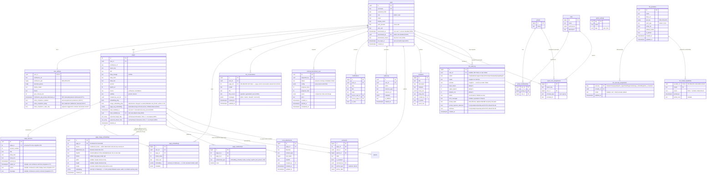

# 6. Data Model (ERD)

Focused ERD of the core tables. Only the most relevant columns are shown;
auxiliary tables (migrations log, rate-limit buckets, token blacklist,
per-feature settings) are omitted for readability. See
`backend/src/core/db/migrations/` for the full schema.

```mermaid
erDiagram
    users ||--o| user_settings : "has 1"
    users ||--o{ pages : "owns"
    users ||--o{ page_embeddings : "owns"
    users ||--o{ llm_conversations : "owns"
    users ||--o{ retrieval_benchmark_runs : "requests"
    users ||--o{ notifications : "receives"
    users ||--o{ audit_log : "generates"
    users ||--o{ comments : "authors"
    users ||--o{ templates : "authors"

    pages ||--o{ page_versions : "versioned as"
    pages ||--o{ page_embeddings : "chunked into"
    pages ||--o{ page_image_embeddings : "images indexed as (#1115; P0 schema, P1 typing, P2 rows, read by the P3 leg)"
    pages ||--o{ comments : "annotated by"
    pages ||--o{ page_relationships : "related via"
    pages ||--o{ local_attachments : "owns (standalone pages only)"
    pages ||--o{ spaces : "is custom home of (#352)"

    roles ||--o{ group_memberships : "granted via"
    groups ||--o{ group_memberships : "has"
    users ||--o{ group_memberships : "member of"
    groups ||--o{ space_role_assignments : "assigned in (principal)"
    users ||--o{ space_role_assignments : "assigned in (principal)"
    roles ||--o{ space_role_assignments : "used in"

    users {
        uuid id PK
        text username UK
        text password_hash
        text role "admin | user"
        text email
        text display_name
        text auth_provider "local | oidc"
        text oidc_sub
        timestamptz deactivated_at "non-null => account disabled (#304)"
        uuid deactivated_by FK "admin who disabled (#304)"
        text deactivated_reason "free-form note (#304)"
        timestamptz last_login_at "last successful login (#307)"
        timestamptz created_at
    }

    user_settings {
        uuid user_id PK,FK
        text confluence_url
        bytea confluence_pat "AES-256-GCM"
        text[] selected_spaces
        text ollama_model
        text theme
        int sync_interval_min
        timestamptz confluence_pat_prompt_dismissed_at "PAT onboarding banner dismissed (#771)"
        bool inline_completion_enabled "personal ghost-text preference (#1417)"
        text inline_completion_delay "fast | balanced | deliberate | manual (#1417)"
        bool inline_completion_code_only "suppress suggestions outside code blocks (#1417)"
    }

    pages {
        int id PK
        uuid user_id FK
        text confluence_id
        text space_key
        text title
        text body_storage "XHTML"
        text body_html
        text body_text
        int version
        int parent_id FK
        text source "confluence | standalone"
        text visibility "private | shared"
        uuid created_by_user_id FK
        bool embedding_dirty
        bool image_embedding_dirty "attachments changed; re-embed IMAGES only (#1115, written in P2)"
        vector page_avg_embedding "materialized avg of chunk vectors, HNSW-indexed (#919)"
        timestamptz local_modified_at "non-null => local edit since last_synced (#305)"
        uuid local_modified_by FK "who last edited locally (#305)"
        text_array expected_image_files "cached asset filenames; NULL => recompute (#887)"
        text_array expected_drawio_files "cached draw.io filenames; NULL => recompute (#887)"
        timestamptz deleted_at
    }

    page_versions {
        uuid id PK
        int page_id FK "universal FK since migration 030"
        int version_number
        text title
        text body_html
        text body_text
        timestamptz synced_at
        timestamptz edited_at "nullable; real Confluence edit time (migration 077)"
        text author "nullable; Confluence author display name (migration 077)"
        text message "nullable; Confluence version comment (migration 077)"
    }

    page_embeddings {
        bigint id PK
        uuid user_id FK
        int page_id FK
        int chunk_index
        text chunk_text
        vector embedding "vector(n) or halfvec(n) — n is the resolved model's width"
        jsonb metadata
    }

    page_image_embeddings {
        bigint id PK
        int page_id FK "ON DELETE CASCADE"
        text source "confluence | local — which attachment store the key resolves in"
        text attachment_key "filename inside that store"
        text sha256 "content address of the embedded bytes; the re-scan skip"
        text format "sniffed: png | jpeg | webp | gif"
        int width "nullable; header-declared only"
        int height "nullable; header-declared only"
        text model "provider model id that produced the vector"
        vector embedding "vector(n) or halfvec(n) — n is the probed IMAGE model's width; no HNSW until the probe"
        timestamptz created_at
    }

    page_relationships {
        bigint id PK
        int page_id_1 FK
        int page_id_2 FK
        text relationship_type "embedding_similarity | label_overlap | explicit_link | parent_child"
        double score
    }

    llm_conversations {
        uuid id PK
        uuid user_id FK
        int page_ref FK "ON DELETE SET NULL — page a dock conversation started from (#1361)"
        text model
        text title
        text title_source "question | generated | user (#1361)"
        jsonb messages "[{role, content, refused?, sources?}]"
        timestamptz created_at
        timestamptz updated_at
    }

    retrieval_benchmark_runs {
        uuid id PK
        uuid requested_by FK
        text status "queued | running | completed | failed"
        jsonb config "query source and limits"
        int progress_done
        int progress_total
        jsonb result "compact ids, titles and timings"
        text error
        timestamptz created_at
        timestamptz started_at
        timestamptz completed_at
    }

    comments {
        bigint id PK
        int page_id FK
        uuid user_id FK
        bigint parent_id FK
        text body
        bool is_resolved
        uuid resolved_by FK
        text anchor_type "selection | block"
        jsonb anchor_data
    }

    notifications {
        bigint id PK
        uuid user_id FK
        text type
        text title
        text body
        uuid source_user_id FK
        int source_page_id FK
        bool is_read
    }

    templates {
        bigint id PK
        text title
        text description
        text category
        jsonb body_json
        text body_html
        uuid created_by FK
        bool is_global
        text space_key
    }

    audit_log {
        uuid id PK
        uuid user_id FK
        text action
        text resource_type
        text resource_id
        jsonb metadata
        text ip_address
        timestamptz created_at
    }

    admin_settings {
        text key PK
        text value
        text type "json | text"
    }

    roles {
        bigint id PK
        text name
        jsonb permissions
        text description
    }

    groups {
        bigint id PK
        text name
    }

    group_memberships {
        uuid user_id FK
        bigint group_id FK
        bigint role_id FK
    }

    space_role_assignments {
        bigint id PK
        text space_key
        bigint role_id FK
        text principal_type "user | group"
        text principal_id
    }

    local_attachments {
        bigint id PK
        int page_id FK
        text filename
        text content_type
        bigint size_bytes
        text sha256
        uuid created_by FK
        timestamptz created_at
        timestamptz updated_at
    }

    llm_providers ||--o{ llm_usecase_assignments : "referenced by"
    llm_providers {
        uuid id PK
        text name
        text base_url
        bytea api_key "AES-256-GCM"
        text auth_type "bearer | none"
        bool verify_ssl
        text default_model
        bool is_default
        timestamptz created_at
        timestamptz updated_at
    }

    llm_usecase_assignments {
        text usecase PK "chat|summary|quality|auto_tag|embedding|rerank|image_embedding|inline_completion"
        uuid provider_id FK
        text model "nullable; null = inherit provider default"
        timestamptz updated_at
    }

    llm_providers ||--o{ llm_model_capabilities : "probed for (CASCADE)"
    llm_model_capabilities {
        uuid provider_id PK,FK "ON DELETE CASCADE (#1154)"
        text model PK
        bool vision "NULL = probed, undetermined"
        timestamptz probed_at
        text probe_error "nullable"
    }

    users ||--o{ llm_audit_log : "may originate"
    llm_audit_log {
        bigint id PK
        uuid user_id FK "nullable; SET NULL on user delete"
        text action "chat|ask|improve|generate|summarize|embed|quality|tag|diagram"
        text model "snapshot at call time"
        text provider "snapshot — survives provider delete"
        int input_tokens "default 0"
        int output_tokens "default 0"
        int duration_ms "default 0"
        text status "success|error; default success"
        text error_message "nullable; populated on failures"
        text prompt_hash "SHA-256 hex; plaintext NEVER stored by CE writer"
        bool prompt_injection_detected "Compendiq/compendiq-ee#115 P0f; default FALSE"
        bool sanitized "Compendiq/compendiq-ee#115 P0f; default FALSE"
        timestamptz created_at
    }
```

`llm_conversations` carries `llm_conversations_user_updated_idx (user_id,
updated_at DESC, id DESC)` for the keyset-paged list (migration 094).

`inline_completion` is one of three non-inheriting use cases, alongside
`rerank` and `image_embedding`. Its seeded assignment has null provider/model,
which means the feature is disabled until an administrator explicitly assigns
both a usable provider and model. The personal `user_settings` fields only
control when an already-assigned feature may run; they cannot select or
override a provider.

Inline-completion prompts and completions are intentionally absent from
`llm_audit_log`. The feature writes only aggregate request and token counters to
fixed Redis hash fields; no user, page, prefix, suffix, or completion is part of
those keys or values.

**`chunk_text` is what gets embedded, verbatim (#1108).** Prefixing the page
title and section into the embedded text was tried, measured, and **not
shipped** — but read what the measurement does and does not say before
re-proposing it.

What it says: on #1102's 262-page corpus and 144-query fixture, the prefix
produced **no credible benefit**. Recall@5 moved 5 wins / 3 losses on
Qwen3-Embedding-4B — McNemar exact p = 0.73, i.e. noise — and was flat on
`bge-m3`.

What it does **not** say: that the prefix is harmful. Recall@1 fell by exactly
four queries on each model (86→82 and 101→97). Four is below what any paired
test can call: `mcnemarExactTwoSided(0, 4)` is 0.125, and `metrics.ts` says so
by name. MRR moved with those same four queries, and `pairedSignificance`
returns no verdict for a graded score at all. So the honest conclusion is
"unproven, and not worth the cost", not "it hurts".

Three caveats mattered more than the numbers **at the time of that
measurement** (pre-#1265, when the chunker was dead code):

1. **The section half never fired.** `section_title === page_title` for all 488
   chunks, because `htmlToText` stripped the `#` markers before `chunkText`'s
   heading regex saw them — so what was measured was a bare page title, not
   `"{title} — {section}"`.
2. **The prefix was ~0.6% of the embedded text**, not the ~1.6% the configured
   chunk size implies, because most chunks reached `CHUNK_HARD_LIMIT` (6000)
   rather than the 1500-char target — same root cause.
3. **The corpus is OSS markdown documentation**, whose pages usually open with
   their own title. Real Confluence pages need not, which is exactly the case
   the prefix was meant to serve.

**The "re-measure after the chunker actually splits" trigger has fired:**
#1265 (PR #1266) made the structure-aware chunker live — the embedding input
is Markdown from `htmlToEmbeddingText(body_html)`, sections split at real
headings, `section_title` carries real (flattened) heading prose, and the
chunking change alone measured Recall@1 0.3889 → 0.5069 / MRR 0.5830 → 0.6501
on the #1102 fixture. The title-prefix question specifically (this section's
subject) remains open and re-measurable with real sections now; reproduce
with `backend/scripts/compare-embedding-variants.mts`. Note its Qwen arms now
build the query preamble from `query-instruction.ts`'s exported `RETRIEVAL_TASK`
rather than from a hardcoded copy of Qwen's stock web-search task, so a re-run
measures the prefix that ships and its absolute numbers may shift a little
against the ones recorded above. `query-instruction.test.ts` holds that by
pinning the call to two arguments — the task is reachable only through the
default parameter, so it cannot be overridden back to the stock wording while
the harness still calls the shipping formatter.

The invariant that work exposed is kept regardless: **every document-side embed
must send the model byte-identical text** — the live embed in `embedPage`, its
shadow dual-write, and #1116's backfill. A divergence changes the embedded text
and the model in the same swap, with identical dimensions and row counts to
show for it; `shadow-migration-service.integration.test.ts` pins the paths
together, which matters most for #1114's query-side prefix.

## Notable conventions

- **User ownership is pervasive.** Almost every table carries `user_id`
  (UUID, FK → `users.id`) — Compendiq is multi-tenant at the user level.
- **pgvector — the column type is dimension-driven, not one model's shape.**
  `page_embeddings.embedding` always carries a *declared* width — 006 shipped
  `vector(768)`, 048 re-typed it to `vector(1024)` — but the schema does not
  *fix* one: that declaration is where the migrations leave a fresh install, and
  a model swap re-types the column. The embedding
  pair is resolved from `llm_usecase_assignments` (the `embedding` use case,
  ADR-021) and the width is **probed from the model**, not typed by an
  operator: the shadow migration embeds the literal text `probe` and takes
  `vectors[0].length`. That number is stored in
  `admin_settings.embedding_dimensions` and picks the column type and index
  path via `columnTypeFor`, rewritten by `enqueueReembedAll({ newDimensions })`
  (destructive) or by #1116's shadow swap (non-destructive):

  | Dimensions  | Column type   | Index                                           |
  |-------------|---------------|-------------------------------------------------|
  | `n ≤ 2000`  | `vector(n)`   | HNSW `vector_cosine_ops` (default tier)         |
  | `2001–4000` | `halfvec(n)`  | HNSW `halfvec_cosine_ops` (float16, ~50% size)  |
  | `n > 4000`  | `vector(n)`   | no index (sequential scan; warning logged)      |

  Both indexed tiers build with `m = 16`, `ef_construction = 200` for cosine
  similarity; only the opclass changes.

  pgvector 0.8 caps HNSW at 2000 dims for `vector` and 4000 dims for `halfvec`;
  larger models (e.g. `qwen3-embedding:8b` at 4096) fall to the seq-scan tier.
  Query-time `ef_search` is set per request. Source of truth:
  `backend/src/domains/llm/services/embedding-service.ts` (`enqueueReembedAll`).

  **Which model, in practice.** `bge-m3` at 1024 (`vector(1024)` + HNSW) is the
  **bootstrap shape**, and only the *width* half of it is shipped by the code:
  migration 048 types the column `vector(1024)` and writes
  `admin_settings.embedding_dimensions = '1024'`, with the deprecated
  `EMBEDDING_DIMENSIONS` env read only if that row goes missing. The *model* half
  is not — `EMBEDDING_MODEL` has had no effect since migration 054 (it is logged
  as deprecated and never read), nothing seeds a `bge-m3` assignment on a fresh
  install, and `resolveUsecase('embedding')` therefore falls through to the
  default provider's `default_model` until an admin assigns the use case in
  Settings → AI Models. `bge-m3` is the model `.env.example` tells an operator
  to pull, matching the width the schema ships.
  **Qwen3-Embedding-4B at 2560 native is the measured recommendation**
  for production (#1114): that lands on the `halfvec(2560)` +
  `halfvec_cosine_ops` tier — at that width fp16 is not a fallback but the only
  indexed representation pgvector offers, and it was measured harmless at the
  vector level. Ingest is ~10× slower per chunk, so the cutover is a scheduling
  decision, run through #1116's shadow path rather than the destructive one.
  The numbers, the caveats and the open operational items are in
  `docs/ARCHITECTURE-DECISIONS.md`, ADR-012's `#1114` amendment. Nothing in this
  file should be read as "the column is 1024 wide".
- **Shadow re-embed columns (#1116, transient).** During a zero-downtime model
  change (`shadow-migration-service.ts`), `page_embeddings.embedding_next` and
  `pages.page_avg_embedding_next` exist as **runtime-created** nullable columns
  typed at the server-probed dimension of the NEW model (same tier table as
  above; there is deliberately no numbered migration — the type is only known
  at probe time). `embedPage` dual-writes both columns while the backfill runs;
  the swap is one transaction of column/index RENAMEs under an explicit
  `lock_timeout` with bounded retries (live→`_prev`, `_next`→live, the prev
  column's NOT NULL dropped because post-swap inserts never provide it), which
  also repoints the `embedding` use-case assignment and `embedding_dimensions`.
  `_prev` columns hold the old vectors for rollback until cleanup drops them
  and restores the live column's NOT NULL. Migration state lives in
  `admin_settings.embedding_shadow_migration`. A schema snapshot can therefore
  legitimately contain `_next`/`_prev` variants of both vector columns; the
  destructive `enqueueReembedAll({newDimensions})` path refuses to run while
  that state row exists (and vice versa). Runbook:
  `docs/runbooks/shadow-reembed.md`.
- **The image index is a separate table (#1115) — `P0 schema, typed at probe
  time in P1, populated from P2`.** `page_image_embeddings` holds one vector per
  referenced image per page, produced by a *different* model from a *different*
  ADR-021 use case (`image_embedding`), and `pages.image_embedding_dirty` is its
  own dirty flag. Migration `093` ships the shape, P1 gives it its real type and
  index, and **P2 fills it**: `image-embedding-service.ts` upserts one row per
  image the page's `body_html` references, keyed `(page_id, source,
  attachment_key)` — where `source` follows the URL PREFIX in that body, never
  `confluence_id IS NULL`, because a relocated page has no `confluence_id` and
  its bytes in the local store. `sha256` is what makes a re-scan cheap: an
  unchanged file keeps its row and costs no request. **P3 reads it** —
  `image-leg-search.ts` kNN-searches this table under the same
  `visiblePagesPredicate` the vector leg uses and fuses the result as a third
  RRF leg; **P4 reads the BYTES behind it**, attaching up to
  `rag_answer_max_images` of the matched pictures to the chat request. A row
  never becomes a `SearchResult` itself: an image-reached page enters ranking as
  its own `chunk_index 0` chunk, or as a title-synthesised one. Four properties
  are deliberate:
  - **Not rows in `page_embeddings`.** A `kind` discriminator would have made
    `embedPage`'s `DELETE`, its `AVG(embedding)` for `page_avg_embedding`, the
    `(page_id, chunk_index)` uniqueness, #1116's shadow columns, MMR, rerank and
    sibling assembly all conditional. A separate table keeps every one of them
    text-only by construction, and it is the only shape that can hold two
    different probed widths at once.
  - **The declared `vector(…)` width in the migration is a placeholder, and
    the index is built at PROBE TIME.** The live type follows the image model's
    probed width through the same tiering the text column uses
    (`core/db/vector-column-tier.ts`, shared with the destructive re-embed, the
    shadow path and the eval seeder), and **the migration ships no HNSW index at
    all** — the opclass is unknown until the probe answers. Assigning the
    `image_embedding` use case runs the probe and then
    `ensureImageEmbeddingColumn(dims, {providerId, model, baseUrl,
    targetDimensions})` (P1), which retypes the column and creates
    `page_image_embeddings_embedding_hnsw_idx` under the same bounded-lock DDL
    discipline as the shadow columns above. Above 4000 dimensions there is no
    index and the settings panel says so — with the remedy beside it, since
    `admin_settings.image_embedding_target_dimensions` is the MRL width the leg
    *requests* (vLLM's `dimensions` is per-request, so nothing truncates unless
    the client asks). `admin_settings.image_embedding_dimensions` and
    `…_index_model` record what the live index was built for — the second as the
    full identity string `provider:model@baseUrl#dims`, which is the only thing
    that can tell two same-width spaces apart. `…_probe` holds the last probe's
    verdict, and it is admin-only: its `error` is the provider's own body
    (#1184's rule).
  - **A model change here truncates and re-scans.** No shadow swap: the leg is
    disabled while the index is empty, so text retrieval is never degraded, and
    images are cheap to redo (content-addressed by `sha256`). The trigger is the
    probed width **or** the recorded `provider:model@baseUrl#dims` changing — two
    models at the same width are two incompatible spaces, and a column type
    cannot tell them apart; the base URL is there because a provider row's
    endpoint can move without its id changing, and the model is the *resolved*
    one, pinned into the assignment row at probe time so it cannot follow
    `provider.default_model` around.
  - **`image_embedding_dirty` is separate from `embedding_dirty` on purpose.**
    An attachment can change under an unchanged page version — sync's
    version-unchanged branch is exactly that case — and then the images must be
    re-embedded and the text must not. P2 raises it at every write that can move
    an image, in two shapes: the ATTACHMENT writers call
    `core/services/image-embedding-dirty.ts` (the two sync attachment writers,
    `fetchAndCachePageImage`, `writeAttachmentCache`, `putLocalAttachment`,
    `cleanPageAttachments`), while the BODY writers raise the column inline in
    the UPDATE they already own, gated on `body_html` alone (the sync upsert,
    the conflict-policy update, both relocate directions, the four `body_html`
    writers in `routes/knowledge/pages-crud.ts`, `restoreVersion` and both
    branches of `POST /llm/improvements/apply` — the last two matter because a
    restore and an Apply are the two ways a page's `img` set moves with no
    attachment write to notice it). It is CLEARED only
    by a page whose scan had no failure, so the flag is the retry queue as well
    as the work queue. Design of record: ADR-025.
- **The attachment stores are filesystem-only, and #1349 gives them a
  reconciler.** Two trees under `ATTACHMENTS_DIR`:
  `<confluence_id | page id>/<file>` (the Confluence cache — pasted images on
  standalone pages land here keyed by PK, so the keyspace is SHARED with
  Confluence ids) and `local/<page_id>/<file>` (the local store, whose metadata
  rows are `local_attachments`). Three intake paths write and only page-scoped
  cleanups delete; `local_attachments`' CASCADE removes rows, never files. The
  standalone hard-delete and trash purge now remove both directories, plus the
  page's `page-icons/<pk>/` mark, which nothing but the icon route itself ever
  removed and which no sweep will ever collect
  (`core/services/standalone-attachment-cleanup.ts`). The mark is keyed by
  `pages.id` alone, so the same removal rides every other HARD delete too —
  the Confluence delete route (single and bulk), sync's 30-day
  `purgeDeletedPages` and `unsyncSpace`, through
  `discardPageIconForDeletedPage` — each of them behind its own COMMITTED row
  delete (`DELETE … RETURNING id`), never on a cleanup transaction's rollback
  branch, where the page still exists and the mark is its only copy. And never
  a soft delete, which is restorable. `<pk>/` in the shared tree, by contrast, is removed only when no
  page claims `confluence_id = <pk>` AND the directory is older than a 5-minute
  grace window, because deleting a shared-keyspace directory can evict a live
  Confluence page's whole cache, and during a FIRST sync the claim does not
  exist yet (attachments are downloaded before the `pages` INSERT). Everything else is
  the admin-triggered, dry-run-first orphan sweep
  (`domains/confluence/services/attachment-sweep-service.ts`, surfaced on
  Settings → Knowledge → Spaces & Sync → Sync schedule): the two stores are walked separately
  and the RESERVED root entries are skipped by name
  (`ATTACHMENT_ROOT_RESERVED_DIRNAMES` — `local/` and the page-icon store
  `page-icons/`; both match the Confluence tree's key pattern, so a naive walk
  lists a whole other store as one orphan and a live run deletes it), a directory is
  orphaned only when NO page row — trashed included — claims its key AND none
  of its files carries a kept filename (the keep-set outranks the directory
  verdict; a keep-intersecting pageless directory is skipped whole and
  counted as keep-protected), and a
  file only against a GLOBAL per-store keep-set fed from every body text in
  the system (pages `body_html`/`draft_body_html`/`body_storage` live and
  trashed, `page_versions`, `pending_sync_versions`, `templates`, `comments`,
  and `llm_conversations.messages` — #1361 persists a matched image's
  `attachmentUrl` per assistant turn),
  because attachment URLs are copied verbatim between bodies. A 24h mtime
  grace window covers sync/paste races (both write files before the row that
  references them), only image-like files are per-file candidates in the
  Confluence tree (non-image lazily-cached attachments have no enumerator),
  local rows whose FILE is missing are counted, never deleted, and a live run
  refuses against an empty-on-disk store the database still references. Files
  a live run deletes take their `page_image_embeddings` rows with them and
  re-raise `image_embedding_dirty` on the owning pages. State lives in two
  `admin_settings` JSON rows (`attachment_sweep_last_run`,
  `attachment_storage_stats`) — no new table.
- **Materialized page averages (#919).** `pages.page_avg_embedding` stores each
  page's average chunk vector, written by `embedPage` inside the same
  transaction as the chunk inserts, with its own HNSW index
  (`idx_pages_page_avg_embedding_hnsw`, same type/opclass/params as
  `page_embeddings.embedding`; kept in lockstep by `enqueueReembedAll`). The
  knowledge-graph relationship builder (`computePageRelationships`) serves
  top-K nearest-neighbour edges from this index scoped to the changed pages,
  instead of AVG-ing the whole `page_embeddings` table and doing an index-less
  pairwise scan on every embedding run.
- **Encryption at rest.** `user_settings.confluence_pat` is stored as a
  ciphertext blob (AES-256-GCM, key from `PAT_ENCRYPTION_KEY`). Never
  log or expose it to the frontend. The AES key is derived via HKDF-SHA256
  over the full passphrase (#738); pre-HKDF ciphertexts (`v{N}:` /
  unversioned) remain decryptable. The `smtp_pass` row in `admin_settings`
  uses the same versioned helpers — legacy plaintext rows are detected on
  startup and re-encrypted in place.
- **`admin_settings`** is a key-value bag used for server-wide config
  that must survive restarts and be editable at runtime — notably the
  `license_key` (populated by the EE plugin) and the `embedding_dimensions`
  row (read by the embedding service and rewritten when the admin probes +
  re-embeds against a different-dimensioned model).
- **LLM providers are rows, not env vars.** The `llm_providers` table
  stores one row per configured upstream endpoint (ADR-021). Exactly one
  row has `is_default = TRUE`. The `llm_usecase_assignments` table maps
  each of `chat | summary | quality | auto_tag | embedding | rerank` (#1104; rerank disabled when unassigned, never defaulted) to a
  `(provider_id, model)` pair. `model` may be `NULL` to inherit the
  provider's `default_model`; the whole row may be absent to inherit the
  default provider + its default model. The resolver caches this lookup
  and invalidates on provider writes via `llm-cache-bus.ts`.
- **`llm_model_capabilities`** (migration 087, #1154) records a probed
  `vision` verdict per `(provider_id, model)` — never per provider, since one
  host commonly serves both a vision-capable and a text-only model. Unlike
  `llm_usecase_assignments`' `ON DELETE RESTRICT`, its FK to `llm_providers`
  is `ON DELETE CASCADE`: capability is derived data that should vanish with
  its provider, not user configuration that should block a delete. `vision`
  is nullable and `NULL` is a distinct, meaningful state ("probed, couldn't
  tell") from `FALSE` ("definitively rejected the image") — see ADR-021's
  `#1154` amendment for the full verdict table. `getVisionCapability`
  (`domains/llm/services/model-capabilities.ts`) reads this table without
  ever blocking on a probe; `refreshVisionCapability` writes it, called from
  the admin save path and the manual re-probe route (#1184). `probe_error`
  carries the provider's own error body and is readable only through
  admin-gated routes: `readVisionCapabilityDetail` backs
  `GET /admin/llm-usecases/chat/vision-capability` and
  `POST /admin/llm-usecases/chat/reprobe-vision`, while the non-admin
  `GET /llm/usecase-default` exposes the `vision` verdict alone.
- **`audit_log`** captures auth events, license changes, RBAC mutations,
  and high-value LLM calls (prompt-injection flags, failed sanitization).
- **User FK policies on hard delete** (migration 062): `audit_log.user_id`,
  `error_log.user_id` and `comments.resolved_by` use `ON DELETE SET NULL`
  so historical rows survive a user delete with a null pointer.
  `templates.created_by` is `NOT NULL` and cannot use SET NULL, so the
  admin-CRUD `deleteUser()` service reassigns any templates authored by
  the target to the `__system__` sentinel user
  (`00000000-0000-0000-0000-000000000000`) inside the same transaction
  before issuing the `DELETE FROM users`.
- **Soft delete** on `pages.deleted_at` — the Trash feature filters on this.
  Standalone pages in the trash are hard-deleted after 30 days
  (`purgeExpiredStandalonePages` in `data-retention-service.ts`, run by the
  daily maintenance job; dependent rows go via `ON DELETE CASCADE`).
  Confluence-synced pages have their own purge in `sync-service.ts`
  (`purgeDeletedPages`, with upstream re-confirmation — see 08-flow-sync).
- **Version history & restore** (`page_versions`, keyed by `page_id`). Snapshots
  are written on sync, on draft-publish, and before a restore — so both
  Confluence-synced and standalone/local pages accumulate history. The
  right-pane "Version history" UI lists snapshots + the live version, previews
  any snapshot, and offers a Confluence-style **restore**
  (`POST /api/pages/:id/versions/:version/restore`): it snapshots the current
  live state first, then applies the target snapshot as a **new** bumped
  version (older versions remain), marks `embedding_dirty`, and — for
  Confluence-sourced pages — pushes the restored content upstream as a new
  Confluence version so the next sync doesn't clobber the revert. Retention
  keeps the last `RETENTION_VERSIONS_MAX` (default 50) snapshots per page
  (`data-retention-service.ts`).
- **Cached asset expectations** (`pages.expected_image_files` /
  `expected_drawio_files`, migration 081, #887). The sync-overview dashboard
  needs each page's expected image/draw.io filenames; deriving them from raw
  XHTML on every request materialised the whole corpus's `body_storage` and
  double-JSDOM-parsed each body. They are now persisted as `TEXT[]` and reset to
  NULL by the `pages_expected_assets_invalidate` BEFORE UPDATE trigger whenever
  `body_storage` changes (covering every writer without touching their call
  sites). `getSyncOverview` lazily recomputes the NULL rows in bounded batches
  and persists them, so steady-state reads do zero XHTML parsing. NULL means
  "recompute"; an empty array means "computed, no assets". This trigger is
  independent of the migration 060 `local_modified` trigger (disjoint columns).
