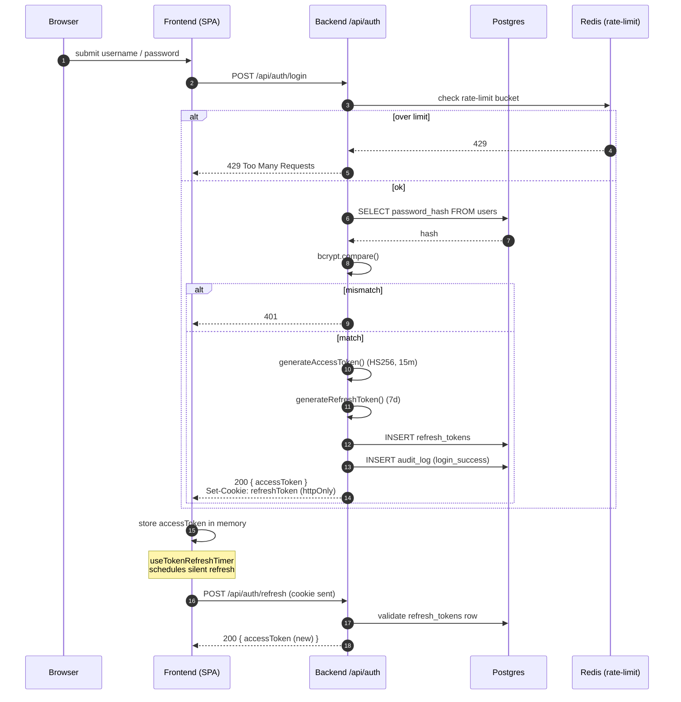
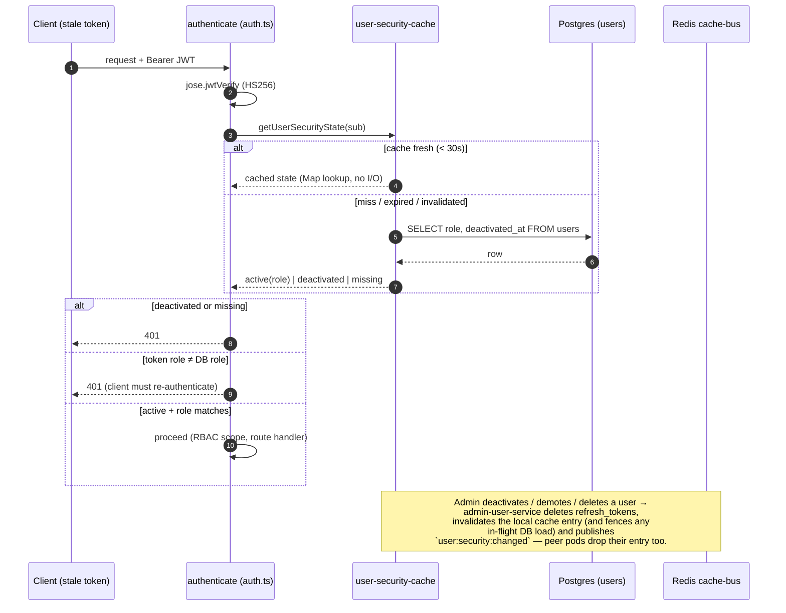
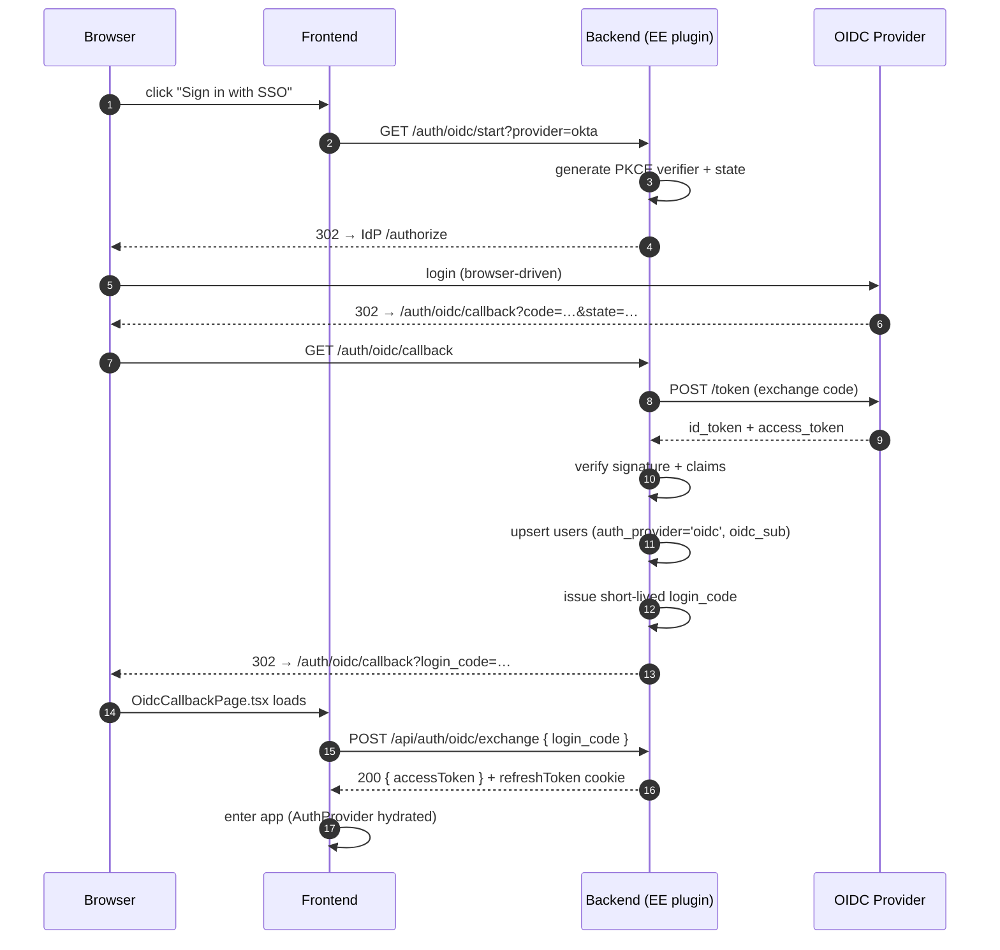

# 7. Auth & Login Flow

Compendiq supports two auth modes:

1. **Local credentials** — default in CE. Bcrypt + JWT with refresh tokens.
2. **OIDC SSO** — Enterprise Edition only, gated by
   `ENTERPRISE_FEATURES.OIDC_SSO`.

## Local login (CE + EE)

### Client-side token refresh

The SPA keeps the access token in memory (rehydrated from `localStorage` on
reload) and refreshes it four ways, all funneling through the single-flight
`refreshAccessTokenOnce()` so concurrent requests trigger exactly one
`POST /api/auth/refresh`:

- **Scheduled** — `useTokenRefreshTimer` refreshes shortly before expiry.
- **Proactive (#965)** — `apiFetch` decodes the token's `exp` and, if it is
  already expired (or within a 5s skew), refreshes **before** sending. This
  stops a burst of concurrent queries on session resume from each round-tripping
  to a guaranteed 401 (the "401 storm").
- **Reactive** — a `401` response still triggers a refresh + retry as the
  fallback for server-side revocation / clock skew.
- **Session init (#884)** — `useSessionInit` fires once on app load when the
  user looks authenticated but has no in-memory token (e.g. `localStorage`
  migrated from an older key). It must go through the single-flight helper too:
  in that state every mounted query also 401s and refreshes, so an independent
  refresh here would race the deduped path — the loser presents an
  already-rotated (revoked) JTI, tripping token-family reuse detection and
  logging the user out despite a valid session.

### Registration quirks

- `POST /api/auth/register` is rate-limited (5/min).
- **The first successful registration creates an admin.** Subsequent
  registrations create regular users. This transition is atomic
  (single `INSERT … RETURNING role` guarded by a transaction).
- Registration may be disabled by an admin setting (`admin_settings`
  key) once the initial user is created.

### Logout

`POST /api/auth/logout` deletes the refresh token row, clears the cookie,
and records `audit_log(action='logout')`. The access token is short-lived
enough that blacklisting is not needed in CE; EE may add it.

On the client, `useClearCacheOnLogout` (wired in `App.tsx`) wipes the
in-memory TanStack Query cache on every authenticated→unauthenticated
transition. The single SPA-scoped QueryClient would otherwise survive a
logout→relogin in the same tab and serve the next user the previous user's
cached pages, search results, and `allowed` permission results — query keys
carry no user identity (#885). A ref guard means a token refresh (`setAuth`
while still authenticated) does not drop a live session's cache; only a true
logout does.

## Per-request revocation check (#737)

`authenticate` does not trust the JWT alone: after signature verification it
consults a per-user security-state cache so **deactivation, hard-delete and
role changes take effect on already-issued access tokens** instead of only at
`/login` and `/refresh`.

Properties:

- **Hot-path cost**: a `Map` lookup per request; at most one indexed
  single-row `SELECT` per user per 30s window per pod
  (`USER_SECURITY_CACHE_TTL_MS`).
- **Revocation latency bound**: immediate on the pod that handled the admin
  action and on every pod subscribed to the cache-bus; ≤ 30s on pods without
  a working bus (single-pod soft-fail mode). Invalidation bumps a per-user
  generation that fences in-flight loads: a `SELECT` that snapshotted
  pre-COMMIT state cannot re-cache the stale "active/old-role" answer after
  the invalidation ran (requests already awaiting that load may see the
  pre-mutation state once — they raced the admin action — but it is never
  cached). `ACCESS_TOKEN_EXPIRY` is capped at 24h as the absolute worst-case
  backstop; values above 24h are clamped at startup with a warning (an
  invalid format still fails startup).
- **Role change = privilege boundary**: `updateUser` revokes all refresh
  tokens (mirroring deactivation), so a demoted admin cannot refresh back to
  an admin token — they must log in again.
- **Soft-fail**: if the `users` lookup fails and nothing is cached, the
  request proceeds on the token claims (pre-#737 behaviour) so a transient DB
  blip cannot 401 every session.

## OIDC flow (Enterprise Edition)

Routes registered only when the EE plugin is loaded **and**
`ENTERPRISE_FEATURES.OIDC_SSO` is enabled in the loaded license.

Why the extra hop via a `login_code`? It keeps tokens out of the URL
fragment that the browser exposes to history/referer. The callback page
posts to a JSON endpoint and only then receives the real JWT.

## Where this lives

| Concern | File |
|---------|------|
| JWT plugin, decorators | `backend/src/core/plugins/auth.ts` |
| Per-user security-state cache (#737) | `backend/src/core/services/user-security-cache.ts` |
| Refresh-token revocation on deactivate / role change | `backend/src/core/services/admin-user-service.ts` |
| Routes (register / login / refresh / logout) | `backend/src/routes/foundation/auth.ts` |
| OIDC routes (EE only) | `@compendiq/enterprise` (loaded via `core/enterprise/loader.ts`) |
| Frontend session init | `frontend/src/shared/hooks/useSessionInit.ts` |
| Refresh timer | `frontend/src/shared/hooks/useTokenRefreshTimer.ts` |
| API client (single-flight + proactive/reactive refresh) | `frontend/src/shared/lib/api.ts` |
| OIDC callback UI | `frontend/src/features/auth/OidcCallbackPage.tsx` |
| OIDC admin config UI | `frontend/src/features/admin/OidcSettingsPage.tsx` |
