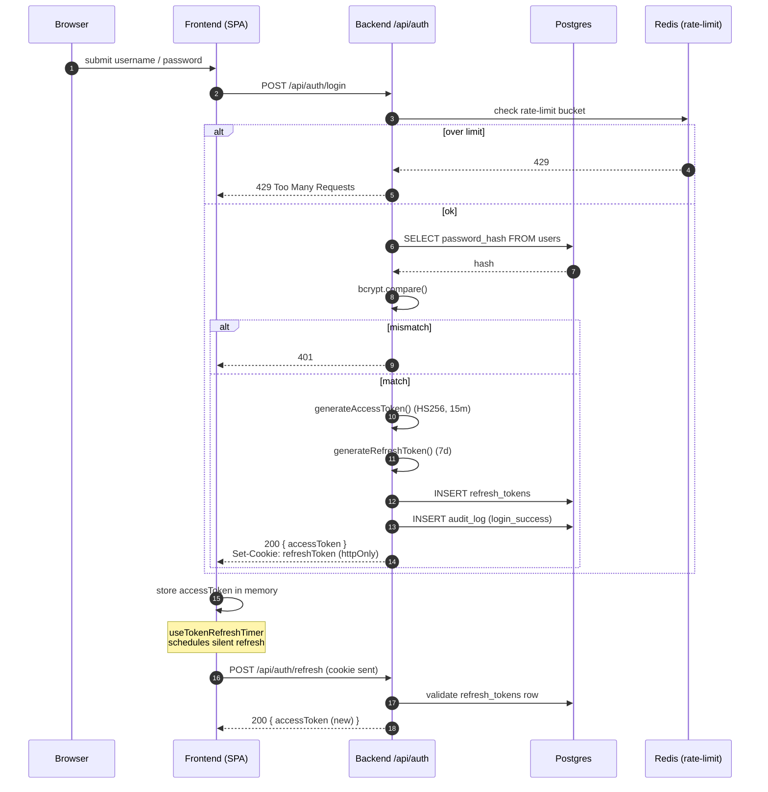
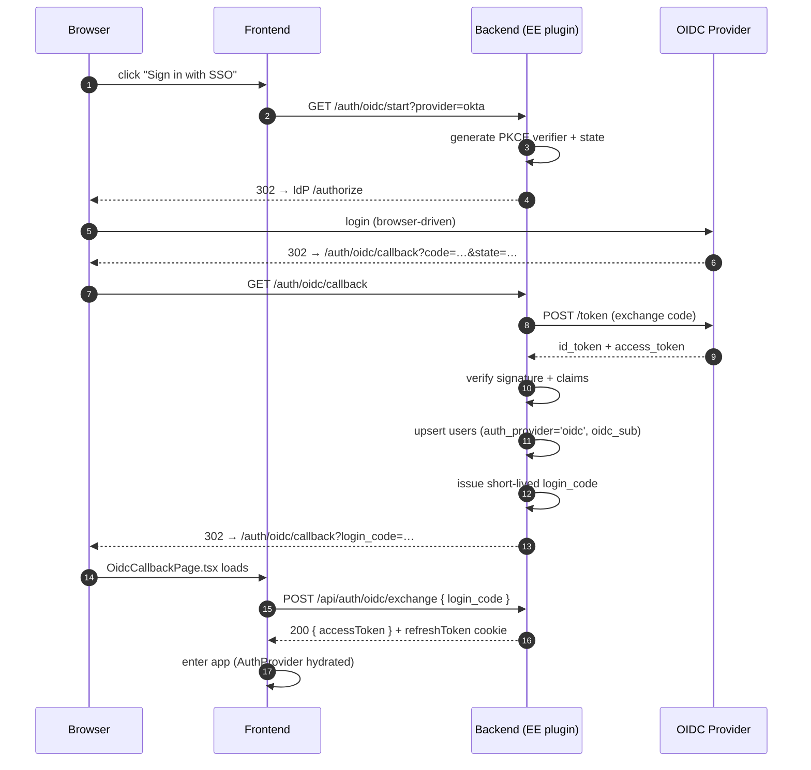

# 7. Auth & Login Flow

Compendiq supports two auth modes:

1. **Local credentials** — default in CE. Bcrypt + JWT with refresh tokens.
2. **OIDC SSO** — Enterprise Edition only, gated by
   `ENTERPRISE_FEATURES.OIDC_SSO`.

## Local login (CE + EE)

### Registration quirks

- `POST /api/auth/register` is rate-limited (5/min).
- **The first successful registration creates an admin.** Subsequent
  registrations create regular users. This transition is atomic
  (single `INSERT … RETURNING role` guarded by a transaction).
- Registration may be disabled by an admin setting (`admin_settings`
  key) once the initial user is created.

### Logout

`POST /api/auth/logout` deletes the refresh token row, clears the cookie,
and records `audit_log(action='logout')`. The access token is short-lived
enough that blacklisting is not needed in CE; EE may add it.

## OIDC flow (Enterprise Edition)

Routes registered only when the EE plugin is loaded **and**
`ENTERPRISE_FEATURES.OIDC_SSO` is enabled in the loaded license.

Why the extra hop via a `login_code`? It keeps tokens out of the URL
fragment that the browser exposes to history/referer. The callback page
posts to a JSON endpoint and only then receives the real JWT.

## Where this lives

| Concern | File |
|---------|------|
| JWT plugin, decorators | `backend/src/core/plugins/auth.ts` |
| Routes (register / login / refresh / logout) | `backend/src/routes/foundation/auth.ts` |
| OIDC routes (EE only) | `@compendiq/enterprise` (loaded via `core/enterprise/loader.ts`) |
| Frontend session init | `frontend/src/shared/hooks/useSessionInit.ts` |
| Refresh timer | `frontend/src/shared/hooks/useTokenRefreshTimer.ts` |
| OIDC callback UI | `frontend/src/features/auth/OidcCallbackPage.tsx` |
| OIDC admin config UI | `frontend/src/features/admin/OidcSettingsPage.tsx` |
