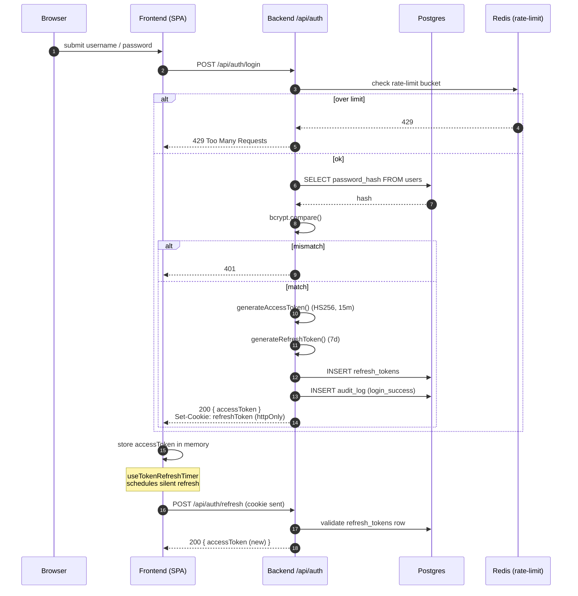
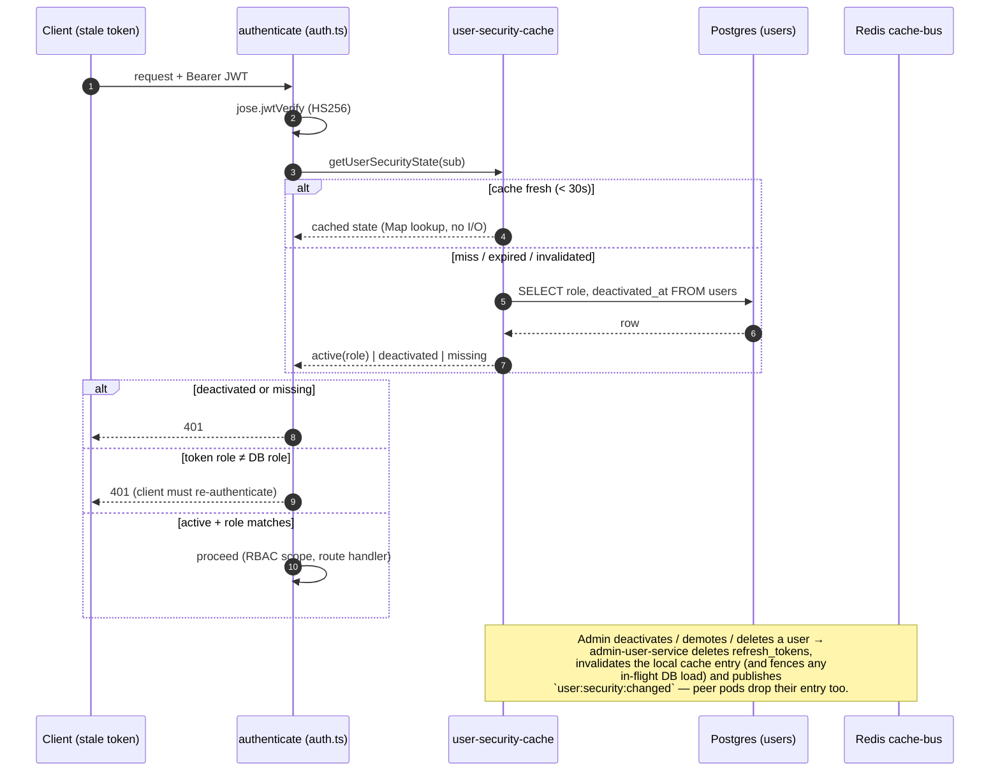
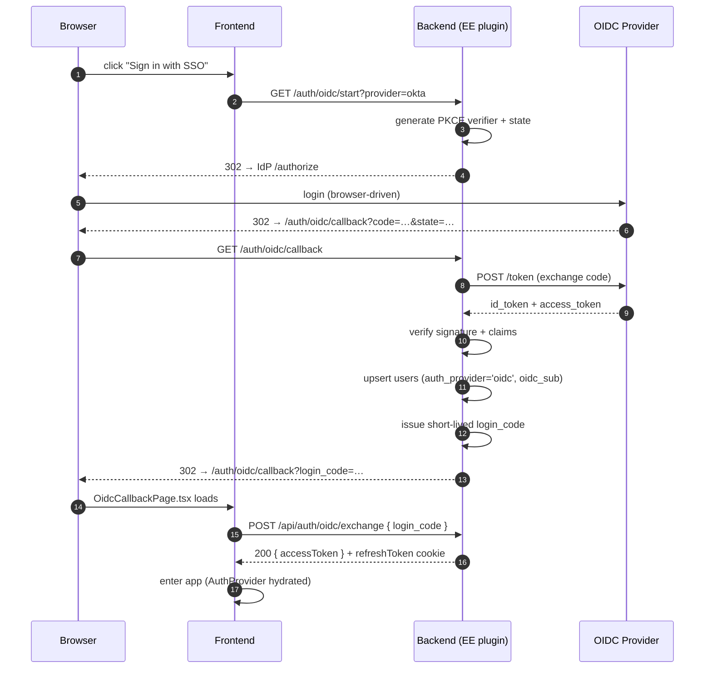

# 7. Auth & Login Flow

Compendiq supports two auth modes:

1. **Local credentials** — default in CE. Bcrypt + JWT with refresh tokens.
2. **OIDC SSO** — Enterprise Edition only, gated by
   `ENTERPRISE_FEATURES.OIDC_SSO`.

## Local login (CE + EE)

```mermaid
sequenceDiagram
    autonumber
    participant B as Browser
    participant FE as Frontend (SPA)
    participant BE as Backend /api/auth
    participant DB as Postgres
    participant RL as Redis (rate-limit)

    B->>FE: submit username / password
    FE->>BE: POST /api/auth/login
    BE->>RL: check rate-limit bucket
    alt over limit
        RL-->>BE: 429
        BE-->>FE: 429 Too Many Requests
    else ok
        BE->>DB: SELECT password_hash FROM users
        DB-->>BE: hash
        BE->>BE: bcrypt.compare()
        alt mismatch
            BE-->>FE: 401
        else match
            BE->>BE: generateAccessToken() (HS256, 15m)
            BE->>BE: generateRefreshToken() (7d)
            BE->>DB: INSERT refresh_tokens
            BE->>DB: INSERT audit_log (login_success)
            BE-->>FE: 200 { accessToken }<br/>Set-Cookie: refreshToken (httpOnly)
        end
    end

    FE->>FE: store accessToken in memory
    Note over FE: useTokenRefreshTimer<br/>schedules silent refresh
    FE->>BE: POST /api/auth/refresh (cookie sent)
    BE->>DB: validate refresh_tokens row
    BE-->>FE: 200 { accessToken (new) }
```

### Client-side token refresh

The SPA keeps the access token **in memory only** — it is never written to
`localStorage` or `sessionStorage` (CWE-922). On reload / new tab it is
re-minted from the HttpOnly refresh cookie via `useSessionInit` (see below).
Only non-sensitive `user` + `isAuthenticated` are persisted. The token is
refreshed four ways, all funneling through the single-flight
`refreshAccessTokenOnce()` so concurrent requests trigger exactly one
`POST /api/auth/refresh`:

- **Scheduled** — `useTokenRefreshTimer` refreshes shortly before expiry.
- **Proactive (#965)** — `apiFetch` decodes the token's `exp` and, if it is
  already expired (or within a 5s skew), refreshes **before** sending. This
  stops a burst of concurrent queries on session resume from each round-tripping
  to a guaranteed 401 (the "401 storm").
- **Reactive** — a `401` response still triggers a refresh + retry as the
  fallback for server-side revocation / clock skew.
- **Session init (#884)** — `useSessionInit` fires once on app load when the
  user looks authenticated but has no in-memory token. Because the token is
  memory-only, this is the normal state after every reload / new tab (#1054),
  not just a migrated-key edge case. It must go through the single-flight
  helper too: in that state every mounted query also 401s and refreshes, so an
  independent refresh here would race the deduped path — the loser presents an
  already-rotated (revoked) JTI, tripping token-family reuse detection and
  logging the user out despite a valid session.

#### Cross-tab coordination (#1054)

Token adoption and logout are propagated between tabs over an **in-memory,
same-origin `BroadcastChannel('compendiq-auth')`** — the access token is
**never** broadcast through Web Storage. When one tab refreshes/logs in, it
posts the new token to peers; on logout it posts a `logout` message that clears
in-memory auth (and, via `useClearCacheOnLogout`, the cached user data) in every
other tab. The `BroadcastChannel` is feature-guarded; where it is unavailable
the retained `localStorage` `storage` event still coordinates **logout**
(because `isAuthenticated` persists), and each tab otherwise re-mints its own
token from the refresh cookie. Received messages are applied under a
re-entrancy guard so a tab never echoes a change it just received.

### Registration quirks

- `POST /api/auth/register` is rate-limited (5/min).
- **The first successful registration creates an admin.** Subsequent
  registrations create regular users. This transition is atomic
  (single `INSERT … RETURNING role` guarded by a transaction).

#### Registration policy (opt-in self-registration, #1051)

Self-registration after the initial account is **opt-in**, controlled by the
key-value `admin_settings.registration_mode` (`open` | `closed`). There is no
migration and no env var.

- **Default `closed`.** Once a real (non-sentinel) admin exists, an unset or
  `closed` mode makes `POST /api/auth/register` return
  `403 { error: 'registration_disabled' }`. The gate runs **before**
  `bcrypt.hash`, and the 403 is written with an explicit `reply.code(403).send`
  (not a thrown `httpError`) so the machine-readable code survives the global
  error handler's `safeErrorName` sanitisation.
- **Bootstrap is always allowed.** While no real admin exists yet, registration
  is permitted regardless of the stored mode, using the same
  sentinel-excluding predicate (`role='admin' AND id != <SYSTEM_USER_ID>`) as
  `GET /api/health/setup-status` / `POST /api/setup/admin`. This is why the
  first account can always be created on a fresh install.
- **Admin opt-in.** Admins flip the mode via `GET/PUT /api/admin/settings`
  (`registrationMode`), surfaced under Settings → Access Control → Registration.
  Choosing `open` shows a warning that any visitor can self-register and that
  self-registered users can view/edit shared standalone pages.
- **SPA gate.** The login screen reads the public, unauthenticated
  `GET /api/auth/registration-policy` → `{ allowRegistration }` and only renders
  the signup toggle when it is `true`. The client fails **closed** (a
  fetch/parse error hides signup) and refuses to submit a disabled registration.
  The endpoint exposes only the boolean — never the raw mode nor whether an
  admin exists.

### Logout

`POST /api/auth/logout` deletes the refresh token row, clears the cookie,
and records `audit_log(action='logout')`. The access token is short-lived
enough that blacklisting is not needed in CE; EE may add it.

On the client, `useClearCacheOnLogout` (wired in `App.tsx`) wipes the
in-memory TanStack Query cache on every authenticated→unauthenticated
transition. The single SPA-scoped QueryClient would otherwise survive a
logout→relogin in the same tab and serve the next user the previous user's
cached pages, search results, and `allowed` permission results — query keys
carry no user identity (#885). A ref guard means a token refresh (`setAuth`
while still authenticated) does not drop a live session's cache; only a true
logout does.

## Per-request revocation check (#737)

`authenticate` does not trust the JWT alone: after signature verification it
consults a per-user security-state cache so **deactivation, hard-delete and
role changes take effect on already-issued access tokens** instead of only at
`/login` and `/refresh`.

```mermaid
sequenceDiagram
    autonumber
    participant C as Client (stale token)
    participant BE as authenticate (auth.ts)
    participant UC as user-security-cache
    participant DB as Postgres (users)
    participant RB as Redis cache-bus

    C->>BE: request + Bearer JWT
    BE->>BE: jose.jwtVerify (HS256)
    BE->>UC: getUserSecurityState(sub)
    alt cache fresh (< 30s)
        UC-->>BE: cached state (Map lookup, no I/O)
    else miss / expired / invalidated
        UC->>DB: SELECT role, deactivated_at FROM users
        DB-->>UC: row
        UC-->>BE: active(role) | deactivated | missing
    end
    alt deactivated or missing
        BE-->>C: 401
    else token role ≠ DB role
        BE-->>C: 401 (client must re-authenticate)
    else active + role matches
        BE->>BE: proceed (RBAC scope, route handler)
    end

    Note over RB,UC: Admin deactivates / demotes / deletes a user →<br/>admin-user-service deletes refresh_tokens,<br/>invalidates the local cache entry (and fences any<br/>in-flight DB load) and publishes<br/>`user:security:changed` — peer pods drop their entry too.
```

Properties:

- **Hot-path cost**: a `Map` lookup per request; at most one indexed
  single-row `SELECT` per user per 30s window per pod
  (`USER_SECURITY_CACHE_TTL_MS`).
- **Revocation latency bound**: immediate on the pod that handled the admin
  action and on every pod subscribed to the cache-bus; ≤ 30s on pods without
  a working bus (single-pod soft-fail mode). Invalidation bumps a per-user
  generation that fences in-flight loads: a `SELECT` that snapshotted
  pre-COMMIT state cannot re-cache the stale "active/old-role" answer after
  the invalidation ran (requests already awaiting that load may see the
  pre-mutation state once — they raced the admin action — but it is never
  cached). `ACCESS_TOKEN_EXPIRY` is capped at 24h as the absolute worst-case
  backstop; values above 24h are clamped at startup with a warning (an
  invalid format still fails startup).
- **Role change = privilege boundary**: `updateUser` revokes all refresh
  tokens (mirroring deactivation), so a demoted admin cannot refresh back to
  an admin token — they must log in again.
- **Soft-fail**: if the `users` lookup fails and nothing is cached, the
  request proceeds on the token claims (pre-#737 behaviour) so a transient DB
  blip cannot 401 every session.

## OIDC flow (Enterprise Edition)

Routes registered only when the EE plugin is loaded **and**
`ENTERPRISE_FEATURES.OIDC_SSO` is enabled in the loaded license.

```mermaid
sequenceDiagram
    autonumber
    participant B as Browser
    participant FE as Frontend
    participant BE as Backend (EE plugin)
    participant IDP as OIDC Provider

    B->>FE: click "Sign in with SSO"
    FE->>BE: GET /auth/oidc/start?provider=okta
    BE->>BE: generate PKCE verifier + state
    BE-->>B: 302 → IdP /authorize
    B->>IDP: login (browser-driven)
    IDP-->>B: 302 → /auth/oidc/callback?code=…&state=…
    B->>BE: GET /auth/oidc/callback
    BE->>IDP: POST /token (exchange code)
    IDP-->>BE: id_token + access_token
    BE->>BE: verify signature + claims
    BE->>BE: upsert users (auth_provider='oidc', oidc_sub)
    BE->>BE: issue short-lived login_code
    BE-->>B: 302 → /auth/oidc/callback?login_code=…
    B->>FE: OidcCallbackPage.tsx loads
    FE->>BE: POST /api/auth/oidc/exchange { login_code }
    BE-->>FE: 200 { accessToken } + refreshToken cookie
    FE->>FE: enter app (AuthProvider hydrated)
```

Why the extra hop via a `login_code`? It keeps tokens out of the URL
fragment that the browser exposes to history/referer. The callback page
posts to a JSON endpoint and only then receives the real JWT.

### Deciding whether to offer the SSO button

Before any of the above, the login page probes `GET /api/auth/oidc/config`.
CE answers with a static `{ enabled: false, enterpriseRequired: true }` stub
(`app.ts`, community mode only); EE answers from the `oidc_providers` table
plus the license. The button renders when `enabled && !enterpriseRequired`.

The probe outcome must not be collapsed to "config or null" (`OidcProbe` in
`login/sso-notice.ts` — same rule as the `vision` tri-state on the AI
composers):

| Outcome | Login page |
|---------|-----------|
| `pending` (first probe of the page load) | nothing yet |
| `ready`, `enabled` | SSO button + "or continue with credentials" divider |
| `ready`, not enabled | nothing — SSO is genuinely off here |
| `failed`, `retrying: false` (5xx / network / rate-limit / parse) | unavailable notice with a **Check again** trigger |
| `failed`, `retrying: true` | the *same* notice, trigger `aria-disabled` + `aria-busy` |

A failed probe is *not* "SSO is disabled". nginx proxies all of `/api/` to one
upstream, so a backend that is down or restarting returns 502 for this route —
and swallowing that into a hidden button removes the only sign-in path on an
SSO-only deployment while looking exactly like the button having been deleted.

**Check again** re-runs all three of the page's probes, not just the SSO one —
they died with the same upstream. The presentation config carries the layout
variant and the edition badge; the registration policy fails closed, so a
deployment that allows sign-up would otherwise keep hiding its own "Create
one" link until the user reloaded. Each probe drops responses from a
superseded generation, so a slow answer landing after a newer one cannot undo
it in either direction. No reload is needed.

### Why the notice is built the way it is

Every one of these exists because the obvious alternative breaks something.
None of them are stylistic.

- **A recheck stays in `failed`** rather than returning to `pending`. Dropping
  to `pending` unmounts the notice together with the trigger the user just
  pressed: focus lands on `<body>`, and the hanging-upstream case this notice
  exists for shows an empty panel that reads as success.
- **The trigger is `aria-disabled`, not `disabled`.** A genuinely disabled
  control is blurred by the browser and leaves the tab order — dropping the
  focus of the user who just pressed it, which is the failure above by another
  route. The click handler is detached instead.
- **Focus restore keys off the notice going away, not the SSO button
  arriving.** Those are not the same condition: a recheck that settles on "SSO
  is genuinely off" also collapses the notice, and on CE that is the *only*
  outcome a recovered backend can produce (`app.ts` serves a fixed
  `enabled: false` stub in community mode). Focus moves to whichever control
  replaced the trigger — the SSO button, or else the username field — and only
  when `document.activeElement` is still `<body>`, so a user who moved to a
  form field meanwhile keeps it.
- **Nothing is announced when the notice resolves.** The region speaks the
  failure once; a "recovered" announcement would contradict the rule above for
  no gain. During a recheck the focused trigger is itself the feedback surface
  (its accessible name becomes "Checking…" while `aria-busy` and
  `aria-disabled` flip on the node the screen-reader cursor is on), and the
  focus move is what confirms the outcome.
- **The recheck flag and the live region live in `LoginPage`, not the panel.**
  `ChangeDeskLogin` and `LocalLoopLogin` are different component types, so the
  first successful presentation-config read *remounts the whole panel*. Anything
  inside it is destroyed mid-recheck.
- **The live region waits for the attribution signal.** The two probes settle
  independently, so announcing on the first would say "Cannot reach the server"
  and contradict it a few frames later. The visible heading does refine in
  place — the weaker true statement then the stronger one is honest on screen —
  but a screen reader cannot retract what it has already said.
- **Which failure gets named** is that attribution signal.
  `GET /api/auth/login-page-config` is an unrelated core route on the same
  upstream, so losing it too means nothing responded and the notice says
  *"Cannot reach the server"* instead of blaming SSO. It matters most on CE,
  where SSO does not exist at all and an SSO-shaped error is pure noise. That
  wording also drops the "you can still sign in with credentials" reassurance:
  the credential form posts to the same dead upstream.

## Where this lives

| Concern | File |
|---------|------|
| JWT plugin, decorators | `backend/src/core/plugins/auth.ts` |
| Per-user security-state cache (#737) | `backend/src/core/services/user-security-cache.ts` |
| Refresh-token revocation on deactivate / role change | `backend/src/core/services/admin-user-service.ts` |
| Routes (register / login / refresh / logout) | `backend/src/routes/foundation/auth.ts` |
| OIDC routes (EE only) | `@compendiq/enterprise` (loaded via `core/enterprise/loader.ts`) |
| Frontend session init | `frontend/src/shared/hooks/useSessionInit.ts` |
| Refresh timer | `frontend/src/shared/hooks/useTokenRefreshTimer.ts` |
| API client (single-flight + proactive/reactive refresh) | `frontend/src/shared/lib/api.ts` |
| OIDC callback UI | `frontend/src/features/auth/OidcCallbackPage.tsx` |
| OIDC admin config UI | `frontend/src/features/admin/OidcSettingsPage.tsx` |
| SSO probe tri-state + notice copy (visible and announced) | `frontend/src/features/settings/login/sso-notice.ts` |
| Unavailable notice + focus restore | `frontend/src/features/settings/login/AuthPanel.tsx` |
| Probe generations, combined recheck, live region | `frontend/src/features/settings/LoginPage.tsx` |
| Public login presentation (variant + edition badge) | `backend/src/routes/foundation/login-page-config.ts` |
