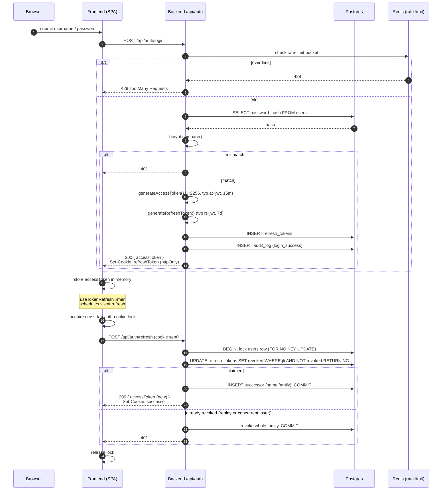
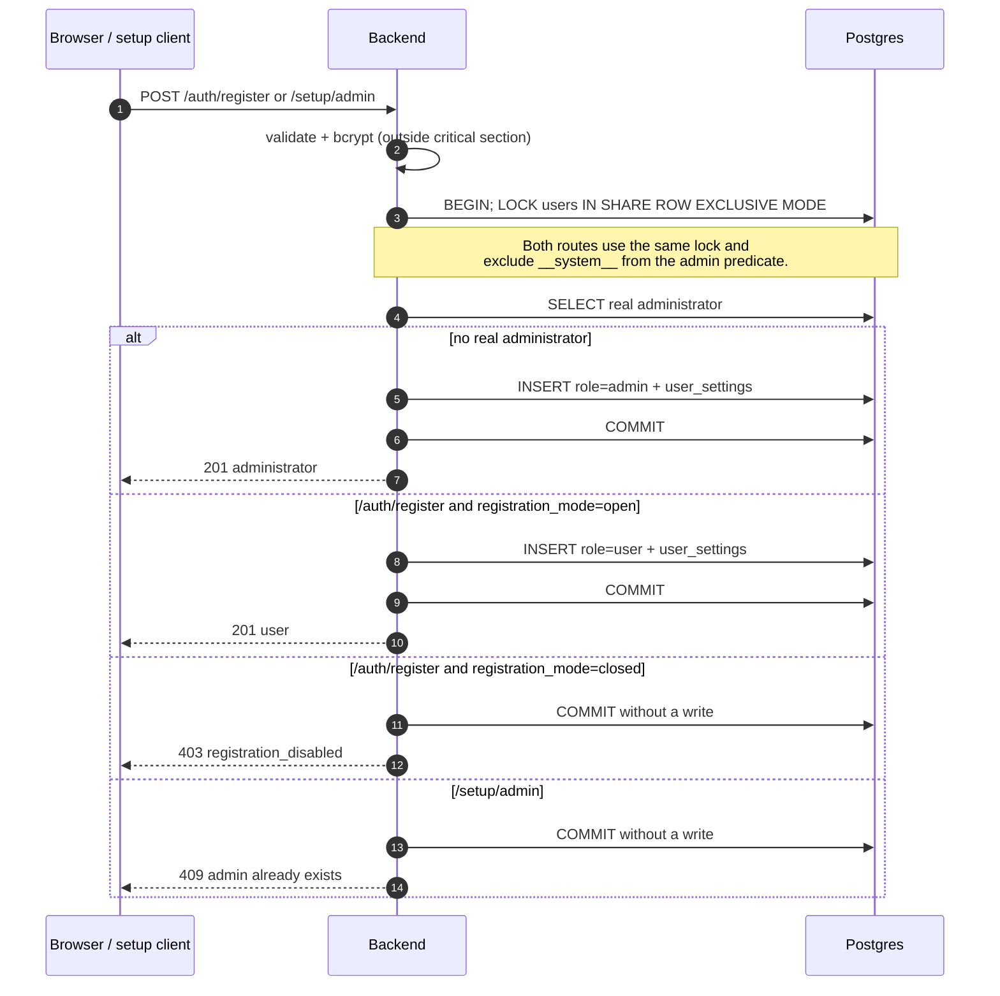
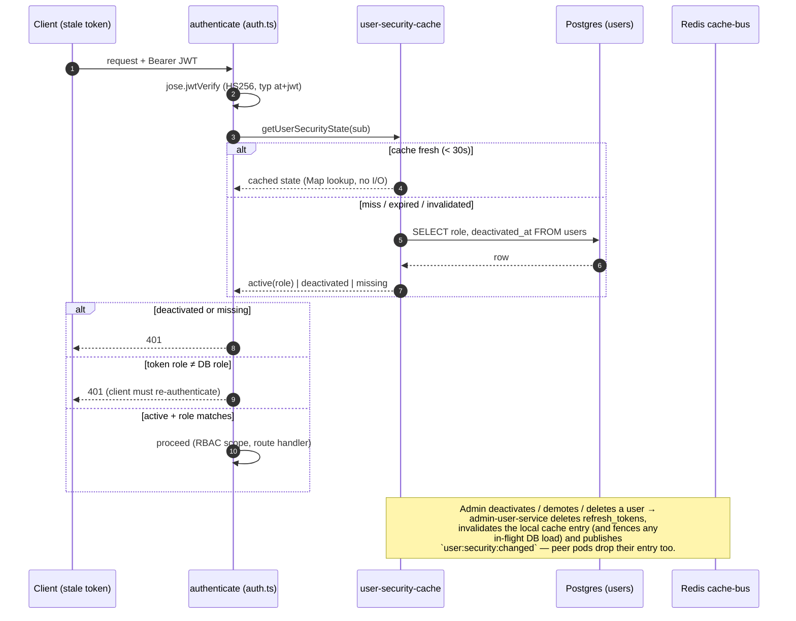
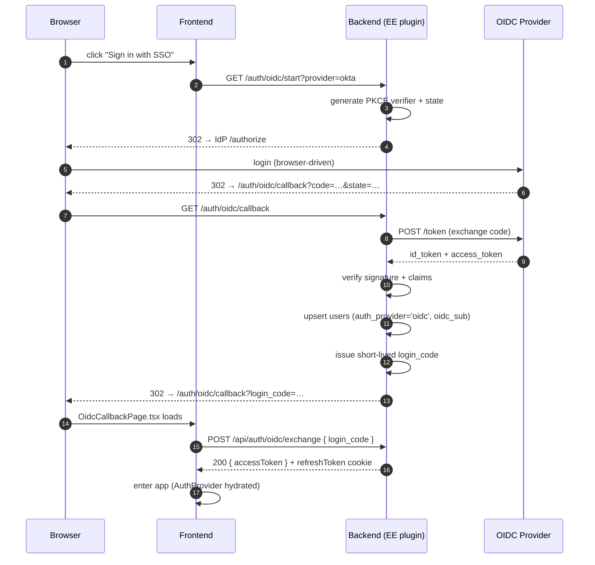

# 7. Auth & Login Flow

Compendiq supports two auth modes:

1. **Local credentials** — default in CE. Bcrypt + JWT with refresh tokens.
2. **OIDC SSO** — Enterprise Edition only, gated by
   `ENTERPRISE_FEATURES.OIDC_SSO`.

## Local login (CE + EE)

```mermaid
sequenceDiagram
    autonumber
    participant B as Browser
    participant FE as Frontend (SPA)
    participant BE as Backend /api/auth
    participant DB as Postgres
    participant RL as Redis (rate-limit)

    B->>FE: submit username / password
    FE->>BE: POST /api/auth/login
    BE->>RL: check rate-limit bucket
    alt over limit
        RL-->>BE: 429
        BE-->>FE: 429 Too Many Requests
    else ok
        BE->>DB: SELECT password_hash FROM users
        DB-->>BE: hash
        BE->>BE: bcrypt.compare()
        alt mismatch
            BE-->>FE: 401
        else match
            BE->>BE: generateAccessToken() (HS256, typ at+jwt, 15m)
            BE->>BE: generateRefreshToken() (typ rt+jwt, 7d)
            BE->>DB: INSERT refresh_tokens
            BE->>DB: INSERT audit_log (login_success)
            BE-->>FE: 200 { accessToken }<br/>Set-Cookie: refreshToken (httpOnly)
        end
    end

    FE->>FE: store accessToken in memory
    Note over FE: useTokenRefreshTimer<br/>schedules silent refresh
    FE->>FE: acquire cross-tab auth-cookie lock
    FE->>BE: POST /api/auth/refresh (cookie sent)
    BE->>DB: BEGIN, lock users row (FOR NO KEY UPDATE)
    BE->>DB: UPDATE refresh_tokens SET revoked WHERE jti AND NOT revoked RETURNING
    alt claimed
        BE->>DB: INSERT successor (same family), COMMIT
        BE-->>FE: 200 { accessToken (new) }<br/>Set-Cookie: successor
    else already revoked (replay or concurrent loser)
        BE->>DB: revoke whole family, COMMIT
        BE-->>FE: 401
    end
    FE->>FE: release lock
```

### Token purpose (access vs refresh)

Access and refresh JWTs are both HS256 with `JWT_SECRET` and issuer
`compendiq`, so the signature alone cannot tell them apart. Each carries its
purpose in the signed `typ` header (RFC 8725 §3.11 explicit typing):

| Token | `typ` | Accepted by |
|-------|-------|-------------|
| Access | `at+jwt` (RFC 9068) | `verifyToken()` only |
| Refresh | `rt+jwt` | `decodeRefreshToken()` only (rotation, logout) |

- `verifyToken()` is the one bearer verifier: `fastify.authenticate`, the
  collaboration socket's `authenticateSocket` (subprotocol or `Authorization`)
  and the logout route's bearer lookup all go through it, and it requires
  `typ: at+jwt`. A refresh token — live or already revoked — therefore never
  authenticates as a bearer. This matters because the bearer path never reads
  `refresh_tokens`: before the marker, a refresh JWT revoked by logout still
  worked as a 7-day bearer token.
- The refresh decoder requires `typ: rt+jwt` plus `jti` and `family`, so an
  access token presented as the `kb_refresh` cookie gets `401`, and so does
  any refresh token minted before the marker (#1683).
- Tokens issued before the marker are rejected on both paths. An unmarked
  access token's `401` makes the SPA try a refresh, and that refresh also
  gets `401` when the refresh cookie is unmarked, so the session ends and the
  user signs in again. Upgrading from a release without the marker therefore
  signs every user out once. During a rolling multi-instance upgrade, tokens
  issued by an old-version instance are refused by new-version instances in
  the same way until the rollout finishes.
- Any new token kind signed with `JWT_SECRET` needs its own `typ` and its own
  verifier; never verify a bearer token without `verifyToken()`.

### Refresh-token rotation (single use)

`POST /api/auth/refresh` calls `rotateRefreshToken()`, one transaction that
holds the user's row lock (`SELECT … FROM users … FOR NO KEY UPDATE`):

- The presented JTI is **claimed** with a conditional
  `UPDATE … WHERE revoked = FALSE RETURNING`, and the same-family successor is
  inserted before the same `COMMIT`. One JTI can therefore produce at most one
  successor, even under concurrent requests.
- A request whose claim finds the row already revoked — a sequential replay or
  the loser of a concurrent race — follows the reuse policy: it revokes the
  whole family in that transaction, records `SESSION_REVOKED`
  (`token_reuse_detected`) and gets `401`. There is no multi-tab grace; the
  SPA avoids self-inflicted reuse by serializing its own requests (below).
- A deactivated user's presented JTI is revoked and the request gets `401`; a
  missing user or unknown JTI gets `401`.
- Family revocation (`revokeTokenFamily`, reached from the logout path's reuse
  check), logout (`revokeAllUserTokens`), role changes and deactivation all
  serialize on the same users row — the admin paths because they `UPDATE` the
  row and delete `refresh_tokens` in one transaction. A successor therefore
  commits either before a revocation (and is revoked by it) or after it (and
  its claim finds nothing to rotate); it cannot escape while the lock is
  obtainable.
- Lock waits are bounded by `lock_timeout` 5s, statements by
  `statement_timeout` 10s, and a session transaction whose client stalls
  between statements by `idle_in_transaction_session_timeout` 10s (PostgreSQL
  then terminates it, releasing the users row and any claimed token row). A
  timeout rolls back — the cookie was not consumed — and the refresh route
  answers `503` with body `code: "refresh_busy"` instead of hanging (pg reports
  a terminated session either as the 25P03 error or, for an in-flight
  statement, a code-less connection error; the transaction helper rethrows
  whichever carries the deadline SQLSTATE). Family revocation and logout do not give up
  on a timeout (a lock wait over 5s or a statement over 10s inside the locked
  transaction): they run their `UPDATE` without the users-row lock at once, in
  its own transaction with the same 5s/10s deadlines, then once more under the
  lock. Getting the lock proves the stalled holder and every rotation queued
  ahead have finished, so their successors are revoked too. Only if that
  second lock wait also times out can such a successor survive — the exposure
  every revocation had before the lock. If the unlocked `UPDATE` timed out as
  well, nothing was revoked and the call fails with `RefreshSessionBusyError`
  (logout then answers `503`, see below).

### Client-side token refresh

The SPA keeps the access token **in memory only** — it is never written to
`localStorage` or `sessionStorage` (CWE-922). On reload / new tab it is
re-minted from the HttpOnly refresh cookie via `useSessionInit` (see below).
Only non-sensitive `user` + `isAuthenticated` are persisted. The token is
refreshed four ways, all funneling through the single-flight
`refreshAccessTokenOnce()` so concurrent requests in one tab trigger exactly
one `POST /api/auth/refresh`:

- **Scheduled** — `useTokenRefreshTimer` refreshes shortly before expiry.
- **Proactive (#965)** — `apiFetch` decodes the token's `exp` and, if it is
  already expired (or within a 5s skew), refreshes **before** sending. This
  stops a burst of concurrent queries on session resume from each round-tripping
  to a guaranteed 401 (the "401 storm").
- **Reactive** — a `401` response still triggers a refresh + retry as the
  fallback for server-side revocation / clock skew.
- **Session init (#884)** — `useSessionInit` fires once on app load when the
  user looks authenticated but has no in-memory token. Because the token is
  memory-only, this is the normal state after every reload / new tab (#1054),
  not just a migrated-key edge case. It must go through the single-flight
  helper too: in that state every mounted query also 401s and refreshes, so an
  independent refresh here would race the deduped path — the loser presents an
  already-rotated (revoked) JTI, tripping token-family reuse detection and
  logging the user out despite a valid session.

`refreshAccessTokenOnce()` resolves `null` only when the session is gone
(`401`/`403` or another non-transient answer); callers then `clearAuth()`. Only
the backend's retry-safe busy `503` (body `code: "refresh_busy"`,
`REFRESH_BUSY_CODE` in `@compendiq/contracts`) is retried, after 1s and 3s.
Each attempt takes the cross-tab lock on its own, so the lock is free during the
backoff, and each acquisition first adopts a token another tab refreshed
meanwhile. A network error, any other `5xx`, `408` or `429` is not retried —
after a lost response or a proxy error the rotation may already have
committed, and presenting the consumed cookie again would be token reuse. Both
cases reject with `RefreshUnavailableError` (an `ApiError` with status `503`).
Callers keep the session and surface that error — `apiFetch` throws it,
`useSessionInit` leaves auth as is, presence reconnects with backoff and the
collaboration socket rejoins after a pause that doubles from 1s up to 30s and
starts over at 1s once a socket connects.

#### Cross-tab auth-cookie lock

Tabs of one browser share the HttpOnly refresh cookie, and the server treats a
second presentation of a rotated cookie as reuse. Every request that presents
or replaces the cookie therefore runs under one browser-wide lock
(`withAuthCookieLock`, `shared/lib/auth-cookie-lock.ts`): refresh, login,
registration, setup-admin, OIDC exchange and logout. Only the request itself
is held, never the follow-up work, so the lock is not re-entered.

- Secure contexts use the Web Locks API, which the browser releases when a tab
  closes or navigates.
- Plain-HTTP deployments have no Web Locks, so the lock is an IndexedDB lease:
  a `readwrite` transaction on one store is serialized across the origin's
  tabs, making the check-and-take atomic. The holder renews the lease every
  5s; a lease left by a tab that died expires after 20s.
- Without either API the request runs unserialized.

A tab that waited while another tab rotated the cookie adopts the access token
that tab broadcast (below) instead of rotating again; without a broadcast it
rotates the already-updated cookie in turn.

#### Cross-tab coordination (#1054)

Token adoption and logout are propagated between tabs over an **in-memory,
same-origin `BroadcastChannel('compendiq-auth')`** — the access token is
**never** broadcast through Web Storage. When one tab refreshes/logs in, it
posts the new token to peers; on logout it posts a `logout` message that clears
in-memory auth (and, via `useClearCacheOnLogout`, the cached user data) in every
other tab. The `BroadcastChannel` is feature-guarded; where it is unavailable
the retained `localStorage` `storage` event still coordinates **logout**
(because `isAuthenticated` persists), and each tab otherwise re-mints its own
token from the refresh cookie, one tab at a time behind the auth-cookie lock.
Received messages are applied under a re-entrancy guard so a tab never echoes
a change it just received.

### Registration quirks

- `POST /api/auth/register` is rate-limited (5/min).
- **The first successful real-account registration creates an admin.** The
  migration-seeded `__system__` sentinel is not a real account and does not
  consume this bootstrap. Subsequent registrations create regular users.
- Registration and `POST /api/setup/admin` serialize the transition through
  the same transaction and users-table lock. Their sentinel-excluding
  real-admin decision, user insert, and default `user_settings` insert commit
  together, so concurrent requests cannot both create a first administrator.

```mermaid
sequenceDiagram
    autonumber
    participant C as Browser / setup client
    participant BE as Backend
    participant DB as Postgres

    C->>BE: POST /auth/register or /setup/admin
    BE->>BE: validate + bcrypt (outside critical section)
    BE->>DB: BEGIN#59; LOCK users IN SHARE ROW EXCLUSIVE MODE
    Note over BE,DB: Both routes use the same lock and<br/>exclude __system__ from the admin predicate.
    BE->>DB: SELECT real administrator
    alt no real administrator
        BE->>DB: INSERT role=admin + user_settings
        BE->>DB: COMMIT
        BE-->>C: 201 administrator
    else /auth/register and registration_mode=open
        BE->>DB: INSERT role=user + user_settings
        BE->>DB: COMMIT
        BE-->>C: 201 user
    else /auth/register and registration_mode=closed
        BE->>DB: COMMIT without a write
        BE-->>C: 403 registration_disabled
    else /setup/admin
        BE->>DB: COMMIT without a write
        BE-->>C: 409 admin already exists
    end
```

#### Registration policy (opt-in self-registration, #1051)

Self-registration after the initial account is **opt-in**, controlled by the
key-value `admin_settings.registration_mode` (`open` | `closed`). There is no
migration and no env var.

- **Default `closed`.** Once a real (non-sentinel) admin exists, an unset or
  `closed` mode makes `POST /api/auth/register` return
  `403 { error: 'registration_disabled' }`. The gate runs **before**
  `bcrypt.hash`, and the 403 is written with an explicit `reply.code(403).send`
  (not a thrown `httpError`) so the machine-readable code survives the global
  error handler's `safeErrorName` sanitisation.
- **Bootstrap is always allowed.** While no real admin exists yet, registration
  is permitted regardless of the stored mode, using the same
  sentinel-excluding predicate (`role='admin' AND id != <SYSTEM_USER_ID>`) as
  `GET /api/health/setup-status` / `POST /api/setup/admin`. The register route
  performs a cheap preflight before bcrypt, then rechecks the policy while
  holding the shared bootstrap lock. This is why a first account can always be
  created on a fresh install without allowing a raced request after setup has
  completed.
- **Admin opt-in.** Admins flip the mode via `GET/PUT /api/admin/settings`
  (`registrationMode`), surfaced under Settings → Access Control → Registration.
  Choosing `open` shows a warning that any visitor can self-register and that
  self-registered users can view/edit shared standalone pages.
- **SPA gate.** The login screen reads the public, unauthenticated
  `GET /api/auth/registration-policy` → `{ allowRegistration }` and only renders
  the signup toggle when it is `true`. The client fails **closed** (a
  fetch/parse error hides signup) and refuses to submit a disabled registration.
  The endpoint exposes only the boolean — never the raw mode nor whether an
  admin exists.

### Logout

`POST /api/auth/logout` revokes every refresh token of the identified user
under the same users-row lock as rotation (so a refresh committing at the same
moment cannot leave a live successor behind, except when the lock-timeout
fallback described under rotation times out twice), clears the cookie, and records
`audit_log(action='logout')`. The access token is short-lived enough that
blacklisting is not needed in CE; EE may add it.

If the revocation fails with `RefreshSessionBusyError` (the locked attempt and
the unlocked fallback both timed out, or a reused cookie's family revocation
did), nothing was revoked: logout answers `503` with body
`code: "logout_busy"`, keeps the cookie and leaves the tokens as they are, so
the client can retry. A cookie-only logout revokes the presented JTI as part of
the user-wide revocation; the separate single-JTI revoke runs only as a
best-effort step when that revocation fails otherwise. Every other failure
keeps the best-effort behavior: `200` and a cleared cookie. On the client,
`logoutApi()` keeps auth state on that marked `503` and rejects; the user menu
shows a "Sign-out did not complete" toast with a **Retry** action. Any other
logout failure, including an unmarked `503` from a proxy, still clears client
auth.

On the client, `useClearCacheOnLogout` (wired in `App.tsx`) wipes the
in-memory TanStack Query cache on every authenticated→unauthenticated
transition. The single SPA-scoped QueryClient would otherwise survive a
logout→relogin in the same tab and serve the next user the previous user's
cached pages, search results, and `allowed` permission results — query keys
carry no user identity (#885). A ref guard means a token refresh (`setAuth`
while still authenticated) does not drop a live session's cache; only a true
logout does.

The wipe spares exactly one query: `SETUP_STATUS_QUERY_KEY`. It describes the
deployment (`{ setupComplete, steps }`), never a user, so it falls outside what
#885 protects — and `ProtectedRoute` gates on its loading state. A blanket
`queryClient.clear()` removed it **mid-flight** on the most common expiry path
(open the app with a stale session → `useSessionInit`'s refresh 401s →
`clearAuth`): the in-flight response then arrived for a query that no longer
existed and was discarded, so `isLoading` stayed true with nothing left to
trigger a refetch. The route sat on the loading fallback forever, *above* its
own `<Navigate to="/login">`, and only a manual reload recovered. Mutation
state is still cleared outright.

Local (non-collaborative) editor drafts live in `localStorage`, which every
account signing in to the same browser shares, so they are scoped to the
signed-in user's id (`shared/lib/editor-drafts.ts`, GHSA-r652-53hc-h6jh) and
follow a different rule from the cache wipe. A **completed explicit sign-out**
(`logoutApi()` past the `logout_busy` check) deletes the signing-out user's
drafts plus any legacy unscoped `draft:*` key, advances a sign-out epoch and
sets a per-user signed-out marker, both kept in `localStorage` so every tab
sees them (the epoch also in memory). A pending autosave or unmount flush
captured before that epoch, for a user carrying the marker, or by a different
user than the one now signed in, is dropped instead of written, and no draft
edit starts for a marked user. In the signing-out tab this fence is
synchronous. Another tab that has not yet received the `logout` message is
fenced as soon as the epoch and marker writes are visible to it; browsers may
replicate `localStorage` asynchronously between tabs in different processes,
so a write landing in that sub-millisecond window can survive — only ever
under the signed-out user's own scope, never offered to another account. The
marker is cleared whenever that user's session is established again
(`setAuth`, on sign-in and on token refresh alike: a refresh only succeeds
while the server session is live, e.g. when the logout request never reached
the server). Any other session loss (a
refresh that finds the session gone, an expired token) keeps the user's
drafts — and still flushes the pending one into that user's scope — so the
same user can restore them after signing back in. Legacy unscoped keys are
also deleted once at app start (`main.tsx`) and are never read. The sign-out
confirmation does not warn about unsaved editor changes; a completed sign-out
discards them.

## Per-request revocation check (#737)

`authenticate` does not trust the JWT alone: after signature verification it
consults a per-user security-state cache so **deactivation, hard-delete and
role changes take effect on already-issued access tokens** instead of only at
`/login` and `/refresh`.

```mermaid
sequenceDiagram
    autonumber
    participant C as Client (stale token)
    participant BE as authenticate (auth.ts)
    participant UC as user-security-cache
    participant DB as Postgres (users)
    participant RB as Redis cache-bus

    C->>BE: request + Bearer JWT
    BE->>BE: jose.jwtVerify (HS256, typ at+jwt)
    BE->>UC: getUserSecurityState(sub)
    alt cache fresh (< 30s)
        UC-->>BE: cached state (Map lookup, no I/O)
    else miss / expired / invalidated
        UC->>DB: SELECT role, deactivated_at FROM users
        DB-->>UC: row
        UC-->>BE: active(role) | deactivated | missing
    end
    alt deactivated or missing
        BE-->>C: 401
    else token role ≠ DB role
        BE-->>C: 401 (client must re-authenticate)
    else active + role matches
        BE->>BE: proceed (RBAC scope, route handler)
    end

    Note over RB,UC: Admin deactivates / demotes / deletes a user →<br/>admin-user-service deletes refresh_tokens,<br/>invalidates the local cache entry (and fences any<br/>in-flight DB load) and publishes<br/>`user:security:changed` — peer pods drop their entry too.
```

Properties:

- **Hot-path cost**: a `Map` lookup per request; at most one indexed
  single-row `SELECT` per user per 30s window per pod
  (`USER_SECURITY_CACHE_TTL_MS`).
- **Revocation latency bound**: immediate on the pod that handled the admin
  action and on every pod subscribed to the cache-bus; ≤ 30s on pods without
  a working bus (single-pod soft-fail mode). Invalidation bumps a per-user
  generation that fences in-flight loads: a `SELECT` that snapshotted
  pre-COMMIT state cannot re-cache the stale "active/old-role" answer after
  the invalidation ran (requests already awaiting that load may see the
  pre-mutation state once — they raced the admin action — but it is never
  cached). `ACCESS_TOKEN_EXPIRY` is capped at 24h as the absolute worst-case
  backstop; values above 24h are clamped at startup with a warning (an
  invalid format still fails startup).
- **Role change = privilege boundary**: `updateUser` revokes all refresh
  tokens (mirroring deactivation), so a demoted admin cannot refresh back to
  an admin token — they must log in again.
- **Soft-fail**: if the `users` lookup fails and nothing is cached, the
  request proceeds on the token claims (pre-#737 behaviour) so a transient DB
  blip cannot 401 every session.

## OIDC flow (Enterprise Edition)

Routes registered only when the EE plugin is loaded **and**
`ENTERPRISE_FEATURES.OIDC_SSO` is enabled in the loaded license.

```mermaid
sequenceDiagram
    autonumber
    participant B as Browser
    participant FE as Frontend
    participant BE as Backend (EE plugin)
    participant IDP as OIDC Provider

    B->>FE: click "Sign in with SSO"
    FE->>BE: GET /auth/oidc/start?provider=okta
    BE->>BE: generate PKCE verifier + state
    BE-->>B: 302 → IdP /authorize
    B->>IDP: login (browser-driven)
    IDP-->>B: 302 → /auth/oidc/callback?code=…&state=…
    B->>BE: GET /auth/oidc/callback
    BE->>IDP: POST /token (exchange code)
    IDP-->>BE: id_token + access_token
    BE->>BE: verify signature + claims
    BE->>BE: upsert users (auth_provider='oidc', oidc_sub)
    BE->>BE: issue short-lived login_code
    BE-->>B: 302 → /auth/oidc/callback?login_code=…
    B->>FE: OidcCallbackPage.tsx loads
    FE->>BE: POST /api/auth/oidc/exchange { login_code }
    BE-->>FE: 200 { accessToken } + refreshToken cookie
    FE->>FE: enter app (AuthProvider hydrated)
```

Why the extra hop via a `login_code`? It keeps tokens out of the URL
fragment that the browser exposes to history/referer. The callback page
posts to a JSON endpoint and only then receives the real JWT.

### Deciding whether to offer the SSO button

Before any of the above, the login page probes `GET /api/auth/oidc/config`.
CE answers with a static `{ enabled: false, enterpriseRequired: true }` stub
(`app.ts`, community mode only); EE answers from the `oidc_providers` table
plus the license. The button renders when `enabled && !enterpriseRequired`.

The probe outcome must not be collapsed to "config or null" (`OidcProbe` in
`login/sso-notice.ts` — same rule as the `vision` tri-state on the AI
composers):

| Outcome | Login page |
|---------|-----------|
| `pending` (first probe of the page load) | nothing yet |
| `ready`, `enabled` | SSO button + "or continue with credentials" divider |
| `ready`, not enabled | nothing — SSO is genuinely off here |
| `failed`, `retrying: false` (5xx / network / rate-limit / parse) | unavailable notice with a **Check again** trigger |
| `failed`, `retrying: true` | the *same* notice, trigger `aria-disabled` + `aria-busy` |

A failed probe is *not* "SSO is disabled". nginx proxies all of `/api/` to one
upstream, so a backend that is down or restarting returns 502 for this route —
and swallowing that into a hidden button removes the only sign-in path on an
SSO-only deployment while looking exactly like the button having been deleted.

**Check again** re-runs all three of the page's probes, not just the SSO one —
they died with the same upstream. The presentation config carries the layout
variant and the edition badge; the registration policy fails closed, so a
deployment that allows sign-up would otherwise keep hiding its own "Create
one" link until the user reloaded. Each probe drops responses from a
superseded generation, so a slow answer landing after a newer one cannot undo
it in either direction. No reload is needed.

### Why the notice is built the way it is

Every one of these exists because the obvious alternative breaks something.
None of them are stylistic.

- **A recheck stays in `failed`** rather than returning to `pending`. Dropping
  to `pending` unmounts the notice together with the trigger the user just
  pressed: focus lands on `<body>`, and the hanging-upstream case this notice
  exists for shows an empty panel that reads as success.
- **The trigger is `aria-disabled`, not `disabled`.** A genuinely disabled
  control is blurred by the browser and leaves the tab order — dropping the
  focus of the user who just pressed it, which is the failure above by another
  route. The click handler is detached instead.
- **Focus restore keys off the notice going away, not the SSO button
  arriving.** Those are not the same condition: a recheck that settles on "SSO
  is genuinely off" also collapses the notice, and on CE that is the *only*
  outcome a recovered backend can produce (`app.ts` serves a fixed
  `enabled: false` stub in community mode). Focus moves to whichever control
  replaced the trigger — the SSO button, or else the username field — and only
  when `document.activeElement` is still `<body>`, so a user who moved to a
  form field meanwhile keeps it.
- **Nothing is announced when the notice resolves.** The region speaks the
  failure once; a "recovered" announcement would contradict the rule above for
  no gain. During a recheck the focused trigger is itself the feedback surface
  (its accessible name becomes "Checking…" while `aria-busy` and
  `aria-disabled` flip on the node the screen-reader cursor is on), and the
  focus move is what confirms the outcome.
- **The recheck flag and the live region live in `LoginPage`, not the panel.**
  `ChangeDeskLogin` and `LocalLoopLogin` are different component types, so the
  first successful presentation-config read *remounts the whole panel*. Anything
  inside it is destroyed mid-recheck.
- **The live region waits for the attribution signal.** The two probes settle
  independently, so announcing on the first would say "Cannot reach the server"
  and contradict it a few frames later. The visible heading does refine in
  place — the weaker true statement then the stronger one is honest on screen —
  but a screen reader cannot retract what it has already said.
- **Which failure gets named** is that attribution signal.
  `GET /api/auth/login-page-config` is an unrelated core route on the same
  upstream, so losing it too means nothing responded and the notice says
  *"Cannot reach the server"* instead of blaming SSO. It matters most on CE,
  where SSO does not exist at all and an SSO-shaped error is pure noise. That
  wording also drops the "you can still sign in with credentials" reassurance:
  the credential form posts to the same dead upstream.

## Where this lives

| Concern | File |
|---------|------|
| JWT plugin, decorators | `backend/src/core/plugins/auth.ts` |
| Per-user security-state cache (#737) | `backend/src/core/services/user-security-cache.ts` |
| Refresh-token revocation on deactivate / role change | `backend/src/core/services/admin-user-service.ts` |
| Routes (register / login / refresh / logout) | `backend/src/routes/foundation/auth.ts` |
| OIDC routes (EE only) | `@compendiq/enterprise` (loaded via `core/enterprise/loader.ts`) |
| Frontend session init | `frontend/src/shared/hooks/useSessionInit.ts` |
| Refresh timer | `frontend/src/shared/hooks/useTokenRefreshTimer.ts` |
| API client (single-flight + proactive/reactive refresh) | `frontend/src/shared/lib/api.ts` |
| Cross-tab auth-cookie lock (Web Locks / IndexedDB lease) | `frontend/src/shared/lib/auth-cookie-lock.ts` |
| OIDC callback UI | `frontend/src/features/auth/OidcCallbackPage.tsx` |
| OIDC admin config UI | `frontend/src/features/admin/OidcSettingsPage.tsx` |
| SSO probe tri-state + notice copy (visible and announced) | `frontend/src/features/settings/login/sso-notice.ts` |
| Unavailable notice + focus restore | `frontend/src/features/settings/login/AuthPanel.tsx` |
| Probe generations, combined recheck, live region | `frontend/src/features/settings/LoginPage.tsx` |
| Public login presentation (variant + edition badge) | `backend/src/routes/foundation/login-page-config.ts` |
