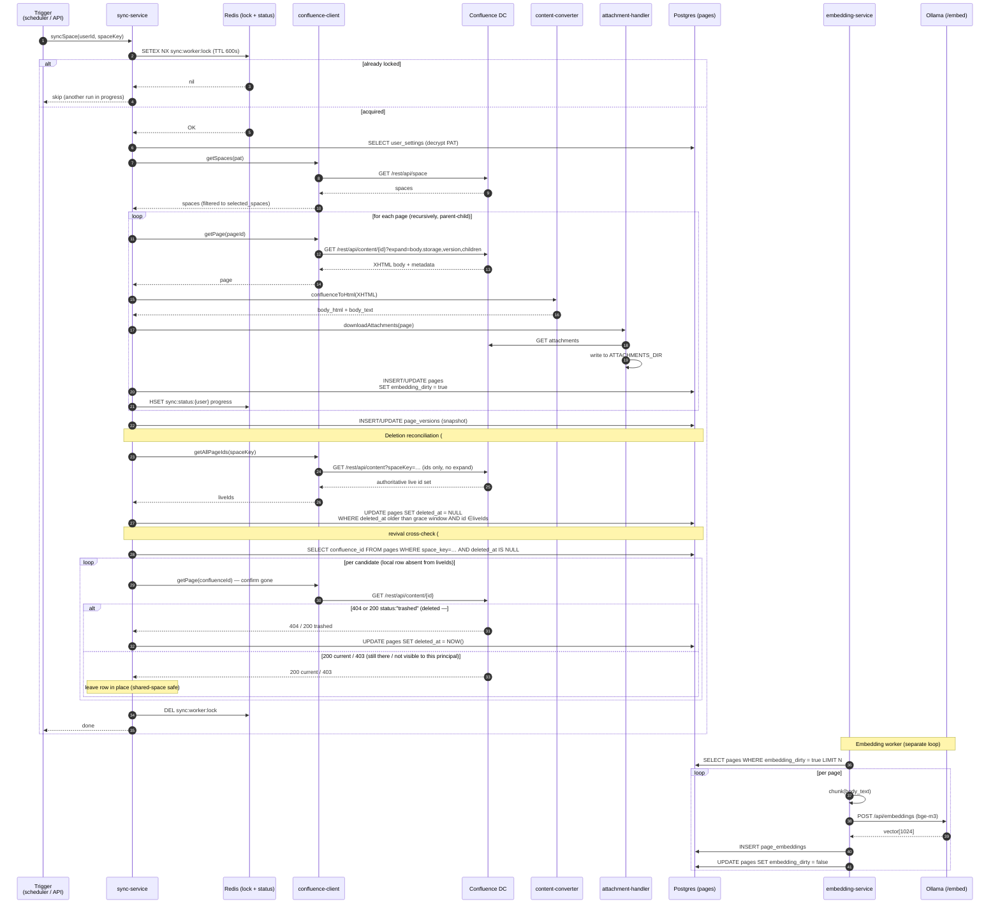
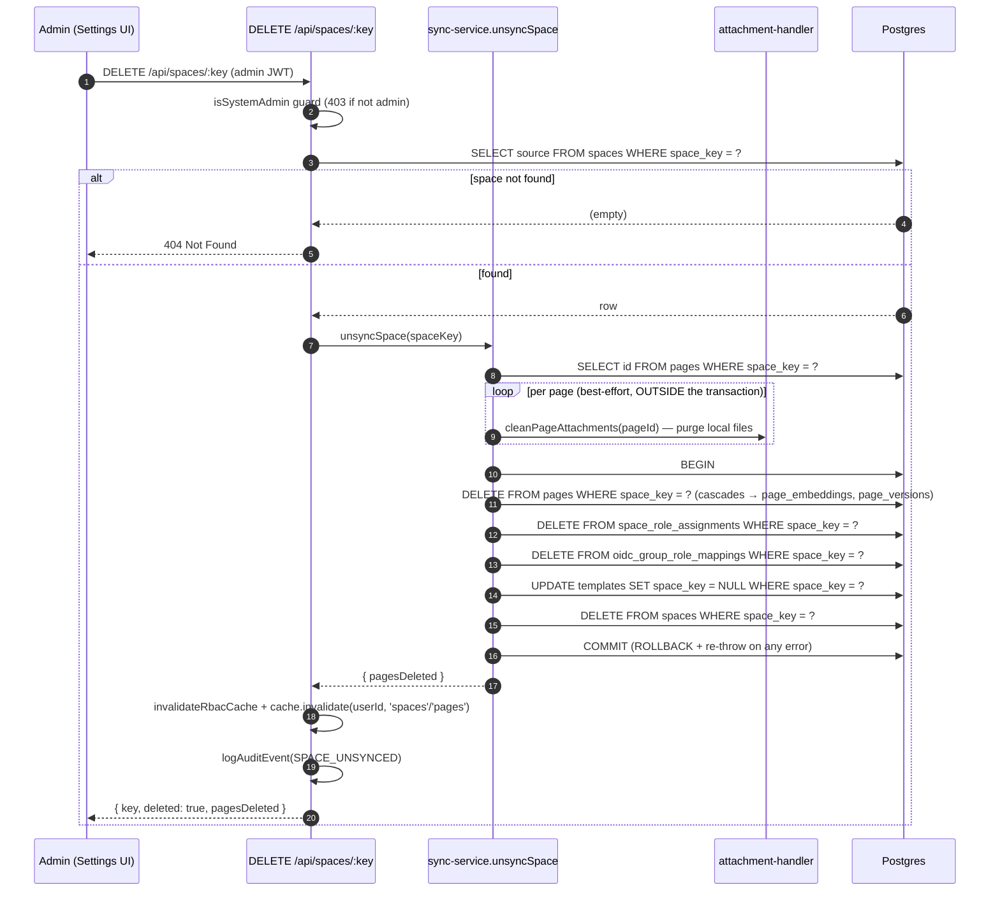

# 8. Confluence Sync Flow

End-to-end flow for pulling a user's selected Confluence spaces into the
local Postgres + pgvector store. Triggered either manually
(`POST /api/confluence/sync/:spaceKey`) or automatically by the in-process
sync scheduler.

## Sequence

## Triggers

| Trigger | Source | Cadence |
|---------|--------|---------|
| Manual sync | `POST /api/confluence/sync/:spaceKey` | on demand |
| Scheduled sync | In-process sync scheduler in `backend/src/index.ts` (`startQueueWorkers`) | every `SYNC_INTERVAL_MIN` (default 15 min) |
| Webhook (future) | not yet implemented | — |

## Concurrency & safety

- **Redis lock (`sync:worker:lock`)** — single active sync per instance;
  TTL acts as a dead-man's switch.
- **Per-user PAT scope** — each sync decrypts the PAT just-in-time, uses it
  for the duration of the run, and never logs it.
- **SSRF guard** — `confluence-client` uses the shared SSRF guard from
  `core/utils/ssrf-guard.ts` to reject URLs pointing at loopback / link-local
  / metadata IPs. Each user-configured Confluence URL is added to a
  per-pod allowlist; mutations (add / remove via Settings → Confluence or
  LLM provider CRUD) are broadcast across pods over Redis pub/sub
  (`ssrf:allowlist:changed`) via `core/services/ssrf-allowlist-bus.ts` so
  multi-pod deployments stay coherent (issue #306).
- **TLS** — respects `CONFLUENCE_VERIFY_SSL` (default `true`) and
  `NODE_EXTRA_CA_CERTS` for self-signed internal CAs.
- **Idempotency** — upsert by `(user_id, confluence_id)`. `version` column
  is written from Confluence's own version counter; no double-writes.
- **Circuit breaker** — `core/services/circuit-breaker.ts` protects against
  runaway failure against a broken Confluence instance.
- **Per-page failure isolation (#822)** — the per-page loop in `syncSpace`
  wraps each `syncPage` in try/catch: a page deleted or restricted between the
  space listing and its `getPage` (404/403), or content that throws during
  conversion, is logged, counted (`pagesFailed`), and skipped so the remaining
  pages, deletion reconciliation, and the space `last_synced` update still run.
  Only a connection-fatal `ConfluenceError` (401 — revoked/expired PAT) rethrows
  to abort the whole run fast rather than grinding through every page.

## Deletion reconciliation (#706)

Pages removed in Confluence are reflected locally by `detectDeletedPages`, which
runs on **every** sync — incremental as well as the ≥24h full sync — so deletions
surface within a normal sync cycle rather than lingering until a rare full run.

- **Bounded cost.** The authoritative live id set comes from a dedicated cheap
  listing (`getAllPageIds`: ids only, no `expand`), so a candidate set is derived
  by set difference rather than re-fetching every page. The incremental
  modified-pages list can't be used for this — it only holds pages that changed.
- **Shared-space safety.** A page absent from one principal's listing is *not*
  assumed deleted (it may simply be restricted from that user). Each candidate is
  confirmed gone via a direct `GET /content/{id}` — a **404** *or* a **200 with
  `status: "trashed"`** — before its row is soft-deleted; a `200` (`current`) / `403`
  leaves the row untouched, so one user's restricted view can no longer nuke pages
  others can still see. The number of confirmation fetches per run is capped
  (`MAX_DELETION_CONFIRMATIONS`); a larger candidate set is deferred to a later run
  (the whole run defers — zero soft-deletes that cycle).
- **Trash counts as deleted (#766).** Confluence DC's `DELETE /rest/api/content/{id}`
  on a current page moves it to the space **Trash** rather than purging it, and —
  depending on the DC version — `GET /content/{id}` may still answer `200` with
  `status: "trashed"` instead of 404. #719 originally treated such a page as *still
  present*, which meant pages deleted via Compendiq's **own Delete button** (which
  trashes upstream) were never reconciled if a post-delete local failure left a row
  behind. Reconciliation now treats `trashed` as gone: trashed content is already
  absent from the live listing (only `current` content is listed), so a trashed
  confirmation can only mean "deleted", never "restricted from this principal".
  Restorability is preserved on the Compendiq side: the local row is *soft*-deleted
  and survives (hidden) for 30 days before `purgeDeletedPages` — mirroring the
  Confluence trash's own recoverability — and a page restored from the Confluence
  trash is revived locally by the reconciliation revival cross-check (below).
- **Revival cross-check (#766 review).** Restoring a page from the Confluence trash
  creates **no new version** (`lastmodified` is unchanged), so the incremental
  sync's `lastmodified >=` CQL window never re-upserts it — the upsert path
  (`deleted_at = NULL` on `ON CONFLICT … DO UPDATE`) revives a row only when the
  page is *also modified upstream* or a full sync (≥24h-stale `last_synced`) runs.
  `detectDeletedPages` therefore cross-checks the already-fetched live id listing
  against locally soft-deleted rows for the space and clears `deleted_at` for
  matches, so a trash-restore converges within one reconciliation cycle.
  **Grace window**: the delete routes record their delete *intent* as a soft-delete
  *before* calling Confluence — until that upstream DELETE lands, the page is still
  in the live listing, and a concurrent reconciliation would otherwise resurrect a
  row that is mid-delete. Only rows whose `deleted_at` is older than
  `REVIVAL_GRACE_SECONDS` (15 min — far above the Confluence client's 30–120s HTTP
  timeouts) are revived; a genuine trash-restore is unaffected because its row was
  soft-deleted in an earlier cycle, so the grace has long elapsed.
- **Per-cycle fan-out.** Reconciliation is invoked once per (user × space); a shared
  space would otherwise repeat the listing + confirmation fetches per user each cycle.
  A best-effort Redis `SET NX EX` guard (`sync:reconcile:{spaceKey}`) lets the first
  run per space claim the cycle and the rest skip. It fails open when Redis is absent
  (runs per-user, as before) and can only narrow work — a true deletion is 404 for
  every principal, so whoever reaches the space first reconciles it.
- **Soft delete + purge.** Reconciled rows are soft-deleted (`deleted_at`), then
  hard-purged after 30 days by `purgeDeletedPages`. A subsequent re-appearance in
  Confluence revives the row via the reconciliation revival cross-check above;
  `syncPage`'s upsert `ON CONFLICT … DO UPDATE` (and the version-mismatch update
  path) also set `deleted_at = NULL`, but only fire when the page is modified
  upstream or a full sync runs. **Purge re-confirms before the point of no
  return (#766 review)**: purge irreversibly destroys the row and all local
  enrichment (embeddings, version history via FK cascade), so each candidate is
  re-confirmed gone upstream (`GET /content/{id}` → 404 or `status: "trashed"`)
  first. A `200 current` answer skips the purge (the page exists upstream — left
  for reconciliation); an inconclusive answer (403/5xx/network) defers to a later
  cycle. Confirmations are capped at `MAX_DELETION_CONFIRMATIONS` per run, oldest
  first; a larger backlog converges over subsequent cycles.

The same 404-tolerance applies to **user-initiated delete** (`DELETE /api/pages/:id`
and the bulk path): if Confluence answers 404 the remote page is already gone, so
local cleanup proceeds and the delete succeeds instead of failing with
"Resource not found". Any non-404 error still surfaces (no silent data loss).

### User-initiated delete ordering (#766)

The delete routes used to call Confluence first and then run several separate
local statements with no transaction — any post-upstream failure stranded a
**live** local row whose Confluence counterpart was already gone, and nothing
converged it. The routes now order the work so the two stores can never diverge
visibly:

1. **Record the delete intent locally first** — soft-delete the row
   (`deleted_at = NOW()`, one atomic UPDATE). Every user-facing query filters
   `deleted_at IS NULL`, so the article disappears immediately.
2. **Call Confluence** (`DELETE /rest/api/content/{id}` — irreversible; trashes
   the page upstream).
3. **On upstream success or 404** — finish the hard local cleanup
   (`pinned_pages` + `pages`; embeddings/versions cascade via FK) inside **one**
   `BEGIN…COMMIT` on a dedicated pool client. Attachment files are cleaned
   best-effort after commit (filesystem can't join the transaction).
4. **On upstream failure (non-404)** — clear the soft-delete (only if this
   request set it) and surface the error: **neither side changed**.

Failure containment: a crash between 1 and 2 leaves a hidden row for a page
that still exists upstream — the reconciliation revival cross-check restores it
once the soft-delete is older than the grace window (the sync upsert would also
restore it, but only if the page is modified upstream or a full sync runs).
A local failure after a successful upstream delete leaves at worst a hidden
soft-deleted row that `purgeDeletedPages` removes within the standard 30-day
window — never a live orphan. The bulk path applies the same shape per batch
(intent for all candidates up front, per-page restore for upstream failures,
one cleanup transaction for the upstream-deleted set).

## Version history backfill (#722/#724)

Confluence version metadata (edit time, author, commit message) is not fetched
during the regular sync — only the latest body and version number are written.
Full version list import is **lazy-on-open**: when a user opens the Version History
dialog, `GET /api/pages/:id/versions` calls `backfillVersionHistory` which hits
`GET /rest/experimental/content/{id}/version?expand=by,message` and upserts each row
into `page_versions` via `upsertVersionMetadata` (idempotent ON CONFLICT DO UPDATE
with COALESCE). The experimental path is the only one Confluence **Data Center**
serves for the version list — on DC, `/rest/api/content/{id}/version` has no GET
collection (only DELETE of a single version), which used to 404 every backfill and
collapse the dialog to just the current version (#780). A 404/405 on the
experimental path falls back to the Cloud-style stable path for forward
compatibility; whichever path answers is reused for the remaining pagination pages. The historical body (`body_html`) for each old version is fetched even
more lazily — only when a user previews or compares that specific version
(`GET /api/pages/:id/versions/:version` triggers `getHistoricalBody` when
`body_html IS NULL`). Both calls are best-effort: failures never fail the request,
so the dialog still opens. Since #763 the list endpoint additionally reports the
backfill outcome as `backfillStatus` (`ok` | `skipped_no_credentials` | `failed`,
plus a human-readable `backfillDetail`) so the UI can distinguish a complete
history from one whose Confluence import never ran (viewer has no stored PAT —
backfill uses the *viewing user's* credentials via `getClientForUser`) or failed.
For `failed`, the `backfillDetail` wording further distinguishes a client-construction
failure (stored credentials unusable, e.g. PAT decryption error — Confluence was
never contacted) from a failed Confluence import call; for the latter the underlying
Confluence error message is appended (whitespace-collapsed and truncated to ~200 chars
for the dialog) so it still shows *why* the import failed (#780).
The field is omitted for standalone pages, where no Confluence backfill applies.

The `edited_at` column holds the real Confluence edit timestamp; the existing
`synced_at` column records when Compendiq last ingested the row. The frontend
shows `edited_at` directly when present, and falls back to "Synced <syncedAt>"
to make clear the displayed time is a sync time, not the author's edit time (#724).

## Space unsync / removal (#721)

An admin can permanently remove a synced Confluence space from the local store via
`DELETE /api/spaces/:key`. The operation is **local-only** — it never contacts
Confluence. Sequence:

Key properties:

- **Admin-gated** — `isSystemAdmin` check enforces system-admin role; non-admins receive 403.
- **Read-only against Confluence** — nothing is written or deleted in Confluence DC.
- **Atomic** — all row deletes/updates run inside a single `BEGIN…COMMIT` on one
  pooled client (same pattern as `postgres.ts`). On any error we `ROLLBACK` and
  re-throw, so a crash mid-purge can never leave a space half-removed.
- **Cascade** — `DELETE FROM pages` cascades to `page_embeddings` and `page_versions` via FK `ON DELETE CASCADE` (migration 030).
- **Orphan reconciliation** — several tables reference a space by plain `space_key`
  with **no** foreign key, so they survive the cascade. Within the same transaction
  `unsyncSpace` reconciles them so nothing dangles:
  - `space_role_assignments` (RBAC; also encodes the sync selection since
    `user_space_selections` was migrated into it and **dropped** in migration 040) —
    **DELETE** rows for the space.
  - `oidc_group_role_mappings` (OIDC group→space RBAC mapping, `space_key` nullable) —
    **DELETE** rows whose `space_key` matches; rows with `space_key IS NULL` are global
    and left untouched.
  - `templates` (may hold **user-authored** content, `space_key` nullable per
    migration 032) — **NULL the `space_key` (detach)** rather than delete, so
    unsyncing a space never silently destroys user work. The artifact is
    retained, just unscoped.
- **Attachment cleanup** — `cleanPageAttachments` is best-effort and runs per page
  **before/outside** the DB transaction; filesystem deletes can't be rolled back, so a
  cleanup failure is logged, never fatal, and never aborts the transaction. Worst case
  is a few orphaned files (preferable to dangling DB rows), swept again on re-run.
- **Audit** — every removal emits a `SPACE_UNSYNCED` audit event.
- **RBAC invalidation** — both the in-process RBAC cache and the per-user query cache are flushed so subsequent requests reflect the removal immediately.

## Spaces tab selection and `getSelectedSyncSpaces` (#721)

`GET /api/settings` previously returned `selectedSpaces` via `getUserAccessibleSpaces`,
which for system admins returned **all** spaces (not just those explicitly assigned via
editor role). From #721 onward, the settings endpoint calls `getSelectedSyncSpaces`
instead, which returns only spaces where the requesting user holds an explicit **editor**
role assignment (`space_role_assignments JOIN roles WHERE roles.name = 'editor'`).

This means the Spaces tab always reflects the admin's deliberate sync selection,
not the implicit "can see everything" fallback, and the Remove action correctly
removes a space from that selection.

**Write-side guard (#815).** When `PUT /api/settings` self-assigns the editor role
for the submitted `selectedSpaces`, it first intersects them against the spaces
reachable by the caller's **own** Confluence PAT (`getClientForUser().getAllSpaces()`,
the same set the picker `GET /api/spaces/available` offers). Keys the caller's PAT
cannot see are rejected (`403`), and a request with no configured PAT is rejected
(`400`). Without this check any authenticated user could insert an editor
`space_role_assignments` row for an arbitrary space and thereby read every
already-synced page in it, since `getUserAccessibleSpaces` derives a non-admin's
readable spaces solely from those rows. Deselection (an empty set, handled by the
DELETE path) is always safe and skips the PAT lookup. Cross-user space grants remain
the exclusive domain of the admin-managed RBAC routes.

## Sync-overview read path (#887)

`GET /api/settings/sync-overview` (`getSyncOverview`) reports, per accessible
space, how many expected image / draw.io assets are cached on disk. It once
re-derived each page's expected filenames from raw XHTML on every request — the
overview query materialised the whole corpus's `body_storage` and then JSDOM-
parsed each body twice (`extractImageReferences` + `extractDrawioDiagramNames`),
so an admin on a large instance blocked the event loop for tens of seconds per
poll. Those filename sets are a pure function of `body_storage` + `space_key`, so
they are now persisted on `pages.expected_image_files` / `expected_drawio_files`
(migration 081) and reset to NULL by the `pages_expected_assets_invalidate`
BEFORE UPDATE trigger whenever `body_storage` changes. The overview query selects
the cached arrays instead of `body_storage`; a bounded (200/batch) lazy backfill
recomputes and persists only the still-NULL rows (legacy pages, or pages just
invalidated by a sync/edit) using the same extractors in that rare path. The
per-page `fs.access` cache checks stay at read time (attachment downloads change
cache state independently of page sync). The `SyncOverviewResponse` contract is
unchanged, so the frontend needs no change.

## Content pipeline hand-off

The `confluenceToHtml()` call produces `body_html` and `body_text`. The
same page is later converted to Markdown *at query time* when sent to the
LLM. See [`11-content-pipeline.md`](./11-content-pipeline.md).

## Key files

- `backend/src/domains/confluence/services/sync-service.ts` — `syncSpace`, `unsyncSpace`, `purgeDeletedPages`
- `backend/src/domains/confluence/services/confluence-client.ts`
- `backend/src/domains/confluence/services/attachment-handler.ts`
- `backend/src/domains/confluence/services/sync-overview-service.ts`
- `backend/src/domains/llm/services/embedding-service.ts`
- `backend/src/routes/confluence/sync.ts`
- `backend/src/routes/confluence/spaces.ts` — `DELETE /api/spaces/:key` (unsync)
- `backend/src/core/services/rbac-service.ts` — `getSelectedSyncSpaces` (explicit editor assignments)
- `frontend/src/features/settings/SpacesTab.tsx` — Remove action + empty-save guard
