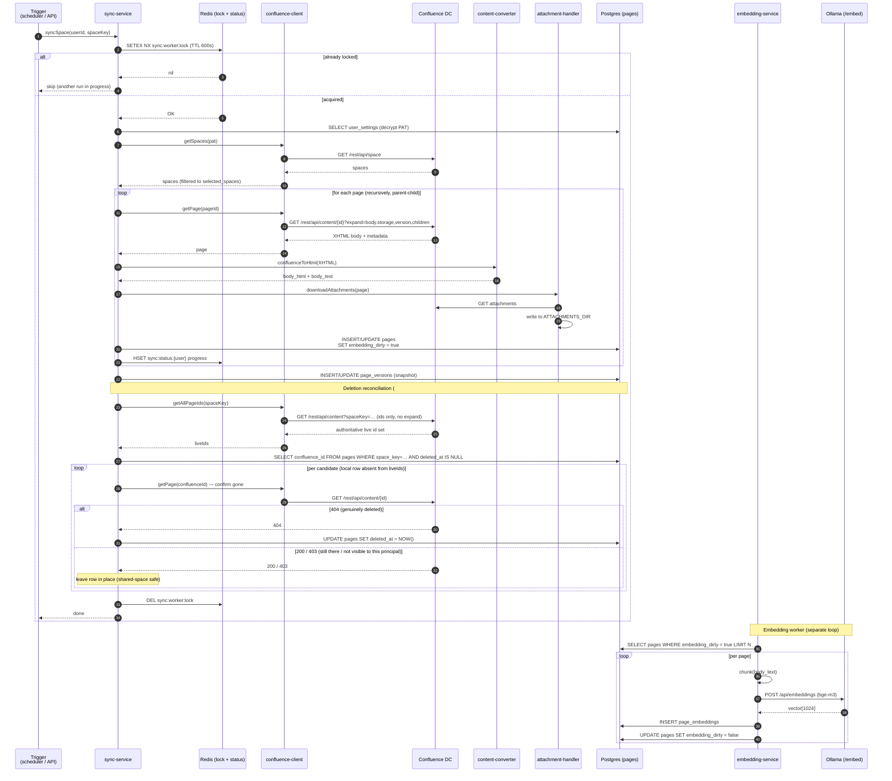

# 8. Confluence Sync Flow

End-to-end flow for pulling a user's selected Confluence spaces into the
local Postgres + pgvector store. Triggered either manually
(`POST /api/confluence/sync/:spaceKey`) or automatically by the in-process
sync scheduler.

## Sequence

## Triggers

| Trigger | Source | Cadence |
|---------|--------|---------|
| Manual sync | `POST /api/confluence/sync/:spaceKey` | on demand |
| Scheduled sync | In-process sync scheduler in `backend/src/index.ts` (`startQueueWorkers`) | every `SYNC_INTERVAL_MIN` (default 15 min) |
| Webhook (future) | not yet implemented | — |

## Concurrency & safety

- **Redis lock (`sync:worker:lock`)** — single active sync per instance;
  TTL acts as a dead-man's switch.
- **Per-user PAT scope** — each sync decrypts the PAT just-in-time, uses it
  for the duration of the run, and never logs it.
- **SSRF guard** — `confluence-client` uses the shared SSRF guard from
  `core/utils/ssrf-guard.ts` to reject URLs pointing at loopback / link-local
  / metadata IPs. Each user-configured Confluence URL is added to a
  per-pod allowlist; mutations (add / remove via Settings → Confluence or
  LLM provider CRUD) are broadcast across pods over Redis pub/sub
  (`ssrf:allowlist:changed`) via `core/services/ssrf-allowlist-bus.ts` so
  multi-pod deployments stay coherent (issue #306).
- **TLS** — respects `CONFLUENCE_VERIFY_SSL` (default `true`) and
  `NODE_EXTRA_CA_CERTS` for self-signed internal CAs.
- **Idempotency** — upsert by `(user_id, confluence_id)`. `version` column
  is written from Confluence's own version counter; no double-writes.
- **Circuit breaker** — `core/services/circuit-breaker.ts` protects against
  runaway failure against a broken Confluence instance.

## Deletion reconciliation (#706)

Pages removed in Confluence are reflected locally by `detectDeletedPages`, which
runs on **every** sync — incremental as well as the ≥24h full sync — so deletions
surface within a normal sync cycle rather than lingering until a rare full run.

- **Bounded cost.** The authoritative live id set comes from a dedicated cheap
  listing (`getAllPageIds`: ids only, no `expand`), so a candidate set is derived
  by set difference rather than re-fetching every page. The incremental
  modified-pages list can't be used for this — it only holds pages that changed.
- **Shared-space safety.** A page absent from one principal's listing is *not*
  assumed deleted (it may simply be restricted from that user). Each candidate is
  confirmed gone via a direct `GET /content/{id}` → **404** before its row is
  soft-deleted; a `200`/`403` leaves the row untouched, so one user's restricted
  view can no longer nuke pages others can still see. The number of confirmation
  fetches per run is capped (`MAX_DELETION_CONFIRMATIONS`); a larger candidate set
  is deferred to a later run (the whole run defers — zero soft-deletes that cycle).
- **Trash vs. purge.** Confluence DC move-to-trash does **not** make a page 404 —
  `GET /content/{id}` still returns `200` with `status: "trashed"`. So a page sitting
  in the Confluence trash is treated as *still present* and is **not** reconciled;
  reconciliation fires only once the page is hard-purged (then the id is gone from
  `getAllPageIds` *and* the confirmation fetch returns 404). This is intentional —
  it mirrors Confluence's own "deleted means purged" semantics and avoids removing a
  page a Confluence admin could still restore from the trash.
- **Per-cycle fan-out.** Reconciliation is invoked once per (user × space); a shared
  space would otherwise repeat the listing + confirmation fetches per user each cycle.
  A best-effort Redis `SET NX EX` guard (`sync:reconcile:{spaceKey}`) lets the first
  run per space claim the cycle and the rest skip. It fails open when Redis is absent
  (runs per-user, as before) and can only narrow work — a true deletion is 404 for
  every principal, so whoever reaches the space first reconciles it.
- **Soft delete + purge.** Reconciled rows are soft-deleted (`deleted_at`), then
  hard-purged after 30 days by `purgeDeletedPages`. A subsequent re-appearance in
  Confluence revives the row: `syncPage`'s upsert `ON CONFLICT … DO UPDATE` (and the
  version-mismatch update path) both set `deleted_at = NULL`.

The same 404-tolerance applies to **user-initiated delete** (`DELETE /api/pages/:id`
and the bulk path): if Confluence answers 404 the remote page is already gone, so
local cleanup proceeds and the delete succeeds instead of failing with
"Resource not found". Any non-404 error still surfaces (no silent data loss).

## Content pipeline hand-off

The `confluenceToHtml()` call produces `body_html` and `body_text`. The
same page is later converted to Markdown *at query time* when sent to the
LLM. See [`11-content-pipeline.md`](./11-content-pipeline.md).

## Key files

- `backend/src/domains/confluence/services/sync-service.ts`
- `backend/src/domains/confluence/services/confluence-client.ts`
- `backend/src/domains/confluence/services/attachment-handler.ts`
- `backend/src/domains/confluence/services/sync-overview-service.ts`
- `backend/src/domains/llm/services/embedding-service.ts`
- `backend/src/routes/confluence/sync.ts`
