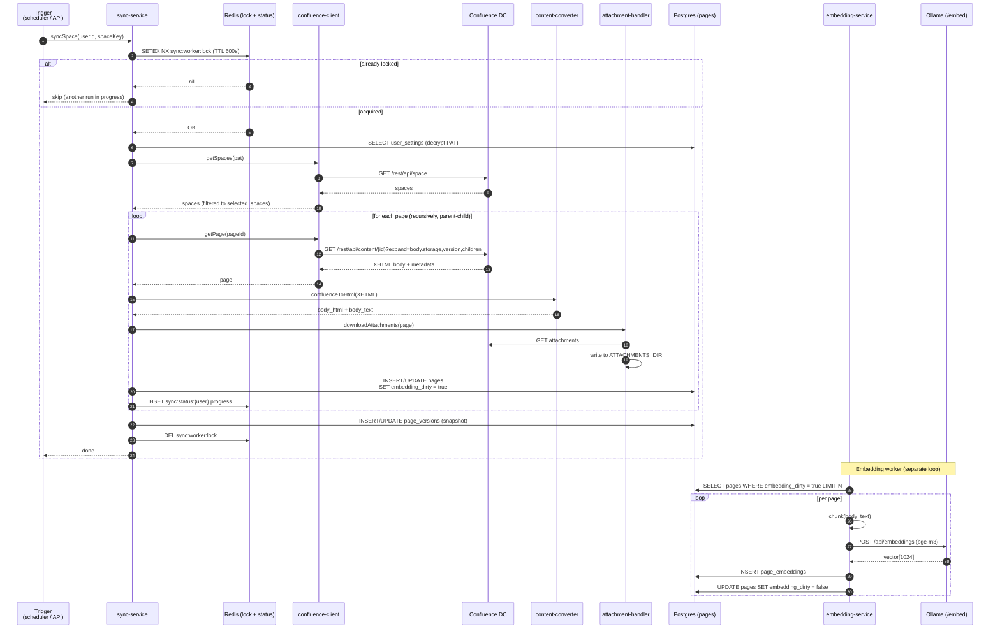

# 8. Confluence Sync Flow

End-to-end flow for pulling a user's selected Confluence spaces into the
local Postgres + pgvector store. Triggered either manually
(`POST /api/confluence/sync/:spaceKey`) or automatically by the in-process
sync scheduler.

## Sequence

## Triggers

| Trigger | Source | Cadence |
|---------|--------|---------|
| Manual sync | `POST /api/confluence/sync/:spaceKey` | on demand |
| Scheduled sync | In-process sync scheduler in `backend/src/index.ts` (`startQueueWorkers`) | every `SYNC_INTERVAL_MIN` (default 15 min) |
| Webhook (future) | not yet implemented | — |

## Concurrency & safety

- **Redis lock (`sync:worker:lock`)** — single active sync per instance;
  TTL acts as a dead-man's switch.
- **Per-user PAT scope** — each sync decrypts the PAT just-in-time, uses it
  for the duration of the run, and never logs it.
- **SSRF guard** — `confluence-client` uses the shared SSRF guard from
  `core/utils/ssrf-guard.ts` to reject URLs pointing at loopback / link-local
  / metadata IPs. Each user-configured Confluence URL is added to a
  per-pod allowlist; mutations (add / remove via Settings → Confluence or
  LLM provider CRUD) are broadcast across pods over Redis pub/sub
  (`ssrf:allowlist:changed`) via `core/services/ssrf-allowlist-bus.ts` so
  multi-pod deployments stay coherent (issue #306).
- **TLS** — respects `CONFLUENCE_VERIFY_SSL` (default `true`) and
  `NODE_EXTRA_CA_CERTS` for self-signed internal CAs.
- **Idempotency** — upsert by `(user_id, confluence_id)`. `version` column
  is written from Confluence's own version counter; no double-writes.
- **Circuit breaker** — `core/services/circuit-breaker.ts` protects against
  runaway failure against a broken Confluence instance.

## Content pipeline hand-off

The `confluenceToHtml()` call produces `body_html` and `body_text`. The
same page is later converted to Markdown *at query time* when sent to the
LLM. See [`11-content-pipeline.md`](./11-content-pipeline.md).

## Key files

- `backend/src/domains/confluence/services/sync-service.ts`
- `backend/src/domains/confluence/services/confluence-client.ts`
- `backend/src/domains/confluence/services/attachment-handler.ts`
- `backend/src/domains/confluence/services/sync-overview-service.ts`
- `backend/src/domains/llm/services/embedding-service.ts`
- `backend/src/routes/confluence/sync.ts`
