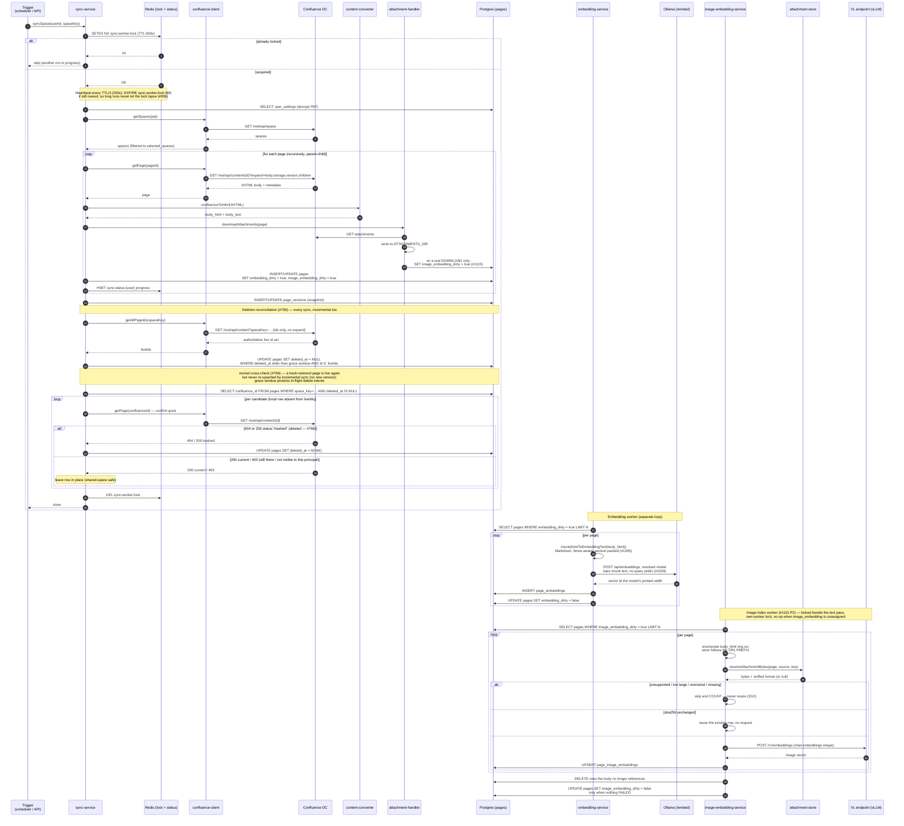
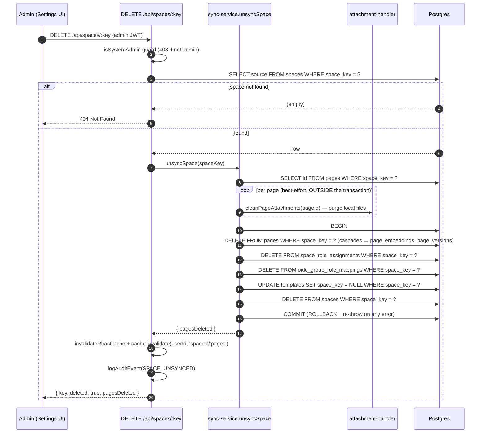

# 8. Confluence Sync Flow

End-to-end flow for pulling a user's selected Confluence spaces into the
local Postgres + pgvector store. Triggered either manually
(`POST /api/confluence/sync/:spaceKey`) or automatically by the in-process
sync scheduler.

## Sequence

```mermaid
sequenceDiagram
    autonumber
    participant T as Trigger<br/>(scheduler / API)
    participant S as sync-service
    participant R as Redis (lock + status)
    participant CL as confluence-client
    participant CF as Confluence DC
    participant CC as content-converter
    participant AH as attachment-handler
    participant DB as Postgres (pages)
    participant ES as embedding-service
    participant OL as Ollama (/embed)
    participant IW as image-embedding-service
    participant AS as attachment-store
    participant VL as VL endpoint (vLLM)

    T->>S: syncSpace(userId, spaceKey)
    S->>R: SETEX NX sync:worker:lock (TTL 600s)
    alt already locked
        R-->>S: nil
        S-->>T: skip (another run in progress)
    else acquired
        R-->>S: OK
        Note over S,R: Heartbeat every TTL/3 (200s): EXPIRE sync:worker:lock 600<br/>if still owned, so long runs never let the lock lapse (#35;906)
        S->>DB: SELECT user_settings (decrypt PAT)
        S->>CL: getSpaces(pat)
        CL->>CF: GET /rest/api/space
        CF-->>CL: spaces
        CL-->>S: spaces (filtered to selected_spaces)

        loop for each page (recursively, parent-child)
            S->>CL: getPage(pageId)
            CL->>CF: GET /rest/api/content/{id}?expand=body.storage,version,children
            CF-->>CL: XHTML body + metadata
            CL-->>S: page
            S->>CC: confluenceToHtml(XHTML)
            CC-->>S: body_html + body_text
            S->>AH: downloadAttachments(page)
            AH->>CF: GET attachments
            AH->>AH: write to ATTACHMENTS_DIR
            AH->>DB: on a real DOWNLOAD only:<br/>SET image_embedding_dirty = true (#35;1115)
            S->>DB: INSERT/UPDATE pages<br/>SET embedding_dirty = true, image_embedding_dirty = true
            S->>R: HSET sync:status:{user} progress
        end

        S->>DB: INSERT/UPDATE page_versions (snapshot)

        Note over S,DB: Deletion reconciliation (#35;706) — every sync, incremental too
        S->>CL: getAllPageIds(spaceKey)
        CL->>CF: GET /rest/api/content?spaceKey=… (ids only, no expand)
        CF-->>CL: authoritative live id set
        CL-->>S: liveIds
        S->>DB: UPDATE pages SET deleted_at = NULL<br/>WHERE deleted_at older than grace window AND id ∈ liveIds
        Note over S,DB: revival cross-check (#35;766) — a trash-restored page is live again<br/>but never re-upserted by incremental sync (no new version)#59;<br/>grace window protects in-flight delete intents
        S->>DB: SELECT confluence_id FROM pages WHERE space_key=… AND deleted_at IS NULL
        loop per candidate (local row absent from liveIds)
            S->>CL: getPage(confluenceId) — confirm gone
            CL->>CF: GET /rest/api/content/{id}
            alt 404 or 200 status:"trashed" (deleted — #35;766)
                CF-->>S: 404 / 200 trashed
                S->>DB: UPDATE pages SET deleted_at = NOW()
            else 200 current / 403 (still there / not visible to this principal)
                CF-->>S: 200 current / 403
                Note over S: leave row in place (shared-space safe)
            end
        end

        S->>R: DEL sync:worker:lock
        S-->>T: done
    end

    Note over ES,OL: Embedding worker (separate loop)
    ES->>DB: SELECT pages WHERE embedding_dirty = true LIMIT N
    loop per page
        ES->>ES: chunk(htmlToEmbeddingText(body_html))<br/>Markdown, fence-aware, section-packed (#35;1265)
        ES->>OL: POST /api/embeddings, resolved model<br/>bare chunk text, no query prefix (#35;1329)
        OL-->>ES: vector at the model's probed width
        ES->>DB: INSERT page_embeddings
        ES->>DB: UPDATE pages SET embedding_dirty = false
    end

    Note over IW,VL: Image index worker (#35;1115 P2) — kicked beside the text pass,<br/>own worker lock, no-op when image_embedding is unassigned
    IW->>DB: SELECT pages WHERE image_embedding_dirty = true LIMIT N
    loop per page
        IW->>IW: enumerate body_html img src<br/>store follows the URL PREFIX
        IW->>AS: resolveAttachmentBytes(page, source, key)
        AS-->>IW: bytes + sniffed format (or null)
        alt unsupported / too large / oversized / missing
            IW->>IW: skip and COUNT — never resize (D10)
        else sha256 unchanged
            IW->>IW: reuse the existing row, no request
        else
            IW->>VL: POST /v1/embeddings (chat-embeddings shape)
            VL-->>IW: image vector
            IW->>DB: UPSERT page_image_embeddings
        end
    end
    IW->>DB: DELETE rows the body no longer references
    IW->>DB: UPDATE pages SET image_embedding_dirty = false<br/>only when nothing FAILED
```

## Triggers

| Trigger | Source | Cadence |
|---------|--------|---------|
| Manual sync | `POST /api/confluence/sync/:spaceKey` | on demand |
| Scheduled sync | In-process sync scheduler in `backend/src/index.ts` (`startQueueWorkers`) | every `SYNC_INTERVAL_MIN` (default 15 min) |
| Webhook (future) | not yet implemented | — |

## Concurrency & safety

- **Redis lock (`sync:worker:lock`)** — single active sync per instance. The
  600s TTL acts as a dead-man's switch; while a run is in flight an
  ownership-checked heartbeat re-`EXPIRE`s the key every TTL/3 (200s) so a sync
  that outlasts one TTL can't lapse and admit a second concurrent worker
  (#906). The heartbeat is cleared alongside the lock release in `finally`.
- **Per-user PAT scope** — each sync decrypts the PAT just-in-time, uses it
  for the duration of the run, and never logs it.
- **SSRF guard** — `confluence-client` uses the shared SSRF guard from
  `core/utils/ssrf-guard.ts` to reject URLs pointing at loopback / link-local
  / metadata IPs. Each user-configured Confluence URL is added to a
  per-pod allowlist; mutations (add / remove via Settings → Confluence or
  LLM provider CRUD) are broadcast across pods over Redis pub/sub
  (`ssrf:allowlist:changed`) via `core/services/ssrf-allowlist-bus.ts` so
  multi-pod deployments stay coherent (issue #306).
- **TLS** — respects `CONFLUENCE_VERIFY_SSL` (default `true`) and
  `NODE_EXTRA_CA_CERTS` for self-signed internal CAs.
- **Idempotency** — upsert by `(user_id, confluence_id)`. `version` column
  is written from Confluence's own version counter; no double-writes.
- **Timezone-safe incremental window (#858)** — `getModifiedPages` builds the
  `lastmodified >=` lower bound as a **minute-granular CQL datetime literal**
  (`yyyy/MM/dd HH:mm`, from the UTC wall-clock) widened by a **24h overlap
  margin**. CQL date/time literals are resolved in the Confluence instance's
  configured timezone (not UTC, and not exposed to us); the old bare-UTC-date
  bound silently dropped edits made near a UTC-day boundary on west-of-UTC
  instances, and the miss was permanent because the bound only advances forward.
  The 24h margin provably covers the full real-world offset range (−12h…+14h);
  over-fetching is a no-op because the `version` idempotency guard above skips
  any re-fetched page whose stored version is already current.
- **Relocate exclusion (#1123)** — `POST /api/pages/:id/relocate` refuses with
  `409` while `sync:worker:lock` is held. It mutates `source` / `confluence_id`,
  which the upsert and deletion reconciliation both key off; see
  [Page relocate across the boundary](#page-relocate-across-the-boundary-1123).
- **Circuit breaker** — `core/services/circuit-breaker.ts` protects against
  runaway failure against a broken Confluence instance.
- **Per-page failure isolation (#822)** — the per-page loop in `syncSpace`
  wraps each `syncPage` in try/catch: a page deleted or restricted between the
  space listing and its `getPage` (404/403), or content that throws during
  conversion, is logged, counted (`pagesFailed`), and skipped so the remaining
  pages, deletion reconciliation, and the space `last_synced` update still run.
  Only a connection-fatal `ConfluenceError` (401 — revoked/expired PAT) rethrows
  to abort the whole run fast rather than grinding through every page.

## Deletion reconciliation (#706)

Pages removed in Confluence are reflected locally by `detectDeletedPages`, which
runs on **every** sync — incremental as well as the ≥24h full sync — so deletions
surface within a normal sync cycle rather than lingering until a rare full run.

- **Bounded cost.** The authoritative live id set comes from a dedicated cheap
  listing (`getAllPageIds`: ids only, no `expand`), so a candidate set is derived
  by set difference rather than re-fetching every page. The incremental
  modified-pages list can't be used for this — it only holds pages that changed.
- **Shared-space safety.** A page absent from one principal's listing is *not*
  assumed deleted (it may simply be restricted from that user). Each candidate is
  confirmed gone via a direct `GET /content/{id}` — a **404** *or* a **200 with
  `status: "trashed"`** — before its row is soft-deleted; a `200` (`current`) / `403`
  leaves the row untouched, so one user's restricted view can no longer nuke pages
  others can still see. The number of confirmation fetches per run is capped
  (`MAX_DELETION_CONFIRMATIONS`); a larger candidate set is deferred to a later run
  (the whole run defers — zero soft-deletes that cycle).
- **Trash counts as deleted (#766).** Confluence DC's `DELETE /rest/api/content/{id}`
  on a current page moves it to the space **Trash** rather than purging it, and —
  depending on the DC version — `GET /content/{id}` may still answer `200` with
  `status: "trashed"` instead of 404. #719 originally treated such a page as *still
  present*, which meant pages deleted via Compendiq's **own Delete button** (which
  trashes upstream) were never reconciled if a post-delete local failure left a row
  behind. Reconciliation now treats `trashed` as gone: trashed content is already
  absent from the live listing (only `current` content is listed), so a trashed
  confirmation can only mean "deleted", never "restricted from this principal".
  Restorability is preserved on the Compendiq side: the local row is *soft*-deleted
  and survives (hidden) for 30 days before `purgeDeletedPages` — mirroring the
  Confluence trash's own recoverability — and a page restored from the Confluence
  trash is revived locally by the reconciliation revival cross-check (below).
- **Revival cross-check (#766 review).** Restoring a page from the Confluence trash
  creates **no new version** (`lastmodified` is unchanged), so the incremental
  sync's `lastmodified >=` CQL window never re-upserts it — the upsert path
  (`deleted_at = NULL` on `ON CONFLICT … DO UPDATE`) revives a row only when the
  page is *also modified upstream* or a full sync (≥24h-stale `last_synced`) runs.
  `detectDeletedPages` therefore cross-checks the already-fetched live id listing
  against locally soft-deleted rows for the space and clears `deleted_at` for
  matches, so a trash-restore converges within one reconciliation cycle.
  **Grace window**: the delete routes record their delete *intent* as a soft-delete
  *before* calling Confluence — until that upstream DELETE lands, the page is still
  in the live listing, and a concurrent reconciliation would otherwise resurrect a
  row that is mid-delete. Only rows whose `deleted_at` is older than
  `REVIVAL_GRACE_SECONDS` (15 min — far above the Confluence client's 30–120s HTTP
  timeouts) are revived; a genuine trash-restore is unaffected because its row was
  soft-deleted in an earlier cycle, so the grace has long elapsed.
- **Per-cycle fan-out.** Reconciliation is invoked once per (user × space); a shared
  space would otherwise repeat the listing + confirmation fetches per user each cycle.
  A best-effort Redis `SET NX EX` guard (`sync:reconcile:{spaceKey}`) lets the first
  run per space claim the cycle and the rest skip. It fails open when Redis is absent
  (runs per-user, as before) and can only narrow work — a true deletion is 404 for
  every principal, so whoever reaches the space first reconciles it.
- **Soft delete + purge.** Reconciled rows are soft-deleted (`deleted_at`), then
  hard-purged after 30 days by `purgeDeletedPages`. A subsequent re-appearance in
  Confluence revives the row via the reconciliation revival cross-check above;
  `syncPage`'s upsert `ON CONFLICT … DO UPDATE` (and the version-mismatch update
  path) also set `deleted_at = NULL`, but only fire when the page is modified
  upstream or a full sync runs. **Purge re-confirms before the point of no
  return (#766 review)**: purge irreversibly destroys the row and all local
  enrichment (embeddings, version history via FK cascade), so each candidate is
  re-confirmed gone upstream (`GET /content/{id}` → 404 or `status: "trashed"`)
  first. A `200 current` answer skips the purge (the page exists upstream — left
  for reconciliation); an inconclusive answer (403/5xx/network) defers to a later
  cycle. Confirmations are capped at `MAX_DELETION_CONFIRMATIONS` per run, oldest
  first; a larger backlog converges over subsequent cycles.

The same 404-tolerance applies to **user-initiated delete** (`DELETE /api/pages/:id`
and the bulk path): if Confluence answers 404 the remote page is already gone, so
local cleanup proceeds and the delete succeeds instead of failing with
"Resource not found". Any non-404 error still surfaces (no silent data loss).

### User-initiated delete ordering (#766)

The delete routes used to call Confluence first and then run several separate
local statements with no transaction — any post-upstream failure stranded a
**live** local row whose Confluence counterpart was already gone, and nothing
converged it. The routes now order the work so the two stores can never diverge
visibly:

1. **Record the delete intent locally first** — soft-delete the row
   (`deleted_at = NOW()`, one atomic UPDATE). Every user-facing query filters
   `deleted_at IS NULL`, so the article disappears immediately.
2. **Call Confluence** (`DELETE /rest/api/content/{id}` — irreversible; trashes
   the page upstream).
3. **On upstream success or 404** — finish the hard local cleanup
   (`pinned_pages` + `pages`; embeddings/versions cascade via FK) inside **one**
   `BEGIN…COMMIT` on a dedicated pool client. Attachment files are cleaned
   best-effort after commit (filesystem can't join the transaction).
4. **On upstream failure (non-404)** — clear the soft-delete (only if this
   request set it) and surface the error: **neither side changed**.

Failure containment: a crash between 1 and 2 leaves a hidden row for a page
that still exists upstream — the reconciliation revival cross-check restores it
once the soft-delete is older than the grace window (the sync upsert would also
restore it, but only if the page is modified upstream or a full sync runs).
A local failure after a successful upstream delete leaves at worst a hidden
soft-deleted row that `purgeDeletedPages` removes within the standard 30-day
window — never a live orphan. The bulk path applies the same shape per batch
(intent for all candidates up front, per-page restore for upstream failures,
one cleanup transaction for the upstream-deleted set).

## Version history backfill (#722/#724)

Confluence version metadata (edit time, author, commit message) is not fetched
during the regular sync — only the latest body and version number are written.
Full version list import is **lazy-on-open**: when a user opens the Version History
dialog, `GET /api/pages/:id/versions` calls `backfillVersionHistory` which hits
`GET /rest/experimental/content/{id}/version?expand=by,message` and upserts each row
into `page_versions` via `upsertVersionMetadata` (idempotent ON CONFLICT DO UPDATE
with COALESCE). The experimental path is the only one Confluence **Data Center**
serves for the version list — on DC, `/rest/api/content/{id}/version` has no GET
collection (only DELETE of a single version), which used to 404 every backfill and
collapse the dialog to just the current version (#780). A 404/405 on the
experimental path falls back to the Cloud-style stable path for forward
compatibility; whichever path answers is reused for the remaining pagination pages. The historical body (`body_html`) for each old version is fetched even
more lazily — only when a user previews or compares that specific version
(`GET /api/pages/:id/versions/:version` triggers `getHistoricalBody` when
`body_html IS NULL`). Both calls are best-effort: failures never fail the request,
so the dialog still opens. Since #763 the list endpoint additionally reports the
backfill outcome as `backfillStatus` (`ok` | `skipped_no_credentials` | `failed`,
plus a human-readable `backfillDetail`) so the UI can distinguish a complete
history from one whose Confluence import never ran (viewer has no stored PAT —
backfill uses the *viewing user's* credentials via `getClientForUser`) or failed.
For `failed`, the `backfillDetail` wording further distinguishes a client-construction
failure (stored credentials unusable, e.g. PAT decryption error — Confluence was
never contacted) from a failed Confluence import call; for the latter the underlying
Confluence error message is appended (whitespace-collapsed and truncated to ~200 chars
for the dialog) so it still shows *why* the import failed (#780).
The field is omitted for standalone pages, where no Confluence backfill applies.

The `edited_at` column holds the real Confluence edit timestamp; the existing
`synced_at` column records when Compendiq last ingested the row. The frontend
shows `edited_at` directly when present, and falls back to "Synced <syncedAt>"
to make clear the displayed time is a sync time, not the author's edit time (#724).

## Page relocate across the boundary (#1123)

`POST /api/pages/:id/relocate` moves a single article between a local space and
Confluence. It is **not** the same as `PUT /api/pages/:id/move`, which only
re-parents inside the local tree and never contacts Confluence.

Relocate is the only code path that mutates `pages.source` after insert. It
flips the **same row** — `page_embeddings`, `page_versions` and
`llm_improvements` are already on a universal integer `page_id` FK (migration
030), so a move must never be implemented as delete-and-recreate.

### Ordering — why each direction commits when it does

The hazard in both directions is `detectDeletedPages`, whose candidate query is
`WHERE space_key = $1 AND deleted_at IS NULL AND confluence_id IS NOT NULL`. A
row whose `confluence_id` points at a page that is not live gets **soft-deleted
by the next sync** — i.e. the user's article disappears.

- **local → Confluence: create upstream first, commit `confluence_id` last.**
  In the window between the two, the row still has `confluence_id IS NULL`, so
  reconciliation cannot see it at all. Committing an id the upstream create
  never produced is structurally impossible. If anything after the create fails
  — attachment upload, the transaction, an identifier collision — the
  just-created Confluence page is deleted again and **nothing local changed**.
- **Confluence → local: commit the local flip first, delete upstream after.**
  Once `confluence_id` is `NULL` the article is permanently outside
  reconciliation's reach. The inverse order would leave a window in which a
  committed row points at a trashed page, which reconciliation resolves by
  soft-deleting the article. If the upstream `DELETE` then fails, the outcome
  is confirmed with `getPage()` using the exact test reconciliation applies
  (404, or `status: 'trashed'` — DC trashes rather than purges). Only when the
  page is provably still **live** does a compensating transaction restore the
  pre-move state, so neither side changed.

Deleting the Confluence page is deliberate (product decision on #1123): a
detach-only move would leave the page live upstream and the next `syncSpace`
would re-import it as a second, duplicate `source='confluence'` row.

### `parent_id` rewrite

`parent_id` is a `TEXT` column whose meaning depends on the parent's `source`:
a child of a Confluence page stores the parent's `confluence_id`, a child of a
standalone page stores the parent's integer `id` as text. The tree CTE resolves
both arms with `p.parent_id = COALESCE(t.confluence_id, t.id::text)`.

A relocate changes which value is authoritative for the moved page, so **every
direct child's `parent_id` is rewritten in the same transaction**. Without it
the children silently detach — the dual-arm readers stop resolving them, and
the several single-arm readers drop them without an error. Edges *inside* the
subtree are between rows whose identity did not change and are left alone.
Children keep their own `source`, space and path; only the link is rewritten.

Because Confluence DC page ids are numeric strings, the new key can collide
with some other page's numeric `id` (or vice versa). The move refuses with
`409` rather than re-pointing a different page's children.

#### The `/move` half (#1166)

`PUT /api/pages/:id/move` is the other writer of this column, and the same rule
binds it: it stores the key of the parent it is moving *under*, derived from
that parent's `source` by the shared `parentKeyFor()` helper in
`page-relocate-service.ts`. It used to store the numeric id unconditionally,
and the next sync overwrote the column from the upstream ancestors, so nothing
ever surfaced the wrong value.

**There is no flavour that satisfies every reader**, and the fix should not be
described as if there were. The single arms are contradictory:
`embedding-service.ts` joins `parent.confluence_id = child.parent_id`, while
`pages-embeddings.ts` joins `p.parent_id = a.id::text`. Under a Confluence
parent, storing the parent's own key therefore **gains** `subpage-context.ts`
(sub-pages fed to the LLM) and `embedding-service.ts`, and **loses**
`pages-embeddings.ts` clustering.

That loss is *alignment*, not damage: a natively synced Confluence child is
absent from those clusters too, so after the fix a moved child behaves exactly
like its synced siblings rather than like a standalone page that happens to sit
under one. Anyone touching `pages-embeddings.ts` should read its `id::text`
join as "clusters standalone hierarchies only", which is what it has always
done.

Other consequences of the fix:

- **The parent is resolved against both arms** — `confluence_id = $1 OR
  id::text = $1` — so a caller may address the new parent by either identifier,
  the same latitude `GET /pages/:id/children` gives. That **parent** parameter
  is never cast to `int`: a Confluence id above 2^31 raises `22003` and aborts
  the statement (#1167). The cycle-check anchor then takes the *resolved*
  numeric `pages.id`, so it needs no dual arm of its own.
- **The moved page's own `:id` is validated, not widened.** It stays a bare
  `WHERE id = $1`, which casts the text parameter to int4 and therefore aborted
  the statement for anything that is not one: `PUT /api/pages/CONF-1/move` was a
  `22P02` and an `:id` above 2^31 a `22003`, both surfacing as `500`. The
  `IdParamSchema` in `local-spaces.ts` now refuses a non-int4 identifier up
  front, so those are `400 Invalid page ID` — a guard at the schema, so the
  three routes sharing it (`/move`, `/reorder`, `/breadcrumb`) are all covered
  and a fourth cannot reintroduce it. Deliberately **not** the dual-arm
  resolution the *parent* lookup uses: these address a local row by its primary
  key and the frontend sends exactly that, so accepting `confluence_id` here
  would change which pages they reach rather than fix an error.
- **An ambiguous identifier is refused with `409`, not resolved to a winner.**
  Picking one row settles the `path` and the stored key, but the value stored
  stays ambiguous and every reader resolves it against *both* arms — so the
  cycle guard would validate one candidate parent while readers follow the
  other. That is not hypothetical: it let a page become its own parent, after
  which the tree CTE returns it as its own descendant up to the recursion cap.
  `/move` therefore reuses relocate's `assertIdentifierUnambiguous`, including
  its deliberate counting of soft-deleted rows. Both the requested identifier
  and the stored key are checked, since they differ when a Confluence parent is
  addressed by its numeric id.
- **The response body and the `PAGE_MOVED` audit metadata echo the stored key,
  not the caller's input.** They differ exactly when the parent is
  Confluence-sourced, and echoing the input reported a link no reader resolves.

`/move` still **never contacts Confluence**: re-parenting is not pushed
upstream, and `ConfluenceClient.updatePage` sends no `ancestors` to do it with.
The corrected value therefore remains transient for Confluence-sourced children
— the next sync rewrites `parent_id` from upstream either way.

### Concurrency

- Relocate takes `PAGE_MOVE_ADVISORY_LOCK_ID` (`core/db/advisory-locks.ts`),
  the **same** transaction-scoped advisory lock as `PUT /pages/:id/move`, plus
  `SELECT … FOR UPDATE` on the row. The two must serialize: `/move` writes a
  `parent_id` in the flavour the parent has *now*, and relocate changes exactly
  that flavour.
- **Relocate is blocked by an in-flight sync; sync is never blocked by
  relocate.** The route refuses with `409` while `sync:worker:lock` is held
  (`isSyncRunning()`). The sync upsert and deletion reconciliation both key off
  `confluence_id` and run on unlocked pooled connections, so there is no lock a
  route could join; refusing for the duration of a run is cheap, whereas making
  the whole sync pipeline lockable is not.

  This is a **best-effort guard, not mutual exclusion.** The probe runs once at
  the start of the request, so a sync that begins mid-relocate is not excluded,
  and it fails **open** when Redis is unavailable (the sync worker itself
  proceeds unlocked in that case, so refusing every relocate would be strictly
  worse). What actually protects the data is the commit ordering above: the
  worst outcome of a lost race is one junk row — a Confluence page re-imported
  as a second row — which is recoverable and self-healing, never a lost article.

### Gates

Three, all of which must pass: the dedicated global permission `pages:relocate`
(seeded by migration 086 onto `editor` and `space_admin` — CE has no admin UI
for granting permissions, so the seed is the only path), the same per-space
write check `POST /api/pages` applies on the Confluence side of the move, and
`userCanAccessPage` for the page itself. The permission is an *additional*
gate, never a bypass of space authorization.

The destructive confirmations are verified server-side against live state, not
taken on trust: a move to Confluence must echo the exact `page_versions` count
it is discarding, and a move to local must name the `confluence_id` and
`space_key` being deleted upstream. Both mismatch with `409`.

### The same collision, in bulk selection

Nothing to do with relocate's transaction, but the same ambiguity and the same
verdict, so the reasoning is recorded next to it rather than twice.

`resolveBulkSelection` (`core/services/bulk-page-selection.ts`) resolves each
supplied id against `pages.id` **and** `pages.confluence_id`, so that the wire
shape the UI sends — `confluence_id` for synced rows — addresses a page at all.
Because Confluence DC ids are numeric strings, one string can name two
different live pages, and the resolver refuses on the same principle relocate
does: an id naming two pages is reported as ambiguous and acted on by nobody,
never resolved to both and never to a chosen winner. Two deliberate differences,
both because the operations differ in shape:

- **Per id, not per request.** The bulk routes have a `failed`/`errors` channel
  and one bad id must not sink the batch (#1167); `/move` and relocate have a
  single target, so refusing the id and refusing the request are the same thing
  there.
- **Only live, in-scope rows compete.** Relocate counts soft-deleted rows
  because the `parent_id` it writes outlives the request and a restore puts the
  trashed row back in contention. The resolver acts within the request and every
  bulk route filters `deleted_at IS NULL`, so a trashed or out-of-scope row can
  never be a target — vetoing on one would refuse with no hazard behind it, and
  would disclose that a page exists outside the caller's spaces.

## Space unsync / removal (#721)

An admin can permanently remove a synced Confluence space from the local store via
`DELETE /api/spaces/:key`. The operation is **local-only** — it never contacts
Confluence. Sequence:

```mermaid
sequenceDiagram
    autonumber
    participant A as Admin (Settings UI)
    participant R as DELETE /api/spaces/:key
    participant SV as sync-service.unsyncSpace
    participant AH as attachment-handler
    participant DB as Postgres

    A->>R: DELETE /api/spaces/:key (admin JWT)
    R->>R: isSystemAdmin guard (403 if not admin)
    R->>DB: SELECT source FROM spaces WHERE space_key = ?
    alt space not found
        DB-->>R: (empty)
        R-->>A: 404 Not Found
    else found
        DB-->>R: row
        R->>SV: unsyncSpace(spaceKey)
        SV->>DB: SELECT id FROM pages WHERE space_key = ?
        loop per page (best-effort, OUTSIDE the transaction)
            SV->>AH: cleanPageAttachments(pageId) — purge local files
        end
        SV->>DB: BEGIN
        SV->>DB: DELETE FROM pages WHERE space_key = ? (cascades → page_embeddings, page_versions)
        SV->>DB: DELETE FROM space_role_assignments WHERE space_key = ?
        SV->>DB: DELETE FROM oidc_group_role_mappings WHERE space_key = ?
        SV->>DB: UPDATE templates SET space_key = NULL WHERE space_key = ?
        SV->>DB: DELETE FROM spaces WHERE space_key = ?
        SV->>DB: COMMIT (ROLLBACK + re-throw on any error)
        SV-->>R: { pagesDeleted }
        R->>R: invalidateRbacCache + cache.invalidate(userId, 'spaces'/'pages')
        R->>R: logAuditEvent(SPACE_UNSYNCED)
        R-->>A: { key, deleted: true, pagesDeleted }
    end
```

Key properties:

- **Admin-gated** — `isSystemAdmin` check enforces system-admin role; non-admins receive 403.
- **Read-only against Confluence** — nothing is written or deleted in Confluence DC.
- **Atomic** — all row deletes/updates run inside a single `BEGIN…COMMIT` on one
  pooled client (same pattern as `postgres.ts`). On any error we `ROLLBACK` and
  re-throw, so a crash mid-purge can never leave a space half-removed.
- **Cascade** — `DELETE FROM pages` cascades to `page_embeddings` and `page_versions` via FK `ON DELETE CASCADE` (migration 030).
- **Shadow dual-write (#1116)** — while a zero-downtime embedding-model change
  is backfilling, `embedPage` embeds each page's chunks with **both** models and
  writes `embedding` + `embedding_next` in the same insert (a shadow-provider
  failure never fails the live embed; the page is left as a straggler the swap
  gate refuses on). See `06-data-model.md`'s shadow-columns entry and
  `docs/runbooks/shadow-reembed.md`.
- **Orphan reconciliation** — several tables reference a space by plain `space_key`
  with **no** foreign key, so they survive the cascade. Within the same transaction
  `unsyncSpace` reconciles them so nothing dangles:
  - `space_role_assignments` (RBAC; also encodes the sync selection since
    `user_space_selections` was migrated into it and **dropped** in migration 040) —
    **DELETE** rows for the space.
  - `oidc_group_role_mappings` (OIDC group→space RBAC mapping, `space_key` nullable) —
    **DELETE** rows whose `space_key` matches; rows with `space_key IS NULL` are global
    and left untouched.
  - `templates` (may hold **user-authored** content, `space_key` nullable per
    migration 032) — **NULL the `space_key` (detach)** rather than delete, so
    unsyncing a space never silently destroys user work. The artifact is
    retained, just unscoped.
- **Attachment cleanup** — `cleanPageAttachments` is best-effort and runs per page
  **before/outside** the DB transaction; filesystem deletes can't be rolled back, so a
  cleanup failure is logged, never fatal, and never aborts the transaction. Worst case
  is a few orphaned files (preferable to dangling DB rows), swept again on re-run.
- **Audit** — every removal emits a `SPACE_UNSYNCED` audit event.
- **RBAC invalidation** — both the in-process RBAC cache and the per-user query cache are flushed so subsequent requests reflect the removal immediately.

## Spaces tab selection and `getSelectedSyncSpaces` (#721)

`GET /api/settings` previously returned `selectedSpaces` via `getUserAccessibleSpaces`,
which for system admins returned **all** spaces (not just those explicitly assigned via
editor role). From #721 onward, the settings endpoint calls `getSelectedSyncSpaces`
instead, which returns only spaces where the requesting user holds an explicit **editor**
role assignment (`space_role_assignments JOIN roles WHERE roles.name = 'editor'`).

This means the Spaces tab always reflects the admin's deliberate sync selection,
not the implicit "can see everything" fallback, and the Remove action correctly
removes a space from that selection.

**Write-side guard (#815).** When `PUT /api/settings` self-assigns the editor role
for the submitted `selectedSpaces`, it first intersects them against the spaces
reachable by the caller's **own** Confluence PAT (`getClientForUser().getAllSpaces()`,
the same set the picker `GET /api/spaces/available` offers). Keys the caller's PAT
cannot see are rejected (`403`), and a request with no configured PAT is rejected
(`400`). Without this check any authenticated user could insert an editor
`space_role_assignments` row for an arbitrary space and thereby read every
already-synced page in it, since `getUserAccessibleSpaces` derives a non-admin's
readable spaces solely from those rows. Deselection (an empty set, handled by the
DELETE path) is always safe and skips the PAT lookup. Cross-user space grants remain
the exclusive domain of the admin-managed RBAC routes.

## Sync-overview read path (#887)

`GET /api/settings/sync-overview` (`getSyncOverview`) reports, per accessible
space, how many expected image / draw.io assets are cached on disk. It once
re-derived each page's expected filenames from raw XHTML on every request — the
overview query materialised the whole corpus's `body_storage` and then JSDOM-
parsed each body twice (`extractImageReferences` + `extractDrawioDiagramNames`),
so an admin on a large instance blocked the event loop for tens of seconds per
poll. Those filename sets are a pure function of `body_storage` + `space_key`, so
they are now persisted on `pages.expected_image_files` / `expected_drawio_files`
(migration 081) and reset to NULL by the `pages_expected_assets_invalidate`
BEFORE UPDATE trigger whenever `body_storage` changes. The overview query selects
the cached arrays instead of `body_storage`; a bounded (200/batch) lazy backfill
recomputes and persists only the still-NULL rows (legacy pages, or pages just
invalidated by a sync/edit) using the same extractors in that rare path. The
per-page `fs.access` cache checks stay at read time (attachment downloads change
cache state independently of page sync). The `SyncOverviewResponse` contract is
unchanged, so the frontend needs no change.

## The embedding call in that loop

Two things about the embedding worker's `ES → OL` round-trip in the sequence
above are load-bearing, and both used to be wrong in that diagram.

**The model is not `bge-m3`.** It is whatever `resolveUsecase('embedding')`
resolves to (ADR-021) — `bge-m3` at 1024 is only the bootstrap default, and
**Qwen3-Embedding-4B at 2560** is the measured recommendation for production
(#1114). The returned width is not a constant either: it is probed from the
model and drives the `page_embeddings.embedding` column type
(`vector(n)` ≤ 2000, `halfvec(n)` 2001–4000). See
[`06-data-model.md`](./06-data-model.md).

**The text this loop sends is bare, and that asymmetry is the point (#1329).**
Instruction-aware models (Qwen3's embedding family) are trained with a
preamble on the QUERY and nothing on the DOCUMENT. `query-instruction.ts`
therefore applies `Instruct: {task}\nQuery:{query}` on the query side — and
**never here**. `embedPage`, the shadow dual-write and the shadow backfill all
embed the chunk verbatim; a structural test (`query-instruction.test.ts`) fails
if any of them starts to prefix, because a wrongly prefixed document still
returns a plausible vector and no behavioural test would go red while retrieval
quietly degraded. The corollary is that the stored corpus is byte-identical
whether or not the prefix is active, so turning it on needs no re-embed. Query
side: see [`09-flow-rag-chat.md`](./09-flow-rag-chat.md) → Retrieval details.

**There are two query-side embedding calls, and both prefix (#1339, fixed in
#1335).** One is the RAG retrieval leg's `generateEmbedding` in
`rag-service.ts`, which serves `/llm/ask` and `/api/search?mode=hybrid` (that
mode delegates to `hybridSearch`). The other is `generateSearchEmbedding` in
`routes/knowledge/search.ts`, which embeds the query itself for
`/api/search?mode=semantic` instead of delegating, so it has to apply the
asymmetry independently. `mode=keyword` embeds nothing.

That second site shipped bare for two PRs — inert under the `bge-m3` default,
where the prefix is a no-op, and a silent retrieval regression the moment an
operator swapped to Qwen3 — and the structural guard could not see it: its
discovery roots were `domains/llm/services` and `domains/llm/eval`, so a caller
in `routes/` was outside its world and its "exactly one query-side call"
conclusion read as verified when it was merely unlooked-at. The guard now walks
all of `backend/src` **and** `backend/scripts` and asserts two-way set
equality: the files applying `formatQueryForEmbedding` must be exactly
`rag-service.ts` and `routes/knowledge/search.ts`, and every other
`generateEmbedding` caller must appear in a commented allow-list of non-query
embeds. A new embedding path can no longer inherit a policy by omission.

## The image index rides this cadence (#1115 P2)

The image worker has **no repeatable job of its own**. It is kicked
fire-and-forget from `syncUser`'s tail, beside `processDirtyPages` and not
after it — the two share no lock, no table and no provider, and chaining them
would make an image scan wait out a text re-embed of the corpus. That mirrors
how the text embedder is scheduled: `queue-service.ts` schedules the SYNC, and
the embedding pass runs off its tail.

Several properties keep that cheap and safe on the instances that will never use
it — deliberately unnumbered, because the count was wrong the first time the
list grew and a reader who trusts it stops at the wrong bullet:

- **A no-op fast path before the lock.** `resolveImageEmbeddingUsecase()` is
  consulted first, so an unassigned leg — the default, and ADR-021's "the leg is
  off" state — costs one query per sync and takes no Redis lock. The "idle"
  notice is logged **once per process**, not once per tick, or it would be pure
  noise at whatever `SYNC_INTERVAL_MIN` is set to.
- **Its own lock key.** `worker:lock:image-embedding-index`, never the per-user
  `embedding:lock:*`: `processDirtyPages` backs off when it finds another holder
  of that key, so borrowing it would have silently blocked every text embed on
  the instance for the duration of an image scan.
- **The dirty flag is the queue AND the retry queue.** It clears only for a page
  whose scan had no failure, so an endpoint outage leaves exactly the affected
  pages queued for the next cadence. An unassigned leg clears nothing at all. A
  page whose write THROWS is counted (`pagesFailed`), left dirty and stepped
  past — a corpus scan must not be abortable by one page.
- **The lock renews on a clock, not a page counter.** A page may legitimately
  issue `rag_images_per_page_max` sequential VL requests, so a count-based
  cadence lets a 600 s TTL lapse mid-run and a second scan start on the same
  backlog. The holder-epoch guard runs on a third of the TTL and both renews
  and re-reads the holder.
- **The sync kick is the only automatic trigger.** `syncUser` fire-and-forgets
  `processDirtyPageImages()` beside `processDirtyPages`; there is no repeatable
  job. On an instance with **no Confluence credentials** `runScheduledSync`
  never calls `syncUser` at all, so a local-only deployment's backlog drains
  only from the Embeddings card's **Process now** / **Re-scan all**.

The attachment writers close what P0 called the fact-base hole: sync's
**version-unchanged** branch re-downloads missing attachments without touching
the page row, so the page's images can change while `embedding_dirty` correctly
stays put. `syncImageAttachments` / `syncDrawioAttachments` raise
`image_embedding_dirty` there — but only on a real DOWNLOAD, because both
functions skip files already on disk and an unconditional flag would re-scan
every page carrying a diagram on every sync. `fetchAndCachePageImage` — the
per-request lazy fetch on `/api/attachments/:pageId/:filename` — raises it on
the same rule, because it is the recovery path for a `missing` skip: a skip is
terminal (the page still clears its flag), so nothing else would re-queue the
page once the bytes finally land.

**Page-body writes raise it too, and not through that module.** Each sets the
column inline in an UPDATE (or INSERT) it already owns, in two flavours. The
sync upsert, both relocate directions and both `pages-crud.ts` create arms raise
it **unconditionally** — each is writing the body wholesale and there is nothing
to diff against. The conflict-policy update, the four `body_html` writers in
`routes/knowledge/pages-crud.ts` (the editor save, the app-side Confluence push,
publish-draft, the bulk refresh), `restoreVersion` and both branches of
`POST /llm/improvements/apply` are **gated on `body_html IS DISTINCT FROM $n`**.
That gate is the whole point on the edit paths: `body_text` alone cannot move an
`img src`, and those paths are the *only* trigger for a page whose image was
DELETED — that writes no attachment at all, so without them the index keeps a
row for a picture the page no longer shows.

## Content pipeline hand-off

The `confluenceToHtml()` call produces `body_html` and `body_text`. The
same page is later converted to Markdown *at query time* when sent to the
LLM. See [`11-content-pipeline.md`](./11-content-pipeline.md).

## Key files

- `backend/src/domains/confluence/services/sync-service.ts` — `syncSpace`, `unsyncSpace`, `purgeDeletedPages`
- `backend/src/domains/confluence/services/confluence-client.ts`
- `backend/src/domains/confluence/services/attachment-handler.ts`
- `backend/src/domains/confluence/services/sync-overview-service.ts`
- `backend/src/domains/llm/services/embedding-service.ts`
- `backend/src/domains/llm/services/image-embedding-service.ts` — `embedPageImages`, `processDirtyPageImages` (#1115 P2)
- `backend/src/core/services/image-embedding-dirty.ts` — `pages.image_embedding_dirty` for the ATTACHMENT writers (the body writers raise it inline; see ADR-025)
- `backend/src/routes/llm/llm-image-index.ts` — status, re-scan, process (all `requireAdmin`)
- `backend/src/routes/confluence/sync.ts`
- `backend/src/routes/confluence/spaces.ts` — `DELETE /api/spaces/:key` (unsync)
- `backend/src/routes/knowledge/pages-relocate.ts` — `POST /api/pages/:id/relocate` + preview
- `backend/src/domains/knowledge/services/page-relocate-service.ts` — the move transaction and ordering, and `parentKeyFor()`
- `backend/src/routes/knowledge/local-spaces.ts` — `PUT /api/pages/:id/move`, the other `parent_id` writer
- `backend/src/core/db/advisory-locks.ts` — `PAGE_MOVE_ADVISORY_LOCK_ID`, shared with `PUT /pages/:id/move`
- `backend/src/core/services/rbac-service.ts` — `getSelectedSyncSpaces` (explicit editor assignments)
- `frontend/src/features/settings/SpacesTab.tsx` — Remove action + empty-save guard
