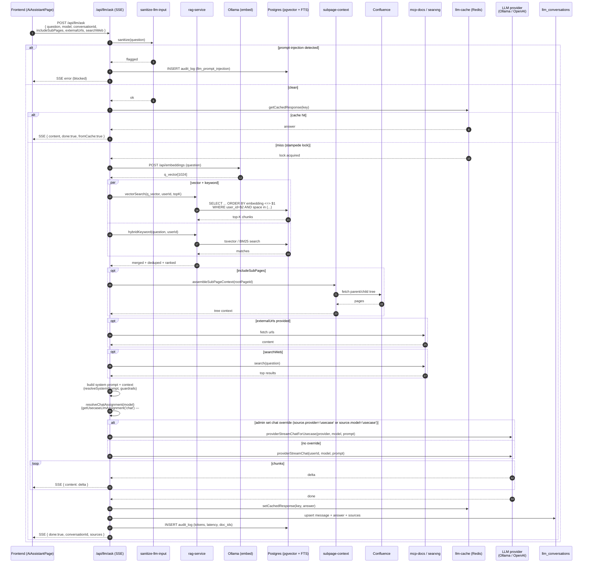

# 9. RAG Chat Flow

End-to-end flow for a user's question through the RAG pipeline. Implemented
in `backend/src/routes/llm/llm-ask.ts` (SSE) with retrieval in
`backend/src/domains/llm/services/rag-service.ts`.

## Sequence



## Retrieval details

- **Vector search** uses pgvector's `<=>` cosine distance against an HNSW
  index on `page_embeddings.embedding`. `ef_search` is set per request for
  a recall/latency trade-off.
- **Keyword search** uses the PostgreSQL text-search configuration from
  `FTS_LANGUAGE` (default `simple`; set `german`, `english`, etc. for
  language-aware stemming).
- **Hybrid merge** deduplicates by `page_id`, keeps the best chunk per
  page, and re-ranks using a weighted blend.
- **Scope** — results are filtered to pages the requesting user can see
  (own pages + spaces they have RBAC access to).

## Streaming contract

The SSE frames use JSON events:

```
data: { "content": "partial token" }
data: { "content": "more tokens" }
data: { "done": true, "conversationId": "…", "sources": [ … ] }
```

On abort (client disconnect) the backend aborts the upstream LLM request —
see `backend/src/routes/llm/sse-abort.test.ts` for the behaviour we rely on.

## Cache + stampede protection

- **Key** = `hash(userId, model, normalizedQuestion, contextFingerprint)`.
- Cache hit → answer returned immediately from Redis.
- Cache miss → a Redis lock is taken; concurrent identical requests wait
  for the first writer and then read the fresh entry, avoiding duplicate
  LLM calls.
- TTL: `LLM_CACHE_TTL` (default `3600`s).

## Related routes

All of these go through the same provider resolver and sanitization layer:

| Route | Purpose |
|-------|---------|
| `POST /api/llm/ask` | RAG Q&A (this diagram) |
| `POST /api/llm/improve` | Improve an existing article |
| `POST /api/llm/generate` | Generate a new article |
| `POST /api/llm/summarize` | Summarize a page |
| `POST /api/llm/diagram` | Generate a Mermaid diagram from prose |
| `POST /api/llm/pdf/extract` | PDF → text → summary |

## Key files

- `backend/src/routes/llm/llm-ask.ts`
- `backend/src/domains/llm/services/rag-service.ts`
- `backend/src/domains/llm/services/embedding-service.ts`
- `backend/src/domains/llm/services/llm-provider.ts` (Ollama vs OpenAI resolver)
- `backend/src/domains/llm/services/llm-cache.ts`
- `backend/src/core/utils/sanitize-llm-input.ts`
- `backend/src/domains/confluence/services/subpage-context.ts`
