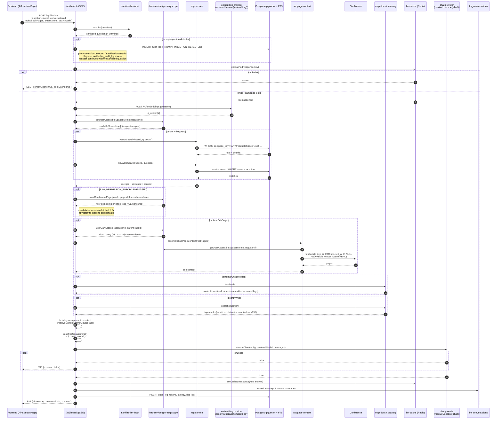

# 9. RAG Chat Flow

End-to-end flow for a user's question through the RAG pipeline. Implemented
in `backend/src/routes/llm/llm-ask.ts` (SSE) with retrieval in
`backend/src/domains/llm/services/rag-service.ts`.

## Sequence


```mermaid
sequenceDiagram
    autonumber
    participant FE as Frontend (AiAssistantPage)
    participant BE as /api/llm/ask (SSE)
    participant SAN as sanitize-llm-input
    participant RBAC as rbac-service (per-req scope)
    participant RAG as rag-service
    participant EMB as embedding provider<br/>(resolveUsecase('embedding'))
    participant PG as Postgres (pgvector + FTS)
    participant SP as subpage-context
    participant CF as Confluence
    participant MCP as mcp-docs / searxng
    participant CACHE as llm-cache (Redis)
    participant PROV as chat provider<br/>(resolveUsecase('chat'))
    participant CONV as llm_conversations

    FE->>BE: POST /api/llm/ask<br/>{ question, model, conversationId,<br/>  includeSubPages, externalUrls, searchWeb }
    BE->>SAN: sanitize(question)
    SAN-->>BE: sanitized question (+ warnings)
    opt prompt-injection detected
        BE->>PG: INSERT audit_log (PROMPT_INJECTION_DETECTED)
        note right of BE: promptInjectionDetected / sanitized attestation<br/>flags set on the llm_audit_log row —<br/>request continues with the sanitized question
    end
    BE->>CACHE: getCachedResponse(key)
    alt cache hit
        CACHE-->>BE: answer
        BE-->>FE: SSE { content, done:true, fromCache:true }
    else miss (stampede lock)
        CACHE-->>BE: lock acquired
        BE->>EMB: POST /v1/embeddings (question)
        EMB-->>BE: q_vector[N]
        BE->>RBAC: getUserAccessibleSpacesMemoized(userId)
        RBAC-->>BE: readableSpaceKeys[] (request-scoped)
        par vector + keyword
            BE->>RAG: vectorSearch(userId, q_vector)
            RAG->>PG: WHERE cp.space_key = ANY(readableSpaceKeys) ...
            PG-->>RAG: top-K chunks
        and
            BE->>RAG: keywordSearch(userId, question)
            RAG->>PG: tsvector search WHERE same space filter
            PG-->>RAG: matches
        end
        RAG-->>BE: merged + deduped + ranked
        opt RAG_PERMISSION_ENFORCEMENT (EE)
            BE->>RBAC: userCanAccessPage(userId, pageId) for each candidate
            RBAC-->>BE: filter decision (per-page read ACE honoured)
            note right of BE: candidates were overfetched 1.5x<br/>at vector/fts stage to compensate
        end
        opt includeSubPages
            BE->>RBAC: userCanAccessPage(userId, parentPageId)
            RBAC-->>BE: allow / deny (#35;814 — skip tree on deny)
            BE->>SP: assembleSubPageContext(rootPageId)
            SP->>RBAC: getUserAccessibleSpacesMemoized(userId)
            SP->>CF: fetch child tree WHERE deleted_at IS NULL<br/>AND visible to user (space RBAC)
            CF-->>SP: pages
            SP-->>BE: tree context
        end
        opt externalUrls provided
            BE->>MCP: fetch urls
            MCP-->>BE: content (sanitized#59; detections audited — same flags)
        end
        opt searchWeb
            BE->>MCP: search(question)
            MCP-->>BE: top results (sanitized#59; detections audited — #35;835)
        end
        BE->>BE: build system prompt + context<br/>(resolveSystemPrompt, guardrails)
        BE->>BE: resolveUsecase('chat')<br/>→ { config, model }
        BE->>PROV: streamChat(config, resolvedModel, messages)
        loop chunks
            PROV-->>BE: delta
            BE-->>FE: SSE { content: delta }
        end
        PROV-->>BE: done
        BE->>CACHE: setCachedResponse(key, answer)
        BE->>CONV: upsert message + answer + sources
        BE->>PG: INSERT audit_log (tokens, latency, doc_ids)
        BE-->>FE: SSE { done:true, conversationId, sources }
    end
```

### Permission-check checkpoint

Per ADR-022, RAG retrieval post-filters vector and FTS candidate sets by the
caller's readable space keys. The resolver
(`rbac-service.getUserAccessibleSpaces`) is memoised per request via
`AsyncLocalStorage`, so a single hybrid query touches the RBAC path once
regardless of how many retrieval calls execute. The Fastify `authenticate`
hook enters the scope on every authenticated request via `enterRbacScope`,
synchronously before its first `await` (the scope's `userId` is filled in once
token verification succeeds) — `enterWith` only propagates the store to
continuations descending from the frame it is called in, so entering it after
an await would leave the route handler without the scope and the memo dead at
runtime (#899). The memoised wrapper falls back to the raw resolver outside a
scope (background workers, tests that skip the opt-in).

### Score semantics (#1117)

A retrieval result carries three numbers, and only one of them means anything
to a user.

| Field | Unit | Produced by | Safe to show? |
|---|---|---|---|
| `score` | whatever the producer used | cosine from `vectorSearch`, `ts_rank` from `keywordSearch`, RRF fusion from `reciprocalRankFusion` | **No** — ordering only |
| `vectorScore` | cosine similarity, `[-1,1]` | the vector leg; `null` when the page was matched only by full-text | **Yes**, with care |
| `keywordRank` | raw `ts_rank`, unbounded | the keyword leg; `null` when matched only by vector | No — corpus-dependent |

RRF fusion previously *overwrote* `score` with the fusion value and discarded
the cosine. That value is ~0.016 for a single rank in one leg and ~0.033 for the
common two-leg case, and it is **not** bounded there: the vector leg is
per-chunk, so one page occupying several top slots has its contributions summed.
The worst case is a function of the per-stage limit, which differs by caller:

| Path | topK | stage limit | worst-case fusion score |
|---|---|---|---|
| `/llm/ask` (chat) | 5 | 10 (CE) | ~0.169 |
| `/llm/ask` under EE ACL | 5 | `ceil(5×1.5)` = 8 | ~0.141 |
| `/api/search` under EE ACL | 20 | `ceil(20×1.5)` = 30 | ~0.419 |

`ConfidenceBadge` sits on the chat path only and reads the value as a cosine
(`>= 0.7` high, `>= 0.4` medium). The chat-path maximum of ~0.169 is well under
that floor, which is why **every** hybrid knowledge-base answer rendered "Low
confidence" — and web sources, handed a flat `score: 1`, were the only ones that
could raise the average. Note the chat-path bound is *not* global: the
`/api/search` figure clears 0.4, and nothing thresholds it there. `rrfWorstCase`
in `rag-service.ts` computes these and a test pins them, because the prose
version of this table has been wrong twice.

Fusion now carries the per-leg values alongside the fused score instead of
replacing them; ordering is unchanged.

On the wire, `/llm/ask` sources and `/api/search` items expose the cosine as
**`similarity`** (`null` when none was measured). `score` is retained because it
is what orders the array, and must never be rendered. A `null` similarity
renders **no** badge and **no** percentage, because a keyword-only hit has no
similarity rather than a similarity of zero.

Two range traps. `vectorScore` is `1 - (embedding <=> query)` and pgvector's
cosine distance runs to 2, so the true range is `[-1,1]`; the `/pages` search
list therefore renders a percentage only for a **positive** similarity. And
`sources` are never persisted — `saveConversation` writes `ChatMessage[]`, i.e.
`{role, content}` (see the source-objects note later in this document) — so a
replayed conversation carries no sources and shows no badge regardless of any
of this.

`search_analytics.max_score` deliberately still stores the **fusion** value for
`hybrid` and `keyword_fallback` rows. Repointing it at `vectorScore` would make
new rows silently incomparable with historical ones. Since migration 088
(#1117 stage 2) `search_type` is the documented unit tag for `max_score` —
one unit per value, pinned by the table below — and rerank scores get their
own `rerank_score` column instead of ever overloading this one:

| `search_type` | `max_score` unit | writer |
|---|---|---|
| `hybrid` | RRF fusion value | `hybridSearch` (rag-service) |
| `keyword_fallback` | RRF fusion value (keyword-only leg) | `hybridSearch` (rag-service) |
| `semantic` | cosine similarity | `/api/search` semantic mode |
| `keyword` | raw `ts_rank` | `/api/search` keyword mode |
| `faceted` | NULL | `POST /api/search/log` |

Values are enforced by the `SearchAnalyticsType` union in `rag-service.ts`,
not a CHECK constraint; future stages (#1104 rerank, #1109 MMR, #1112
expansion) add members **with** their writers. Note the admin analytics
routes (`knowledge-gaps`, `content-gaps`) still apply one `max_score < 0.3`
threshold across all rows regardless of unit — a pre-existing defect this
table documents but #1117 did not change.

## Retrieval observability (#1117 stage 2)

Migration 088 added three nullable columns to `search_analytics`, none
backfilled (on pre-088 rows NULL means "not recorded", not "healthy"):

- **`rerank_score`** — reserved for #1104; max rerank score of the returned
  set in [0,1], so rerank never changes `max_score`'s meaning.
- **`degraded_reason`** — why the vector leg under-delivered:
  `embedding_failed` (provider call threw; beats the coverage-derived reasons
  because the leg is missing entirely), `no_embeddings` (embeddable pages
  exist, zero embedded), `partial_embeddings` (coverage below
  `DEGRADED_COVERAGE_THRESHOLD`, 0.95). NULL = healthy.
- **`embedding_coverage`** — measured coverage in [0,1] at query time,
  recorded degraded or not, so the destructive re-embed window (#1116) is
  visible in analytics after the fact.

**The coverage probe** (`getEmbeddingCoverage`) counts ground truth from
`page_embeddings` — deliberately not `pages.embedding_status`, which a failed
run can leave stale — over what `embedPage` will actually embed: non-deleted,
non-folder, `body_html` present, and at least `MIN_EMBEDDABLE_TEXT_CHARS` (20)
of extracted text. That last filter matters: `embedPage` permanently settles
shorter pages with zero embedding rows, so counting them would leave a corpus
with a few structural stub pages "degraded" forever. It replaced a boolean
EXISTS probe that flipped healthy the moment ONE visible page had an embedding
row, so 1% coverage rendered identically to 100%. `/api/search` runs it once
for semantic/hybrid modes, exposes `embeddingCoverage` + `degradedReason` on
the response (`null` in keyword mode: unmeasured, not healthy), and **hands
its reading to `hybridSearch`** so a hybrid request never counts twice;
`hybridSearch` self-probes (in parallel with the legs) only when nothing was
handed over — the chat path. A probe failure degrades the *signal* to null,
never the search, on both paths: the route catches and proceeds in the
requested mode, `hybridSearch` catches inside its coverage promise.

Two deliberate asymmetries. A semantic/hybrid request downgraded to keyword
for zero coverage still carries the measured `degradedReason`/coverage onto
its (`search_type = 'keyword'`) analytics row — during a re-embed window every
search lands there, and dropping the extras would record the outage as healthy
keyword traffic. And the **wire** fields describe corpus state measured before
retrieval ran: an embedding provider failing mid-request degrades that request
only, which the analytics row (`embedding_failed`) and the span record — the
response's `degradedReason` deliberately does not flip for it.

The frontend derives the signal from the **enhanced** (probed) response —
`use-search.ts` deriving `hasEmbeddings` from the immediate keyword response,
where the probe never runs and the flag is unconditionally true, is why the
`/pages` no-embeddings banner could never fire in production before #1117.
`PagesPage` shows the amber zero-embeddings banner on `hasEmbeddings: false`
and a degraded-coverage banner (with the measured percentage) on
`degradedReason: 'partial_embeddings'`.

**Spans.** `rag.hybrid_search` (attributes: `rag.top_k`, `rag.vector_hits`,
`rag.keyword_hits`, `rag.search_type`, `rag.embedding_coverage`, and
`rag.degraded_reason` only when degraded — absence is the healthy signal) with
`rag.vector_search` / `rag.keyword_search` children (`rag.limit`, `rag.hits`),
via the same `withSpan` seam as the `llm.*` spans. `withSpan` now passes the
live span into its callback so results-derived attributes can be set.

**Metrics.** `telemetry.ts` gained the metrics half (`getMeter` /
`recordHistogram`). Export follows the standard OTel env config
(`OTEL_METRICS_EXPORTER` et al. — sdk-node builds the reader, defaulting to
OTLP at the configured endpoint, and `none` is honored); only the unconfigured
dev default (enabled, no endpoint, no exporter set) is overridden to a console
reader, mirroring the trace fallback. `shutdownTelemetry` also disables the
write-once api globals so a start→shutdown→start cycle hands out live
instruments, not meters bound to a dead provider. One instrument:
`compendiq.retrieval.stage.duration` (ms), attribute `stage` ∈
`vector_search` | `keyword_search` | `total` — `rerank` joins when #1104
lands, which is what makes rerank latency measurable before that stage ships.
Per-leg stages record successful runs only; `total` records failures too. The
`rerank_bypassed` counter from the issue was deliberately dropped: nothing to
instrument until #1104 exists.

Per ADR-023 (EE — `RAG_PERMISSION_ENFORCEMENT`), a second post-filter runs
after the RRF merge when the feature is active. It calls
`userCanAccessPage(userId, pageId)` for each merged candidate, gating
retrieval on per-page read ACEs. The sync path (ADR-023) writes Confluence's
effective read restrictions — resolved through the ancestor chain at sync
time — into `access_control_entries` with `source='confluence'`, so the
query-time check is a single consistent `userCanAccessPage` call per
candidate. Candidates are overfetched at 1.5× `topK` at the vector and FTS
stages to give the filter headroom. When the feature is off (CE or EE
without the flag), neither the overfetch nor the second post-filter runs —
behaviour matches v0.3.

The `includeSubPages` branch (#814) is gated independently of the RAG
retrieval filters, since it injects a caller-supplied page tree rather than
retrieved chunks. Before assembly, `/llm/ask` enforces the same access check
as `GET /pages/:id` on the parent (`userCanAccessPage`) and skips the branch
on denial. `subpage-context.fetchSubPages` then resolves the caller's readable
spaces once and applies `visiblePagesPredicate` plus `deleted_at IS NULL` to
every descendant query, so cross-space or soft-deleted sub-pages never reach
the LLM prompt on any route (`ask`, `improve`, `analyze-quality`, `summarize`).

## Image input flow (#1154)

`/api/llm/ask` does not accept an image — only `/api/llm/generate` and
`/api/llm/improve` do, via an `imageHandle` staged ahead of time:

```
POST /api/llm/prepare-image        multipart; magic-byte sniff, <=4096 per
                                   edge, <=5 MB
  -> INFO memory                   headroom pre-flight (#1183)
       used + incoming <= N% of maxmemory -> continue
       over                               -> 503, nothing written
       maxmemory 0, or INFO unreadable    -> continue (fail open — the SET's
                                             own OOM reply is the backstop
                                             and maps to the same 503)
  -> Redis  llm:img:<userId>:<sha256>   TTL 900s; raw bytes behind a
                                        `<format>\n` header, not base64.
                                        Not consumed on read, but a new
                                        upload evicts the user's previous
                                        one (one staged image per user —
                                        Redis is shared and noeviction).
  -> { handle, format, width, height, fileSize }

POST /api/llm/generate | /api/llm/improve   { ..., imageHandle }
  -> resolveUsecase('chat')          -> { config, resolvedModel }
  -> getVisionCapability(providerId, resolvedModel)
       true            -> continue
       false | null    -> 422 (fail closed — a client-side gate is never trusted)
  -> loadStagedImage(userId, imageHandle)
       hit             -> continue, handle stays in Redis (regenerate-safe)
       miss/expired    -> 410
  -> buildLlmCacheKey(..., { imageHash: imageHandle })
  -> streamChat(cfg, resolvedModel, [
       { role: 'system', content: systemPrompt },              // string, unchanged
       { role: 'user',   content: [ { type: 'text', ... },
                                     { type: 'image_url', ... } ] }   // array, #1154
     ])
```

The capability gate and the staging load are both centralised in
`resolveImagePart` (`routes/llm/_helpers.ts`) so `/llm/generate` and
`/llm/improve` cannot drift on the 422/410 semantics. `getVisionCapability`
never blocks this request path on an LLM round-trip — it returns the stored
verdict and only schedules a background re-probe (see ADR-021's `#1154`
amendment and `06-data-model.md`'s `llm_model_capabilities` entry). Because
the handle is the sha256 of the validated bytes, it doubles as the
`imageHash` cache-key input without a separate hashing step — two different
images with the same prompt produce two distinct cache keys.

The `INFO memory` pre-flight (#1183) exists because the per-user cap alone is a
mitigation, not a bound: it holds the namespace to `users x 5 MB`, which still
fills the shipped `--maxmemory 256mb` if enough people upload inside one TTL
window — and that instance is `noeviction` and shared with BullMQ, so filling it
fails *writes* application-wide. Refusing the upload turns an app-wide enqueue
outage into one degraded feature. The threshold is
`IMAGE_STAGING_MAX_REDIS_PERCENT` (default 80). The check is uncached — one
O(1) command on a path that already streams and hashes megabytes, where a stale
"there is room" would admit every upload inside the cache window on a single
reading.

Note the fail-open branches above are a real gap, not just a fallback: a
deployment whose Redis does not answer `INFO` (renamed or ACL-blocked, common on
hardened and managed instances) never engages the ceiling at all and is back to
the per-user mitigation, with `OOM` on the `SET` arriving only once BullMQ is
already blocked. ADR-021's `#1183` paragraphs carry the reasoning; `.env.example`
states the condition where an operator will meet it.

## Retrieval details

- **Vector search** uses pgvector's `<=>` cosine distance against an HNSW
  index on `page_embeddings.embedding`. `ef_search` is set per request for
  a recall/latency trade-off.
- **Keyword search** uses the PostgreSQL text-search configuration from
  `FTS_LANGUAGE` (default `simple`; set `german`, `english`, etc. for
  language-aware stemming).
- **Hybrid merge** deduplicates by `page_id`, keeps the best chunk per
  page, and re-ranks using a weighted blend.
- **Scope** — results are filtered to pages the requesting user can see
  (own pages + spaces they have RBAC access to).

## Streaming contract

The SSE frames use JSON events:

```
data: { "content": "partial token" }
data: { "content": "more tokens" }
data: { "done": true, "conversationId": "…", "sources": [ … ] }
```

On abort (client disconnect) the backend aborts the upstream LLM request —
see `backend/src/routes/llm/sse-abort.test.ts` for the behaviour we rely on.

### Source objects (#1125)

Every entry in `sources` carries **both** identities, and the frontend picks
the target from them — `ask`, `generate`, `improve` and `summarize` all emit
the same shape:

| Field | Knowledge-base hit | Web / external-docs hit |
|-------|--------------------|-------------------------|
| `pageId` | integer `pages.id` | `0` |
| `confluenceId` | Confluence id, **`null` for locally-created pages** | the URL (legacy field, predates `url`) |
| `spaceKey` | space key, **`null` for locally-created pages** | the `Web` / `External` display label |
| `url` | absent | absolute http(s) URL |

`frontend/src/features/ai/source-target.ts` is the single resolver: a `url`
(or a URL found in `confluenceId`) opens in a new tab, otherwise navigation
goes to `/pages/<pageId>`, otherwise the source renders as a **non-link**.
**Never discriminate on `spaceKey === 'Web'`** — that is a display label and a
real Confluence space could be keyed `Web`. Citing by `confluenceId` was
#1125: web sources became `/pages/https://…` (multi-segment, so NotFoundPage)
and standalone pages became `/pages/null`.

**`confluenceId` is never a navigation target, and there is no fallback to
it.** `GET /pages/:id` resolves a `/^\d+$/` id against the integer PK
(`pages-crud.ts`), and Confluence content ids *are* numeric — so
`/pages/<confluenceId>` does not 404, it silently opens whichever unrelated
page holds that PK, which is worse than the not-found this issue fixed.
Nothing needs the fallback: `/llm/ask` has always emitted `pageId` on
knowledge-base hits, the other three routes emit only web sources (which carry
the URL), and sources are **not persisted** with a conversation —
`llm_conversations.messages` stores `{role, content}` only, so there is no
back-catalogue of `pageId`-less sources to serve.

For the same reason the RAG cache key's doc-id list uses `confluenceId`
falling back to `page:<pageId>` — a set of NULL ids collapses to
indistinguishable empty strings, and two different sets of standalone pages
would otherwise share one key.

## Cache + stampede protection

- **Key** = `hash(userId, model, normalizedQuestion, contextFingerprint)`.
- Cache hit → answer returned immediately from Redis.
- Cache miss → a Redis lock is taken; concurrent identical requests wait
  for the first writer and then read the fresh entry, avoiding duplicate
  LLM calls.
- TTL: `LLM_CACHE_TTL` (default `3600`s).

## Related routes

All of these go through the same provider resolver and sanitization layer:

| Route | Purpose |
|-------|---------|
| `POST /api/llm/ask` | RAG Q&A (this diagram) |
| `POST /api/llm/improve` | Improve an existing article; optional `referenceText` carries an attached document (#1131), optional `imageHandle` carries a staged image (#1154, see below) |
| `POST /api/llm/generate` | Generate a new article; optional `documentText` carries an attached document (`pdfText` until #1132), optional `imageHandle` carries a staged image (#1154, see below) |
| `POST /api/llm/summarize` | Summarize a page |
| `POST /api/llm/generate-diagram` | Generate a Mermaid diagram from prose |
| `POST /api/llm/extract-document` | Uploaded document → text extraction, sanitized (pdf · docx · odt · rtf · md · txt — see `11-content-pipeline.md`). The only path — the `POST /api/llm/extract-pdf` alias was retired with the #1131 UI PR |
| `POST /api/llm/prepare-image` | Stages an uploaded image (png/jpeg/webp/gif; SVG refused) in Redis for `generate`/`improve` to consume (#1154, see below) |

## Key files

- `backend/src/routes/llm/llm-ask.ts`
- `backend/src/domains/llm/services/rag-service.ts`
- `backend/src/domains/llm/services/embedding-service.ts`
- `backend/src/domains/llm/services/llm-provider-resolver.ts` (per-use-case provider + model resolver)
- `backend/src/domains/llm/services/openai-compatible-client.ts` (unified client — `chat` / `streamChat` / `generateEmbedding` with queue + per-provider circuit breakers)
- `backend/src/domains/llm/services/llm-cache.ts`
- `backend/src/core/utils/sanitize-llm-input.ts`
- `backend/src/domains/confluence/services/subpage-context.ts`
