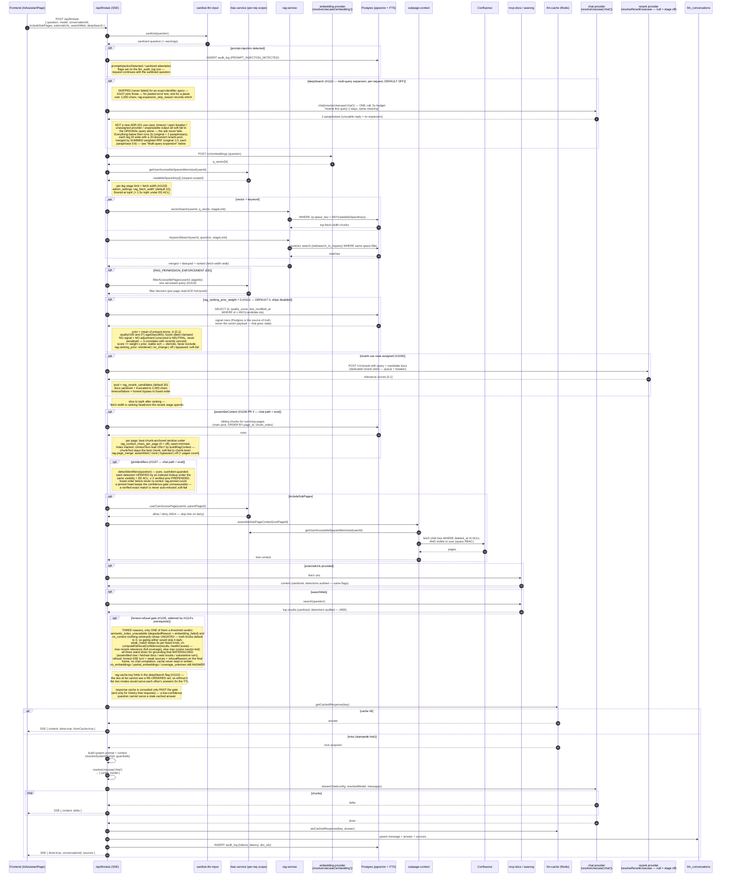

# 9. RAG Chat Flow

End-to-end flow for a user's question through the RAG pipeline. Implemented
in `backend/src/routes/llm/llm-ask.ts` (SSE) with retrieval in
`backend/src/domains/llm/services/rag-service.ts`.

## Sequence


```mermaid
sequenceDiagram
    autonumber
    participant FE as Frontend (AiAssistantPage)
    participant BE as /api/llm/ask (SSE)
    participant SAN as sanitize-llm-input
    participant RBAC as rbac-service (per-req scope)
    participant RAG as rag-service
    participant EMB as embedding provider<br/>(resolveUsecase('embedding'))
    participant PG as Postgres (pgvector + FTS)
    participant SP as subpage-context
    participant CF as Confluence
    participant MCP as mcp-docs / searxng
    participant CACHE as llm-cache (Redis)
    participant PROV as chat provider<br/>(resolveUsecase('chat'))
    participant PROV2 as rerank provider<br/>(resolveRerankUsecase — null = stage off)
    participant CONV as llm_conversations

    FE->>BE: POST /api/llm/ask<br/>{ question, model, conversationId,<br/>  includeSubPages, externalUrls, searchWeb, deepSearch }
    BE->>SAN: sanitize(question)
    SAN-->>BE: sanitized question (+ warnings)
    opt prompt-injection detected
        BE->>PG: INSERT audit_log (PROMPT_INJECTION_DETECTED)
        note right of BE: promptInjectionDetected / sanitized attestation<br/>flags set on the llm_audit_log row —<br/>request continues with the sanitized question
    end
    opt deepSearch (#35;1112 — multi-query expansion, per-request, DEFAULT OFF)
        note right of BE: SKIPPED (never failed) for an exact-identifier query —<br/>#35;1107 pins those — for pasted error text, and for a paste<br/>over 1,000 chars#59; rag.expansion_skip_reason records which
        BE->>PROV: chat(resolveUsecase('chat')) — ONE call, 5s budget<br/>"rewrite this query 2 ways, same meaning"
        PROV-->>BE: 2 paraphrases (unusable reply = no expansion)
        note right of BE: NOT a new ADR-021 use case#59; timeout / open breaker /<br/>unassigned provider / unparseable output all soft-fail to<br/>the ORIGINAL query alone — the ask never fails.<br/>Everything below then runs 3x (original + 2 paraphrases),<br/>each leg 20 wide with a 20-document rerank pool,<br/>merged by SUMMED weighted RRF (original 1.0, each<br/>paraphrase 0.6) — see "Multi-query expansion" below
    end
    BE->>EMB: POST /v1/embeddings (question)
    EMB-->>BE: q_vector[N]
    BE->>RBAC: getUserAccessibleSpacesMemoized(userId)
    RBAC-->>BE: readableSpaceKeys[] (request-scoped)
    note right of BE: per-leg stage limit = fetch width (#35;1103)<br/>admin_settings 'rag_fetch_width' (default 10),<br/>floored at topK (+ 1.5x topK under EE ACL)
    par vector + keyword
        BE->>RAG: vectorSearch(userId, q_vector, stageLimit)
        RAG->>PG: WHERE cp.space_key = ANY(readableSpaceKeys) ...
        PG-->>RAG: top fetch-width chunks
    and
        BE->>RAG: keywordSearch(userId, question, stageLimit)
        RAG->>PG: tsvector search (websearch_to_tsquery) WHERE same space filter
        PG-->>RAG: matches
    end
    RAG-->>BE: merged + deduped + ranked (fetch-width wide)
    opt RAG_PERMISSION_ENFORCEMENT (EE)
        BE->>RBAC: filterAccessiblePages(userId, pageIds)<br/>one set-based query (#35;1104)
        RBAC-->>BE: filter decision (per-page read ACE honoured)
    end
    opt rag_ranking_prior_weight > 0 (#35;1111 — DEFAULT 0, ships disabled)
        BE->>PG: SELECT id, quality_score, last_modified_at<br/>WHERE id = ANY(candidate ids)
        PG-->>BE: signal rows (Postgres is the source of truth,<br/>never the vector payload — that goes stale)
        note right of BE: prior = mean of present terms, in [0,1]#59;<br/>quality/100 and 2^(-ageDays/365), future dates clamped#59;<br/>NO signal = NO adjustment (unscored is NEUTRAL, never<br/>penalised — it correlates with recently synced)#59;<br/>score += weight x prior, stable sort — demote, never exclude#59;<br/>rag.ranking_prior: reordered | no_change | off | bypassed#59; soft-fail
    end
    opt rerank use case assigned (#35;1104)
        BE->>PROV2: POST /v1/rerank with query + candidate docs<br/>(dedicated rerank client — queue + breaker)
        PROV2-->>BE: relevance scores [0,1]
        note right of BE: pool = rag_rerank_candidates (default 30)<br/>docs sanitized + truncated to 2,000 chars<br/>timeout/failure = honest bypass to fused order
    end
    note right of BE: slice to topK after ranking —<br/>fetch width is ranking headroom the rerank stage spends
    opt assembleContext (#35;1106 PR 2 — chat path + eval)
        BE->>PG: sibling chunks for surviving pages<br/>(main pool, ORDER BY page_id, chunk_index)
        PG-->>BE: rows
        note right of BE: per page: best-chunk-anchored window under<br/>rag_context_chars_per_page (0 = off)#59; seam-trimmed,<br/>holes marked#59; contextText read ONLY by buildRagContext —<br/>chunkText stays the best chunk#59; soft-fail to chunk-level#59;<br/>rag.page_merge: assembled | none | bypassed | off (+ pages count)
    end
    opt pinIdentifiers (#35;1107 — chat path + eval)
        note right of BE: detectIdentifiers(question) — pure, cue/token-guarded#59;<br/>each detection VERIFIED by an indexed lookup under the<br/>same visibility + EE ACL#59; ≤ 2 verified pins PREPENDED,<br/>fused order below never re-sorted#59; rag.pinned count#59;<br/>a pinned head keeps the confidence gate unmeasurable —<br/>a verified exact match is never auto-refused#59; soft-fail
    end
    opt includeSubPages
        BE->>RBAC: userCanAccessPage(userId, parentPageId)
        RBAC-->>BE: allow / deny (#35;814 — skip tree on deny)
        BE->>SP: assembleSubPageContext(rootPageId)
        SP->>RBAC: getUserAccessibleSpacesMemoized(userId)
        SP->>CF: fetch child tree WHERE deleted_at IS NULL<br/>AND visible to user (space RBAC)
        CF-->>SP: pages
        SP-->>BE: tree context
    end
    opt externalUrls provided
        BE->>MCP: fetch urls
        MCP-->>BE: content (sanitized#59; detections audited — same flags)
    end
    opt searchWeb
        BE->>MCP: search(question)
        MCP-->>BE: top results (sanitized#59; detections audited — #35;835)
    end
    opt honest-refusal gate (#35;1105, widened by #35;1114's prerequisite)
        note right of BE: THREE reasons, only ONE of them a threshold verdict:<br/>semantic_index_unavailable (degradedReason = embedding_failed) and<br/>no_context (nothing retrieved) refuse UNGATED — both knobs default<br/>to 0, so gating either would ship it dark#59;<br/>weak_match keeps its per-basis knob, on<br/>computeRetrievalConfidence(results, healthCaveat) —<br/>max rerank relevance (full coverage), else max cosine (vector-led)#59;<br/>all three stand down for grounding that MATERIALISED<br/>(assembled tree / fetched docs / web results / substantive turn)#59;<br/>refusal: honest SSE turn + weak sources + refusalReason on the final<br/>frame, no chat completion, cache never read or written#59;<br/>no_embeddings / partial_embeddings / coverage_unknown still ANSWER
    end
    note right of BE: rag cache key folds in the deepSearch flag (#35;1112) —<br/>the doc-id list cannot see a RE-ORDERED set, so without it<br/>the two modes would serve each other's answers for the TTL
    note right of BE: response cache is consulted only PAST the gate<br/>(and only for history-free requests) — a low-confidence<br/>question cannot serve a stale cached answer
    BE->>CACHE: getCachedResponse(key)
    alt cache hit
        CACHE-->>BE: answer
        BE-->>FE: SSE { content, done:true, fromCache:true }
    else miss (stampede lock)
        CACHE-->>BE: lock acquired
        BE->>BE: build system prompt + context<br/>(resolveSystemPrompt, guardrails)
        BE->>BE: resolveUsecase('chat')<br/>→ { config, model }
        BE->>PROV: streamChat(config, resolvedModel, messages)
        loop chunks
            PROV-->>BE: delta
            BE-->>FE: SSE { content: delta }
        end
        PROV-->>BE: done
        BE->>CACHE: setCachedResponse(key, answer)
        BE->>CONV: upsert message + answer + sources
        BE->>PG: INSERT audit_log (tokens, latency, doc_ids)
        BE-->>FE: SSE { done:true, conversationId, sources }
    end
```

### Permission-check checkpoint

Per ADR-022, RAG retrieval post-filters vector and FTS candidate sets by the
caller's readable space keys. The resolver
(`rbac-service.getUserAccessibleSpaces`) is memoised per request via
`AsyncLocalStorage`, so a single hybrid query touches the RBAC path once
regardless of how many retrieval calls execute. The Fastify `authenticate`
hook enters the scope on every authenticated request via `enterRbacScope`,
synchronously before its first `await` (the scope's `userId` is filled in once
token verification succeeds) — `enterWith` only propagates the store to
continuations descending from the frame it is called in, so entering it after
an await would leave the route handler without the scope and the memo dead at
runtime (#899). The memoised wrapper falls back to the raw resolver outside a
scope (background workers, tests that skip the opt-in).

### Score semantics (#1117)

A retrieval result carries three numbers, and only one of them means anything
to a user.

| Field | Unit | Produced by | Safe to show? |
|---|---|---|---|
| `score` | whatever the producer used | cosine from `vectorSearch`, `ts_rank` from `keywordSearch`, RRF fusion from `reciprocalRankFusion` | **No** — ordering only |
| `vectorScore` | cosine similarity, `[-1,1]` | the vector leg; `null` when the page was matched only by full-text | **Yes**, with care |
| `keywordRank` | raw `ts_rank`, unbounded | the keyword leg; `null` when matched only by vector | No — corpus-dependent |

RRF fusion previously *overwrote* `score` with the fusion value and discarded
the cosine. That value is ~0.016 for a single rank in one leg and ~0.033 for
the common two-leg case — and since #1106's best-chunk-only rule the two-leg
figure is the **bound**: a page's vector contribution is its best chunk's
reciprocal rank, never a per-chunk sum, so the ceiling no longer tracks the
stage limit at all. (`resolveStageLimit` — the fetch width, floored at `topK`
and at `ceil(topK×1.5)` under EE ACL — still sizes the candidate POOL.) At the
defaults:

| Path | topK | stage limit | worst-case fusion score |
|---|---|---|---|
| every path since #1106 | any | any (pool sizing only) | **~0.0328** (`rrfWorstCase(true)` = 2/61) — width-invariant |
| *historical rows (pre-#1106 summed scale)* | | | *chat ~0.169; rerank pool assigned ~0.419; `/api/search`@20 ~0.302; past 1.0 at the width cap* |

Since #1106 the vector leg is page-denominated (the stage limit counts
distinct pages; the leg fetches `min(4 × stageLimit, 500)` raw CHUNK rows)
**and fusion is best-chunk-only**: a page's vector contribution is its best
chunk's reciprocal rank, never a per-chunk sum — measured on the rig,
summing over the widened window recovered Recall@10 but crushed the head
(R@1 0.4028→0.3333, MRR 0.6016→0.5503). The fusion ceiling is therefore a
width-invariant constant, and `search_analytics.max_score` rows straddling
the #1106 deploy are only loosely comparable (old rows carry the summed
scale) — the same class of caveat the #1103 width change carried, in the
shrinking direction.

`ConfidenceBadge` used to read the value as a cosine (`>= 0.7` high, `>= 0.4`
medium). The chat-path maximum (~0.169 then, ~0.0328 since #1106's best-chunk-only rule — still a fusion value, not a cosine) sits well under that floor, which is why
**every** hybrid knowledge-base answer rendered "Low confidence" — and web
sources, handed a flat `score: 1`, were the only ones that could raise the
average. #1117 moved the badge onto the cosine (`similarity` on the wire); the
fusion value stays ordering-only. `rrfWorstCase` in `rag-service.ts` computes
these and a test pins them, because the prose version of this table has been
wrong three times.

Fusion now carries the per-leg values alongside the fused score instead of
replacing them; ordering is unchanged.

On the wire, `/llm/ask` sources and `/api/search` items expose the cosine as
**`similarity`** (`null` when none was measured). `score` is retained because it
is what orders the array, and must never be rendered. A `null` similarity
renders **no** badge and **no** percentage, because a keyword-only hit has no
similarity rather than a similarity of zero.

Two range traps. `vectorScore` is `1 - (embedding <=> query)` and pgvector's
cosine distance runs to 2, so the true range is `[-1,1]`; the `/pages` search
list therefore renders a percentage only for a **positive** similarity. And
`sources` are never persisted — `saveConversation` writes `ChatMessage[]`, i.e.
`{role, content}` (see the source-objects note later in this document) — so a
replayed conversation carries no sources and shows no badge regardless of any
of this.

`search_analytics.max_score` deliberately still stores the **fusion** value for
`hybrid` and `keyword_fallback` rows. Repointing it at `vectorScore` would make
new rows silently incomparable with historical ones. One #1104 caveat: on
`hybrid_rerank` rows the max runs over the rerank-SELECTED top-K (which can
include deep-fused candidates the reranker promoted). A second — assigning a
rerank provider raising the fusion ceiling on bypassed rows too — was retired
by #1106's width-invariant bound; it applies to rows from that era only.
Since migration 088
(#1117 stage 2) `search_type` is the documented unit tag for `max_score` —
one unit per value, pinned by the table below — and rerank scores get their
own `rerank_score` column instead of ever overloading this one:

| `search_type` | `max_score` unit | writer |
|---|---|---|
| `hybrid` | RRF fusion value | `hybridSearch` (rag-service) |
| `hybrid_rerank` | RRF fusion value (`rerank_score` carries the rerank scale) | `hybridSearch` with a live #1104 rerank stage |
| `hybrid_multi_query` | **summed weighted** multi-leg RRF value (≈ up to 0.036) — near the single-query ceiling and NOT comparable with it | `multiQuerySearch` (#1112), one row per gesture; the legs record none |
| `keyword_fallback` | RRF fusion value (keyword-only leg) | `hybridSearch` (rag-service) |
| `semantic` | cosine similarity | `/api/search` semantic mode |
| `keyword` | raw `ts_rank` | `/api/search` keyword mode |
| `faceted` | NULL | `POST /api/search/log` |

Values are enforced by the `SearchAnalyticsType` union in `rag-service.ts`,
not a CHECK constraint; future stages (#1109 MMR, #1112 expansion) add
members **with** their writers — #1104 added `hybrid_rerank` exactly this
way. A BYPASSED rerank records plain `hybrid`: the type says what happened,
never what was attempted. Note the admin analytics
routes (`knowledge-gaps`, `content-gaps`) still apply one `max_score < 0.3`
threshold across all rows regardless of unit — a pre-existing defect this
table documents but #1117 did not change.

## Multi-query expansion — "deep search" (#1112)

A page that says "graceful shutdown" answers "how do I stop the server
without dropping requests", and neither leg bridges that reliably: the
embedding blurs the intent and FTS shares no tokens. Deep search asks the
`chat` model to rewrite the question two ways, retrieves all three phrasings,
and fuses the three rankings. It is a **per-request flag, default off**
(`deepSearch` on `AskRequestSchema`, the `searchWeb` / `thinking` precedent) —
it costs one extra completion and two extra retrievals, so it is the caller's
decision per ask, never a mode the server infers.

**The stage lives in `multi-query-search.ts`, in front of retrieval — never
inside `hybridSearch`.** `/api/search` paginates, and a paginated surface must
not silently change what "page 2" means. `multiQuerySearch` copies
`hybridSearch`'s parameter list so the ask route swaps one for the other, and
so that "when expansion does not happen this IS `hybridSearch`" stays checkable
at the call site.

**The original query is always a leg**, which is what makes the feature
unable to lose on a lexically perfect query: the worst case is paraphrases
that contribute nothing while the original's evidence carries the merge.

**The merge SUMS each page's weighted reciprocal rank across the legs** —
original 1.0, each paraphrase 0.6. Concatenating and de-duplicating by
`pageId` would discard the entire signal: every leg has already deduplicated
per page, so "ranked mid-pack by all three phrasings" and "ranked first by one
and unseen by the other two" are indistinguishable to a de-duplicating merge
(and to a max-of-contributions merge), and agreement across phrasings is the
only new evidence expansion produces. The weights encode one property
deliberately: a SINGLE rewrite never outvotes the original at equal rank, two
AGREEING rewrites do. Rank, not the incoming fusion `score`, because rerank,
the ranking prior and MMR all reorder rows whose `score` no longer describes
their position. Ties break toward the original leg, so two identical deep
searches cannot return different heads. Each leg still goes through
`fuseWithStableHead` untouched, so the head-window contract holds within a
leg; the merged ORDER across legs is a new ranking by construction — that is
the feature.

**Skipped, never failed, where a paraphrase cannot help.** An exact-identifier
query is what #1107 pins, and paraphrasing `INC-2203` only dilutes the row the
pin exists to lead with; pasted error text is a literal FTS matches character
for character. Detection (not the pin itself) is what is available before
retrieval, and it is the conservative direction — detection is the pin's
necessary condition. The error-text patterns are deliberately conservative
structural markers: a miss costs a paraphrase leg beside an original leg that
still carries the literal, while a false positive would silently disable the
feature for ordinary questions. `multi-query-search.test.ts` runs the detector
over the whole #1102 fixture and asserts zero hits on the question, how-to,
keywords and vocabulary-gap styles.

The list was widened after the first measurement, where three of the ten R@5
regressions were error-text queries it did not catch. Each of the added rules
is still a marker rather than a vibe — a code-comment prefix, a GNU long
option, an IANA media type, a single-quoted identifier, a source path (the
directory separator is load-bearing; a bare `vite.config.js` is something
people ask about), a constructor expression, a `host:port` literal. A phrase
detector ("cannot", "failed to", "is not defined") was tried and rejected: on
the same fixture it fired on three ordinary questions. Measured after
widening: **17 of the 20 `error-text` labels, 0 of the 162** question /
how-to / keywords / vocabulary-gap / identifier-negative ones. The three
misses are prose ABOUT an error with no literal in them at all, and are left
alone deliberately.

**Everything soft-fails to the original query alone** — a timeout (5s,
covering queue wait, so a backlogged queue cannot strand a slot), an open
breaker, no `chat` assignment, or a reply with no usable line. Reformulation
deliberately reuses the `chat` use case rather than adding a sixth ADR-021
assignment: it is a one-sentence rewrite, and a new knob would be one more
thing to configure before the feature works at all.

**Legs run 20 wide, and each leg's rerank pool is 20**
(`rerankCandidatesOverride`, which REPLACES the operator's
`rag_rerank_candidates` for the request and stays inside its [10, 100] clamp).
Both are constants, not knobs — #1118 owns the knobs.

It began as a *floor* of 60, on the reasoning that the rerank stage rebuilds
its result from the pool alone, so at the default 30 the extra candidates the
wider legs surfaced would be dropped before the merge saw them. That was right
about the mechanism and wrong about the budget. `rag_rerank_candidates` bounds
ONE retrieval's rerank cost, and the three legs run concurrently against one
provider and one `RERANK_TIMEOUT_MS` (5s) — so a floor multiplied the
operator's ceiling by the leg count. Measured on the #1102 rig against a local
`bge-reranker-v2-m3` (2000-char chunks): 30 docs 2.4s, 3×20 4.8s, 3×30 7.2s,
3×60 **14.9s**. The first deep+rerank measurement was void because of exactly
that — every leg blew the budget, the aborts counted as breaker failures, and
the stage participated in 7 of 197 queries while the run still reported a
number.

20 per leg keeps the gesture's total at 3×20 = 60 documents, the same order as
one ordinary search, and it is the floor of what is useful rather than an
arbitrary shrink: a leg hands `DEEP_SEARCH_LEG_TOPK` = 20 rows to the merge, so
a pool below 20 could only rescore a strict subset of the merge's own input.
The eval runner's rerank-participation guard is a **fraction** (default 0.9)
for the same episode's sake: firing only at exactly zero, it read those 7 lucky
queries as a healthy stage.

**One gesture, one analytics row.** The legs run with `recordAnalytics: false`
and the wrapper files a single `hybrid_multi_query` row under the USER's
query — recorded as ordinary rows, the paraphrases would appear in top-searches
and in the knowledge-gap predicate as questions nobody asked.

**The RAG cache key folds in the flag** (`deep:1`). The doc-id component
cannot see a RE-ORDERED set, and sees nothing at all when expansion soft-fails
and later recovers, so without the flag the two modes serve each other's
answers for the whole TTL.

The eval rig measures the axis with `--deep-search` (`run-retrieval-eval.ts`).
The reformulation call is real there, like the embedder, and `runEval` refuses
a deep run in which expansion never once fired rather than publish plain
retrieval under a deep label — the silent-lie class the vector-participation
and rerank guards exist for. Queries that skipped BY DESIGN are counted
separately, so an all-identifier fixture is still a valid measurement.

**Production measurement is a separate, non-destructive path.** The admin
retrieval benchmark samples distinct real questions from search_analytics
or accepts an explicitly labelled custom suite, then runs the same chat
retrieval options once with deepSearch=false and once with deepSearch=true. It
persists asynchronous run state in retrieval_benchmark_runs, records no
replay analytics, and stores query text, page ids/titles plus timings. The vendored
fixture remains the only source of Recall/MRR for the CI quality gate; unlabeled
production questions report paired movement and latency instead of a fabricated
quality score.

### What it measured, and why the toggle must not be sticky

197 fixture queries, paired against the same corpus, with the #1104 rerank
stage live in both arms (197/197 participation; expansion fired for 177 and
skipped 20 by design):

| slice | n | R@1 | R@5 | MRR | R@5 W/L | McNemar |
|---|---|---|---|---|---|---|
| ALL | 197 | .629 → .645 | .858 → .827 | .731 → .720 | 7 / 13 | p = .2632 |
| vocabulary-gap | 33 | .182 → **.424** | .545 → .636 | .335 → .503 | 5 / 2 | p = .4531 |
| everything else | 164 | .720 → .689 | .921 → **.866** | .810 → .763 | 2 / 11 | **p = .0225** |

Latency: 1.40 → 3.76 s/query. Without the reranker the same shape holds —
vocabulary-gap R@5 .424 → .545 (4W/0L), the other 164 .896 → .854 (1W/8L,
p = .0391), 0.02 → 0.96 s/query.

Expansion is therefore a **large win for the query class it targets and a
credible loss on ordinary queries**. That is survivable only because
`deepSearch` is opt-in per request: the regression materialises only when the
flag is set for a question that would already have worked. The eval necessarily
measures the pathological case — expansion applied to all 197 queries,
including the ones nobody would turn it on for — which is why the "ALL" row
looks worse than the targeted row.

**So the chat-surface control (#1119) must be per-question and reset after
every ask.** Not a persisted preference, not a remembered mode, not a
conversation-level setting. A sticky toggle turns a per-question opt-in into
exactly the arm the "everything else" row measures.

Shipped as `frontend/src/features/ai/DeepSearchToggle.tsx`, rendered above the
prompt on **both** surfaces that post `/llm/ask` — `/ai`'s `AskModeInput` and
the docked assistant's `DockPanel`. The constraint is enforced by where the
state lives rather than by discipline: plain `useState` in each composer, read
into the request body and cleared at submit beside `setInput('')`, before the
`await`. Every alternative home was rejected for surviving something it must
not — `AiContext` (`thinkingMode` writes localStorage, `includeSubPages`
survives every ask), `AiThread` (12 retained threads, so per-conversation
sticky), `ai-dock-store` (ephemeral today, but a store is what later work
persists), a `?deep=1` search param (survives reload). The reset sits *inside*
the submit handler past its guards, so Enter on an empty composer cannot
discard the choice and an abort or an error cannot leave the toggle lit. Two
further boundaries clear it, both found in review: a **chip run** in the dock
(Improve / Summarize / Diagram / Quality post to routes that do not take the
flag, so leaving it lit would show a mode the request is not in), and a
**conversation switch** on `/ai` (the sidebar swaps the thread under a composer
that stays mounted, which no remount tidies up).

The copy is the other half of the constraint, and it is deliberately
unflattering. The caveat is **visible at rest and wired to the control via
`aria-describedby`** — it used to live in a `title` plus a "Slower; this
question only." line that appeared only *after* the toggle was switched on,
which put the one fact a user needs before deciding behind hover, out of reach
of touch, keyboard and screen readers, and read as slower-BUT-better: the
inverse of the measurement. The visible line names both directions ("Helps when
normal search missed it; slightly worse on straightforward questions") and
quotes the cost as **about 2.4 seconds**, not "roughly 2" — the delta is 2.36
(1.40 → 3.76 s/query) and rounding it down flatters the feature.
`AskMode.test.tsx` and `AiDock.test.tsx` each fail if the flag survives a send,
a remount, a chip run or a conversation switch, on any storage write, and if
the caveat stops being visible or stops describing the control.

## Quality / recency ranking prior (#1111)

A quality worker already computes `pages.quality_score`, and every page
carries `last_modified_at`; neither reached ranking. `ranking-prior.ts`
folds them into the fused ordering as a small additive prior, and four
rulings define it.

### It ships DISABLED (`rag_ranking_prior_weight` defaults to 0)

The mechanism is here; the behaviour is off. It ships for a future placement
decision and for deployments with no reranker, and an operator turns it on by
writing the weight. Two measurements on the local rig (275 pages, 164 fixture
queries, `nomic-embed-text-v1.5`, `bge-reranker-v2-m3`) decided that:

1. **With a rerank provider assigned the prior's effect is provably ZERO** —
   not small, byte-identical across all five metrics and all 164 queries. The
   rerank pool (`rag_rerank_candidates`, default 30) is wider than the fused
   candidate set (the fetch width, default 10), so the cross-encoder rescores
   *every* candidate and the prior's ordering is discarded wholesale. That is
   arithmetic, not a tuning miss, and it is what the pre-rerank ruling below
   costs on the shipped configuration.
2. **Without rerank it moved exactly two queries — one intended gain and one
   REGRESSION.** The gain was probe `q-1111a00003` (5 → 3). The regression was
   a vendored page, correct and *unscored*, displaced by a synthetic page that
   gained the prior only because it carried signals at all. That is
   partial-coverage bias: "neutral on NULL" stops an unscored page being
   penalised *absolutely*, but a scored near-tie neighbour still gains, which
   demotes the unscored page *relatively*. It is inherent to an additive prior
   over a partly-scored corpus, not a defect in the blend — and a real
   Confluence corpus with partial quality coverage is exactly that shape.

Recall@5, Recall@10 and Recall@1 were flat or ±one query and MRR moved
−0.0022, so nothing here demonstrates a benefit either. The rulings below all
still describe the stage — they describe what it does *when enabled*.

**Demote, never exclude.** A low score or a stale timestamp pushes a page
down; it never removes one. Exclusion would be an ACL-adjacent correctness
change — a page silently unreachable with no user-facing explanation — and a
wrong LLM-computed score must not be able to do that.

**Unscored is NEUTRAL.** A page with no signal gets *no adjustment*, not a
zero. `quality_score` has unknown corpus coverage and an unscored page is
overwhelmingly a recently synced one, so scoring it 0 would systematically
demote the freshest content in a space. `computePrior` returns `null` for
"no claim" and the caller adds nothing. Note what this does and does not
promise: nothing is subtracted for lacking a score, but a scored page that
gains the prior can still pass an unscored page it was near — that is the
feature working, not a penalty. Where scoring coverage is partial, the
population-level effect is still a relative tilt toward scored pages.

**Pre-rerank.** The prior nudges the order the cross-encoder then judges, so
#1104 can overrule it on relevance grounds. Applying it after rerank would
override the epic's biggest measured win. The practical consequence is
finding 1 above: wherever a rerank provider is assigned, the prior only
decides which candidates enter the rerank pool (`rag_rerank_candidates`,
default 30) — and since that pool is wider than the default fetch width, it
contains all of them and so decides nothing at all. The stage can only be
felt on deployments with **no** rerank provider, which is the CE default.

Moving the stage after rerank, or narrowing the pool below the fetch width,
would each make it live again — and each contradicts this ruling, so both are
an open follow-up on #1111 needing a fresh decision, not a change to make
here.

**Weight 0.003 once enabled, sized against RRF.** This is the tuned value an
operator sets, not the shipped default. The gap between "both legs found it"
(~0.0328) and "one leg did" (~0.0164) is ~0.0164, so the maximum prior is
under a fifth of it and cannot carry a page across leg agreement. Inside a
tier, adjacent RRF ranks differ by only ~0.00026, so the prior reorders
freely there — roughly fourteen positions at full strength. That asymmetry
is the intent: RRF discards the legs' own confidence, so within a tier it
asserts an ordering it has little evidence for, and that is exactly where a
secondary signal should be allowed to decide.

Signals are read from Postgres in one batched `id = ANY(...)` query after
fusion rather than joined into the hot retrieval SQL — the issue's ruling
that the tier source-of-truth stays in Postgres, since the vector payload
goes stale. The stage soft-fails like its neighbours: any error serves the
fused order and records `rag.ranking_prior = bypassed`.

Config is `rag_ranking_prior_weight` in `admin_settings`, **default 0** and
clamped to `[0, 0.05]`; `0` disables the stage and skips the signal query
entirely, so a deployment that has not opted in pays nothing for it. Edited
from **Settings → AI Models → Retrieval** (#1118) alongside `rag_fetch_width`,
`rag_mmr_lambda`, `rag_rerank_candidates` and the rest of the epic's knobs.

The panel presents this stage and MMR as **optional stages that are off by
default**, each captioned with the measurement that decided it — and it says
inline when a rerank provider is assigned, because the cross-encoder then
rescores the whole pool and discards the prior's ordering wholesale. A knob
that is provably a no-op on the reader's own deployment has to say so where it
is set, not only here.

## Exact-identifier pin stage (#1107)

Literal identifiers — a numeric page id, an INC-2203-style key, a quoted or
"page called …" title — get averaged away by the vector leg and diluted by
FTS. `detectIdentifiers` (`identifier-shortcircuit.ts`, pure and
dependency-free) recognises those shapes under structural guards: whole-
query, quoted, or cue-adjacent only; case-sensitive where case is signal;
short queries only (6 tokens — ONE gate; a second, tighter bound existed
and gated nothing reachable, because every uncued shape is anchored to the
whole query and so is one token long); at most two detections, strongest
kind first. A QUOTED string is
always a title, never a space key (#1273 fork F10): pages titled 'FAQ',
'SLA' or 'API' exist, space-key detections verify nothing, and quoting a
short title is exactly the gesture the trgm lookup serves. Multi-segment
keys (CVE-2024-1234) capture whole — truncating at the second hyphen left a
far less specific key that title-matches a different CVE (F7), and an
over-long trailing segment is REFUSED rather than truncated back to the
shorter key. The called-cue capture drops surrounding punctuation — not
because punctuation breaks the probe (measured on Postgres 17 / pg_trgm
1.6: punctuation and quotes are separators, so `show_trgm('FAQ?')` equals
`show_trgm('FAQ')` and `similarity` is 1.0) but so the quoted and cued
paths normalise onto ONE string. Where the 0.3 threshold really bites is
trailing PROSE — `similarity('FAQ', 'FAQ right now')` is 0.2857 — and
stripping deliberately does not address that, because trimming words would
guess at where the title ends. For the same reason the called-cue is
skipped entirely when the query carries quotes: the two describe one
gesture, and the cue's greedy capture describes it worse. Space-key
detections verify nothing by themselves — a space is not a page. Every
detection is then VERIFIED by one indexed lookup (pages PK for ids, the
pg_trgm title index for titles, the title index for keys) under the same
space-visibility predicate as retrieval, plus the EE ACL batch filter.
Each lookup returns a short ORDERED CANDIDATE LIST rather than one row,
because page-level ACL filtering happens after the query: a single-row
lookup that selected a restricted page suppressed the pin an accessible
page would have received, so "Deployment Runbook" existing in both a
restricted and a readable space pinned nothing at all (F5). **A detection
takes its best accessible candidate or nothing — never a substitute.**
The list is everything the lookup admitted, so the second row is a
*neighbour*, not a second answer; sliding onto it when the
first is already pinned would resemble de-duplication while actually
pinning an unrelated page as a verified exact match, ahead of every fused
result. Verified pins are PREPENDED to the
final result set (a page already in the fused set MOVES to the head keeping
its enriched row; the fused order below is never re-sorted), the tail
re-slices to topK, and `rag.pinned` carries the count. The #1105 gate is
guarded IN the confidence formula: `computeRetrievalConfidence` returns
unmeasurable for any pinned head (#1273 review B3 — a MOVED pin keeps its
measured scores, and without the guard pinning could CAUSE a refusal the
unpinned ranking would not have produced), so a verified exact match is
never auto-refused, new pin or moved. Verification is deterministic and
namespace-aware (#1273 B1/B2): the cued numeric shape requires ≥5 digits
(pages.id is a dense SERIAL — small integers verify against SOME row on
every instance) and the confluence_id namespace outranks the internal PK.

Three lookup rules are load-bearing and each was a wrong pin before it
existed. (1) **The key must match as a TOKEN, not a substring.** `ILIKE
'%INC-220%'` matches every `INC-2203` page, and the starts-with tiebreak
then picks one confidently — and because the shorter key's own page often
has the *longer* title, `length ASC` actively promoted the wrong ticket.
Sequential ticket numbering makes every short key a prefix of a longer
one, so this was ordinary, not exotic. The predicate is a boundary regex
whose trailing half is a **lookahead**, because `-` and `.` continue an
identifier only when a DIGIT follows. `INC-220-1` and `PROJ-12.1` are
sub-tasks and are refused; `INC-7777-postmortem` is the same ticket with a
word suffix and `Root cause of INC-2203.` merely ends a sentence, so both
are admitted. Excluding either character outright lost those ordinary
title forms. The classes are spelled **ASCII**, not `[[:alnum:]]`: under
`en_US.utf8` that POSIX class matches CJK and Hangul, so `JPN-4242対応手順`
— a title in a script that offers no space to delimit with — was refused
outright. `~*` remains index-usable for `gin_trgm_ops` (verified: Bitmap
Index Scan on `idx_pages_title_trgm`), and the interpolation is safe
because the detector only emits `[A-Z0-9-]`.
(2) **`NULLS LAST` on the pageId ordering.** `(cp.confluence_id = $2) DESC`
is NULL for a locally-created page and Postgres sorts DESC as NULLS FIRST,
so a PK match on a local page outranked the page whose `confluence_id`
actually equalled the queried value — the precise inverse of the namespace
preference the clause exists to state. (3) **A title pin requires an EXACT
match, normalised for case and whitespace — not a similarity threshold, at
any value.** This is measured, not stylistic: `similarity('Deployment
Runbok', 'Deployment Runbook')` is 0.850 and `similarity('Deployment
Runbook 2023', 'Deployment Runbook 2024')` is 0.846, so a *typo of the
right page* and a *different page in a versioned family* are
indistinguishable by threshold. The same holds for `Q1`/`Q2 Roadmap`
(0.692), `EMEA`/`APAC` (0.630) and `v1.2`/`v1.3` (0.810). Any floor that
admits the typo admits the wrong year, quarter or region — which this
stage would then lead the results with, label a verified exact match, and
suppress the refusal gate for. Fuzzy tolerance was never in the issue's
contract; it arrived with the trigram operator. `%` stays as the
index-driven candidate generator and equality is the verification.

**The issue-key lookup probes TITLES only, and that is a precision
decision, not an oversight** (#1273 fork F1). It was briefly two-tiered,
falling back to a ts_rank-ordered tsv arm for pages that merely MENTION the
key. But the shape that admits INC-2203 equally admits SHA-256, UTF-8,
ISO-8601 and AES-256, and no structural test separates them — a prefix
denylist would be precisely the probabilistic guard this design rejects. A
body-mention fallback therefore pinned an arbitrary mentioning page at rank
1 for any short query carrying a hyphenated uppercase token, with the
confidence gate suppressed on top. A title match means the page is NAMED by
the key; a body match means somebody mentioned it, and only the first earns
rank 1. A key living solely in body text now rides ordinary retrieval:
recall this stage never promised, traded for the precision it did.

A new pin carries a head-of-body excerpt sized to the same
`rag_context_chars_per_page` budget assembled pages get, falling back to
500 chars when the knob is off (F9). It still cannot be sibling-assembled —
it is created after that stage and has no anchor chunk to grow a window
around — so reading the same knob is what keeps the feature's headline
query (the exact-match page the fused legs missed) from carrying the
thinnest context in the pipeline. Pinning a page that fused just OUTSIDE
topK recovers its enriched row from the pre-slice pool, not merely from the
sliced result set (F12) — that near-miss IS the diluted-exact-match case
this stage exists for, and matching post-slice dropped its scored chunk and
rerank score for a bare excerpt. The recovery reads the **reranked** pool
where that stage ran, falling back to the fused candidates only for a page
beyond the rerank pool entirely: the rerank stage builds new row objects
rather than mutating the candidate array, so recovering from `candidates`
would have quietly dropped the very relevance score the recovery exists to
preserve. The operator kill switch is
`rag_pin_identifiers` ('0' disables), a checkbox on the Retrieval settings
panel (#1118). Detection misses soft-fail to the
fused order, and lookup errors are isolated PER DETECTION (F8) — one
failing probe must not discard a second, independently verified pin. The
fixture's
`identifier` / `identifier-negative` styles are the measurable form of the
acceptance criteria: exact queries pin first, natural-language queries with
identifier-shaped tokens are provably unmoved.

### No dedicated title retrieval leg (#1110, closed as superseded)

**Title matching is this pin stage, and nothing else.** #1110 asked for a
third RRF leg over titles (or a `setweight` of the title portion of
`pages.tsv`); it was closed without one, because the case it targeted is
either already served here or provably unreachable by ranking.

Exact titles — quoted, "page called X", or the whole query — and
key-in-title are pinned above, on a normalised equality and a token-bounded
`title ~* key`. What a title leg would have added is the *approximate* half:
partial or typo'd titles, queries past the detector's 6-token bound, and
unquoted uncued ones.

**Titles are near-invisible to retrieval today, so re-weighting them moves
nothing users see.** The vector leg cannot see a title at all since #1261
dropped the chunk title prefix, and inside `pages.tsv` — where migration 049
concatenates title and body with no `setweight`, i.e. at weight D — a title
is a handful of lexemes among thousands. That is measured, not assumed:
when #1282 corrected 45 of the corpus's 262 titles from file paths and code
comments to real titles, **0 of 197 fixture queries changed rank** (R@1
0.6294, R@5 0.8579, MRR 0.7306 — identical to four decimals before and
after). Probing the keyword leg directly over both title sets, the expected
page moved on 7 of 46 affected queries and every move was deep in the tail
(73→55, 32→25, 20→18) — never near the window RRF and the reranker actually
consume.

A third leg would therefore act where nothing downstream reads, while
breaking analytics continuity: `rrfWorstCase` goes 2/(k+1) → 3/(k+1) ≈
0.049, and that value is the documented unit of `search_analytics.max_score`
for `hybrid` / `hybrid_rerank` (the historical-incomparability problem
#1106 hit). It is also unmeasurable as things stand — no fixture label
covers the near-miss title class. The `vocabulary-gap` slice averages 0.03
query∩title token overlap *by construction*, and the 3 `identifier` labels
average 1.00 and already pin at rank 1, where a title leg can improve
nothing.

Two corrections for anyone revisiting this, because the issue's own A/B had
them backwards. A title-only tsvector is **not** backfill-free: it needs a
column plus a trigger plus a backfill, or an expression index that cannot be
built at all because `fts_language` is runtime-configurable through
`admin_settings`. And `setweight` is **smaller** than described: the title is
already inside `tsv`, so it is pure re-weighting — a trigger edit plus an
`UPDATE pages`, no reindex. The cheapest shape is neither: pg_trgm over
`pages.title`, reusing `idx_pages_title_trgm` (migration 045), which would
also close the documented gap where `/api/search`'s semantic and hybrid
modes lack the trigram title match that keyword mode has.

## Sibling-chunk context assembly (#1106 PR 2)

After the topK slice — and before analytics, the confidence computation and
`onRetrievalMeta`, so every observer sees the final shape — the chat path
(and the eval runner, which measures the shipped configuration) assembles
each surviving page's sibling chunks into a contiguous, budget-bounded
window: one main-pool query over the `(page_id, chunk_index)` unique index,
then per page a best-chunk-anchored alternating expansion under
`rag_context_chars_per_page` (admin_settings; clamped [0, 24000], **0
disables assembly**, default 6000 = the CHUNK_HARD_LIMIT per-chunk ceiling, leaving the per-page prompt ceiling unchanged at the default),
rendered in document order with chunker seam-overlap trimmed (bounded exact
match at paragraph-break positions only — a genuine splitter overlap is
always followed by a literal `\n\n`, and matches elsewhere are boilerplate
coincidence the trim must not eat; ~20-char floor) and `[…]` markers at
chunk_index holes (skipped
embedding batches — order by chunk_index, never arithmetic on it). The
merged text travels in `SearchResult.contextText`, read **exclusively** by
`buildRagContext` (`contextText ?? chunkText`, dropping the `Section:`
header clause when the window spans sections); `chunkText` is never mutated
— /api/search snippets and the rerank docs must keep the matching passage,
not a page prefix. Rows without a resolvable anchor — keyword-only rows,
and stale anchors from a page re-embedded mid-request — are deliberately
not assembled: an unanchored window is a page prefix with no anchoring
signal (#1270 review). Soft-fail is the house
pattern: any error (or an empty sibling set — the re-embed TRUNCATE window,
a concurrent atomic replace) degrades to chunk-level, never the search;
`rag.page_merge: assembled|none|bypassed|off` plus `rag.page_merge_pages` (outcome, config, failure and not-requested are all distinguishable in a trace) and the `page_merge` stage histogram
carry the observability. Assembly touches no ranking or score field, so it
is provably invisible to the eval's pageId scoring — the zero-discordant
A/B in PR 2's body is the recorded evidence.

## Honest-refusal gate (#1105, widened by #1114's prerequisite)

`computeRetrievalConfidence(results, healthCaveat)` (the dependency-free
`retrieval-confidence.ts` leaf module, re-exported from rag-service so
route suites can keep it real under a closed rag-service stub) reduces the
returned set to one auditable number from RETRIEVAL signals only — never
LLM self-report: max **rerank relevance** when the #1104 stage scored
**every** returned row (basis `rerank`; partial provider coverage
downgrades to similarity so one measured score never speaks for rows the
cross-encoder skipped), else max **cosine** when the fused set is
**vector-led** (basis `similarity`, clamped at 0 — a keyword-led set whose
tail carries one stray vector chunk is grounded by rows the vector leg
never measured, and gating it on that stray cosine would refuse a set whose
zero-vector twin answers), else `null` (basis `none`). An empty set scores
0 only when retrieval health was **positively verified**; under a health
caveat — a degraded reason (embedding provider down, corpus unembedded) or
`coverage_unknown` (the probe itself failed) — empty is an outage symptom
and scores `null`: there is no number, so no threshold applies to it. (That
is a statement about MEASUREMENT, not about refusal — see the reversal
below.) The route learns the verdict through
`HybridSearchOptions.onRetrievalMeta`, fired once at the END of the
pipeline (after the ACL post-filter and the rerank stage, guarded so a
throwing observer cannot fail the search) with `{ degradedReason,
healthCaveat, searchType, embeddingCoverage, aclEmptied }`; the same
verdict rides the trace as `rag.confidence` / `rag.confidence_basis`.

`/llm/ask` logs it on every question (`RAG retrieval confidence`, info,
with the full meta and the resulting `refusalReason` — `aclEmptied` marks a
healthy set the EE ACL filter emptied, a visibility fact the refusal
wording deliberately does not distinguish), and refuses for **one of three
reasons**, of which only the third consults a knob:

1. **`semantic_index_unavailable`** — `degradedReason === 'embedding_failed'`:
   the embedding leg THREW (provider outage, model still loading, 5xx,
   timeout, an unassigned `embedding` use case, or a pgvector dimension
   mismatch — one `try` in `hybridSearch` covers all of them, and which
   stage threw is in the logged `err`).
2. **`no_context`** — retrieval returned nothing at all. `buildRagContext`
   hands the model the literal string "No relevant context found in the
   knowledge base."; before this change the model answered over it from
   parametric memory, with `refused` unset and nothing on the wire.
3. **`weak_match`** — the #1105 verdict proper: a MEASURED score below the
   operator's threshold for this request's basis.

Reasons 1 and 2 are **ungated by design**. Both knobs default to 0, so a
threshold-gated version of either ships dark in every deployment that never
opened Settings → Retrieval — including, for reason 1, during the #1116
re-embed window it exists to disclose. Reason 3 keeps its knob because it
alone asks a tuning question ("how good is good enough") that the other two
never ask. The wording is per reason and must stay distinguishable: reason 1
says the index could not be searched and the attached rows were *never
ranked*; reason 2 says the knowledge base has nothing. Saying the second
when the first is true is the failure the gate exists to prevent. The final
SSE frame carries `refusalReason` beside `refused: true` so the client can
tell them apart too.

Reason 3 fires when ALL of: the operator raised **the
threshold for this request's basis** above its **0 default** —
`rag_confidence_threshold` (similarity) or
`rag_confidence_threshold_rerank` (rerank), two `admin_settings` knobs
because the scales are incommensurable and the basis flips per request on a
rerank bypass, while a basis-`none` set falls back to the max of
both — a score belonging to no scale must not be orphaned by the knob
split (now belt-and-braces: the only non-null `none` score is a healthy
empty set, which reason 2 refuses ahead of any threshold); both [0,1),
strict-parsed ('' = unset),
TTL-cached — the score is measurable (non-null) and below that threshold,
and no other grounding **materialised**: an assembled sub-page tree,
fetched external docs, web results that actually came back, or a prior
**substantive** assistant turn. That stand-down covers **all three**
reasons, the outage one included: a page tree, attached documents, web
results and a substantive prior turn are real grounding, and the vector
index being down takes nothing away from them. Request flags alone never stand the gate
down — the sharp case is `includeSubPages`, session-sticky state sent on
every ask, which as a flag was a one-click session-wide gate bypass even
when RBAC denied the tree; requested grounding that failed to materialise
is instead NAMED in the refusal text (a refusal whose only remedy is
"rephrase" misdirects when the real failure is a dead sidecar) — and a
persisted refusal turn grounds nothing: refusals are
stored with a `refused` marker, excluded from the history exemption (so
re-asking the weak question refuses again instead of answering with the
refusal as context) and stripped from the messages sent to the model. A
refusal is an honest SSE turn via the shared terminal-turn helper
(`sendCachedSSE` with `cached: false`): the message + the weak sources +
`refused: true` on the final frame (the #1119 chat surface keys on it; the
live text names the attached sources, the persisted text — which has no
source list on reload — does not), persisted to the conversation, never
cached, no chat completion billed (the query embedding and any rerank call
already ran — they are the cost of measuring), no `llm_audit_log` row (that
log attests model calls, matching the cache-hit path). Both scales are
deployment-specific (the embedding model moves the cosine distribution;
rerank normalisation moves the relevance one — and a raw-logit reranker's
per-set sigmoid makes its scale only loosely comparable across requests,
logged when it engages), which is why the thresholds are operator knobs
with no universal constant and why `tieredMinScoreForCorpus`'s hardcoded
tiers were deliberately not ported.

**A threshold remembers the model it was tuned on (#1114).** The paragraph
above ends at "operator knobs with no universal constant", and that is exactly
what leaves them exposed: the constant is deployment-specific because the
MODEL sets it, so a model change reinterprets a number nobody edited. A #1116
shadow swap rewrites the `embedding` assignment (and a rollback rewrites it
back), and a plain `PUT /admin/llm-usecases` rewrites either assignment
outright — none of them touched `rag_confidence_threshold` or
`rag_confidence_threshold_rerank`, so an instance tuned to 0.35 against
`bge-m3` kept 0.35 on `Qwen3-Embedding-4B`'s scale and silently refused too
much or too little. **The ruling is warn, don't mutate**: a swap must never
rewrite refusal policy, because an operator who set a gate deliberately would
find it moved by an action about embeddings, and a silently *relaxed* gate is
worse than a silently strict one. So the evidence is kept instead. Writing a
threshold through `PUT /admin/settings` records the pair it was written
against beside it — `rag_confidence_threshold_calibration` and
`rag_confidence_threshold_rerank_calibration`, `{providerId, model, setAt}`,
resolved through `resolveConfidenceBasisPair` so inheritance, the EE override
and ADR-021's "unassigned rerank = stage disabled" all count. Only for a
threshold that PUT actually carried (re-dating an untouched one would certify
it against a model nobody tuned it on), re-recorded on a re-save of the same
number (that is the panel's own remedy), and cleared when the threshold goes
back to 0 (gate off = nothing calibrated). A basis with no assigned model is
recorded as a **null pair inside a present record**, never as an absent
record: a rerank threshold saved while the stage is disabled (ADR-021's
ordinary state) was tuned against nothing, which is a fact, and it goes stale
the moment a reranker appears behind it. Writing it as an absence instead
reported a threshold saved seconds ago as predating the feature and made its
own remedy a permanent no-op. `GET /admin/settings` compares the record with
the live pair — both sides null is a match, since nothing moved — and answers
`ragConfidenceCalibration`, provider id and model name only.
A resolver that *fails* is not an answer: `resolveConfidenceBasisPair` reports
`{resolved, pair}` separately, and the write path abstains entirely when
`resolved` is false, leaving the previous record. Collapsing the two wrote a
DB hiccup or a decrypt error down as the claim "tuned against no model at
all" — false on an instance whose embedder never moved, stated as fact by the
panel, and permanent. "No provider configured at all" is not a failure but a
state (`NoProviderConfiguredError`), so it still records a null pair and the
day an admin assigns the first embedder still warns. The failure travels to
the READ path too, on `liveResolved`: both a genuinely unassigned basis and an
unreadable one arrive with a null live pair, and only the first is a fact
about `llm_usecase_assignments`. Two of the second's causes are permanent, not
transient — an `api_key` left undecryptable by a `PAT_ENCRYPTION_KEY`
rotation, an EE org policy naming a provider that has been deleted — so
rendering "no embedding model is assigned now" sends the operator to the
assignment grid instead of the provider row, every time they look. The
staleness verdict errs toward "this still needs attention" in both, and only
the sentence differs — but the two are not computed the same way, because a
pair-diff alone cannot express the unreadable case. `!liveResolved` is a stale
verdict in its **own right**, not a diff outcome: a record with a null pair
(tuned while the basis was genuinely unassigned, ADR-021's ordinary rerank
state) read against a resolver that threw leaves null on both sides, which a
diff calls a match — and the panel returns early on `stale: false`, so that
cell used to render *neither* notice, the one output that says nothing in the
one state where the live side is admittedly unknown. A genuinely *unassigned*
live side beside that same null-pair record stays quiet on purpose: nothing
moved under the number, and the rerank pool's own status line already says the
stage is off.

**The PUT reports what it did, because 200 does not mean "recorded".** The
threshold row always lands; the record beside it may not — the route abstains
when the live model cannot be resolved, and the bookkeeping write is
best-effort. So `PUT /admin/settings` answers
`ragConfidenceCalibrationWrite: {similarity, rerank}`, each `null` (this
request carried no threshold for that basis) or one of `recorded` (with the
model it recorded against, `null` when the basis is genuinely unassigned),
`cleared`, `unresolved` or `failed`. The panel's `Keep`/`Record` press words
its toast from that — "recorded against Qwen3-Embedding-4B", or an error
saying the calibration was left as it was — rather than from the status code.
Without it, the one persistent failure mode is a button the notice tells you
to press, which reports success, refetches, and re-renders the same notice
with nothing on screen explaining why.
`warnThresholdOutlivedItsModel` logs the change at the swap, the post-swap
rollback and the direct assignment change — never on an abort, which rewrote
no assignment, and never when the threshold is 0, which is every instance that
left the gate off. The third exemption is **narrower than the other two, and
scoped to the direct-assignment path alone** (`llm-usecases.ts`): there an
unresolved read on either side skips the line entirely, because that route
compares a before against an after and unknown-vs-something is not a change it
can name. The **swap and the rollback warn anyway** — each knows an assignment
really was rewritten, so there is a change to report whatever the resolver
says, and both fall back to the raw `llm_usecase_assignments.model` for the
side that would not resolve. A possibly-null model beats suppressing a swap
warning entirely: the outgoing/incoming pair is a nicety, the fact that the
embedder moved under a live threshold is the point. The swap's line names the INCOMING model captured
**inside** the swap transaction, off the state it verified under the lock,
exactly as the rollback does: the pre-lock snapshot and the verified value
differ precisely when another lifecycle step won the lock race, and a warning
naming a model the swap did not install is worse than none. The OUTGOING model
is **resolved**, never read off `llm_usecase_assignments.model` — that column
is NULL on an assignment that pins a provider and inherits its
`default_model`, a first-class partial pin the rollback restores verbatim, so
a raw read printed `previousModel: null`, the one field the line exists to
carry. The rollback is symmetric: it resolves the restored pair after the
transaction rather than echoing `revState.prev.model`. `RetrievalTab`
renders a stale record as an amber `role="status"` strip above that control
naming the old model, the live one and the scale between them; a threshold
with no record at all (everything set before this shipped, and anything
written by SQL) gets a muted line instead, because absence of evidence is not
evidence of a change. That line says what is *missing*, not why — a record
write that failed and one that never happened are the same absence — and a
server that has not shipped `ragConfidenceCalibration` at all renders neither,
since it has told us nothing.

**Keeping the number is its own control, not a mode of Save.** The strip's
second remedy — "the number is right, record it against the live model" —
changes no value, so the panel's value-diffed Save can never carry it. Arming
Save on staleness *did* carry it, and carried it into every other save too: an
operator editing the fetch width at the far end of the panel then re-dated a
calibration they had made no judgement about, and the strip — the only
standing surface saying the gate needs re-tuning once the swap's log line has
scrolled away — silently cleared. That defeats the route's own "only a
threshold this PUT carried" rule from one layer up, so the panel does not do
it: Save stays a pure value diff, and the strip carries a **`Keep <value>`**
button that PUTs exactly that one threshold, read from the server's value and
never from the draft in the field. It takes no `aria-label` (WCAG 2.5.3 — the
visible label is the name) and is wired to the strip's sentence with
`aria-describedby`, so two identically-labelled buttons are still
distinguishable. **The muted "no record" line carries the same control**
(`Record <value>`), and needs it more: its remedy used to read "save to record
it against the live model" against a Save that only diffs values, so on every
instance upgraded with a live threshold — the exact instance the runbook's
go/no-go step is written for — the note was permanent and its instruction
impossible, recording the current number reachable only by changing the gate
to a different one and back. Same fix as the amber branch, one branch later. Its copy names the ACTION and not the outcome — "record the model behind it now", never "against the live model" — because that branch has no calibration object and so no live pair to name, and its reachable case (a rerank threshold set before #1114 on an instance whose rerank stage is unassigned, ADR-021's default) records "tuned against nothing" rather than any live model. It is also its **own mutation**, not Save's: Save's success
releases the panel's one-shot hydration so the form re-reads the server, which
is right for a request that submitted the form and wrong for one that submits
a row the operator did not edit — it would revert whatever else they had typed
and not yet saved, the failure #949's `hydrated` flag exists to prevent.

**The refusal as a UI state (#1119).** `Message.isRefusal` is set from that
final frame in `runStream`, and from the stored `refused` marker in
`loadConversation` — without the second, reopening a thread downgrades the
refusal to an ordinary answer. Both chat renderers key on it (`/ai`'s
`MessageBubble` and the dock's `DockMessage`; implementing it in one only
degrades silently in the other): the ordinary bubble ground plus a 1px
hairline and a neutral `Not answered` chip, the backend's sentence rendered as
plain text rather than Markdown, the weak sources under a `Closest matches —
not used` heading, and **no `ConfidenceBadge`** — it would grade an answer that
does not exist. `/ai`'s polite live region announces the refusal instead of
"Answer ready", and stays polite: a correct response is not worth interrupting
for. That announcement names the STATE only — it used to name the corpus
("nothing matched closely enough"), which is false for the
`semantic_index_unavailable` reason and false to precisely the user who
cannot see the message saying otherwise. Announcing per reason is possible
now that `refusalReason` rides the final frame, but it needs the reason
carried onto `Message` first. The treatment is deliberately neither amber (ADR-010 reserves that for
warning/attention, and a state that recurs on every uncovered question would
teach users to ignore it — `/ai` already spends its amber on the
zero-embeddings notice above the thread) nor destructive (that is the error
path; nothing failed here).

## Retrieval observability (#1117 stage 2)

Migration 088 added three nullable columns to `search_analytics`, none
backfilled (on pre-088 rows NULL means "not recorded", not "healthy"):

- **`rerank_score`** — written since #1104 on `hybrid_rerank` rows: max
  rerank relevance of the returned set in [0,1], so rerank never changes
  `max_score`'s meaning. NULL on bypassed/non-reranked rows.
- **`degraded_reason`** — why the vector leg under-delivered:
  `embedding_failed` (provider call threw; beats the coverage-derived reasons
  because the leg is missing entirely), `no_embeddings` (embeddable pages
  exist, zero embedded), `partial_embeddings` (coverage below
  `DEGRADED_COVERAGE_THRESHOLD`, 0.95). NULL = healthy.
- **`embedding_coverage`** — measured coverage in [0,1] at query time,
  recorded degraded or not, so the destructive re-embed window (#1116) is
  visible in analytics after the fact.

**The coverage probe** (`getEmbeddingCoverage`) counts ground truth from
`page_embeddings` — deliberately not `pages.embedding_status`, which a failed
run can leave stale — over what `embedPage` will actually embed: non-deleted,
non-folder, `body_html` present, and at least `MIN_EMBEDDABLE_TEXT_CHARS` (20)
of extracted text. That last filter matters: `embedPage` permanently settles
shorter pages with zero embedding rows, so counting them would leave a corpus
with a few structural stub pages "degraded" forever. It replaced a boolean
EXISTS probe that flipped healthy the moment ONE visible page had an embedding
row, so 1% coverage rendered identically to 100%. `/api/search` runs it once
for semantic/hybrid modes, exposes `embeddingCoverage` + `degradedReason` on
the response (`null` in keyword mode: unmeasured, not healthy), and **hands
its reading to `hybridSearch`** so a hybrid request never counts twice;
`hybridSearch` self-probes (in parallel with the legs) only when nothing was
handed over — the chat path. A probe failure degrades the *signal* to null,
never the search, on both paths: the route catches and proceeds in the
requested mode, `hybridSearch` catches inside its coverage promise.

Two deliberate asymmetries. A semantic/hybrid request downgraded to keyword
for zero coverage still carries the measured `degradedReason`/coverage onto
its (`search_type = 'keyword'`) analytics row — during a re-embed window every
search lands there, and dropping the extras would record the outage as healthy
keyword traffic. And the **wire** fields describe corpus state measured before
retrieval ran: an embedding provider failing mid-request degrades that request
only, which the analytics row (`embedding_failed`) and the span record — the
response's `degradedReason` deliberately does not flip for it.

The frontend derives the signal from the **enhanced** (probed) response —
`use-search.ts` deriving `hasEmbeddings` from the immediate keyword response,
where the probe never runs and the flag is unconditionally true, is why the
`/pages` no-embeddings banner could never fire in production before #1117.
`PagesPage` shows the amber zero-embeddings banner on `hasEmbeddings: false`
and a degraded-coverage banner (with the measured percentage) on
`degradedReason: 'partial_embeddings'`.

**Spans.** `rag.hybrid_search` (attributes: `rag.top_k`, `rag.vector_hits`,
`rag.keyword_hits`, `rag.search_type`, `rag.embedding_coverage`, and
`rag.degraded_reason` only when degraded — absence is the healthy signal) with
`rag.vector_search` / `rag.keyword_search` children (`rag.limit`, `rag.hits`),
via the same `withSpan` seam as the `llm.*` spans. `withSpan` now passes the
live span into its callback so results-derived attributes can be set.

**Metrics.** `telemetry.ts` gained the metrics half (`getMeter` /
`recordHistogram`). Export follows the standard OTel env config
(`OTEL_METRICS_EXPORTER` et al. — sdk-node builds the reader, defaulting to
OTLP at the configured endpoint, and `none` is honored); only the unconfigured
dev default (enabled, no endpoint, no exporter set) is overridden to a console
reader, mirroring the trace fallback. `shutdownTelemetry` also disables the
write-once api globals so a start→shutdown→start cycle hands out live
instruments, not meters bound to a dead provider. One instrument:
`compendiq.retrieval.stage.duration` (ms), attribute `stage` ∈
`vector_search` | `keyword_search` | `rerank` (#1104; successful rescores
only) | `total`. Per-leg stages record successful runs only; `total` records
failures too. Bypass observability is the `rag.rerank` span attribute
(`scored` | `bypassed`) on `rag.hybrid_search` plus a warn log — a bypassed
stage records no rerank latency sample and its analytics row stays
`hybrid`.

Per ADR-023 (EE — `RAG_PERMISSION_ENFORCEMENT`), a second post-filter runs
after the RRF merge when the feature is active. It calls
`userCanAccessPage(userId, pageId)` for each merged candidate, gating
retrieval on per-page read ACEs. The sync path (ADR-023) writes Confluence's
effective read restrictions — resolved through the ancestor chain at sync
time — into `access_control_entries` with `source='confluence'`, so the
query-time check is `filterAccessiblePages(userId, pageIds)` (#1104): one
admin probe, one memoized space resolve, and ONE set-based query
spec-matched to `userCanAccessPage` — an integration test compares the two
verdict-for-verdict. The pool it filters is up to 2× the stage limit (the
rerank candidate budget when the stage is live), at constant query cost. The
stage limit keeps `ceil(topK × 1.5)` as an additional floor so ACL headroom
can only ever add candidates (its old form fetched *fewer* rows than CE on
the chat path — #1263). The post-filter's debug log reports
`candidatesBeforeFilter` and `candidatesKept`; kept is the true accessible
count, so before − kept IS the ACL rejection count again. When the feature
is off (CE or EE without the flag), the second post-filter does not run; the
fetch width applies either way.

**Fusion has a stable head.** When the stage limit exceeds the configured
width (`/api/search?mode=hybrid&limit=11..20` at the default width in CE, and
every EE-ACL request whose `ceil(topK×1.5)` floor exceeds it), fusion runs
twice: the head takes its **order** from RRF over the first width rows of each
leg — the same page sequence a narrower request returns — its **entries** from
the wide fusion (so evidence the deeper fetch retrieved for a head page, like
a better vector chunk, is kept), and the extra candidates are appended, ranked
by wide fusion (`fuseWithStableHead`). Measured at retrieval topK=20 on
#1102's fixture, plain wide fusion improved Recall@20 0.9236 → 0.9514 (the old
code could not return an answer beyond its 10-row legs at all) but diluted the
head — Recall@1 0.3889 → 0.2222, MRR 0.5830 → 0.4566 — the same flat-`k` RRF
mechanism as the width-30 regression below. Stable-head keeps "show me more
results" append-only: the first results never reorder. The rank width is the
configured width **alone** — both floors on the stage limit (the caller's
topK, and the EE ACL 1.5× compensation) are pool padding for
satisfiability/filtering, never ranking decisions. That deliberately changes
pre-#1103 EE ordering at `topK ≥ 7`, which fused over the full 1.5× pool:
the same dilution, worst exactly where the pool was widest.

`/api/search?mode=semantic` shares the decoupling: it fetches
`resolveStageLimit(limit, width, false)` distinct pages (page-denominated
since #1106 — vectorSearch over-fetches raw chunk rows internally and
truncates at the requested page count, so the old chunks-vs-pages
under-delivery is resolved at the source). Widening is order-preserving
(cosine order is a stable prefix) while `ef_search` is constant — since
#1106 ef covers the RAW fetch, so the constant range is stage limits
≤ `RAG_EF_SEARCH/8` = 12, still true at the default width 10; beyond it a
raised `ef` explores more of the HNSW graph and can surface genuinely nearer
neighbours above previous results.

**The width's default (10) is deliberately the legacy per-leg limit.** On
#1102's fixture, width 30 with plain RRF regressed Recall@5 0.8819 → 0.7153
and MRR 0.5831 → 0.4016 while Recall@10 *improved* — RRF's `k=60` is nearly
flat across ranks, so a deep fetch lets mediocre both-legs pages outrank a
rank-1 single-leg hit. The right answers are in the wider pool but drowned in
the top 5; re-scoring that pool is the #1104 reranker's job, and that PR is
what raises the effective width.

The `includeSubPages` branch (#814) is gated independently of the RAG
retrieval filters, since it injects a caller-supplied page tree rather than
retrieved chunks. Before assembly, `/llm/ask` enforces the same access check
as `GET /pages/:id` on the parent (`userCanAccessPage`) and skips the branch
on denial. `subpage-context.fetchSubPages` then resolves the caller's readable
spaces once and applies `visiblePagesPredicate` plus `deleted_at IS NULL` to
every descendant query, so cross-space or soft-deleted sub-pages never reach
the LLM prompt on any route (`ask`, `improve`, `analyze-quality`, `summarize`).

## Image input flow (#1154)

`/api/llm/ask` does not accept an image — only `/api/llm/generate` and
`/api/llm/improve` do, via an `imageHandle` staged ahead of time:

```
POST /api/llm/prepare-image        multipart; magic-byte sniff, <=4096 per
                                   edge, <=5 MB
  -> INFO memory                   headroom pre-flight (#1183)
       used + incoming <= N% of maxmemory -> continue
       over                               -> 503, nothing written
       maxmemory 0, or INFO unreadable    -> continue (fail open — the SET's
                                             own OOM reply is the backstop
                                             and maps to the same 503)
  -> Redis  llm:img:<userId>:<sha256>   TTL 900s; raw bytes behind a
                                        `<format>\n` header, not base64.
                                        Not consumed on read, but a new
                                        upload evicts the user's previous
                                        one (one staged image per user —
                                        Redis is shared and noeviction).
  -> { handle, format, width, height, fileSize }

POST /api/llm/generate | /api/llm/improve   { ..., imageHandle }
  -> resolveUsecase('chat')          -> { config, resolvedModel }
  -> getVisionCapability(providerId, resolvedModel)
       true            -> continue
       false | null    -> 422 (fail closed — a client-side gate is never trusted)
  -> loadStagedImage(userId, imageHandle)
       hit             -> continue, handle stays in Redis (regenerate-safe)
       miss/expired    -> 410
  -> buildLlmCacheKey(..., { imageHash: imageHandle })
  -> streamChat(cfg, resolvedModel, [
       { role: 'system', content: systemPrompt },              // string, unchanged
       { role: 'user',   content: [ { type: 'text', ... },
                                     { type: 'image_url', ... } ] }   // array, #1154
     ])
```

The capability gate and the staging load are both centralised in
`resolveImagePart` (`routes/llm/_helpers.ts`) so `/llm/generate` and
`/llm/improve` cannot drift on the 422/410 semantics. `getVisionCapability`
never blocks this request path on an LLM round-trip — it returns the stored
verdict and only schedules a background re-probe (see ADR-021's `#1154`
amendment and `06-data-model.md`'s `llm_model_capabilities` entry). Because
the handle is the sha256 of the validated bytes, it doubles as the
`imageHash` cache-key input without a separate hashing step — two different
images with the same prompt produce two distinct cache keys.

The `INFO memory` pre-flight (#1183) exists because the per-user cap alone is a
mitigation, not a bound: it holds the namespace to `users x 5 MB`, which still
fills the shipped `--maxmemory 256mb` if enough people upload inside one TTL
window — and that instance is `noeviction` and shared with BullMQ, so filling it
fails *writes* application-wide. Refusing the upload turns an app-wide enqueue
outage into one degraded feature. The threshold is
`IMAGE_STAGING_MAX_REDIS_PERCENT` (default 80). The check is uncached — one
O(1) command on a path that already streams and hashes megabytes, where a stale
"there is room" would admit every upload inside the cache window on a single
reading.

Note the fail-open branches above are a real gap, not just a fallback: a
deployment whose Redis does not answer `INFO` (renamed or ACL-blocked, common on
hardened and managed instances) never engages the ceiling at all and is back to
the per-user mitigation, with `OOM` on the `SET` arriving only once BullMQ is
already blocked. ADR-021's `#1183` paragraphs carry the reasoning; `.env.example`
states the condition where an operator will meet it.

## Image retrieval leg — configuration and probe (#1115, P1)

**Nothing in this section retrieves anything yet.** P1 lands the leg's
configuration and the proof that a configured endpoint can serve it; the
page-embedding worker is P2 and the third RRF leg is P3. Design of record:
ADR-025 and `docs/superpowers/specs/2026-08-16-multimodal-image-retrieval-design.md`.

```
Settings → AI Models → "Image embedding" row
  |
  |  PUT /api/admin/llm-usecases  { image_embedding: { providerId, model? } }
  v
resolve the pair the assignment WOULD produce
  (assignment model, else provider.default_model, else refuse)
  |
  v
probeImageEmbedding(cfg, model)          <- BLOCKING, before the row is written
  |  embedImagesVl(...)  the known 3-colour-band PNG
  |  embedTextsVl(...)   one text, VL_QUERY_INSTRUCTION
  |  require: both widths equal, 1..16000
  |
  +-- failure --> answer 422 with the CATEGORY, as prose AND as `reason`
  |               (shape_rejected | unreachable | width_mismatch | unusable_width)
  |               write NO assignment row
  |               overwrite the stored probe ONLY when the refused pair IS the
  |                 live pair (else a refused CHANGE would replace a working
  |                 leg's verdict with "Not established")
  |
  +-- success --> persist the probe
                  write the assignment row, with the RESOLVED model pinned
                  ensureImageEmbeddingColumn(dims, { providerId, model, baseUrl })
                    width or provider:model@baseUrl changed?
                      yes -> DROP INDEX; TRUNCATE; ALTER TYPE; CREATE INDEX;
                             record dims + provider:model@baseUrl;
                             mark every non-folder page image_embedding_dirty
                      no  -> ensure the index exists, touch nothing else
                    it throws? -> 200 + imageIndexWarning naming Re-check
                                  (the row committed; a bare 500 would deny it)
```

Seven things are load-bearing.

1. **`image_embedding` never inherits** (`resolveImageEmbeddingUsecase`;
   `resolveUsecase('image_embedding')` throws, exactly as it does for
   `rerank`). Unassigned means the image leg is off. The reason is sharper than
   rerank's: a default text embedder handed this request does not error, it
   answers the plain `{model, input}` shape with a well-formed vector from the
   wrong pooling position.
2. **The probe gates the assignment**, unlike #1154's vision probe, which is
   fire-and-forget after the save. A wrong vision verdict disables an optional
   composer control; a wrong `image_embedding` assignment silently fills an
   index with garbage. So it blocks, and a failure refuses.
3. **The 422 names the category, never the provider's body.** The body can echo
   request fragments and internal topology; it stays on
   `GET /admin/llm-usecases/image_embedding/probe` (`requireAdmin`, truncated at
   `PROBE_ERROR_MAX_CHARS`, rendered as plain JSX). `UsecaseDefaultSchema` —
   authenticated but not admin-gated — must never gain it. Same rule as #1184.
4. **Mismatched widths are a refusal, not a curiosity.** `mlx_vlm.server`
   applies the chat template to images and skips it for text, which would put
   two vector spaces into one column; a width disagreement is the only symptom
   reachable from a client.
5. **Unassigning is not probed and destroys nothing.** The leg goes off, and the
   column and index survive, so re-assigning the same pair costs nothing.
   `POST …/reprobe` re-runs the probe and, on success only, re-runs
   `ensureImageEmbeddingColumn` — which is the remedy for an operator who
   restarted the model server at a different width. A failed re-probe leaves the
   column alone: an unreachable endpoint is not evidence that the existing index
   is wrong.
6. **The identity is `provider:model@baseUrl`, and the model is PINNED at
   assignment.** An assignment of `{provider, model: null}` re-resolves
   `provider.default_model` on every read, so leaving it unpinned let a
   `PATCH /admin/llm-providers/:id` repoint the live image model with no probe
   and no rebuild; the base URL is in the identity for the same reason, one
   layer out (that PATCH also moves the endpoint without changing the provider
   id). A server upgraded **in place** at the same URL remains invisible — D12's
   version pin is an operator step, not an automatic one.
7. **Re-check is not merely diagnostic, so it says what it did.** On a width or
   endpoint change it truncates `page_image_embeddings` and re-dirties every
   non-folder page, so the reprobe route answers `rebuilt` + `dirtiedPages` and
   the panel's toast names the emptied index. A probe that established no width
   is announced as an error, not in the success treatment: it is a refusal or an
   outage, and ADR-010 reserves green for succeeded.

## Retrieval details

- **Query-instruction prefix (#1114).** Qwen3's embedding models are trained
  asymmetrically: a QUERY carries an instruction preamble, a DOCUMENT is
  embedded bare. `query-instruction.ts` applies
  `Instruct: {task}\nQuery:{query}` — **no space after `Query:`**; the epic
  body has one and the model's own template does not.
  There are **two** query-side embedding calls and both apply it: the vector
  leg's `generateEmbedding` in `rag-service.ts` (`/llm/ask`, and
  `/api/search?mode=hybrid` through `hybridSearch`), and
  `routes/knowledge/search.ts`, which embeds the query itself for
  `/api/search?mode=semantic` rather than delegating. The semantic mode is not
  an internal corner — it is one of the three buttons on the Pages search bar —
  and it shipped unprefixed, because the first guard scanned only
  `domains/llm/{services,eval}` and so could not see a caller in `routes/`.
  Everything else that embeds must stay bare: `embedPage` and its shadow
  dual-write, the shadow backfill and its dimension probe, the eval seeder,
  `POST /admin/embedding/probe`'s vector-width probe, and the retrieval-eval
  harness's own width probe in `backend/scripts/run-retrieval-eval.ts`. A
  structural test in `query-instruction.test.ts` walks **`backend/src` and
  `backend/scripts`** — both directories `npm run lint -w backend` covers — and
  fails when a query site stops prefixing, when a query site gains a second
  unprefixed embed, and when a caller appears that is in neither list. It
  asserts on each `generateEmbedding(…)` **call's arguments**, not on whether
  the file mentions the module: the first cut of that check was a whole-file
  `includes`, which the bare `import` line satisfied on its own, so dropping the
  wrapper from the call left the guard green. It also resolves each caller's
  **local binding** instead of assuming it is the exported name — the cut before
  this one matched `import { generateEmbedding }` + `generateEmbedding(` and
  nothing else, so an aliased import (`app.ts` writes `close as closeCacheBus`),
  a namespace import (`core/plugins/auth.ts` writes `import * as jose`) and a
  `scripts/*.mts` dynamic import (how every script reaches `src`, because
  scripts run against `dist`) each passed green, verified by mutation. A wrongly
  prefixed document, or a wrongly bare query, still returns a plausible vector,
  so no behavioural test would go red while retrieval quietly degraded.
  `compare-embedding-variants.mts` is the one query-side embed the walk cannot
  see — it embeds the fixture queries over its own `fetch`, so it never calls
  `generateEmbedding` at all — and it therefore carries its own assertion, read
  by path: it builds its prefix from the exported `RETRIEVAL_TASK` rather than
  from a copy (it used to hardcode Qwen's stock *web search* task, so its
  prefix-on/off delta measured a preamble the app never sends), and refuses to
  run a `prefix: true` arm for a model the shipping matcher would not prefix.
  That first assertion pins the **argument count**, not just the callee:
  `formatQueryForEmbedding(model, query, task)` takes an optional third
  argument, so calling the shipping wrapper and still sending the stock web
  search task is one argument away — and the task string carries no literal
  `Instruct: ` for the no-hardcoded-preamble check to catch. The same
  two-argument rule is asserted for `rag-service.ts` and
  `routes/knowledge/search.ts`, because a per-site task is a divergence in the
  app for the same reason it is one in the harness.
  Two consequences are worth stating. It is keyed off the **resolved** model,
  so it turns on exactly when a swap makes Qwen3 live and off again on a
  rollback, with no second setting to keep in step. And because documents are
  bare under every model, the stored corpus is byte-identical either way —
  **flipping it needs no re-embed.** The matcher demands both `qwen3` and
  `embed` and is deliberately narrow: prefixing a model not trained for it
  corrupts every query vector, while failing to prefix one that was merely
  gives up some accuracy, so unknown models fall to the safe side.
  **It also excludes any id containing `vl` (#1115).** `Qwen3-VL-Embedding`
  satisfies both needles and wants an entirely different format — the
  instruction as a **system message inside a chat template**, terminated by
  `<|im_start|>assistant\n`, not the flat `Instruct:/Query:` string. The two
  conventions are unrelated and share no characters. VL formatting lives in
  `vl-embedding-client.ts` and reaches a model only through the
  `image_embedding` use case, never through `generateEmbedding`; the exclusion
  here is for the operator who points the *text* `embedding` assignment at a VL
  id by hand, which the model picker allows because it lists whatever the
  provider serves. It is a bare substring rather than a `-vl-` boundary match,
  because ids arrive in at least four spellings and the asymmetry above applies
  to the exclusion too: over-matching costs a bare query, under-matching
  corrupts every query vector.
- **Vector search** uses pgvector's `<=>` cosine distance against an HNSW
  index on `page_embeddings.embedding`. `ef_search` is set per request for
  a recall/latency trade-off.
- **Keyword search** uses the PostgreSQL text-search configuration stored in
  `admin_settings.fts_language` (default `simple`; set `german`, `english`,
  etc. for language-aware stemming), edited in
  Settings → AI Models → Retrieval. There is no environment variable: the
  `FTS_LANGUAGE` fallback was retired in #1114 because migration 049 seeds
  that row on every instance before the first request, so it could never be
  reached — a deployment that "set the language" in its environment was in
  fact still indexing with `simple`, which is the worst possible failure for
  a non-English corpus because it is silent and looks like a working search.
  A set `FTS_LANGUAGE` is now reported as ignored at startup. **Choosing the
  matching language is correctness, not a recall upgrade:** on the #1102
  fixture's 275-page corpus of technical German **translated from English OSS
  documentation**, `german` against `simple`
  measured within noise on both embedding models — R@10 bit-identical
  query-for-query, one nominally significant cell that dies under multiplicity
  correction (#1114, 2026-08-16; tables in
  `docs/runbooks/retrieval-eval.md`). That provenance is part of the result: a
  translation holds less of the compounding and inflection a German stemmer
  folds than natively-authored pages, so the measurement bounds the *upside you
  may assume* rather than proving the stemmer inert. Either way the panel's
  copy names the rebuild cost and stops short of promising ranking. Saving the
  setting rebuilds every page's `tsv` in the same request, and the row and the
  rebuild are **one transaction** (with `SET LOCAL statement_timeout = 0` and
  `SET LOCAL lock_timeout = '30s'` — both, as `shadow-migration-service.ts`
  does for its own corpus-wide statements: lifting the statement timeout
  removes this statement's only cancellation, and `UPDATE pages` carries no
  WHERE, so without the second one a page row held by an in-flight save would
  make the save wait forever on a pooled connection while blocking every page
  write behind it. `lock_timeout` bounds **every** lock this statement waits
  on, not only the first: the guarantee is that *no single lock wait exceeds
  30s*, so the rebuild's own work stays unbounded and may run arbitrarily long
  while making progress, but it can never block indefinitely on any one lock.
  A lock wait that expires rolls back into the ordinary, retryable 503 below):
  two
  autocommitted statements would let a failed rebuild leave the row saying
  `german` while every `tsv` was still built as `simple` — the same silent
  wrong-index failure the env var caused, reached from the panel instead. It
  covers **every** page, trash included: the maintenance trigger fires on
  `title`/`body_text` only and the restore path clears `deleted_at` alone, so a
  skipped row would come back out of the trash indexed in the previous
  language with nothing left to rebuild it. It is also the **last** write the
  PUT handler makes — after the other knobs, the queue setters, the rate limits
  and `UPDATE pages SET embedding_dirty` — because it is the only one there
  that can throw, and a persisted chunk size without a dirtied corpus is the
  same mixed-index state from the embedding side. The refusal is a **503**
  carrying the operator-facing message (`app.ts` flattens the body message of
  every 500), and the audit row records what actually landed. The rollback
  guarantee is database-side only: the statement is unbounded while nginx caps
  `/api/` at `proxy_read_timeout 300` and closing that connection cancels
  nothing, so a rebuild past five minutes reports a 504 to the browser and
  commits anyway — which is why the panel re-reads `['admin-settings']` on
  error as well as on success. The allow-list
  (`FTS_LANGUAGES` in `packages/contracts`) is shared by the select, the
  route and `getFtsLanguage`, and is closed because the chosen name is
  interpolated into SQL — PostgreSQL has no bind-parameter form for a
  `regconfig`. The parser is **chosen per query** (#1110,
  `core/utils/lexical-query.ts`) — normally `websearch_to_tsquery`, so users
  get `"quoted phrases"` as real phrase matches and `-term` as a genuine
  exclusion — the latter was previously **inverted**, because
  `plainto_tsquery` parsed a leading `-` as an ordinary term and so
  *required* the word the user asked to exclude.

  The parser is CHOSEN per query (`core/utils/lexical-query.ts`), because
  `websearch_to_tsquery` is structurally more fragile than the one it
  replaces and both failures are errors rather than empty results — so they
  500 the request. It nests NOTs (~32 hyphens raise `XX000 tsquery stack too
  small`) and it RIGHT-NESTS punctuation-joined tokens, so `1,2,3,…` at
  ~14,600 terms raises `54001 stack depth limit exceeded` with no hyphens
  involved at all; `plainto_tsquery` flattens the same input and survives
  roughly three times longer.

  A query over 4,000 characters or carrying more than 8 hyphens is parsed
  with `plainto_tsquery` instead. That bound is provable rather than
  guessed — a tsquery cannot hold more nodes than the input has characters —
  which matters because three earlier guards tried to rewrite the string and
  each was disproved by execution: whitespace-anchored stripping missed the
  operand positions Postgres also honours; per-run parity bounded one run but
  not the count; and a hyphen cap bounded neither the phrase nesting nor its
  own escape hatch. That last one was the instructive failure — replacing
  hyphens with spaces destroys the identifiers this product is full of, since
  `to_tsvector` holds `CVE-2024-1234` as the lexemes `'-2024'` and `'-1234'`
  and a query rewritten to `2024 1234` can never match them. Switching parser
  keeps the hyphens, so the fallback genuinely is the pre-#1110 behaviour
  rather than something worse wearing its name. The cost is that one
  pathological query loses phrases and exclusions, which is the right trade
  against a 500.

  **Accepted cost, decided on #1110 (option "yes, everywhere"):** because
  `-term` is now a real exclusion, shell commands inside questions misfire.
  `docker run -it ubuntu bash` compiles to `& !'it'`, and under the default
  `simple` configuration `it` is not a stop word, so the query demands pages
  *without* the word "it". The same applies to `curl -X POST`, `grep -r` and
  prose ranges (`errors between 500 - 599` → `& !'599'`). This was measured
  and accepted rather than discovered; the mitigation is user-facing
  documentation, not code, and a test pins the behaviour so any future change
  is deliberate.

  **Accepted semantic change:** the same parser reads a bare `or` as the OR
  operator, so a natural-language question splits into a disjunction rather
  than the all-AND conjunction `plainto_tsquery` produced — looser, and this
  leg receives chat questions rather than search-box syntax. Measured, not
  assumed: 7 of the 152 eval-fixture queries carry a bare `or`; across both
  axes one improved (rank 8 → 7) and none regressed. `and` is also an
  operator but matches the previous implicit conjunction, so it is a no-op.
  Revisit if a corpus shows the disjunction pulling in loose matches.

  The same parser is used by `/api/search` (all modes). `GET /api/pages`'s
  filter box deliberately still uses `plainto_tsquery`: its zero-result ILIKE
  fallback re-searches the **raw** string, so an exclusion that legitimately
  matches nothing would silently become a substring search for `-term` and
  report `fuzzyMatch: true`. Switching it needs that interaction handled, not
  just the call site swapped.
- **Hybrid merge** deduplicates by `page_id`, keeps the best chunk per
  page, and re-ranks using a weighted blend.
- **Scope** — results are filtered to pages the requesting user can see
  (own pages + spaces they have RBAC access to).
- **Space filter (#1351).** `/api/search`'s `spaceKey` param now narrows
  `mode=semantic` and `mode=hybrid` too, not just `mode=keyword` — before
  this, `vectorSearch`/`hybridSearch` built their result set from the query
  embedding and the RBAC-accessible space set alone, silently ignoring a
  user's Space selection and answering from their whole accessible corpus.
  `vectorSearch(userId, embedding, limit, opts)` and
  `keywordSearch(userId, question, limit, opts)` both take an optional
  `opts.spaceKey`, threaded into `HybridSearchOptions.spaceKey` and applied
  as an `AND cp.space_key = $n` predicate alongside — never instead of —
  `visiblePagesPredicate`, so it can only narrow the ACL-visible set, never
  widen it. Standalone pages carry no `space_key` (NULL), so scoping to a
  space excludes them, mirroring keyword mode's own `cp.space_key = $n`
  filter. Optional and `undefined` by default: `/llm/ask`, deep search
  (`multi-query-search.ts`) and the eval/benchmark harness don't pass it and
  are unaffected — `/api/search`'s semantic and hybrid branches are the only
  callers today.

## Streaming contract

The SSE frames use JSON events:

```
data: { "content": "partial token" }
data: { "content": "more tokens" }
data: { "done": true, "conversationId": "…", "sources": [ … ] }
```

On abort (client disconnect) the backend aborts the upstream LLM request —
see `backend/src/routes/llm/sse-abort.test.ts` for the behaviour we rely on.

### Source objects (#1125)

Every entry in `sources` carries **both** identities, and the frontend picks
the target from them — `ask`, `generate`, `improve` and `summarize` all emit
the same shape:

| Field | Knowledge-base hit | Web / external-docs hit |
|-------|--------------------|-------------------------|
| `pageId` | integer `pages.id` | `0` |
| `confluenceId` | Confluence id, **`null` for locally-created pages** | the URL (legacy field, predates `url`) |
| `spaceKey` | space key, **`null` for locally-created pages** | the `Web` / `External` display label |
| `url` | absent | absolute http(s) URL |

`frontend/src/features/ai/source-target.ts` is the single resolver: a `url`
(or a URL found in `confluenceId`) opens in a new tab, otherwise navigation
goes to `/pages/<pageId>`, otherwise the source renders as a **non-link**.
**Never discriminate on `spaceKey === 'Web'`** — that is a display label and a
real Confluence space could be keyed `Web`. Citing by `confluenceId` was
#1125: web sources became `/pages/https://…` (multi-segment, so NotFoundPage)
and standalone pages became `/pages/null`.

**`confluenceId` is never a navigation target, and there is no fallback to
it.** `GET /pages/:id` resolves a `/^\d+$/` id against the integer PK
(`pages-crud.ts`), and Confluence content ids *are* numeric — so
`/pages/<confluenceId>` does not 404, it silently opens whichever unrelated
page holds that PK, which is worse than the not-found this issue fixed.
Nothing needs the fallback: `/llm/ask` has always emitted `pageId` on
knowledge-base hits, the other three routes emit only web sources (which carry
the URL), and sources are **not persisted** with a conversation —
`llm_conversations.messages` stores `{role, content}` only, so there is no
back-catalogue of `pageId`-less sources to serve.

For the same reason the RAG cache key's doc-id list uses `confluenceId`
falling back to `page:<pageId>` — a set of NULL ids collapses to
indistinguishable empty strings, and two different sets of standalone pages
would otherwise share one key.

## Cache + stampede protection

- **Key** = `hash(userId, model, normalizedQuestion, contextFingerprint)`.
- Cache hit → answer returned immediately from Redis.
- Cache miss → a Redis lock is taken; concurrent identical requests wait
  for the first writer and then read the fresh entry, avoiding duplicate
  LLM calls.
- TTL: `LLM_CACHE_TTL` (default `3600`s).

## Related routes

All of these go through the same provider resolver and sanitization layer:

| Route | Purpose |
|-------|---------|
| `POST /api/llm/ask` | RAG Q&A (this diagram) |
| `POST /api/llm/improve` | Improve an existing article; optional `referenceText` carries an attached document (#1131), optional `imageHandle` carries a staged image (#1154, see below) |
| `POST /api/llm/generate` | Generate a new article; optional `documentText` carries an attached document (`pdfText` until #1132), optional `imageHandle` carries a staged image (#1154, see below) |
| `POST /api/llm/summarize` | Summarize a page |
| `POST /api/llm/generate-diagram` | Generate a Mermaid diagram from prose |
| `POST /api/llm/extract-document` | Uploaded document → text extraction, sanitized (pdf · docx · odt · rtf · md · txt — see `11-content-pipeline.md`). The only path — the `POST /api/llm/extract-pdf` alias was retired with the #1131 UI PR |
| `POST /api/llm/prepare-image` | Stages an uploaded image (png/jpeg/webp/gif; SVG refused) in Redis for `generate`/`improve` to consume (#1154, see below) |

## Key files

- `backend/src/routes/llm/llm-ask.ts`
- `backend/src/domains/llm/services/rag-service.ts`
- `backend/src/domains/llm/services/multi-query-search.ts` (#1112 deep search — expansion, the three-leg merge, and the skip rules)
- `backend/src/domains/llm/services/embedding-service.ts`
- `backend/src/domains/llm/services/llm-provider-resolver.ts` (per-use-case provider + model resolver)
- `backend/src/domains/llm/services/openai-compatible-client.ts` (unified client — `chat` / `streamChat` / `generateEmbedding` with queue + per-provider circuit breakers)
- `backend/src/domains/llm/services/llm-cache.ts`
- `backend/src/core/utils/sanitize-llm-input.ts`
- `backend/src/domains/confluence/services/subpage-context.ts`
