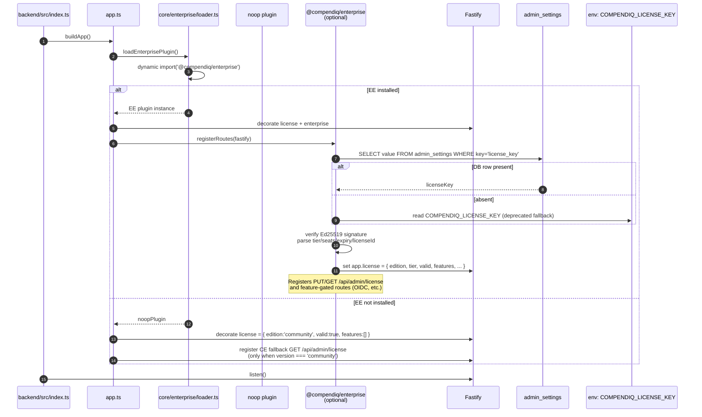
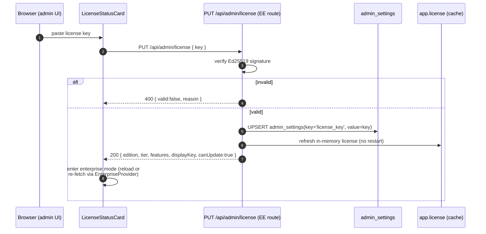
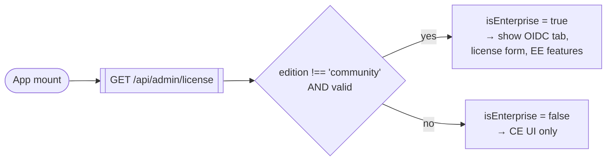

# 10. Enterprise License Flow (Open-Core)

Compendiq ships as an open-core product. CE (this repo) defines the plugin
contract, a noop stub, and the UI surfaces for license management. EE is
published privately as `@compendiq/enterprise` and implements the real
plugin. See `docs/ENTERPRISE-ARCHITECTURE.md` for the full design.

## Boot-time plugin load



## Runtime license update (EE only)



## GET /api/admin/license response shape

| Mode | Response |
|------|----------|
| **CE (noop)** | `{ edition:'community', tier:'community', valid:true, features:[] }` |
| **EE valid**  | `{ edition:'enterprise', tier:'business'\|'enterprise', valid:true, features:[...], displayKey, licenseId, canUpdate:true }` |
| **EE invalid / expired** | `{ edition:'enterprise', valid:false, reason:'expired', canUpdate:true }` |

The frontend uses `canUpdate` to decide whether to render the key-entry
form; CE omits the flag.

## License key format

```
ATM-{tier}-{seats}-{expiryYYYYMMDD}-{licenseId}.{ed25519SignatureBase64url}
```

- **v2** includes `{licenseId}`; **v1** is accepted for backwards compat.
- Signed with an Ed25519 key pair — the public key is compiled into the
  EE plugin; the private key is held by the vendor.
- Persisted in the `admin_settings` table under key `license_key`.
- The `COMPENDIQ_LICENSE_KEY` env var is a **deprecated bootstrap
  fallback** — consulted only when the DB row is absent.

## Frontend gating recap



CE and EE ship the **same frontend image**. There is no IIFE bundle, no
build-time patch, no separate EE SPA. All gating happens at runtime via
`useEnterprise()`.

## Key files (CE side)

| File | Purpose |
|------|---------|
| `backend/src/core/enterprise/types.ts` | `EnterprisePlugin`, `LicenseInfo`, Fastify augmentation |
| `backend/src/core/enterprise/features.ts` | `ENTERPRISE_FEATURES` constants |
| `backend/src/core/enterprise/noop.ts` | Inert CE stub |
| `backend/src/core/enterprise/loader.ts` | Dynamic import + fallback |
| `backend/src/core/types/compendiq-enterprise.d.ts` | Type declaration for the optional EE package |
| `backend/src/routes/foundation/admin.ts` | CE fallback `GET /api/admin/license` |
| `frontend/src/shared/enterprise/context.tsx` | `EnterpriseProvider` |
| `frontend/src/shared/enterprise/use-enterprise.ts` | `useEnterprise()` hook |
| `frontend/src/features/admin/LicenseStatusCard.tsx` | Admin UI for the license |
| `frontend/src/features/admin/OidcSettingsPage.tsx` | EE-gated OIDC config UI |
| `frontend/src/features/auth/OidcCallbackPage.tsx` | EE-gated OIDC callback handler |
| `docker/Dockerfile.enterprise` | Multi-stage Dockerfile template for EE builds |
