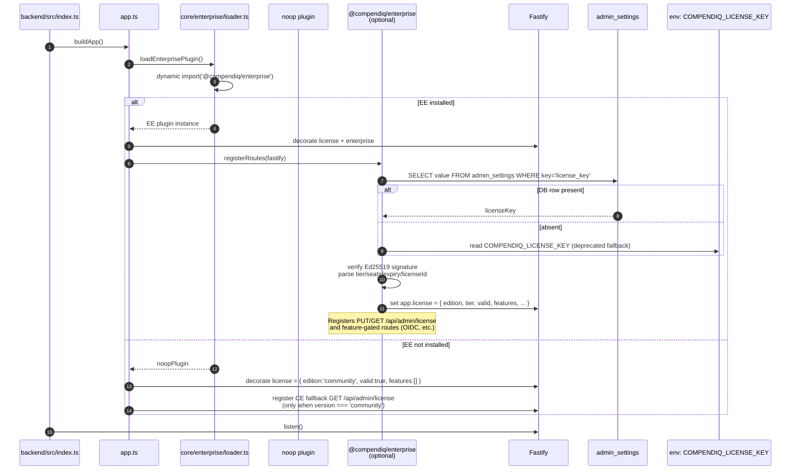
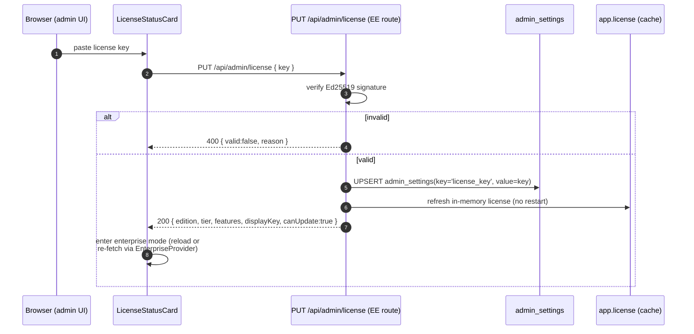
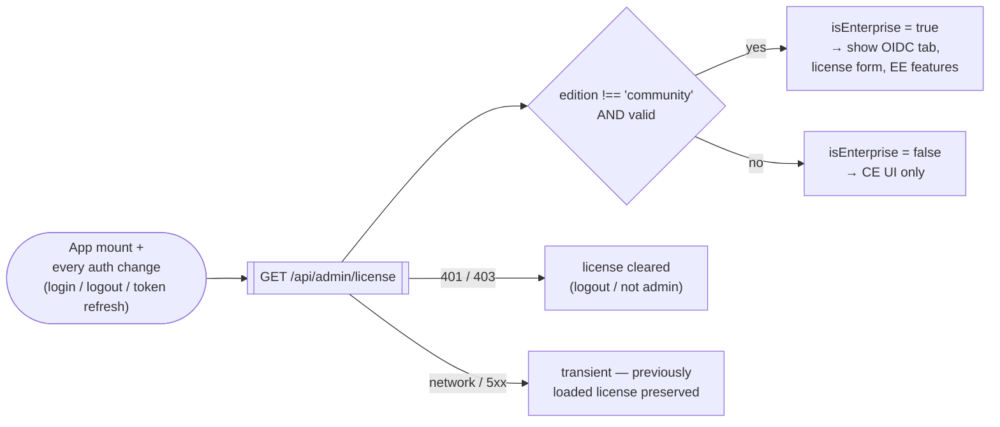
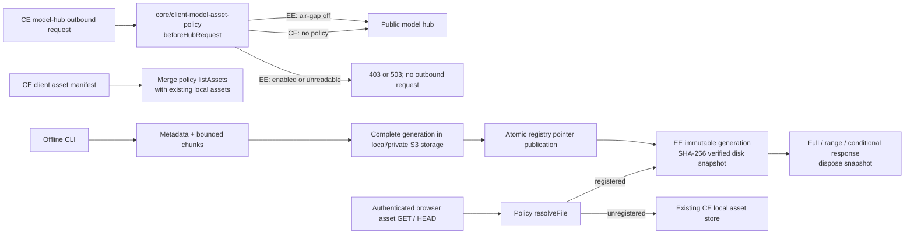
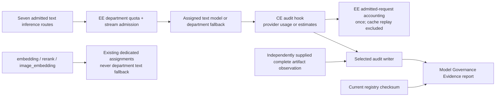

# 10. Enterprise License Flow (Open-Core)

Compendiq ships as an open-core product. CE (this repo) defines the plugin
contract, a noop stub, and the UI surfaces for license management. EE is
published privately as `@compendiq/enterprise` and implements the real
plugin. See `docs/ENTERPRISE-ARCHITECTURE.md` for the full design.

## Boot-time plugin load


```mermaid
sequenceDiagram
    autonumber
    participant I as backend/src/index.ts
    participant A as app.ts
    participant L as core/enterprise/loader.ts
    participant NOOP as noop plugin
    participant EE as @compendiq/enterprise<br/>(optional)
    participant F as Fastify
    participant DB as admin_settings
    participant ENV as env: COMPENDIQ_LICENSE_KEY

    I->>A: buildApp()
    A->>L: loadEnterprisePlugin()
    L->>L: dynamic import('@compendiq/enterprise')
    alt EE installed
        L-->>A: EE plugin instance
        A->>F: decorate license + enterprise
        A->>EE: registerRoutes(fastify)
        EE->>DB: SELECT value FROM admin_settings WHERE key='license_key'
        alt DB row present
            DB-->>EE: licenseKey
        else absent
            EE->>ENV: read COMPENDIQ_LICENSE_KEY (deprecated fallback)
        end
        EE->>EE: verify Ed25519 signature<br/>parse tier/seats/expiry/licenseId
        EE->>F: set app.license = { edition, tier, valid, features, ... }
        Note over EE: Registers PUT/GET /api/admin/license<br/>and feature-gated routes (OIDC, etc.)
    else EE not installed
        L-->>A: noopPlugin
        A->>F: decorate license = { edition:'community', valid:true, features:[] }
        A->>F: register CE fallback GET /api/admin/license<br/>(only when version === 'community')
    end
    I->>F: listen()
```

## Runtime license update (EE only)


```mermaid
sequenceDiagram
    autonumber
    participant Admin as Browser (admin UI)
    participant FE as LicenseStatusCard
    participant BE as PUT /api/admin/license (EE route)
    participant DB as admin_settings
    participant F as app.license (cache)

    Admin->>FE: paste license key
    FE->>BE: PUT /api/admin/license { key }
    BE->>BE: verify Ed25519 signature
    alt invalid
        BE-->>FE: 400 { valid:false, reason }
    else valid
        BE->>DB: UPSERT admin_settings(key='license_key', value=key)
        BE->>F: refresh in-memory license (no restart)
        BE-->>FE: 200 { edition, tier, features, displayKey, canUpdate:true }
        FE->>FE: enter enterprise mode (reload or<br/>re-fetch via EnterpriseProvider)
    end
```

## GET /api/admin/license response shape

| Mode | Response |
|------|----------|
| **CE (noop)** | `{ edition:'community', tier:'community', valid:true, features:[] }` |
| **EE valid**  | `{ edition:'enterprise', tier:'business'\|'enterprise', valid:true, features:[...], displayKey, licenseId, canUpdate:true }` |
| **EE invalid / expired** | `{ edition:'enterprise', valid:false, reason:'expired', canUpdate:true }` |

The frontend uses `canUpdate` to decide whether to render the key-entry
form; CE omits the flag.

## License key format

```
ATM-{tier}-{seats}-{expiryYYYYMMDD}-{licenseId}.{ed25519SignatureBase64url}
```

- **v2** includes `{licenseId}`; **v1** is accepted for backwards compat.
- Signed with an Ed25519 key pair — the public key is compiled into the
  EE plugin; the private key is held by the vendor.
- Persisted in the `admin_settings` table under key `license_key`.
- The `COMPENDIQ_LICENSE_KEY` env var is a **deprecated bootstrap
  fallback** — consulted only when the DB row is absent.

## Frontend gating recap


```mermaid
flowchart LR
    boot(["App mount +<br/>every auth change<br/>(login / logout / token refresh)"]) --> fetch[["GET /api/admin/license"]]
    fetch --> decide{edition !== 'community'<br/>AND valid}
    decide -- yes --> ee["isEnterprise = true<br/>→ show OIDC tab,<br/>license form, EE features"]
    decide -- no  --> ce["isEnterprise = false<br/>→ CE UI only"]
    fetch -- 401 / 403 --> clear["license cleared<br/>(logout / not admin)"]
    fetch -- network / 5xx --> keep["transient — previously<br/>loaded license preserved"]
```

The fetch runs on mount **and whenever the access token changes** (a
post-mount SPA login must flip EE surfaces on without a reload; logout
clears the previous session's license/ui from memory). Only a genuine
auth signal (401/403) clears the license — transient failures (network
error, 5xx) leave the previously loaded license untouched, and the
loading skeleton shows on the initial load only.

CE and EE ship the **same frontend image**. There is no IIFE bundle, no
build-time patch, no separate EE SPA. All gating happens at runtime via
`useEnterprise()`.

### The one edition consumer that does not use `/api/admin/license`

The **login page** is unauthenticated, so it cannot call that admin route at
all. Its edition badge comes from the public
`GET /api/auth/login-page-config`, which reports `'enterprise'` whenever the
loaded plugin is not the noop shim — deliberately derived from the *build*,
not the license, since an EE deployment whose license lapsed is still not
"Community Edition · AGPL-3.0", and claiming otherwise on the sign-in screen
would be a licensing statement we have no grounds for.

`edition` is **optional** in `LoginPageConfigResponseSchema`. An EE stack pins
the CE frontend by image tag (`compendiq-ce-frontend:${CE_TAG:-dev}`) while its
backend is built from an older CE release, so the SPA regularly talks to a
backend predating the field; absent means "unknown" and the badge is omitted
rather than guessed. A required key would throw in `.parse()` and take the
unrelated `variant` down with it.

## Key files (CE side)

| File | Purpose |
|------|---------|
| `backend/src/core/enterprise/types.ts` | `EnterprisePlugin`, `LicenseInfo`, Fastify augmentation |
| `backend/src/core/enterprise/features.ts` | `ENTERPRISE_FEATURES` constants |
| `backend/src/core/enterprise/noop.ts` | Inert CE stub |
| `backend/src/core/enterprise/loader.ts` | Dynamic import + fallback |
| `backend/src/core/types/compendiq-enterprise.d.ts` | Type declaration for the optional EE package |
| `backend/src/app.ts` | CE fallback `GET /api/admin/license` (community-mode inline route) |
| `frontend/src/shared/enterprise/context.tsx` | `EnterpriseProvider` |
| `frontend/src/shared/enterprise/use-enterprise.ts` | `useEnterprise()` hook |
| `frontend/src/features/admin/LicenseStatusCard.tsx` | Admin UI for the license |
| `frontend/src/features/admin/OidcSettingsPage.tsx` | EE-gated OIDC config UI |
| `frontend/src/features/auth/OidcCallbackPage.tsx` | EE-gated OIDC callback handler |
| `docker/Dockerfile.enterprise` | Multi-stage Dockerfile template for EE builds |

## Model registry and inference evidence extension points


```mermaid
flowchart LR
    hub["CE model-hub outbound request"] --> guard["core/client-model-asset-policy<br/>beforeHubRequest"]
    guard -->|CE: no policy| public["Public model hub"]
    guard -->|EE: air-gap off| public
    guard -->|EE: enabled or unreadable| refuse["403 or 503; no outbound request"]
    browser["Authenticated browser asset GET / HEAD"] --> resolver["Policy resolveFile"]
    resolver -->|registered| verify["EE immutable generation<br/>SHA-256 verified disk snapshot"]
    resolver -->|unregistered| local["Existing CE local asset store"]
    verify --> response["Full / range / conditional response<br/>dispose snapshot"]
    manifest["CE client asset manifest"] --> discovery["Merge policy listAssets<br/>with existing local assets"]
    admin["Offline CLI"] --> upload["Metadata + bounded chunks"]
    upload --> stage["Complete generation in local/private S3 storage"]
    stage --> publish["Atomic registry pointer publication"]
    publish --> verify
```

The policy lives in `core/services/client-model-asset-policy.ts`; Community
has no implementation and retains its existing behavior. EE registration
returns an app-lifetime disposer. Every outbound hub fetch checks policy,
including inspection reached through automatic HEAD and each install fetch.
An existing registry entry whose verification fails never falls back to an
unchecked CE copy. Full, ranged, HEAD and conditional responses all verify the
source before serving or returning metadata. Registry snapshots use the data
volume, not the deployment's bounded `/tmp` tmpfs.


```mermaid
flowchart LR
    routes["Seven admitted text inference routes"] --> quota["EE department quota + stream admission"]
    quota --> text["Assigned text model or department fallback"]
    retrieval["embedding / rerank / image_embedding"] --> assigned["Existing dedicated assignments<br/>never department text fallback"]
    text --> audit["CE audit hook<br/>provider usage or estimates"]
    audit --> persist["Selected audit writer"]
    audit --> meter["EE admitted-request accounting<br/>once; cache replay excluded"]
    persist --> evidence["Model Governance Evidence report"]
    observed["Independently supplied complete artifact observation"] --> persist
    registry["Current registry checksum"] --> evidence
```

Summarize, Diagram and Quality use the shared SSE audit lifecycle; inline
completion reports counts without prompt/completion plaintext. Department
accounting is composed once with the selected writer, not repeated inside it.
Only an independently supplied artifact pair can populate checksum/asset
evidence: matching a model name is not an observation. Registry checksum
agreement is not proof of execution or network isolation. No browser audit
producer is introduced by these hooks.

The shared `ReportId` contract and `ComplianceReportsTab` include
`model_governance`; the live backend's `available` list controls generation.
There is no EE frontend overlay. The EE report states retained audit coverage
and ships CSV plus an unsigned checksum PDF cover in a ZIP.
