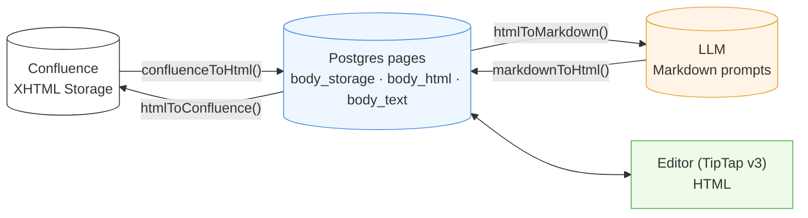
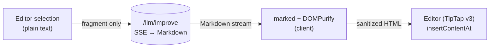

# 11. Content Format Pipeline

Confluence Data Center 9.2 exposes its pages in **XHTML Storage Format**
only — no ADF, no REST API v2. Compendiq normalizes this into three
representations that flow through the rest of the system.

## Representations

| Form | Stored in | Consumed by |
|------|-----------|-------------|
| **XHTML Storage** | `pages.body_storage` | Round-trip to Confluence (push-back not yet enabled in CE, but retained for fidelity) |
| **HTML (clean)** | `pages.body_html` | TipTap editor, viewer UI, diff UI |
| **Plain text** | `pages.body_text` | Embedding input, FTS (`tsvector`) |
| **Markdown** | not stored — derived per call | LLM prompts (Ollama / OpenAI) |

## Flow



## Conversion rules

Implemented in `backend/src/core/services/content-converter.ts` using
`turndown` + `jsdom` + `turndown-plugin-gfm`.

Custom turndown rules handle Confluence-specific macros:

| Confluence macro                     | HTML form                                                    | Markdown form                 |
|--------------------------------------|--------------------------------------------------------------|-------------------------------|
| `ac:structured-macro[code]`          | `<pre><code class="language-x">`                             | ` ```x … ``` ` fenced block   |
| `ac:task-list`                       | `<ul data-task-list>`                                        | `- [ ]` / `- [x]`             |
| `ac:panel` (info/note/warn)          | `<div class="panel panel-…">`                                | `> **INFO:** …` block-quote   |
| `ri:user`                            | `<span class="confluence-user-mention" data-username="…">@user</span>` | `@user` (inline) |
| `ri:page`                            | `<a data-page-link>`                                         | `[title](compendiq://page/ID)` |
| `ac:structured-macro[drawio]`        | ``                                          | ``  |
| `ac:structured-macro[jira]`          | `<span class="confluence-jira-issue" data-key="…">[JIRA: KEY]</span>` | `[JIRA: KEY]` (inline) |
| `ac:structured-macro[include]`       | `<div class="confluence-include-macro" data-page-title="…">[Include: …]</div>` | `[Include: …]` placeholder |
| `ac:structured-macro[excerpt-include]` | `<div class="confluence-include-macro" data-macro-name="excerpt-include">[Excerpt: …]</div>` | `[Excerpt: …]` placeholder |
| `ac:structured-macro[toc]`           | `<div class="confluence-toc" data-maxlevel="…">[Table of Contents]</div>` | `[Table of Contents]` placeholder |
| `ac:structured-macro[labels]`        | dropped on import (page metadata, no body)                   | — (not rendered)              |

### Round-trip notes (issue #300)

- `<ri:user/>` is emitted by Confluence in self-closing form. Because we
  parse storage XHTML with JSDOM in `text/html` mode (void-element rules
  apply), adjacent self-closing `<ri:user/>` tags would nest and swallow
  surrounding text. The forward path pre-expands self-closing
  `ri:user` / `ri:page` / `ri:attachment` / `ri:url` / `ac:emoticon`
  tags into explicit close-tag form before parsing.
- Confluence's canonical on-disk shape for a mention is
  `<ac:link><ri:user .../></ac:link>`. The forward `ac:link` handler
  detects a nested `ri:user` and unwraps the link, delegating to the
  `ri:user` handler so a second round-trip (edit → push-back → re-pull)
  still produces a mention span instead of an empty `<a>`.
- `jira`, `include`, `excerpt-include`, and `toc` all round-trip
  losslessly by stashing the original parameters on `data-*` attributes
  of the placeholder element; `htmlToConfluence` reads them back to
  reconstruct the `<ac:structured-macro>` with its parameters. The
  anonymous `<ac:parameter><ri:page/></ac:parameter>` inside `include` /
  `excerpt-include` is emitted without an `ac:name=""` attribute to
  match the source format byte-for-byte.

## Why store three forms?

- **`body_storage` (XHTML)** — lossless round-trip with Confluence; any
  future write-back needs the exact original serialization.
- **`body_html`** — what the viewer and TipTap editor consume; already
  sanitized so we don't run the converter on every render.
- **`body_text`** — stripped of all tags; the input both to the embedding
  pipeline and to the PostgreSQL `tsvector` column for hybrid search.

Markdown is regenerated on demand because (a) LLM prompt sizes vary by
model so partial/windowed serialisation is common, and (b) the conversion
is cheap compared to the LLM call itself.

## Client-side Markdown → HTML (inline selection improve, #708)

`markdownToHtml()` normally runs on the **backend** when an `/ai`-page
improvement is applied. The editor's **inline selection improve** (the
Notion-style bubble menu) introduces a second, **client-side** path:
`/llm/improve` streams Markdown for the selected fragment, and the editor
converts it to HTML in the browser before `insertContentAt` replaces the
captured range.

- Conversion: `marked` (already a frontend dep) → DOMPurify, in
  `frontend/src/shared/components/article/improve-markdown.ts`. A lone
  wrapping `<p>` is unwrapped for in-place replacement so a mid-sentence
  selection doesn't gain a block break; "Insert below" keeps the block HTML.
- The request sends **only** the selected text as `content`, with `pageId` /
  `includeSubPages` omitted — so the backend skips whole-page/sub-page
  context assembly and writes **no** `llm_improvements` row (selection edits
  are ephemeral previews, accepted via the normal editor draft/save flow).



## AI Improve media protection (#723)

The `/llm/improve` → Accept round-trip runs `body_html` through
`htmlToMarkdown()` before the LLM and `markdownToHtml()` after — a lossy
path that discards `` attributes, draw.io wrappers, and layout
structure. Two safeguards prevent media from being destroyed:

### Placeholder protection (Improve request)

`protectMedia(html)` (exported from `content-converter.ts`) replaces every
`img`, `div.confluence-drawio`, `div.confluence-mermaid`, `div.mermaid`,
`div.confluence-section`, and `div.confluence-column` with an opaque token
`CQ_MEDIA_PLACEHOLDER_<N>` before `htmlToMarkdown()`. Tokens use only
`[A-Z_0-9]` so they survive turndown, `sanitizeLlmInput`, and the LLM
verbatim. The replacement map is returned alongside the protected HTML; the
index is document order, making it deterministic.

`assembleContextIfNeeded` in `_helpers.ts` applies `protectMedia` when the
caller passes `opts.protectMedia = true` (set by `llmImproveRoutes`).

### Restore + drop-guard (Accept)

On `POST /llm/improvements/apply` the route:

1. Re-derives the same token map from the **current** `body_html` stored in
   the DB (same deterministic order — no token map needs to be persisted).
2. Calls `markdownToHtml(improvedMarkdown)` on the LLM output.
3. Calls `restoreMedia(html, media)` to replace tokens (and their
   turndown-escaped variants `CQ\_MEDIA\_PLACEHOLDER\_N`) with the original
   HTML verbatim.
4. Appends any media entries whose HTML is still missing after restoration
   (LLM dropped the token entirely) and logs a warning.

### Lossless confluence-drawio turndown rule

A custom turndown rule in `htmlToMarkdown()` converts
`<div class="confluence-drawio" data-diagram-name="…">` to a fenced
` ```drawio\nNAME\n``` ` block instead of discarding the wrapper.
`markdownToHtml()` post-processes the emitted
`<pre><code class="language-drawio">NAME</code></pre>` back into the
`<div class="confluence-drawio" data-diagram-name="NAME"></div>` wrapper so
non-Improve callers (copy/paste, export) also round-trip draw.io losslessly.

| Custom rule | HTML form | Markdown form |
|-------------|-----------|---------------|
| `confluenceDrawio` | `<div class="confluence-drawio" data-diagram-name="…">` | ` ```drawio\nNAME\n``` ` |

## Attachments

Images, drawio diagrams, and PDFs are downloaded during sync to
`ATTACHMENTS_DIR` (default `data/attachments`) and rewritten to
Compendiq-local URLs in `body_html`. The original Confluence URLs are
kept in a sidecar table (`image_references`) for reconciliation.

See [`08-flow-sync.md`](./08-flow-sync.md) for where this hooks into the
sync pipeline.
