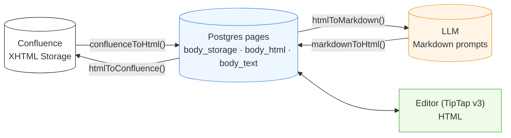
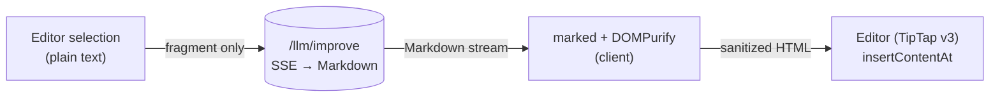

# 11. Content Format Pipeline

Confluence Data Center 9.2 exposes its pages in **XHTML Storage Format**
only — no ADF, no REST API v2. Compendiq normalizes this into three
representations that flow through the rest of the system.

## Representations

| Form | Stored in | Consumed by |
|------|-----------|-------------|
| **XHTML Storage** | `pages.body_storage` | Round-trip to Confluence (push-back not yet enabled in CE, but retained for fidelity) |
| **HTML (clean)** | `pages.body_html` | TipTap editor, viewer UI, diff UI |
| **Plain text** | `pages.body_text` | Embedding input, FTS (`tsvector`) |
| **Markdown** | not stored — derived per call | LLM prompts (Ollama / OpenAI) |

## Flow



## Conversion rules

Implemented in `backend/src/core/services/content-converter.ts` using
`turndown` + `jsdom` + `turndown-plugin-gfm`.

Custom turndown rules handle Confluence-specific macros:

| Confluence macro                     | HTML form                                                    | Markdown form                 |
|--------------------------------------|--------------------------------------------------------------|-------------------------------|
| `ac:structured-macro[code]`          | `<pre><code class="language-x">`                             | ` ```x … ``` ` fenced block   |
| `ac:task-list`                       | `<ul data-task-list>`                                        | `- [ ]` / `- [x]`             |
| `ac:panel` (info/note/warn)          | `<div class="panel panel-…">`                                | `> **INFO:** …` block-quote   |
| `ri:user`                            | `<span class="confluence-user-mention" data-username="…">@user</span>` | `@user` (inline) |
| `ri:page`                            | `<a data-page-link>`                                         | `[title](compendiq://page/ID)` |
| `ac:structured-macro[drawio]`        | ``                                          | ``  |
| `ac:structured-macro[jira]`          | `<span class="confluence-jira-issue" data-key="…">[JIRA: KEY]</span>` | `[JIRA: KEY]` (inline) |
| `ac:structured-macro[include]`       | `<div class="confluence-include-macro" data-page-title="…">[Include: …]</div>` | `[Include: …]` placeholder |
| `ac:structured-macro[excerpt-include]` | `<div class="confluence-include-macro" data-macro-name="excerpt-include">[Excerpt: …]</div>` | `[Excerpt: …]` placeholder |
| `ac:structured-macro[toc]`           | `<div class="confluence-toc" data-maxlevel="…">[Table of Contents]</div>` | `[Table of Contents]` placeholder |
| `ac:structured-macro[labels]`        | `<div class="confluence-labels-macro" data-showlabels="…">[Labels]</div>` (#765; was dropped per #348) | `[Labels]` placeholder; opaque-protected on Improve |
| `ac:layout` / `ac:layout-section` / `ac:layout-cell` | `div.confluence-layout` / `div.confluence-layout-section[data-layout-type]` / `div.confluence-layout-cell` | flattened content (default); `[[[LAYOUT]]]` / `[[[LAYOUT-SECTION type]]]` / `[[[LAYOUT-CELL]]]` boundary tokens with `{ layoutTokens: true }` (#765, Improve only) |
| `ac:structured-macro[section]` / `[column]` (legacy) | `div.confluence-section[data-border]` / `div.confluence-column[data-cell-width]` | flattened content (default); `[[[SECTION border=…]]]` / `[[[COLUMN width=…]]]` boundary tokens with `{ layoutTokens: true }` (#765, Improve only) |

### Round-trip notes (issue #300)

- `<ri:user/>` is emitted by Confluence in self-closing form. Because we
  parse storage XHTML with JSDOM in `text/html` mode (void-element rules
  apply), adjacent self-closing `<ri:user/>` tags would nest and swallow
  surrounding text. The forward path pre-expands self-closing
  `ri:user` / `ri:page` / `ri:attachment` / `ri:url` / `ac:emoticon`
  tags into explicit close-tag form before parsing.
- Confluence's canonical on-disk shape for a mention is
  `<ac:link><ri:user .../></ac:link>`. The forward `ac:link` handler
  detects a nested `ri:user` and unwraps the link, delegating to the
  `ri:user` handler so a second round-trip (edit → push-back → re-pull)
  still produces a mention span instead of an empty `<a>`.
- `jira`, `include`, `excerpt-include`, and `toc` all round-trip
  losslessly by stashing the original parameters on `data-*` attributes
  of the placeholder element; `htmlToConfluence` reads them back to
  reconstruct the `<ac:structured-macro>` with its parameters. The
  anonymous `<ac:parameter><ri:page/></ac:parameter>` inside `include` /
  `excerpt-include` is emitted without an `ac:name=""` attribute to
  match the source format byte-for-byte.

## Why store three forms?

- **`body_storage` (XHTML)** — lossless round-trip with Confluence; any
  future write-back needs the exact original serialization.
- **`body_html`** — what the viewer and TipTap editor consume; already
  sanitized so we don't run the converter on every render.
- **`body_text`** — stripped of all tags; the input both to the embedding
  pipeline and to the PostgreSQL `tsvector` column for hybrid search.

Markdown is regenerated on demand because (a) LLM prompt sizes vary by
model so partial/windowed serialisation is common, and (b) the conversion
is cheap compared to the LLM call itself.

## Client-side Markdown → HTML (inline selection improve, #708)

`markdownToHtml()` normally runs on the **backend** when an `/ai`-page
improvement is applied. The editor's **inline selection improve** (the
Notion-style bubble menu) introduces a second, **client-side** path:
`/llm/improve` streams Markdown for the selected fragment, and the editor
converts it to HTML in the browser before `insertContentAt` replaces the
captured range.

- Conversion: `marked` (already a frontend dep) → DOMPurify, in
  `frontend/src/shared/components/article/improve-markdown.ts`. A lone
  wrapping `<p>` is unwrapped for in-place replacement so a mid-sentence
  selection doesn't gain a block break; "Insert below" keeps the block HTML.
- The request sends **only** the selected text as `content`, with `pageId` /
  `includeSubPages` omitted — so the backend skips whole-page/sub-page
  context assembly and writes **no** `llm_improvements` row (selection edits
  are ephemeral previews, accepted via the normal editor draft/save flow).



## AI Improve media protection (#723)

The `/llm/improve` → Accept round-trip runs `body_html` through
`htmlToMarkdown()` before the LLM and `markdownToHtml()` after — a lossy
path that would discard `` attributes, draw.io wrappers, and layout
structure. Two safeguards prevent media from being destroyed (layout
structure has its own mechanism — see the next section):

### Placeholder protection (Improve request)

`protectMedia(html)` (exported from `content-converter.ts`) replaces every
`img`, `div.confluence-drawio`, `div.confluence-mermaid`, `div.mermaid`,
and `div.confluence-labels-macro` with an opaque token
`CQ_MEDIA_PLACEHOLDER_<N>` before `htmlToMarkdown()`. Tokens use only
`[A-Z_0-9]` so they survive turndown, `sanitizeLlmInput`, and the LLM
verbatim. The replacement map is returned alongside the protected HTML; the
index is document order, making it deterministic. (#765: legacy
`div.confluence-section` / `div.confluence-column` were removed from this
selector — opaque protection froze the prose inside them; they now use
layout boundary tokens instead so the LLM can still edit the content.
Exception: a legacy section/column nested inside a `td`, `th`, `li`,
`blockquote`, or panel div **stays opaque-frozen** — a boundary token line
inside such a construct would be ripped out of it by the token
normalization, e.g. splitting a GFM table row.)

`assembleContextIfNeeded` in `_helpers.ts` applies `protectMedia` when the
caller passes `opts.protectMedia = true` (set by `llmImproveRoutes`).

### Restore + drop-guard (Accept)

On `POST /llm/improvements/apply` the route:

1. Re-derives the same token map from the **current** `body_html` stored in
   the DB (same deterministic order — no token map needs to be persisted).
2. Calls `markdownToHtml(improvedMarkdown)` on the LLM output.
3. Calls `restoreMedia(html, media)` to replace tokens (and their
   turndown-escaped variants `CQ\_MEDIA\_PLACEHOLDER\_N`) with the original
   HTML verbatim.
4. Appends any media entries whose HTML is still missing after restoration
   (LLM dropped the token entirely) and logs a warning.

### Lossless confluence-drawio turndown rule

A custom turndown rule in `htmlToMarkdown()` converts
`<div class="confluence-drawio" data-diagram-name="…">` to a fenced
` ```drawio\nNAME\n``` ` block instead of discarding the wrapper.
`markdownToHtml()` post-processes the emitted
`<pre><code class="language-drawio">NAME</code></pre>` back into the
`<div class="confluence-drawio" data-diagram-name="NAME"></div>` wrapper so
non-Improve callers (copy/paste, export) also round-trip draw.io losslessly.

| Custom rule | HTML form | Markdown form |
|-------------|-----------|---------------|
| `confluenceDrawio` | `<div class="confluence-drawio" data-diagram-name="…">` | ` ```drawio\nNAME\n``` ` |

## AI Improve layout preservation — boundary tokens (#765)

Confluence row/column layouts (modern `ac:layout` grids and the legacy
`section` / `column` macros) have no Markdown representation, so the Improve
round-trip used to flatten them to a single column. They cannot use the
opaque `protectMedia` tokens because — unlike media — layout cells contain
**prose the LLM must still be able to improve**.

Instead, `htmlToMarkdown()` — **only when called with
`{ layoutTokens: true }`** — emits **boundary tokens** as standalone lines
around the (still fully editable) cell content:

```text
[[[LAYOUT]]]
[[[LAYOUT-SECTION two_equal]]]
[[[LAYOUT-CELL]]]
…normal editable Markdown…
[[[/LAYOUT-CELL]]]
[[[/LAYOUT-SECTION]]]
[[[/LAYOUT]]]

[[[SECTION border=true]]] … [[[/SECTION]]]   ← legacy ac:section macro
[[[COLUMN width=50%]]]    … [[[/COLUMN]]]    ← legacy ac:column macro
```

`layoutTokens` is set solely by the Improve route's main-page conversion
(`assembleContextIfNeeded` in `routes/llm/_helpers.ts`). Every other
`htmlToMarkdown` caller — quality scoring, auto-tagging, diagram context,
version-compare summaries, sub-page context, page imports — keeps the
default flattened output, so raw `[[[…]]]` tokens never leak into prompts
or user-visible text. Sub-page context in particular must stay token-free
even within the Improve flow: a truncated sub-page token sequence could be
echoed by the model into the parent page's output and build layout that
never existed on the parent. Legacy sections/columns nested inside
markdown-constrained containers (`td`/`th`/`li`/`blockquote`/panels) never
emit tokens either — they stay opaque-frozen via `protectMedia` (see above).

Tokens carry the structural attributes (`data-layout-type`, `data-border`,
`data-cell-width`). `markdownToHtml()` then:

1. normalizes the Markdown so every token sits in its own paragraph (in case
   the LLM merged adjacent token lines), skipping fenced/inline code so
   literal token text in code is never touched;
2. validates the whole token sequence for **balance and nesting** (a
   `LAYOUT-SECTION` may only open directly inside a `LAYOUT`, a `COLUMN`
   only inside a `SECTION`, …);
3. if valid, converts the token paragraphs back into the
   `div.confluence-layout*` / `div.confluence-section` /
   `div.confluence-column` wrappers (which `htmlToConfluence()` already maps
   losslessly to `ac:layout*` / `section` / `column`);
4. **drop-guard:** if the LLM mangled the tokens (unbalanced, reordered,
   case-changed), ALL tokens are stripped instead — the content degrades to
   the old flattened form, but the page is never corrupted and raw
   `[[[…]]]` text never reaches the saved page.

Steps 2–4 operate only **outside `<pre>`/`<code>` elements**: literal token
text inside code blocks (e.g. documentation about the token syntax) is
data, never rebuilt into layout divs, never stripped, and never able to
poison the balance validation of the real tokens.

`/llm/improve` appends `STRUCTURE_PRESERVATION_INSTRUCTION` (from
`prompts.ts`) to the system prompt whenever the markdown contains boundary
or media tokens, instructing the model to keep them verbatim.

The in-body **labels macro** is the opposite case: it is atomic (no editable
prose), so since #765 it is kept as a
`<div class="confluence-labels-macro">` placeholder on sync-in (it was
previously dropped per #348, which silently deleted the widget from the
Confluence page on any write-back) and opaque-protected through Improve via
`protectMedia`. Page-label *metadata* (`pages.labels`) is unaffected by
Improve: the apply handler never touches the column and the Confluence
`updatePage` call sends only title+body, which does not modify labels
server-side.

## Attachments

Images, drawio diagrams, and PDFs are downloaded during sync to
`ATTACHMENTS_DIR` (default `data/attachments`) and rewritten to
Compendiq-local URLs in `body_html`. The original Confluence URLs are
kept in a sidecar table (`image_references`) for reconciliation.

See [`08-flow-sync.md`](./08-flow-sync.md) for where this hooks into the
sync pipeline.
