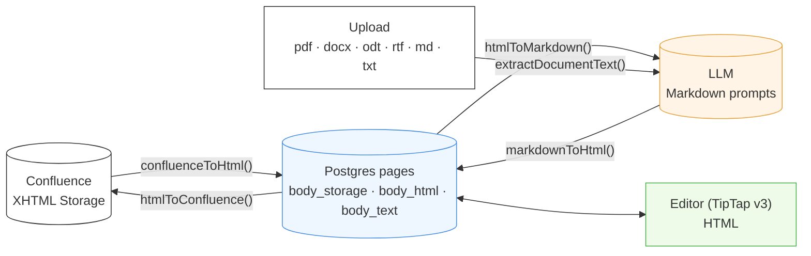
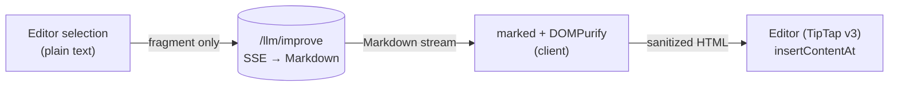

# 11. Content Format Pipeline

Confluence Data Center 9.2 exposes its pages in **XHTML Storage Format**
only — no ADF, no REST API v2. Compendiq normalizes this into three
representations that flow through the rest of the system.

## Representations

| Form | Stored in | Consumed by |
|------|-----------|-------------|
| **XHTML Storage** | `pages.body_storage` | Round-trip to Confluence. Push-back **is** live in CE: `POST /api/pages` calls `createPage()` and `PUT /api/pages/:id` calls `updatePage()` for Confluence-sourced pages. Standalone articles leave it `NULL` until they are relocated into Confluence (#1123). |
| **HTML (clean)** | `pages.body_html` | TipTap editor, viewer UI, diff UI |
| **Plain text** | `pages.body_text` | Embedding input, FTS (`tsvector`) |
| **Markdown** | not stored — derived per call | LLM prompts (Ollama / OpenAI) |
| **Uploaded document** | not stored — discarded after extraction | LLM reference material (AI Improve / AI Generate upload) |

## Flow


```mermaid
flowchart LR
    CF[("Confluence<br/>XHTML Storage")]
    DB[("Postgres pages<br/>body_storage · body_html · body_text")]
    LLM[("LLM<br/>Markdown prompts")]
    ED["Editor (TipTap v3)<br/>HTML"]

    UP["Upload<br/>pdf · docx · odt · rtf · md · txt"]

    CF -- "confluenceToHtml()" --> DB
    DB -- "htmlToConfluence()" --> CF
    DB -- "htmlToMarkdown()" --> LLM
    LLM -- "markdownToHtml()" --> DB
    DB <--> ED
    UP -- "extractDocumentText()" --> LLM

    classDef ext fill:#fff,stroke:#333
    classDef data fill:#eef6ff,stroke:#4a90e2
    classDef ai fill:#fff4e5,stroke:#e5a23c
    classDef ui fill:#eefbe8,stroke:#4caf50
    class CF ext
    class UP ext
    class DB data
    class LLM ai
    class ED ui
```

## Conversion rules

Implemented in `backend/src/core/services/content-converter.ts` using
`turndown` + `jsdom` + `turndown-plugin-gfm`.

Custom turndown rules handle Confluence-specific macros:

| Confluence macro                     | HTML form                                                    | Markdown form                 |
|--------------------------------------|--------------------------------------------------------------|-------------------------------|
| `ac:structured-macro[code]`          | `<pre><code class="language-x">`                             | ` ```x … ``` ` fenced block   |
| `ac:task-list`                       | `<ul data-task-list>`                                        | `- [ ]` / `- [x]`             |
| `ac:panel` (info/note/warn)          | `<div class="panel panel-…">`                                | `> **INFO:** …` block-quote   |
| `ac:structured-macro[expand]` and `[ui-expand]` (Refined) | `<details data-macro-name="expand\|ui-expand" data-macro-params="{…}">` + `<summary>` holding the `title` param (#1211: the identity stamp lets the reverse pass write back the producing macro's `ac:name` — absent defaults to `expand`, an unrecognised value passes through, never coerced — so both macros survive editor saves). `ui-expand`'s `expanded` param maps to the `open` attribute and lives there only (#1129) | flattened content by default; opaque-protected on Improve (#1221 stage 1 — `details` has no turndown rule, so without the freeze the Improve round-trip flattened the section to bare paragraphs and the macro was deleted on write-back) |
| `ri:user`                            | `<span class="confluence-user-mention" data-username="…">@user</span>` | `@user` (inline) |
| `ri:page`                            | `<a data-page-link>`                                         | `[title](compendiq://page/ID)` |
| `ac:structured-macro[drawio]`        | ``                                          | ``  |
| `ac:structured-macro[jira]`          | `<span class="confluence-jira-issue" data-key="…">[JIRA: KEY]</span>` | `[JIRA: KEY]` (inline) |
| `ac:structured-macro[include]`       | `<div class="confluence-include-macro" data-page-title="…">[Include: …]</div>` | `[Include: …]` placeholder |
| `ac:structured-macro[excerpt-include]` | `<div class="confluence-include-macro" data-macro-name="excerpt-include">[Excerpt: …]</div>` | `[Excerpt: …]` placeholder |
| `ac:structured-macro[toc]`           | `<div class="confluence-toc" data-maxlevel="…">[Table of Contents]</div>` | `[Table of Contents]` placeholder |
| `ac:structured-macro[labels]`        | `<div class="confluence-labels-macro" data-showlabels="…">[Labels]</div>` (#765; was dropped per #348) | `[Labels]` placeholder; opaque-protected on Improve |
| `ac:layout` / `ac:layout-section` / `ac:layout-cell` | `div.confluence-layout` / `div.confluence-layout-section[data-layout-type]` / `div.confluence-layout-cell` | flattened content (default); `[[[LAYOUT]]]` / `[[[LAYOUT-SECTION type]]]` / `[[[LAYOUT-CELL]]]` boundary tokens with `{ layoutTokens: true }` (#765, Improve only) |
| `ac:structured-macro[section]` / `[column]` (legacy) | `div.confluence-section[data-border]` / `div.confluence-column[data-cell-width]` | flattened content (default); `[[[SECTION border=…]]]` / `[[[COLUMN width=…]]]` boundary tokens with `{ layoutTokens: true }` (#765, Improve only) |
| any other macro (catch-all) | `<div class="confluence-macro-unknown" data-macro-name="…" data-macro-params="{…}">` (#865; was lossy) | placeholder; opaque-protected on Improve |

### Round-trip notes (issue #300)

- `<ri:user/>` is emitted by Confluence in self-closing form. Because we
  parse storage XHTML with JSDOM in `text/html` mode (void-element rules
  apply), adjacent self-closing `<ri:user/>` tags would nest and swallow
  surrounding text. The forward path pre-expands self-closing
  `ri:user` / `ri:page` / `ri:attachment` / `ri:url` / `ac:emoticon`
  tags into explicit close-tag form before parsing.
- Confluence's canonical on-disk shape for a mention is
  `<ac:link><ri:user .../></ac:link>`. The forward `ac:link` handler
  detects a nested `ri:user` and unwraps the link, delegating to the
  `ri:user` handler so a second round-trip (edit → push-back → re-pull)
  still produces a mention span instead of an empty `<a>`.
- `jira`, `include`, `excerpt-include`, and `toc` all round-trip
  losslessly by stashing the original parameters on `data-*` attributes
  of the placeholder element; `htmlToConfluence` reads them back to
  reconstruct the `<ac:structured-macro>` with its parameters. The
  anonymous `<ac:parameter><ri:page/></ac:parameter>` inside `include` /
  `excerpt-include` is emitted without an `ac:name=""` attribute to
  match the source format byte-for-byte.
- Every macro with no dedicated handler falls through to the catch-all
  `div.confluence-macro-unknown` placeholder (#865). It also round-trips:
  `data-macro-name` restores `ac:name`, and text-valued `ac:parameter`s are
  stashed as a JSON `data-macro-params` attribute and rebuilt on write-back.
  The rich-text-body is re-wrapped; a body-less macro (rendered as the
  `[Confluence macro: name]` placeholder) is emitted without a body rather
  than embedding the placeholder text. Before #865 the reverse pass had no
  handler for this div, so opening a synced page with any unhandled macro in
  the editor and saving (or applying Improve / publishing a draft / restoring
  a version) permanently deleted the macro from the Confluence page.
- **A macro's parameters are its direct `ac:parameter` children** (#1222).
  `ac:parameter` is a direct child of `ac:structured-macro` by storage-format
  schema, so the forward pass scopes every named-parameter lookup to direct
  children. A descendant-wide search let a macro read a *nested* macro's
  parameter — an untitled `expand` took a nested expand's (or a nested `status`
  badge's) `title`, `section` took a nested macro's `border`, `column` its
  `width`, which also landed in an inline flex style — and the reverse pass then
  persisted that value onto the outer macro as a parameter the Confluence page
  never had. This was never limited to the handlers that render a body: any
  macro whose source element contains another macro could be the victim (`toc`,
  `jira`, `labels`, `attachments`, `children`, `drawio` and `status` were all
  demonstrated), and storage XHTML is API-writable, so the nesting is reachable
  even where Confluence's own editor would not produce it. Which macros could
  *donate* a value was an accident of handler order, not a rule: a nested `code`
  macro is already replaced by the time the expand branch looks, a nested
  `status` macro is not. The anonymous `<ac:parameter><ri:page/></ac:parameter>`
  inside `include` / `excerpt-include` is unaffected — it is read by walking
  `ri:page`, not by name. The fix corrects new conversions only; a stolen value
  already baked into stored `body_html` stays until that page is re-synced.
- **`ac:parameter` is in the self-closing pre-expansion list** (#1222 review),
  and the rule above depends on it. "Direct child by schema" is only a *DOM*
  guarantee once the tag closes: a value-less parameter is empty, so an XML
  serializer may write `<ac:parameter ac:name="subtle"/>`, and under the HTML
  parser that element swallows every parameter after it — and the
  `ac:rich-text-body` — as children. So the macro's remaining parameters became
  grandchildren (dropped by a direct-child lookup, though the old descendant
  search still found them), and an empty `title` parameter absorbed the body,
  titling the section with its own opening prose. Expanding the tag closes both.
- `<details>` carries its producing macro's identity (#1211):
  the forward expand branch stamps `data-macro-name="expand"` (plus
  non-`title` parameters as JSON `data-macro-params`; `title` lives in
  `<summary>` only), and the reverse pass writes that value back as
  `ac:name` — defaulting to `expand` when absent (safe: only the native
  expand branch has ever produced `<details>`, so stored `body_html` and
  editor-created sections are all genuinely expands) and passing an
  unrecognised value through rather than coercing it. Without the stamp, the
  second macro mapping to `<details>` (#1129, Refined "UI Expand") would be
  silently rewritten into a native expand on the first editor save. The
  reverse loop converts sections **innermost-first** and reads only a
  direct-child `<summary>`: Confluence supports expand-inside-expand, and
  because each macro body is rebuilt by re-parsing `innerHTML`, an
  outer-first pass would ship the still-raw inner `<details>` to Confluence
  as a literal HTML element (and a summary-less outer could steal the
  nested section's title).
- **Refined's "UI Expand" is the second macro on `<details>` (#1129).**
  `ui-expand` comes from the Refined Macro Toolkit and is a different macro
  from Atlassian's native `expand`, not a rename. Verified against a
  Confluence DC 9.2.19 instance with the app installed: the key is bare
  `ui-expand` (the `rw-ui-expands-macro` / `rw-expand` spellings in Refined's
  own docs are their **Cloud** renderer's internals and never appear in DC
  storage format), and the element shape is identical to the native macro — a
  `title` parameter plus `ac:rich-text-body`, flat siblings rather than a
  container macro. It differs in exactly one thing: an `expanded` parameter
  for a default-open section. That maps to the `<details>` `open` attribute
  and lives **there only** — the forward pass deletes it from
  `data-macro-params` the way it deletes `title`, so a user toggling the
  section in the editor cannot leave a stale copy riding along beside the
  attribute. Write-back emits the parameter **only when open**: DC omits it
  entirely on a collapsed section rather than writing `expanded=false`, so
  emitting one would hand every collapsed section a parameter it never had.
  The mapping is keyed on the macro name, so `open` on a *native* expand stays
  inert — Atlassian's macro has no such parameter, and the editor both forces
  every `<details>` open in edit mode and toggles the attribute on a summary
  click, so an `open` native section is reachable and must not fabricate one.
  Refined's bodies carry its own classed markup (`ordered-list top_level`,
  `rw_adf_text_strong`); that rides through as ordinary body HTML, but we have
  no rule for those classes, so `rw_adf_text_strong` renders as plain text
  rather than bold.
- **`<details>` is frozen whole on the Improve path (#1221 stage 1).**
  `MEDIA_SELECTOR` lists `details`, so `protectMedia` swaps each expand
  section for an opaque token before the HTML→Markdown→HTML round-trip and
  `restoreMedia` puts it back verbatim. Without it the section was flattened
  into bare paragraphs — `<summary>` became prose, the `data-macro-name`
  stamp was lost, and `htmlToConfluence` rebuilt no macro, so applying an
  Improve permanently deleted the expand from the Confluence page. The freeze
  is outermost-first: nested expands, and any media or macro placeholders
  inside a section, ride along in the one capture (`details` is in
  `protectMedia`'s descendant-skip list). The tradeoff is the one #865 already
  accepted — **AI Improve no longer rewrites the prose inside a collapsible
  section** — and it is strictly better than improving that prose and then
  deleting the section holding it. A model that drops the token entirely is
  caught by the apply route's drop-guard, which re-appends the section at the
  end of the body: preserved, but relocated. Stage 2 (#1221) makes the freeze
  conditional and carries expand boundaries as `[[[EXPAND …]]]` layout tokens
  where the position allows, restoring improvability. Non-Improve flows never
  call `protectMedia`, so they still flatten `<details>` as before.
- **Editor schema must stay in sync with these placeholders (#857).**
  The round-trip only holds if the TipTap ProseMirror schema has a node
  whose `parseHTML` matches each placeholder (`panel-*`,
  `confluence-toc`, `confluence-jira-issue`, `confluence-include-macro`,
  `confluence-labels-macro`, `confluence-macro-unknown`,
  `confluence-user-mention`) and whose `renderHTML` re-emits the same
  class + `data-*` attributes. The `details` node likewise declares
  `macroName`/`macroParams` (#1211) — ProseMirror serializes only declared
  attributes, so dropping those declarations silently reintroduces the
  rewrite bug. ProseMirror silently unwraps any element
  with no matching parse rule, so a placeholder the editor doesn't know
  about is dropped from `getHTML()` and then permanently deleted from the
  Confluence page on the next save. The edit-mode schema
  (`Editor.tsx`) and the read-only schema (`ArticleViewer.tsx`) both draw
  these nodes from `article-extensions.ts` — any new converter placeholder
  must be registered in **both** editor extension lists.

## Uploaded documents → text (#1131 / #1132)

`POST /api/llm/extract-document` turns an uploaded file into LLM reference
material. It is the one entry point behind both the AI-Improve and AI-Generate
upload zones; the per-format rules live in
`backend/src/core/services/document-extractor.ts`.

| Type | Extraction | Content check (the client's `Content-Type` is never trusted) |
|------|------------|--------------------------------------------------------------|
| `pdf`  | `unpdf` → plain text + page count | leading `%PDF-` |
| `docx` | `mammoth` → HTML → `htmlToMarkdown()` | `PK\x03\x04` **and** a `word/document.xml` entry |
| `odt`  | `content.xml` → ODF `text:*` walk → Markdown-ish text | `PK\x03\x04` **and** a `mimetype` entry equal to `application/vnd.oasis.opendocument.text` |
| `rtf`  | control-word strip → plain text | leading `{\rtf` |
| `md` / `txt` | read directly | UTF-8 decodes losslessly **and** carries no NUL byte |

The filename extension states only what the caller *claims*; the sniffed format
decides, and a disagreement is a **415** (`md` and `txt` are interchangeable
because their bytes are identical). Extracted text is discarded after the
response — nothing is persisted. Every format then passes through
`sanitizeLlmInput()`, emitting `PROMPT_INJECTION_DETECTED` on a hit, and every
successful extraction emits `DOCUMENT_EXTRACTED`.

**Zip-container bounds.** Accepting `docx` and `odt` means accepting zip
archives, so `ZIP_LIMITS` caps them before anything is inflated: ≤ 512 entries,
≤ 20 MB per entry, ≤ 40 MB in total, and ≤ 200x expansion (the ratio is only
enforced above 1 MB, where it is meaningful). Those caps read sizes the archive
declares about itself, so `docx` extraction additionally repacks the entries
fflate already decompressed into a **stored** archive before handing them to
`mammoth` — mammoth's own inflater is unbounded and outside our reach, and the
repack leaves it nothing to inflate.

**Where the text goes.** The response is never persisted; the frontend holds it
and sends it back on the *next* LLM call, as a dedicated bounded field of that
call's request:

| Surface | Field | Cap | Merged into |
|---------|-------|-----|-------------|
| Docked assistant → Improve chip | `ImproveRequest.referenceText` (#1131) | 200K by schema, 80K to the model | the **user** turn, under an `## Attached reference document` heading |
| `/ai` → Generate | `GenerateRequest.documentText` (#1132, `pdfText` before it) | 200K by schema, 80K to the model | the **user** turn, under `## Source Document` |

Each is sanitized on its own and audited under its own field name. Neither goes
near `ImproveRequest.instruction`: that field is capped at 10K and is appended
to the *system* prompt, so a real document would overflow it and arrive
carrying a directive's authority.

Both fields are **format-blind**: extraction has already sniffed the bytes and
decoded them to prose, so `/llm/generate` and `/llm/improve` cannot tell a PDF
from an ODT and neither branches on format. Generate's document-source system
prompt is `generate_from_document` (`generate_from_pdf` before #1132; safe to
rename because it is absent from `CUSTOM_PROMPT_KEYS`, so no user override for
it can exist).

One frontend component serves both —
`frontend/src/shared/components/upload/DocumentUploadZone.tsx` over
`useExtractDocument()`. Its `formats` prop decides which formats a surface
offers and derives every string it renders. Both surfaces now take the default,
all six, so both say "Only PDF, DOCX, MD, TXT, RTF and ODT files are accepted";
pass a one-format list and the same component says "Only PDF files are
accepted" instead. `totalPages` is PDF-only, so the preview card prints the
format's name for the other five rather than a page count they do not have.

## Markdown import (#1133 / #1178)

`POST /api/pages/import/preview` is a **conversion, not a create**: it parses
YAML front-matter, runs `markdownToHtml()`, sanitizes, and returns
`{ title, bodyHtml, labels }`. It persists nothing — the New Page form loads
the result into the editor the way "Use Template" does, and the normal
`POST /api/pages` create saves it with the space, parent and visibility the
user chose. `markdownToHtml` has no frontend counterpart, so the conversion
cannot move into the browser.

**Front-matter is matched against what editors actually write.** Failing to
match is silent — the `---` block falls through to the body and renders as an
`<hr>` plus an `<h2>` of the raw YAML, while the import still reports success
and the title and labels are gone. So `parseFrontMatter` strips a leading UTF-8
BOM (which otherwise sits in front of the first `---` and defeats `^`) and
accepts CRLF as well as LF (the `\n`-only pattern meant no Windows-authored
file ever matched). The body is returned with its own line endings untouched.

**Nothing imports to nothing.** Whitespace-only Markdown is rejected by the
schema, and a conversion that yields an empty `bodyHtml` — a file that is only
front-matter, or whose body the sanitizer stripped — is a **422**. An
unexpected throw anywhere in the conversion is also a 422 naming what to try,
not a 500 saying `Internal Server Error`.

**Four size limits, deliberately ordered so the app is always what rejects.**
Each layer clears the one below it, so a user never meets a limit that cannot
explain itself:

| Layer | Limit | Unit | Why this value |
|-------|-------|------|----------------|
| nginx edge (`frontend/nginx.conf`, `location ^~ /api/`) | `44m` = 46,137,344 | bytes (nginx's `m` is binary) | Sized to the **largest** `bodyLimit` behind the location — the draw.io attachment route's 40 MiB, not import's 8 MiB — because an edge below any one route's limit makes nginx the binding constraint for that route. Unset it defaults to **1 MB** and answers with an HTML 413 naming nginx's rule, not the app's. |
| Fastify route `bodyLimit` | 8 MiB | bytes | Fastify's default is 1 MiB, which is *below* what a document at the schema limit can serialise to. Worst case is ~6 MB: `JSON.stringify` spends up to 3 bytes of UTF-8 per UTF-16 code unit, or 6 when it has to escape one. |
| `ImportMarkdownSchema` | 1,000,000 | **characters** | The limit the user is told about. Its message is the one worth reaching them. |
| Client precheck (`NewPagePage.tsx`) | 4 MB, then 1,000,000 chars | bytes, then characters | Refuses an oversize file without a round-trip. Bytes first so a huge file is never read into memory just to be counted. |

The units differ on purpose and the gaps between the layers exist because of
it: 1,000,000 characters of Markdown is up to 3 MB of UTF-8 and ~6 MB of
JSON-escaped request body, so an edge limit set to the same *number* as the
schema would still refuse files the schema accepts.

The edge is shared, so it is **not** sized for import. `location ^~ /api/`
also carries the attachment routes, whose payloads are base64 inside JSON and
so a third larger than the binary they carry: a local attachment at its 25 MB
cap is 34,952,536 bytes on the wire, and a draw.io save carries a 10 MB PNG
plus 25 MB of XML in one body — 40,195,416 bytes. `nginx-api-body-limit.test.ts`
parses every `bodyLimit` out of the backend route modules and fails if the edge
drops below any of them, so raising a route's limit past the edge is caught
here rather than in production.

## Why store three forms?

- **`body_storage` (XHTML)** — lossless round-trip with Confluence; any
  future write-back needs the exact original serialization.
- **`body_html`** — what the viewer and TipTap editor consume; already
  sanitized so we don't run the converter on every render.
- **`body_text`** — stripped of all tags; the input both to the embedding
  pipeline and to the PostgreSQL `tsvector` column for hybrid search.

Markdown is regenerated on demand because (a) LLM prompt sizes vary by
model so partial/windowed serialisation is common, and (b) the conversion
is cheap compared to the LLM call itself.

## Client-side Markdown → HTML (inline selection improve, #708)

`markdownToHtml()` normally runs on the **backend** when an `/ai`-page
improvement is applied. The editor's **inline selection improve** (the
Notion-style bubble menu) introduces a second, **client-side** path:
`/llm/improve` streams Markdown for the selected fragment, and the editor
converts it to HTML in the browser before `insertContentAt` replaces the
captured range.

- Conversion: `marked` (already a frontend dep) → DOMPurify, in
  `frontend/src/shared/components/article/improve-markdown.ts`. A lone
  wrapping `<p>` is unwrapped for in-place replacement so a mid-sentence
  selection doesn't gain a block break; "Insert below" keeps the block HTML.
- The request sends **only** the selected text as `content`, with `pageId` /
  `includeSubPages` omitted — so the backend skips whole-page/sub-page
  context assembly and writes **no** `llm_improvements` row (selection edits
  are ephemeral previews, accepted via the normal editor draft/save flow).
- This path has **no macro protection**, unlike the `/llm/improvements/apply`
  route it deliberately bypasses (`protectMedia` / `restoreMedia`, #723).
  `doc.textBetween` builds `content` and it **skips inline atom nodes** —
  `confluenceStatus`, `confluenceUserMention`, `confluenceJiraIssue` — so a
  selection reading "Ask @jdoe about DONE" reaches the model as `"Ask  about "`,
  and the returned HTML then overwrites the range those nodes live in. Both
  editor surfaces therefore **withhold Improve** over such a range rather than
  convert it: `containsStructuredInline()` in `block-menu-nodes.ts`, applied to
  the block by `EditorBlockMenu` (#1179) and to the selection by
  `EditorBubbleMenu`. Marks are a softer case and only warn (`containsLossyMarks`).


```mermaid
flowchart LR
    SEL["Editor selection<br/>(plain text)"]
    IMP[("/llm/improve<br/>SSE → Markdown")]
    MH["marked + DOMPurify<br/>(client)"]
    ED["Editor (TipTap v3)<br/>insertContentAt"]
    SEL -- "fragment only" --> IMP
    IMP -- "Markdown stream" --> MH
    MH -- "sanitized HTML" --> ED
```

## AI Improve media protection (#723)

The `/llm/improve` → Accept round-trip runs `body_html` through
`htmlToMarkdown()` before the LLM and `markdownToHtml()` after — a lossy
path that would discard `` attributes, draw.io wrappers, and layout
structure. Two safeguards prevent media from being destroyed (layout
structure has its own mechanism — see the next section):

### Placeholder protection (Improve request)

`protectMedia(html)` (exported from `content-converter.ts`) replaces every
`img`, `div.confluence-drawio`, `div.confluence-mermaid`, `div.mermaid`,
and `div.confluence-labels-macro` with an opaque token
`CQ_MEDIA_PLACEHOLDER_<N>` before `htmlToMarkdown()`. Tokens use only
`[A-Z_0-9]` so they survive turndown, `sanitizeLlmInput`, and the LLM
verbatim. The replacement map is returned alongside the protected HTML; the
index is document order, making it deterministic. (#765: legacy
`div.confluence-section` / `div.confluence-column` were removed from this
selector — opaque protection froze the prose inside them; they now use
layout boundary tokens instead so the LLM can still edit the content.
Exception: a legacy section/column nested inside a `td`, `th`, `li`,
`blockquote`, or panel div **stays opaque-frozen** — a boundary token line
inside such a construct would be ripped out of it by the token
normalization, e.g. splitting a GFM table row.)

`assembleContextIfNeeded` in `_helpers.ts` applies `protectMedia` when the
caller passes `opts.protectMedia = true` (set by `llmImproveRoutes`).

### Restore + drop-guard (Accept)

On `POST /llm/improvements/apply` the route:

1. Re-derives the same token map from the **current** `body_html` stored in
   the DB (same deterministic order — no token map needs to be persisted).
2. Calls `markdownToHtml(improvedMarkdown, { layoutSkeleton })` on the LLM
   output, where the skeleton is re-derived from the same `body_html`
   (#781, see "Skeleton-guided token recovery" below). An unrecoverable
   layout throws and the apply is rejected with **422** — nothing is saved
   or pushed.
3. Calls `restoreMedia(html, media)` to replace tokens (and their
   turndown-escaped variants `CQ\_MEDIA\_PLACEHOLDER\_N`) with the original
   HTML verbatim.
4. Appends any media entries whose HTML is still missing after restoration
   (LLM dropped the token entirely) and logs a warning.

### Lossless confluence-drawio turndown rule

A custom turndown rule in `htmlToMarkdown()` converts
`<div class="confluence-drawio" data-diagram-name="…">` to a fenced
` ```drawio\nNAME\n``` ` block instead of discarding the wrapper.
`markdownToHtml()` post-processes the emitted
`<pre><code class="language-drawio">NAME</code></pre>` back into the
`<div class="confluence-drawio" data-diagram-name="NAME"></div>` wrapper so
non-Improve callers (copy/paste, export) also round-trip draw.io losslessly.

| Custom rule | HTML form | Markdown form |
|-------------|-----------|---------------|
| `confluenceDrawio` | `<div class="confluence-drawio" data-diagram-name="…">` | ` ```drawio\nNAME\n``` ` |

## AI Improve layout preservation — boundary tokens (#765)

Confluence row/column layouts (modern `ac:layout` grids and the legacy
`section` / `column` macros) have no Markdown representation, so the Improve
round-trip used to flatten them to a single column. They cannot use the
opaque `protectMedia` tokens because — unlike media — layout cells contain
**prose the LLM must still be able to improve**.

Instead, `htmlToMarkdown()` — **only when called with
`{ layoutTokens: true }`** — emits **boundary tokens** as standalone lines
around the (still fully editable) cell content:

```text
[[[LAYOUT]]]
[[[LAYOUT-SECTION two_equal]]]
[[[LAYOUT-CELL]]]
…normal editable Markdown…
[[[/LAYOUT-CELL]]]
[[[/LAYOUT-SECTION]]]
[[[/LAYOUT]]]

[[[SECTION border=true]]] … [[[/SECTION]]]   ← legacy ac:section macro
[[[COLUMN width=50%]]]    … [[[/COLUMN]]]    ← legacy ac:column macro
```

`layoutTokens` is set solely by the Improve route
(`assembleContextIfNeeded` in `routes/llm/_helpers.ts`). Every other
`htmlToMarkdown` caller — quality scoring, auto-tagging, diagram context,
version-compare summaries, page imports — keeps the default flattened
output, so raw `[[[…]]]` tokens never leak into prompts or user-visible
text. In the Improve flow's sub-page mode the **parent page** conversion
emits tokens too (apply-time skeleton alignment runs against the parent;
without its tokens an Improve of a multi-cell layout page with
`includeSubPages` was guaranteed unrecoverable) — but **sub-page**
conversions stay token-free: a truncated sub-page token sequence could be
echoed by the model into the parent page's output and build layout that
never existed on the parent (truncation only ever affects sub-pages — the
parent always goes first). Legacy sections/columns nested inside
markdown-constrained containers (`td`/`th`/`li`/`blockquote`/panels) never
emit tokens either — they stay opaque-frozen via `protectMedia` (see above).

Tokens carry the structural attributes (`data-layout-type`, `data-border`,
`data-cell-width`). `markdownToHtml()` then:

1. normalizes the Markdown so every token sits in its own paragraph (in case
   the LLM merged adjacent token lines), skipping fenced/inline code so
   literal token text in code is never touched;
2. validates the whole token sequence for **balance and nesting** (a
   `LAYOUT-SECTION` may only open directly inside a `LAYOUT`, a `COLUMN`
   only inside a `SECTION`, …);
3. if valid, converts the token paragraphs back into the
   `div.confluence-layout*` / `div.confluence-section` /
   `div.confluence-column` wrappers (which `htmlToConfluence()` already maps
   losslessly to `ac:layout*` / `section` / `column`);
4. **drop-guard (no skeleton — markdown imports etc.):** if the LLM mangled
   the tokens (unbalanced, reordered, case-changed), ALL tokens are stripped
   instead — the content degrades to the old flattened form, but the page is
   never corrupted and raw `[[[…]]]` text never reaches the saved page.

Steps 2–4 operate only **outside `<pre>`/`<code>` elements**: literal token
text inside code blocks (e.g. documentation about the token syntax) is
data, never rebuilt into layout divs, never stripped, and never able to
poison the balance validation of the real tokens.

`/llm/improve` appends `STRUCTURE_PRESERVATION_INSTRUCTION` (from
`prompts.ts`) to the system prompt whenever the markdown contains boundary
or media tokens, instructing the model — with a few-shot example (#781) —
to keep them verbatim. It also refuses to **cache** a response that lost
every token (`hasRecoverableLayoutTokens`): the 422 message tells the user
to run Improve again, and a cached token-less response would otherwise
replay on every retry until the LLM cache TTL expired. The same verdict is
sent to the frontend as `layoutTokensLost` on the final SSE event, so the
Improve diff view can warn before the user hits Accept — authoritative
over any client-side token heuristic, which cannot recognize
mangled-but-recoverable spellings.

### Skeleton-guided token recovery + 422 fallback (#781)

The #765 drop-guard was all-or-nothing: one token mangled by the model
(real local models routinely lower-case, merge, translate, or drop the
unusual `[[[…]]]` lines) silently flattened the whole layout — and the
flattened body was pushed back to Confluence. #781 replaces silence with a
layered defense built on one invariant: **never silently flatten**.

The key insight: the system *knows* the exact expected token sequence — it
generated it from the original document. Recovery therefore never trusts
the LLM's echo; it aligns whatever came back against the known skeleton:

1. `extractLayoutSkeleton(bodyHtml)` derives the expected open/close token
   sequence (with section types / column widths) from the page's **current**
   `body_html` — deterministic, exactly like the #723 media-token
   re-derivation, so nothing is persisted. Frozen legacy wrappers are
   skipped (they travel opaquely, see above).
2. The apply route passes it to
   `markdownToHtml(improvedMarkdown, { layoutSkeleton })`, which scans the
   markdown (outside code) with a *tolerant* token matcher — lower/mixed
   case, 2–4 bracket runs, markdown-escaped `\[`, `\` instead of `/` closes,
   `LAYOUT_CELL` / `LAYOUT SECTION` kind variants, emphasis-wrapped tokens,
   junk attrs — plus two unwrapping fallbacks for token-only code fences and
   a fence wrapped around the entire output. The tolerant matcher is an
   **escalation**, not the default: candidates are first evaluated with the
   strict canonical matcher, and only when no candidate's intact canonical
   tokens cover the full skeleton does the loose scan run. So when the
   echo's real tokens are intact, token lookalikes in user prose (e.g. a
   literal `[[[layout]]]` in a sentence about the syntax) survive as prose
   instead of being consumed as debris — only exact-canonical lookalikes
   remain exposed, the pre-#781 status quo.
3. Found tokens are **greedily aligned, in order, onto the skeleton**. Close
   tokens and pure container opens (`LAYOUT`, `LAYOUT-SECTION`) are
   re-derivable and may be dropped by the model; every **prose-bearing open**
   (`LAYOUT-CELL`, `COLUMN`, `SECTION`) must be found — otherwise a cell
   boundary is genuinely lost (e.g. two cells' prose merged).
4. The markdown is rewritten with **canonical tokens from the skeleton**
   (section types and widths always come from the skeleton, never from the
   echo), unmatched token debris is stripped, and prose that would land in a
   storage-format-invalid slot (e.g. between two cells) is deferred into the
   next cell. The result is verified token-for-token against the skeleton
   before use — any residual mismatch fails closed.
5. **Hard fallback:** when alignment is impossible, `markdownToHtml` throws
   `LayoutRecoveryError` and `POST /llm/improvements/apply` responds
   **422 Unprocessable Entity** with a human-readable message (surfaced as a
   toast by the frontend). The page is **not** modified locally and nothing
   is pushed to Confluence — a flattened body can never be saved silently.
   An empty skeleton (layout-free page) also strips any *hallucinated*
   tokens instead of building layout that never existed. Two exceptions
   recover even when the model dropped **every** token:
   - a skeleton with exactly **one** prose-bearing slot (a `single`-layout
     page): all prose can only belong in that one cell, so it is wrapped
     there (debris stripped, same token-for-token verification);
   - a **multi**-slot skeleton whose cells' **leading prose survives**: the
     skeleton carries each cell's leading text as an `anchor` (captured by
     `extractLayoutSkeleton`), and `splitProseByAnchors()` re-slots the
     output at the anchors — matched case-insensitively, through markdown
     emphasis and whitespace churn. Strictly all-or-nothing: every slot
     needs an anchor, every anchor must match exactly once and in skeleton
     order, and any unrecognized token-shaped remnant bails; otherwise the
     422 stands. (This is the observed real-model failure shape: small
     local models return the improved prose with every token gone while
     cell-leading headings/markers survive verbatim.)

Note that greedy in-order alignment guards the layout **structure**, not the
prose-to-cell **assignment**: a model that swaps two cells' content yields
the swapped prose inside the correctly preserved structure — every boundary
still aligns, so the 422 cannot (and does not try to) detect it. The
guarantee is "never flatten, never corrupt the grid", not "every paragraph
is in the cell the model meant".

Callers without an expected structure (markdown page imports, the summary
worker) keep the legacy no-skeleton drop-guard semantics of step 4 above.

The in-body **labels macro** is the opposite case: it is atomic (no editable
prose), so since #765 it is kept as a
`<div class="confluence-labels-macro">` placeholder on sync-in (it was
previously dropped per #348, which silently deleted the widget from the
Confluence page on any write-back) and opaque-protected through Improve via
`protectMedia`. Page-label *metadata* (`pages.labels`) is unaffected by
Improve: the apply handler never touches the column and the Confluence
`updatePage` call sends only title+body, which does not modify labels
server-side.

## Attachments

There are **two disjoint attachment stores**, not one. Which store a file
lives in follows the owning page's `source`, and both appear in `body_html`
as URLs — so anything that changes `source` must migrate the files *and*
rewrite the references.

| | Store A — Confluence cache | Store B — local store |
|---|---|---|
| Module | `domains/confluence/services/attachment-handler.ts` | `core/services/local-attachment-service.ts` |
| On disk | `<ATTACHMENTS_DIR>/<key>/<filename>` | `<ATTACHMENTS_DIR>/local/<page id>/<filename>` |
| Key | `confluence_id` for Confluence pages; the numeric `pages.id` for standalone pages | always the numeric `pages.id` |
| Metadata | none — the filesystem is the index | `local_attachments` table (migration 064) |
| Served by | `GET /api/attachments/:pageId/:filename` | `GET /api/local-attachments/:pageId/:filename` |
| Authority | a **cache** — a miss can be re-fetched from Confluence | **source of truth** — there is no upstream |

Images, drawio diagrams, and PDFs on Confluence pages are downloaded during
sync into Store A and rewritten in `body_html` to
`/api/attachments/{confluence_id}/{filename}`. A standalone article ends up
using *both*: images pasted into the editor go to Store A under its numeric
id, while draw.io saves and explicit uploads go to Store B.

`assertLocalPageAccess` rejects any page whose `source` is not `standalone`,
so Store B becomes unreachable the moment a page turns Confluence-backed.

### Relocate between the stores (#1123)

`POST /api/pages/:id/relocate` migrates a page's attachments as part of the
move. It is not a rename — the key changes, so every reference in `body_html`
changes with it.

- **local → Confluence.** Files are collected from Store A (numeric key)
  *and* Store B, uploaded to the new Confluence page with `updateAttachment()`,
  and written into Store A under the new `confluence_id`. Every `` is
  normalised onto `/api/attachments/…` and tagged with
  `data-confluence-filename` **before** `htmlToConfluence()` runs: its selector
  is `img[src^="/api/attachments/"]`, so a Store B image that skipped this step
  would survive into storage format as a raw `` pointing at a route
  Confluence cannot reach. `body_storage` is then generated from the storage
  Confluence accepted, and the `local_attachments` rows are deleted — they
  would otherwise be permanently unreachable. An upload failure **aborts the
  whole move**: publishing an article whose `ri:attachment` references point at
  files that were never uploaded is worse than not moving it.
- **Confluence → local.** Files are copied from Store A into Store B and a
  `local_attachments` row is inserted for each, inside the move transaction.
  References become `/api/local-attachments/{page id}/{filename}` — the route
  the frontend already uses for a standalone page's draw.io round-trip.
  **`body_storage` needs no rewrite:** storage format references attachments as
  `<ri:attachment ri:filename="…">`, which carries no page key. It is kept
  verbatim so macro fidelity survives a later move back.

Bytes are always **copied** before the transaction commits, and the old
directory is removed only afterwards, best-effort. A filesystem operation
cannot join a database transaction, so the split is deliberate: the worst case
is an orphaned directory, never a missing image.

**Anchors are re-keyed too, not just images** — `<a href="/api/attachments/…">`
is a live case, not a defensive one (#1169). The Markdown import (#1133)
produces one whenever a link targets an internal attachment URL: `href`
survives `markdownToHtml` and DOMPurify verbatim, and `htmlToConfluence`
*preserves* the anchor rather than converting it, so it round-trips through
`body_storage` intact. Since a move stages the bytes under the new key and then
deletes the old directory, an un-rewritten anchor is a dead link. Only images
are *marked* for publish (`data-confluence-filename`), because only
`img[src^="/api/attachments/"]` becomes an `ri:attachment`; an anchor's href
therefore reaches Confluence as a raw internal URL, which is imperfect and
pre-dates #1164. Confluence's own attachment links arrive as
`<a href="#confluence-attachment:…">` and never match the prefix, so they are
left alone.

Hidden entries in a Store A directory are skipped rather than migrated (#1169).
No write path in either store can create one, so a dot-named file is always
foreign — `.DS_Store`, an AppleDouble sidecar, an rsync temp file — and reading
it used to fail the entire move. A `local_attachments` row naming an unstorable
file is a different case: it is a record the app claims to own, so the move
refuses with a `400` that names the file rather than dropping it silently. The
two stores disagree on what is storable (the cache rejects NUL bytes, the local
store caps at 255 characters), so a move checks a filename against **both**.

See [`08-flow-sync.md`](./08-flow-sync.md) for where this hooks into the
sync pipeline.
