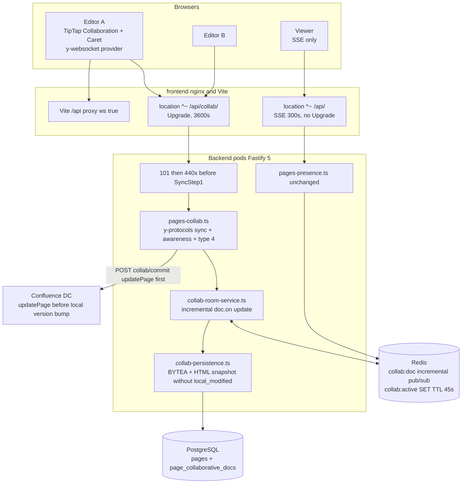
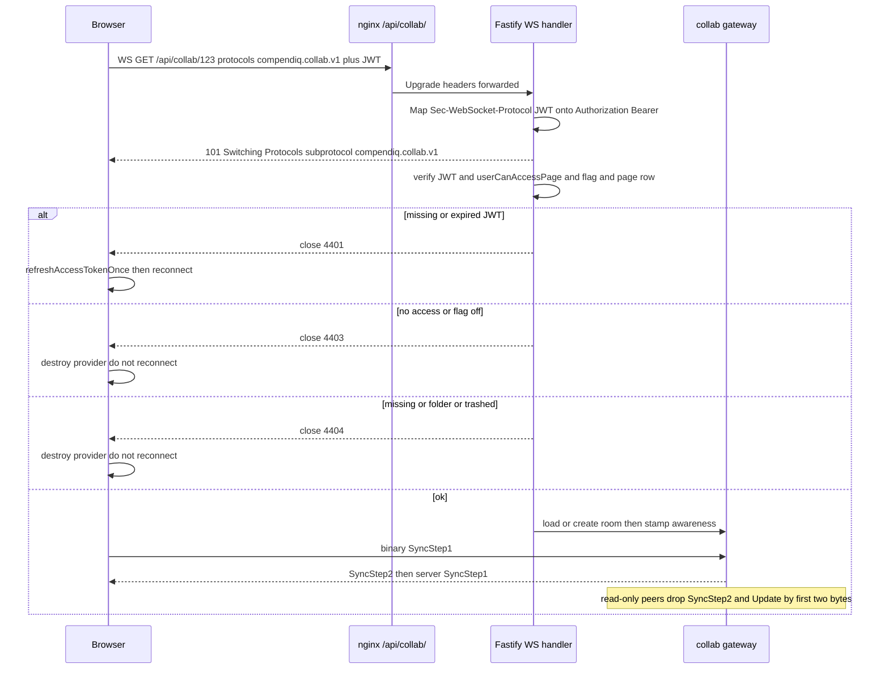
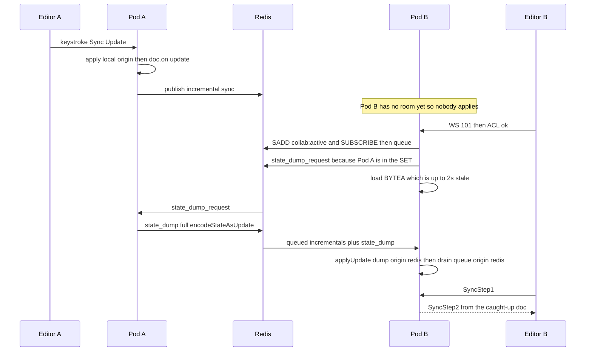

# 12. Real-time Collaborative Editing

Opt-in Yjs CRDT sessions so two (or more) writers on the same article
converge without a `PUT /api/pages/:id` 409. Gated by
`admin_settings.collab_editing_enabled` (seeded `'0'` — **default off**).
Flag off ≡ today's TipTap draft + #301 SSE presence.

Design of record: [`docs/superpowers/specs/2026-08-24-realtime-collaborative-editing-design.md`](../superpowers/specs/2026-08-24-realtime-collaborative-editing-design.md)
(epic [#1411](https://github.com/Compendiq/compendiq-ce/issues/1411), architecture PR [#1443](https://github.com/Compendiq/compendiq-ce/issues/1443)).
This diagram is the topology later PRs implement. The table exists from
migration 104 and the bundled `/api/collab/` nginx location plus Vite
`ws: true` ship here; the editor wiring does **not**.

## Topology

Clients talk to a Fastify 5 WebSocket gateway. Incremental Yjs updates
fan out across pods on Redis pub/sub. Postgres holds the BYTEA persist
form and the 2 s HTML snapshot. Confluence storage is written **only** on
explicit commit.

The bundled `location ^~ /api/collab/` and Vite `/api` `ws: true` ship
in `frontend/nginx.conf` and `frontend/vite.config.ts`. Corporate
reverse-proxy snippets live in `docs/integrations/reverse-proxy/`.

## Gateway (not Hocuspocus)

Embed the Yjs sync/awareness protocol in Fastify 5:

- `@fastify/websocket` (Fastify 5 peer) + `y-protocols` + `yjs` (same
  major as TipTap 3) + `lib0`
- Frontend: `y-websocket@^3.1.0` (2.x always reconnects; 3.1 treats
  4400–4499 as permanent and emits `closed`), `@tiptap/extension-collaboration`,
  `@tiptap/extension-collaboration-caret`, `@tiptap/y-tiptap`

**Rejected:** Hocuspocus (custom multiplexed protocol, second listen/crossws
stack), a standalone `y-websocket` sidecar (JWT and `userCanAccessPage`
would have to be reimplemented), Liveblocks, TipTap Cloud.

v1 registers **one** WebSocket route. `handleProtocols` is a plugin-global
`WebSocket.Server` option: select only `compendiq.collab.v1`, never echo
the JWT as the chosen subprotocol.

## Handshake — 101 first, then 440x before SyncStep1

A browser `WebSocket()` cannot set `Authorization` and **cannot see HTTP
401/403/404** on a failed upgrade (it only gets close 1006). `y-websocket`
treats 1006 as transient and would reconnect forever with a dead JWT.
`use-presence.ts` is `fetch()` of SSE — it is **not** the precedent.

JWT arrives as `Sec-WebSocket-Protocol: compendiq.collab.v1, <jwt>`.
**Never** the query string (nginx logs `$request_uri`). A real
`Authorization: Bearer` header is also accepted (Node tests).

| Code | When |
|------|------|
| **4401** | Missing / invalid / expired JWT, deactivated user (y-websocket 3.1 permanent — client handles `closed`, refreshes JWT, `connect()`s) |
| **4403** | Authenticated but no page access, or flag off at join or mid-session, or write attempted while read-only |
| **4404** | Missing page, `page_type = 'folder'`, or committed trash (`deleted_at`) |
| **1001** | Transient resync after `doc_reset` or in-flight Confluence hide — reconnect |
| HTTP 401 (no socket) | Optional Node-only `inject()` of a non-upgrade GET. Not the browser path. |

Close **after** the 101, **before** any SyncStep1. Do not throw
`fastify.authenticate` in `onRequest` on this route.

`:pageId` on the wire is integer `pages.id`, never `confluence_id`.

## Dual-run with #301 SSE

`GET /api/pages/:id/presence` is **not** retired.

- Flag on, user in the collab room: Yjs awareness feeds
  `PresenceAvatarStack` for editors. SSE continues for viewers who have
  the page open but are not editing. Merge by `userId`. Pencil badge =
  collab-room membership, not the SSE heartbeat's `isEditing`.
- Flag off: today's SSE `isEditing` heartbeat is unchanged.

The server stamps awareness `{ id, name, color }` after JWT and **ignores**
client-claimed identity. Color is deterministic from `userId`.

## Live Y.Doc vs snapshot vs commit

| Representation | When it moves | Versioning / side effects |
|----------------|---------------|---------------------------|
| In-memory `Y.Doc` + Redis **incremental** `doc.on('update')` | Every keystroke | Live truth. `Y.applyUpdate(..., 'redis')` on receive so the handler does not loop. |
| `page_collaborative_docs.doc_state` / `state_vector` | Debounced **2 s** after last applied update, and immediately when the last editor disconnects | Increments **this table's** `version` (persistence generation). Always. |
| `pages.body_html` + `pages.body_text` | Same 2 s debounce (and last-disconnect) | **Does not** increment `pages.version`. **Does** raise `embedding_dirty` / gated `image_embedding_dirty`. **Does not** stamp `local_modified_*`. **Does not** re-queue summary/quality. |
| `pages.body_storage` (XHTML via `htmlToConfluence`) | Explicit Save/Publish / `POST /api/pages/:id/collab/commit` only | Commit increments `pages.version` (standalone locally; Confluence from `confPage.version.number` **after** `updatePage` succeeds) |
| Confluence DC | Collab commit for `source = 'confluence'` | Remote write **first**, same order as today's PUT |

Stamping `local_modified_*` on the 2 s path is forbidden:
`applyConflictPolicyForExistingPage` treats `local_modified_at > last_synced`
as `hasLocalEdits`, default policy is confluence-wins, and snapshot HTML is
not byte-identical to the last Confluence conversion. That combination
would overwrite live CRDT work on the next sync tick.

BYTEA persist is always the full `Y.encodeStateAsUpdate`. Redis pub/sub is
**never** that — it publishes the incremental `update` argument. Mixing
those two floods every keystroke as a full document.

First join with no row: `pg_advisory_xact_lock(COLLAB_INIT_LOCK_KEY, pageId)`,
read `body_html`, parse into `Y.XmlFragment` field `'default'` with
`collabExtensions()`, persist, keep the doc in the in-memory room.
Initialization is server-side, once, locked — two clients `setContent` into
an empty fragment is dual-init duplication.

BYTEA is valid only while it still corresponds to live `body_html`. Every
non-collab writer that updates `body_html` while the room is empty (PUT,
restore, Apply, draft-publish, inbound sync with `sCard = 0`, flag-off
rollback) must `DELETE FROM page_collaborative_docs WHERE page_id = $1`.
The no-row init path is how the next join recovers — not first-ever join
only. A live room still 409s those HTTP writers; it does not DELETE.

## Neighborhoods

ESLint: gateway and persistence live in **`core` + `routes/knowledge`**.
Do **not** put Yjs in `domains/llm`. `core` still imports nothing from
domains/routes. `assertNoLiveCollabRoom` lives in `core` so
`routes/llm/llm-conversations.ts` can 409 Apply while a room is live.

| File (names may refine) | Role |
|-------------------------|------|
| `core/services/collab-room-service.ts` | In-process rooms, incremental Redis pub/sub, awareness, `collab:active` TTL 45 s |
| `core/services/collab-persistence.ts` | BYTEA load/save, init from `body_html`, 2 s snapshot **without** `local_modified_*` |
| `core/services/collab-schema.ts` | Named `collabExtensions()` / `getCollabSchema()` |
| `core/services/collab-flag.ts` | `makeCachedSetting` reader for `collab_editing_enabled` |
| `core/services/collab-tombstone.ts` | Close sockets after committed hide/delete |
| `core/services/collab-guard.ts` | `assertNoLiveCollabRoom(pageId)` |
| `routes/knowledge/pages-collab.ts` | `GET /api/collab/config`, `GET /api/collab/:pageId`, `POST /api/pages/:id/collab/commit` |

Register `/collab/config` **before** `/collab/:pageId`.

## Ingress (`/api/collab/`)

Bundled `frontend/nginx.conf` keeps `location ^~ /api/` SSE-shaped
(`proxy_read_timeout 300`, **no** `Upgrade` / `Connection`). The sibling
`location ^~ /api/collab/` (longer prefix beats `^~ /api/`) sets:

- `proxy_http_version 1.1`
- `proxy_set_header Upgrade $http_upgrade`
- `proxy_set_header Connection "Upgrade"`
- `proxy_read_timeout 3600s` / `proxy_send_timeout 3600s`

Vite's `/api` proxy sets `ws: true` so `npm run dev` upgrades on the
Vite port. Corporate nginx sets `Connection ""` at server scope for SSE
keep-alive — a dedicated `/api/collab/` location must override that or
Upgrade is silently dropped. Snippets: `docs/integrations/reverse-proxy/`.

HTTP/2: browsers' `WebSocket()` uses HTTP/1.1 Upgrade (RFC 6455).
`/api/collab/` must be reachable as HTTP/1.1 to the next hop. CSP
`connect-src 'self'` already allows same-origin `wss:`.

## Redis fan-out (incremental, subscribe-before-load)

Subscribe (and queue) **before** the BYTEA load. Pub/sub does not replay.
`collab:active:{pageId}` is a SET of `{podId}:{connId}`, TTL **45 s**,
refreshed on every ping (15 s) and every inbound frame. Yjs state is not
stored in Redis.

Last disconnect: persist BYTEA + HTML **immediately**. Do **not** `SREM`
the last member until the 10 s empty-room grace fires **and** the
in-memory `Y.Doc` is dropped (a `{podId}:grace` sentinel is equivalent),
so `assertNoLiveCollabRoom` and the heap agree. A reconnect during grace
cancels the timer.

## Feature flag

`admin_settings.collab_editing_enabled`, `'0'` / `'1'`, default `'0'`
(migration 104, `ON CONFLICT DO NOTHING`). Soft-fail default is **false**.

- Flag off: gateway completes 101 then closes **4403** before SyncStep1;
  frontend mounts today's editor; SSE presence only.
- Flag on: `PageViewPage` mounts the provider **only in edit mode**. Read
  mode keeps the #301 SSE heartbeat. Read-only WS joins (ACE without
  write) are an **explicit** edit-mode (or "follow" toggle) path, not
  implied for every page view. In edit mode, Editor mounts Collaboration +
  CollaborationCaret; Save goes to `/collab/commit`.
- Mid-session off: cache-bus `collab:enabled:changed`; every pod tombstones
  its rooms (**4403**). Rollback `DELETE`s `page_collaborative_docs` rows.

Hard cutover is unsafe because `Editor.tsx` carries many custom Confluence
nodes through y-prosemirror. The flag is the rollback.
