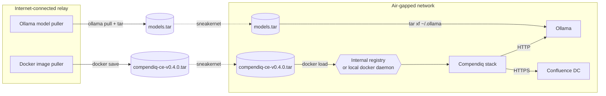

# Air-gapped / disconnected deployment

_last-verified: TBD (draft ships with v0.4; founder VM test pending)_

## Who this is for

Your environment has no outbound internet access at all. You need Compendiq to:

- Start without reaching GHCR to pull images (images are side-loaded from a tarball)
- Run LLM inference locally via Ollama — no OpenAI API, no Azure OpenAI
- Skip OpenTelemetry collectors that would phone home
- Skip MCP docs and any "check for update" probes
- Work with a self-signed Confluence cert (see [`../self-signed-tls/README.md`](../self-signed-tls/README.md))

This guide assumes you already have a **relay host** (a machine that can reach both the public internet and the air-gapped network — typically a bastion or a sneakernet laptop) that you use to carry artefacts across the gap.

## Architecture



## Prerequisites

- A relay host with Docker + internet access.
- A transfer mechanism across the air gap (physical media, internal mirror, whatever you already use).
- Inside the air gap: a host that can run Docker Compose, and an Ollama instance (either on the same host or reachable over the internal network).

## Step 1: pull the images on the relay

From [side-load-images.sh](./side-load-images.sh):

```bash
# On the relay host
./docs/integrations/air-gapped/side-load-images.sh pack v0.4.0 compendiq-ce-v0.4.0.tar
```

This runs `docker pull` for every image Compendiq's `docker-compose.yml` references, tags them at the requested version, and `docker save`s them into a single tarball.

Ship the tarball across the gap.

Inside the air gap:

```bash
./docs/integrations/air-gapped/side-load-images.sh load compendiq-ce-v0.4.0.tar
# → docker load -i compendiq-ce-v0.4.0.tar
# → docker tag each loaded image back into the ghcr.io/compendiq/... namespace
```

Now `docker images | grep compendiq` shows every image locally. Compose will use the cached copy instead of hitting GHCR.

## Step 2: pull the Ollama models on the relay

```bash
# On the relay, with Ollama running
ollama pull bge-m3           # embedding model — required
ollama pull qwen3:4b         # chat model — or whatever you prefer
# Ollama stores models under ~/.ollama
tar -czf models.tar.gz -C ~/.ollama .
```

Ship `models.tar.gz` across the gap.

Inside the air gap:

```bash
mkdir -p ~/.ollama
tar -xzf models.tar.gz -C ~/.ollama
# Restart Ollama if it was already running
systemctl restart ollama   # or: pkill ollama; ollama serve &
ollama list                # confirm bge-m3 + qwen3:4b are listed
```

## Step 3: disable external dependencies

See [`disable-external-deps.md`](./disable-external-deps.md) for the full list. The minimum set:

```env
# docker-compose .env additions

# 1. Telemetry off
OTEL_ENABLED=false

# 2. MCP docs service not started (it would try to fetch docs)
#    In docker-compose.yml, comment out the `mcp-docs:` service entirely.

# 3. Ollama only — no OpenAI fallback. Seeded on first boot.
#    After first boot, manage providers via Settings → LLM.
OLLAMA_BASE_URL=http://ollama.corp.example.com:11434

# 4. If the frontend image was built with update-checks, disable via admin UI.
#    There's nothing to disable via env — just confirm no outbound probe
#    in the backend logs after startup.
```

## Step 4: start the stack

```bash
docker compose -f docker/docker-compose.yml up -d
# Images are loaded from the local daemon; no network pulls happen.
docker compose logs backend | grep -Ei "outbound|fetch|https://" | head -30
# Review the output — no URL pointing at a public domain should appear
# beyond the user-configured Confluence + Ollama.
```

## Step 5: verify no outbound traffic

Run this with Compendiq idle for 60 seconds (no user activity). Any outbound connection it makes is suspicious:

```bash
# On the air-gapped Compendiq host
sudo ss -tnp | grep -v '127.0.0.1\|::1\|<your-ollama-ip>\|<your-confluence-ip>'
# Expect: no rows
```

If rows appear, something is trying to phone home. File an issue with the destination IP/port — likely a bug we should fix.

## Combining with the other guides

If your Confluence uses a private CA, layer in [`self-signed-tls/README.md`](../self-signed-tls/README.md). The `NODE_EXTRA_CA_CERTS` path is orthogonal to the air-gap plumbing — mount the bundle after step 1.

If you front Compendiq with a corporate nginx, layer in [`reverse-proxy/nginx.md`](../reverse-proxy/nginx.md) **after** the stack is happily running behind the air gap.

## Troubleshooting

**1. `docker compose up` tries to pull images even though they're loaded.**
Your image tags in `docker-compose.yml` don't match the tags you loaded. Run `docker images | grep compendiq` to see the actual tags and update `docker-compose.yml` to match. The side-load script is idempotent — re-run with the same version tag if needed.

**2. Ollama returns "model not found".**
Either the tarball didn't extract fully (check `du -sh ~/.ollama` — should be multi-GB), or the Ollama version mismatches between relay and air gap. Match the versions exactly.

**3. Compendiq logs "Failed to fetch … GHCR".**
The image-pull policy is `always` somewhere in your compose. Set `pull_policy: missing` (Compose 2.22+) or remove the service-level policy and rely on defaults.

**4. Backend continuously tries to reach `registry.npmjs.org`.**
Development mode is on. Check `NODE_ENV=production` is set in the backend env.

**5. Embeddings fail with `fetch failed`.**
`OLLAMA_BASE_URL` points at a host the air-gapped backend can't reach. Confirm with `docker compose exec backend curl -v $OLLAMA_BASE_URL/api/tags`.
