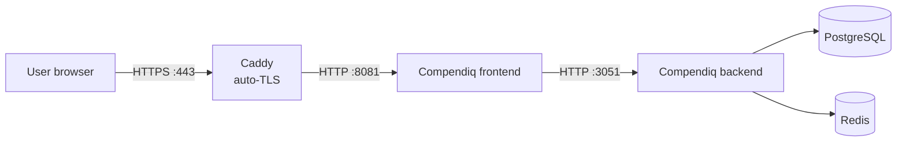

# Compendiq behind Caddy

_last-verified: 2026-04-24 (draft ships with v0.4; founder VM test pending before v0.4.0 tag)_

## Who this is for

You like Caddy because TLS is handled automatically and the config file is five lines. You want to front Compendiq with Caddy on a public (or LAN + internal CA) hostname and keep the LLM and presence streams working — Caddy's only gotcha with Compendiq is default response buffering on long-lived connections.

## Architecture



## Prerequisites

- Caddy v2.7+ installed on the host (systemd unit, Docker, or binary — all equivalent).
- Compendiq running locally on `127.0.0.1:8081` (bundled nginx inside the frontend image; bind to loopback so only Caddy reaches it).
- DNS record for your hostname pointing at the Caddy host. Public internet + port 80/443 open → Caddy auto-fetches a public cert. Private DNS → use Caddy's internal CA (see §2.b below).

## Step-by-step

### 1. Keep Compendiq bound to loopback

In `docker-compose.yml`:

```yaml
frontend:
  ports:
    - "127.0.0.1:8081:8081"
```

### 2a. `Caddyfile` — public hostname with auto-TLS

```caddyfile
compendiq.corp.example.com {
    # SSE streams: presence viewer list (v0.4 #301) and every LLM
    # endpoint. `flush_interval -1` disables response buffering on
    # THIS matcher only — everything else keeps normal buffering for
    # best throughput on static assets.
    @sse {
        path_regexp sse ^/api/(pages/[^/]+/presence|llm/.*)$
    }
    reverse_proxy @sse 127.0.0.1:8081 {
        # Belt-and-suspenders: Caddy auto-streams text/event-stream anyway
        flush_interval -1
        transport http {
            read_timeout 1h
        }
    }

    # Everything else.
    reverse_proxy 127.0.0.1:8081

    # Raise the request body cap for diagram / image uploads.
    request_body {
        max_size 30MB
    }
}
```

Reload Caddy:

```bash
sudo caddy reload --config /etc/caddy/Caddyfile
```

Caddy auto-issues a Let's Encrypt cert on first request. No additional config needed when the hostname resolves publicly.

### 2b. `Caddyfile` — internal hostname with Caddy's local CA

Replace the site block's first line with:

```caddyfile
compendiq.corp.internal {
    tls internal
    # ...same @sse matcher + reverse_proxy blocks as above
}
```

`tls internal` tells Caddy to issue certs from its embedded CA (`~/.local/share/caddy/pki/authorities/local/root.crt`). Distribute that root to client machines so browsers trust it.

## Configuration reference

| Variable | Example | Why |
|---|---|---|
| `FRONTEND_URL` | `https://compendiq.corp.example.com` | CORS origin + setup-wizard redirect target. Must match what Caddy serves. |
| `FRONTEND_PORT` | `8081` | Leave as default; `reverse_proxy` targets this on loopback. |

Compendiq's `trustProxy: true` honours Caddy's `X-Forwarded-*` headers (which Caddy sets automatically), so no extra env vars are needed for client-IP preservation.

## Troubleshooting

**1. LLM chat hangs on a spinning cursor; presence avatars never appear.**
The `@sse` matcher isn't firing — Caddy is routing the request through the generic `reverse_proxy` which buffers. Two usual causes:
- `path_regexp` is case-sensitive and anchored. Check your actual path: `/api/pages/abc/presence` matches, `/api/pages/abc/presence/heartbeat` (if a future backend adds it) does not.
- The matcher block order matters in a Caddyfile. Put the `@sse` matcher **before** the catch-all `reverse_proxy` line — Caddy evaluates top-to-bottom.

**2. "502 Bad Gateway" on first request.**
Compendiq isn't bound on `127.0.0.1:8081`. Run `ss -tlnp | grep 8081` — if the bind is `0.0.0.0:8081` or missing entirely, fix the Compose `ports:` line and restart the frontend container.

**3. Uploads over ~10 MB return 413.**
`request_body max_size` defaults to 10 MB in Caddy. Raise it (see the snippet above — 30 MB is a safe starting point for a 25 MB diagram + JSON overhead).

## Verification

```bash
# Reachability + cert.
curl -I https://compendiq.corp.example.com/api/health
# Expect: 200 OK, valid TLS (from Let's Encrypt or Caddy's internal CA).

# SSE streaming (presence is the fastest sanity check — no LLM required).
# Grab a JWT from the browser (DevTools → Application → Local Storage →
# `compendiq-auth` → state.accessToken), substitute <TOKEN>.
curl -N -H "Authorization: Bearer <TOKEN>" \
     https://compendiq.corp.example.com/api/pages/<pageId>/presence
# Expect: one `event: presence` frame every few seconds, streamed live.
# If you get a single buffered blob at the end, `flush_interval -1` is
# not bound to the route — revisit the @sse matcher.
```

> **Before tagging v0.4.0:** the founder should run the full verification on a fresh VM and update the `_last-verified_` stamp at the top of this file.
