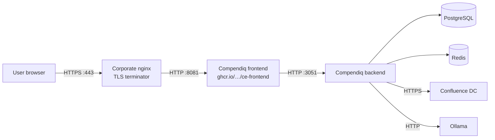

# Compendiq behind nginx

_last-verified: TBD (draft ships with v0.4; founder VM test pending)_

## Who this is for

Your company fronts every internal service with a centrally-managed nginx instance that terminates TLS, enforces WAF rules, and handles auth headers. Compendiq joins the same fleet. You want:

- TLS termination at nginx (not at Compendiq's bundled frontend nginx)
- A vanity hostname like `compendiq.corp.example.com`
- X-Forwarded-* headers preserved end-to-end (for rate-limit buckets + audit logs to show real client IPs)
- Server-Sent Events working (the LLM streams via SSE — buffering breaks them)
- Large diagrams and pasted images uploading without hitting a 413 at the proxy

## Architecture



## Prerequisites

- Compendiq running locally on `localhost:8081` (its bundled nginx is still active inside the container; you'll proxy to it).
- A corporate nginx that you can edit.
- A DNS record pointing `compendiq.corp.example.com` at the nginx host.
- A TLS certificate for `compendiq.corp.example.com` on the nginx host.

## Step-by-step

### 1. Keep Compendiq listening on a local port only

Make sure `docker-compose.yml` does **not** expose the frontend externally:

```yaml
frontend:
  image: ghcr.io/compendiq/compendiq-ce-frontend:<version>
  ports:
    - "127.0.0.1:8081:8081"   # localhost only — nginx reaches it over loopback
```

### 2. Add a vhost to nginx

```nginx
server {
    listen 443 ssl http2;
    server_name compendiq.corp.example.com;

    ssl_certificate     /etc/ssl/certs/compendiq.crt;
    ssl_certificate_key /etc/ssl/private/compendiq.key;

    # Compendiq can emit large diagram + attachment uploads — raise the cap.
    client_max_body_size 30m;

    # SSE streaming (LLM chat). Buffering breaks server-sent events.
    proxy_buffering     off;
    proxy_cache         off;
    proxy_read_timeout  300s;

    # Real client IP preservation so Compendiq's audit_log + per-user
    # rate limits see the original IP, not nginx's loopback.
    proxy_set_header Host              $host;
    proxy_set_header X-Real-IP         $remote_addr;
    proxy_set_header X-Forwarded-For   $proxy_add_x_forwarded_for;
    proxy_set_header X-Forwarded-Proto $scheme;
    proxy_set_header X-Forwarded-Host  $host;

    # HTTP/1.1 + keep-alive so SSE connections aren't force-closed.
    proxy_http_version 1.1;
    proxy_set_header Connection "";

    location / {
        proxy_pass http://127.0.0.1:8081;
    }
}

# Optional: redirect :80 → :443
server {
    listen 80;
    server_name compendiq.corp.example.com;
    return 301 https://$host$request_uri;
}
```

### 3. Tell Compendiq to trust the forwarded headers

Set `FRONTEND_URL` in the backend environment to your public hostname so CORS matches:

```env
FRONTEND_URL=https://compendiq.corp.example.com
```

Compendiq already sets `trustProxy: true` on Fastify (see `backend/src/app.ts`), so `X-Forwarded-For` is honoured out of the box.

### 4. Reload nginx

```bash
sudo nginx -t && sudo systemctl reload nginx
```

## Configuration reference

| Variable | Example | Why |
|---|---|---|
| `FRONTEND_URL` | `https://compendiq.corp.example.com` | CORS origin allowlist; setup-wizard redirect target. |
| `FRONTEND_PORT` | `8081` | Leave as default; proxy pass targets this port on loopback. |
| `BACKEND_HOST_PORT` | `3052` | Only change if 3052 conflicts with another service on the nginx host. |

## Troubleshooting

**1. "CORS blocked" in browser console.**
Check `FRONTEND_URL` matches the exact scheme + host + port the browser is using. Mixed http/https in the value is a common footgun. If the list is comma-separated (staging + prod), make sure both forms are present.

**2. LLM chat answers show a spinning cursor and never stream text.**
nginx is buffering the SSE response. Confirm `proxy_buffering off;` is inside the `server` block and that there's no global `proxy_buffering on;` overriding it. Restart nginx after editing.

**3. Uploads larger than 1 MB (default nginx body cap) return 413.**
Raise `client_max_body_size 30m;` (or more) in the `server` block. 30 MB is enough for a 25 MB draw.io diagram + JSON overhead; tune higher if your users paste larger images.

**4. Audit log shows the nginx loopback IP instead of the real client IP.**
`trustProxy` is already enabled in Compendiq, so the issue is usually nginx not forwarding the real IP. Confirm `X-Forwarded-For` is set in the `proxy_set_header` list above. Restart Compendiq after the nginx reload if the log keeps showing `127.0.0.1`.

**5. 502 Bad Gateway from nginx.**
Compendiq isn't actually listening on `127.0.0.1:8081`. Run `ss -tlnp | grep 8081` on the proxy host; if the port isn't bound, fix the compose `ports:` line and restart.

## Server-Sent Events (SSE) streaming routes

The generic `server`-level `proxy_buffering off;` above is usually enough, but enterprises with a stricter base config often re-enable buffering globally — in which case the SSE routes need their own `location` block to be safe. Add this **above** the generic `location / { ... }` so nginx matches it first:

```nginx
# Compendiq's long-lived SSE endpoints:
#   /api/pages/{id}/presence   — live viewer list (v0.4 #301)
#   /api/llm/ask, /chat, /summarize, /generate, /quality, /auto-tag, etc.
location ~ ^/api/(pages/[^/]+/presence|llm/) {
    proxy_pass http://127.0.0.1:8081;

    # Per-route overrides — critical for SSE.
    proxy_buffering         off;
    proxy_cache             off;
    proxy_http_version      1.1;
    chunked_transfer_encoding off;
    proxy_read_timeout      3600s;   # SSE connections are long-lived.

    # Preserve the same forwarded headers as the generic location.
    proxy_set_header Host              $host;
    proxy_set_header X-Real-IP         $remote_addr;
    proxy_set_header X-Forwarded-For   $proxy_add_x_forwarded_for;
    proxy_set_header X-Forwarded-Proto $scheme;
    proxy_set_header X-Forwarded-Host  $host;
    proxy_set_header Connection        "";
}
```

Without this block, corporate nginx deployments with `proxy_buffering on;` in the base config will silently break both presence SSE (viewer avatars never update) and LLM streaming (chat responses arrive as one blob or time out). Adding the block is cheap insurance even if the server-level `proxy_buffering off;` is already present — the explicit location wins regardless of what other config snippets do elsewhere.

## Verification

```bash
# From the nginx host — basic reachability through the proxy.
# /api/health is unauthenticated and always works, so it's the first thing to try.
curl -I https://compendiq.corp.example.com/api/health
# Expect: 200 OK
```

If you also want to confirm SSE isn't being buffered end-to-end, exercise the LLM ask endpoint.
`POST /api/llm/ask` requires `question` and `model` (see `AskRequestSchema` in `packages/contracts/src/schemas/llm.ts`) — pick a model from `GET /api/llm/models` or the Settings → LLM page. Replace `<TOKEN>` with a valid JWT (grab one from your browser's DevTools → Application → Local Storage → `compendiq-auth` → `state.accessToken` after logging in):

```bash
curl -N -H "Authorization: Bearer <TOKEN>" \
     -H "Content-Type: application/json" \
     -X POST \
     -d '{"question":"hello","model":"qwen3:4b"}' \
     https://compendiq.corp.example.com/api/llm/ask
# Expect: a stream of `data: {...}` lines followed by `data: {"done":true,"final":true,...}`
```

If the `curl -N` call returns a single blob rather than a stream of lines, the proxy is still buffering — revisit step 2. If it returns `400`, double-check the request body matches `AskRequestSchema` (the field is `model`, not `modelId`; there is no `pageIds` array — optional `pageId` is a single string).
