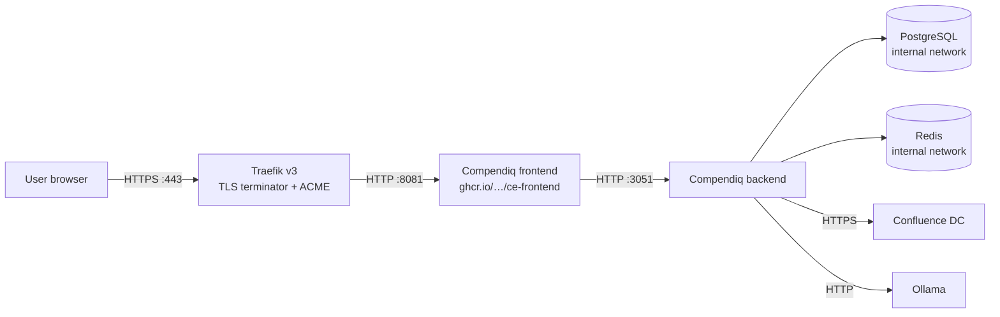

# Compendiq behind Traefik

_last-verified: 2026-04-24 (draft ships with v0.4; founder VM test pending before v0.4.0 tag)_

## Who this is for

Your company runs Docker Swarm or Docker Compose with Traefik v3 as the edge router — TLS terminates at Traefik, certificates come from Let's Encrypt or an internal ACME CA, and every service picks up its routing via Docker labels. You want to drop Compendiq into the same stack: one vanity hostname, auto-TLS, forwarded client IPs, and the LLM / presence streams working through the proxy without breaking.

## Architecture



Traefik attaches to the Docker socket, reads labels on the Compendiq containers, and auto-configures the router. PostgreSQL and Redis stay on the internal `compendiq` network — only the frontend is advertised to Traefik.

## Prerequisites

- Docker Compose v2.20+ (Swarm mode works too; the labels are the same).
- Traefik v3.0+ already running with the Docker provider and an `websecure` entrypoint on `:443`. (Traefik v2.x works with minor label tweaks — the `.tls.certresolver` and `passHostHeader` keys are identical, but service-level middleware binding changed in v3.)
- DNS record pointing `compendiq.corp.example.com` at the Traefik host.
- Port 80 reachable if you use the HTTP-01 ACME challenge, or DNS credentials configured if you use DNS-01. On fully private DNS, plan on DNS-01 — see troubleshooting (#4).
- A shared Docker network (commonly `traefik_proxy`) that Traefik and Compendiq both join.

## Step-by-step

### 1. Put the frontend on the shared Traefik network

Compendiq's default `docker-compose.yml` puts every service on an internal `compendiq` network. Add a second network for the frontend container only:

```yaml
networks:
  compendiq:
    internal: true
  traefik_proxy:
    external: true   # already created by your Traefik stack
```

### 2. Stop exposing the frontend port publicly

The bundled nginx inside the frontend image still listens on `8081`, but it should no longer be reachable from outside the Docker network. Remove the `ports:` mapping and let Traefik reach it over the shared network:

```yaml
services:
  frontend:
    image: ghcr.io/compendiq/compendiq-ce-frontend:<version>
    # No `ports:` block — Traefik connects over traefik_proxy.
    networks:
      - compendiq
      - traefik_proxy
    labels:
      - "traefik.enable=true"
      - "traefik.docker.network=traefik_proxy"

      # --- Main HTTPS router ---------------------------------------
      - "traefik.http.routers.compendiq.rule=Host(`compendiq.corp.example.com`)"
      - "traefik.http.routers.compendiq.entrypoints=websecure"
      - "traefik.http.routers.compendiq.tls=true"
      - "traefik.http.routers.compendiq.tls.certresolver=letsencrypt"
      - "traefik.http.routers.compendiq.service=compendiq"

      # --- Compendiq service target -------------------------------
      - "traefik.http.services.compendiq.loadBalancer.server.port=8081"
      - "traefik.http.services.compendiq.loadBalancer.passHostHeader=true"

      # --- SSE-specific router ------------------------------------
      # Separate router + service for SSE streams so we can disable
      # response buffering WITHOUT disabling it for the rest of the
      # app (which benefits from buffering on static assets).
      # Routes covered:
      #   /api/pages/*/presence  (live viewer list, v0.4 #301)
      #   /api/llm/*             (ask / chat / summarize / generate / quality / auto-tag)
      - "traefik.http.routers.compendiq-sse.rule=Host(`compendiq.corp.example.com`) && (PathRegexp(`^/api/pages/[^/]+/presence$`) || PathPrefix(`/api/llm/`))"
      - "traefik.http.routers.compendiq-sse.entrypoints=websecure"
      - "traefik.http.routers.compendiq-sse.tls=true"
      - "traefik.http.routers.compendiq-sse.tls.certresolver=letsencrypt"
      - "traefik.http.routers.compendiq-sse.service=compendiq-sse"
      - "traefik.http.routers.compendiq-sse.middlewares=compendiq-nobuf@docker"
      - "traefik.http.routers.compendiq-sse.priority=100"   # beats the generic router

      - "traefik.http.services.compendiq-sse.loadBalancer.server.port=8081"
      - "traefik.http.services.compendiq-sse.loadBalancer.passHostHeader=true"

      # --- No-buffering middleware (critical for SSE) ------------
      # maxResponseBodyBytes=0 and memResponseBodyBytes=0 together
      # disable response buffering so SSE frames flush to the client
      # as soon as the backend writes them. Without this, Traefik
      # buffers the entire response and the stream only arrives when
      # the backend closes the connection — at which point the UI
      # spinner has long since timed out.
      - "traefik.http.middlewares.compendiq-nobuf.buffering.maxResponseBodyBytes=0"
      - "traefik.http.middlewares.compendiq-nobuf.buffering.memResponseBodyBytes=0"
```

### 3. Configure Compendiq's forwarded-headers trust

Set `FRONTEND_URL` on the backend service so CORS + setup-wizard redirects match the public hostname:

```yaml
services:
  backend:
    environment:
      FRONTEND_URL: https://compendiq.corp.example.com
    networks:
      - compendiq
```

Fastify already runs with `trustProxy: true` (see `backend/src/app.ts`), so `X-Forwarded-For` and `X-Forwarded-Proto` from Traefik are honoured out of the box. `passHostHeader=true` on the service ensures the original `Host` header reaches the backend — needed for audit logs and rate-limit buckets to see the real hostname.

### 4. Bring the stack up

```bash
docker compose pull
docker compose up -d
# Wait 30-60s for ACME to issue the cert on first boot
docker logs traefik 2>&1 | grep -i acme | tail -20
```

## Configuration reference

| Variable | Example | Why |
|---|---|---|
| `FRONTEND_URL` | `https://compendiq.corp.example.com` | CORS allowlist + setup-wizard redirect target. Must exactly match what Traefik exposes (scheme + host + port). |
| `NODE_EXTRA_CA_CERTS` | `/etc/ssl/certs/corporate-ca.pem` | Only needed if Traefik presents an internal-CA cert on the backend-side leg (rare: most users terminate TLS at Traefik and speak plain HTTP on the internal network). |
| `BACKEND_HOST_PORT` | unset | Do not expose. Keep it on the internal `compendiq` network — only Traefik reaches the frontend, and the backend is reached by the frontend. |
| `FRONTEND_PORT` | `8081` | Leave as default; the Traefik `server.port` label targets this. |

## Troubleshooting

**1. LLM chat spinner never streams text; SSE presence stream cuts off after ~30 s.**
The buffering middleware isn't bound to the SSE router, so Traefik is holding the response in memory. Verify with `docker inspect <compendiq-frontend-id> | grep nobuf` — you should see both `traefik.http.routers.compendiq-sse.middlewares=compendiq-nobuf@docker` **and** the two `buffering.*=0` middleware labels. The `@docker` provider suffix is required in v3 (in v2 it was implicit). Restart the container after fixing labels — Traefik re-reads them, but the active routing table isn't updated mid-request.

**2. Browser DevTools shows 404 on WebSocket / EventSource connection.**
Compendiq doesn't use WebSockets, but the EventSource (SSE) connection fails if the `compendiq-sse` router rule doesn't match. Two common misses:
- The `PathRegexp` for presence requires an exact `^/api/pages/[^/]+/presence$` anchor. If your backend later adds sub-paths (e.g. `/presence/heartbeat`), extend the regex.
- Traefik v3 path matchers are case-sensitive — `/API/llm/ask` will fall through to the generic router (which buffers).

**3. Audit log shows Traefik's internal IP (`172.x.x.x`) instead of the real client IP.**
`passHostHeader=true` is set but Traefik isn't forwarding `X-Forwarded-For`. Confirm Traefik's static config has `--entrypoints.websecure.forwardedHeaders.insecure=true` (if Traefik itself is behind another proxy) or `--entrypoints.websecure.forwardedHeaders.trustedIPs=<upstream-CIDR>`. Compendiq's `trustProxy: true` trusts whatever Traefik forwards, so the fix is upstream of Compendiq.

**4. ACME certificate fails on a fully-private DNS zone.**
HTTP-01 challenge can't reach the Traefik host from Let's Encrypt's servers. Two options:
- Switch to DNS-01 via the `certificatesResolvers.<resolver>.acme.dnsChallenge` config — requires API credentials for your DNS provider (Route53, Cloudflare, RFC2136, etc.).
- Use Traefik's built-in internal CA (`--providers.file ... tls.stores.default.defaultGeneratedCert`) and distribute the CA cert to client machines. Acceptable for fully-internal tools; less so for end-user browsers.

**5. HTTP/2 + SSE: connection resets mid-stream on Traefik v3.**
Traefik v3 defaults to HTTP/2 on `websecure`. With many concurrent SSE connections (several tabs per user × several users), you can hit the default `maxConcurrentStreams` cap (100) and see sporadic resets. Either pin the SSE router to HTTP/1.1 (`--entrypoints.websecure.http2.maxConcurrentStreams=-1` to disable the cap) or add a dedicated HTTP/1.1 entrypoint and route the `compendiq-sse` router there. Most deployments don't hit this until ~50 concurrent editors.

## Verification

```bash
# 1. Basic reachability through the proxy (unauthenticated endpoint).
curl -I https://compendiq.corp.example.com/api/health
# Expect: 200 OK, valid TLS cert

# 2. SSE streaming through the no-buffer router. Grab a JWT from the
#    browser (DevTools → Application → Local Storage → `compendiq-auth`
#    → state.accessToken) and replace <TOKEN>. The presence route is
#    the easiest to verify because it streams without needing an LLM.
curl -N -H "Authorization: Bearer <TOKEN>" \
     https://compendiq.corp.example.com/api/pages/<pageId>/presence
# Expect: a sequence of `event: presence\ndata: {...}\n\n` frames
#         arriving one-by-one, NOT a single buffered blob after close.
```

If the `curl -N` call returns a single blob rather than a stream of lines, the `compendiq-nobuf` middleware is not bound to the `compendiq-sse` router — revisit step 2. If the LLM streams work but presence hangs, check that `PathRegexp` matches your actual presence path (the leading anchor is easy to drop).

> **Before tagging v0.4.0:** the founder should run the full step-by-step on a fresh VM, walk through the `curl` verification, and update the `_last-verified_` stamp at the top of this file with the test date.
