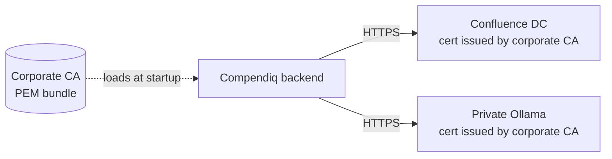

# Self-signed / private-CA TLS

_last-verified: TBD (draft ships with v0.4; founder VM test pending)_

## Who this is for

Your Confluence DC — or your LLM upstream (Ollama, OpenAI-compatible vLLM, etc.), or both — sit on a certificate issued by an **internal certificate authority** rather than a public one. Node's default TLS store has no reason to trust your CA, so Compendiq's outbound HTTPS calls fail with `UNABLE_TO_VERIFY_LEAF_SIGNATURE` or `SELF_SIGNED_CERT_IN_CHAIN`.

You have two paths, in decreasing order of preference:

1. **Recommended — trust the issuing CA.** Give Compendiq your corporate root CA (and any intermediate CAs) via `NODE_EXTRA_CA_CERTS`. TLS verification stays on; your certs are simply trusted. This is the "right" fix.
2. **Escape hatch — disable verification per-upstream.** Set `CONFLUENCE_VERIFY_SSL=false` or `LLM_VERIFY_SSL=false` per individual provider. Use this **only** for a time-boxed period while you're waiting for the CA bundle to be delivered; it weakens security posture.

## Architecture



## Prerequisites

- The PEM file(s) for your corporate CA chain. Typical artefacts: `corp-root-ca.pem`, `corp-intermediate-ca.pem`. If the IT team gave you a `.crt` file, it's the same format with a different extension — you can rename it.
- Docker Compose deployment of Compendiq (the flow for a bare-metal install is the same, just skip the volume mount).

## Path 1 (recommended): `NODE_EXTRA_CA_CERTS`

### 1. Assemble a single CA bundle

Use the helper script to concatenate multiple PEM files in the right order (root last, intermediates before it — one PEM per `-----BEGIN CERTIFICATE-----` block):

```bash
./docs/integrations/self-signed-tls/make-ca-bundle.sh \
    corp-intermediate-ca.pem \
    corp-root-ca.pem \
    > corp-ca-bundle.pem
```

Quick sanity check — the file should contain two `BEGIN CERTIFICATE` lines for a two-cert chain:

```bash
grep -c "BEGIN CERTIFICATE" corp-ca-bundle.pem
# → 2
```

### 2. Mount it into the backend container

Edit `docker-compose.yml`:

```yaml
backend:
  # …
  environment:
    # Path inside the container
    NODE_EXTRA_CA_CERTS: /etc/ssl/certs/corp-ca-bundle.pem
    # Leave these at their defaults — verification is ON
    CONFLUENCE_VERIFY_SSL: "true"
    LLM_VERIFY_SSL: "true"
  volumes:
    # Path on the host : path in the container (read-only)
    - ./corp-ca-bundle.pem:/etc/ssl/certs/corp-ca-bundle.pem:ro
```

### 3. Restart the stack

```bash
docker compose -f docker/docker-compose.yml up -d
```

Node picks up `NODE_EXTRA_CA_CERTS` at process start. Compendiq logs `SSL certificate bundle loaded: /etc/ssl/certs/corp-ca-bundle.pem` — that confirms it's been mounted and parsed.

## Path 2 (escape hatch): verification off

Only use this for short-lived environments where the CA bundle isn't ready yet.

### Per-Confluence

```env
CONFLUENCE_VERIFY_SSL=false
```

Restart Compendiq. Confluence calls skip cert validation. The setup wizard + UI show a warning badge.

### Per-LLM-provider

Each row in `llm_providers` has a `verify_ssl BOOLEAN` column. In Settings → LLM, un-tick **Verify SSL** on the provider you want to skip. This is scoped to that row only — the rest of the providers still verify.

The deprecated `LLM_VERIFY_SSL=false` env var does the same thing but applies to every provider globally; use only during bootstrap / first-boot seeding.

### Security impact

- **Compendiq ↔ Confluence traffic can be MITM'd** by anyone on the network path. An attacker intercepts your user's PAT.
- **Compendiq ↔ LLM upstream can be MITM'd.** Prompt + response bodies leaked in transit.

Turn verification back on as soon as the CA bundle lands.

## Configuration reference

| Variable | Default | What it does |
|---|---|---|
| `NODE_EXTRA_CA_CERTS` | _(unset)_ | Absolute path to a PEM file. Node adds every cert in the file to its trust store on process start. |
| `CONFLUENCE_VERIFY_SSL` | `true` | When `false`, Compendiq's Confluence client skips TLS verification entirely. |
| `LLM_VERIFY_SSL` | `true` | **Deprecated bootstrap fallback.** Seed-only: consulted once on fresh install to populate `llm_providers.verify_ssl`. After that, configure per-provider in Settings → LLM. |

## Troubleshooting

**1. Compendiq still throws `UNABLE_TO_VERIFY_LEAF_SIGNATURE` after mounting the bundle.**
The container never picked up the mount. Run `docker compose exec backend ls /etc/ssl/certs/corp-ca-bundle.pem` to confirm. If missing, re-check the compose `volumes:` line and `docker compose up -d` (not `restart`; restart skips volume remounts).

**2. `SELF_SIGNED_CERT_IN_CHAIN`.**
Your bundle is missing an intermediate CA. Check the Confluence cert chain:

```bash
openssl s_client -connect confluence.corp.example.com:443 -showcerts < /dev/null
```

The output shows every cert in the chain. Every "issuer" line must appear as a "subject" line elsewhere in the chain or in your bundle. Add the missing intermediates and rebuild the bundle.

**3. Logs show `DEPTH_ZERO_SELF_SIGNED_CERT`.**
Confluence is using a cert it signed itself, not one issued by your corporate CA. Either:
- Add that cert itself to the bundle (it IS its own CA in this case), or
- Use `CONFLUENCE_VERIFY_SSL=false` as a short-term workaround.

**4. `NODE_EXTRA_CA_CERTS` points at a valid file but Node ignores it.**
Check for BOM / CRLF line endings in the PEM file — Node's PEM parser is strict:

```bash
file corp-ca-bundle.pem
# Expect: "ASCII text" — NOT "UTF-8 Unicode (with BOM)" or "CRLF line terminators"
```

Strip BOM + convert line endings if needed:

```bash
sed -i '1s/^\xEF\xBB\xBF//' corp-ca-bundle.pem   # strip BOM
sed -i 's/\r$//' corp-ca-bundle.pem              # CRLF → LF
```

## Verification

```bash
# Inside the backend container, confirm Node trusts the CA.
docker compose exec backend node -e "
  const https = require('https');
  https.get('https://confluence.corp.example.com/rest/api/space?limit=1', (res) => {
    console.log('Status:', res.statusCode);
    console.log('TLS verified:', res.socket.authorized);
  }).on('error', (err) => console.error('ERROR:', err.message));
"
# Expect: Status 401 (no PAT) or 200 (public space); TLS verified: true
# The 401 still proves the TLS handshake succeeded, which is what we're testing.
```

If `TLS verified: false` appears, the bundle isn't being loaded — revisit step 2.
