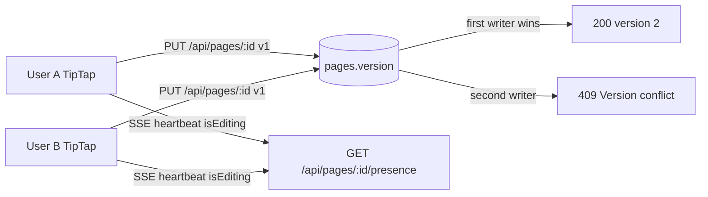
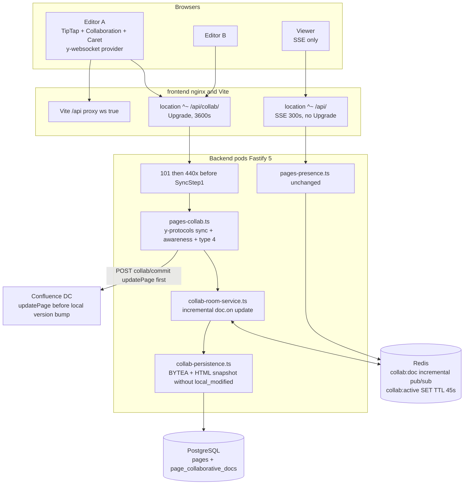
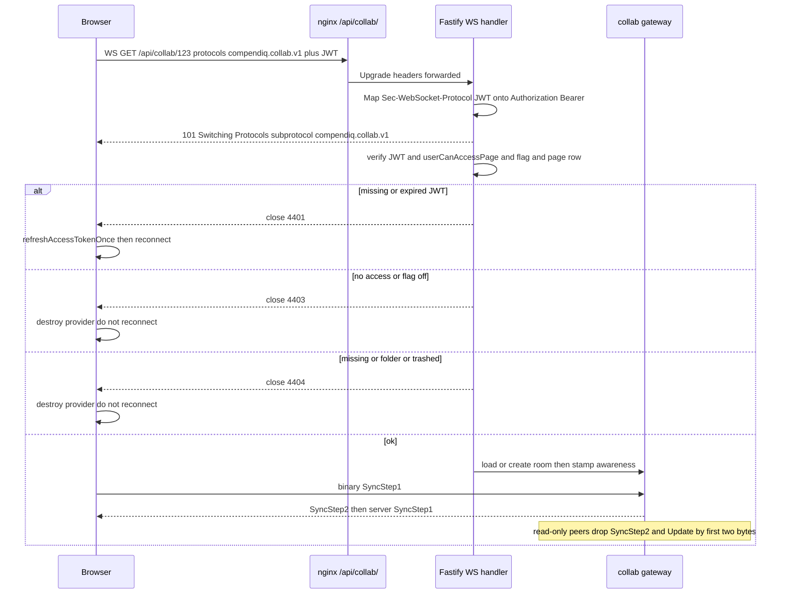
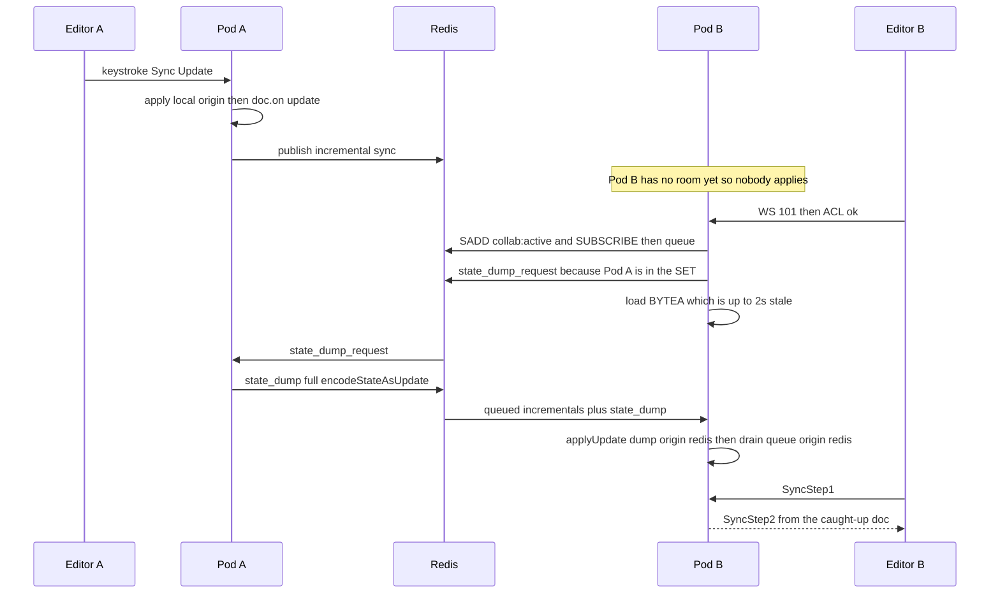
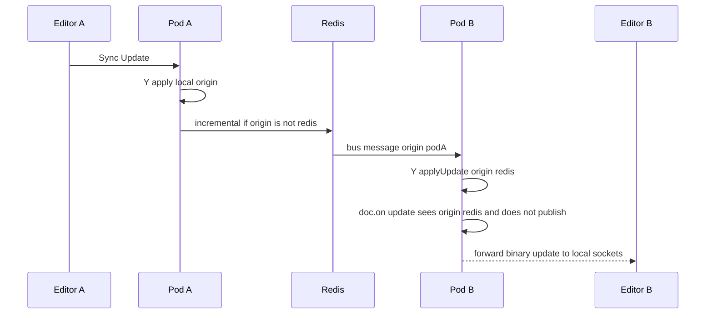
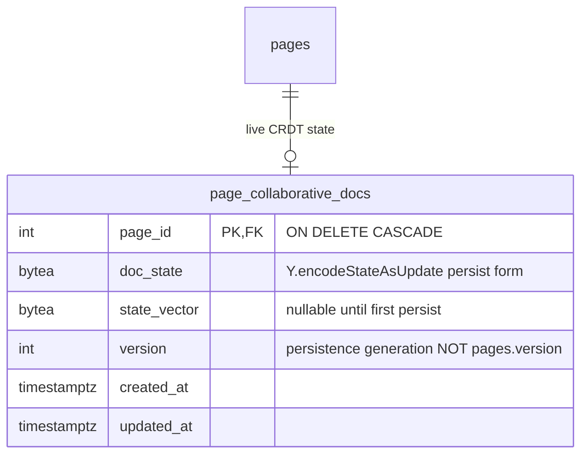
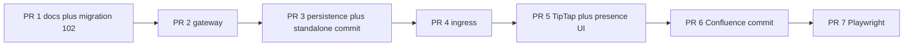

> Design of record for GitHub #1411. Persisted unchanged by #1443.

# Real-time Collaborative Editing for Compendiq CE

**Author:** TBD
**Date:** 2026-08-24
**Status:** Draft (revised after design review — handshake, snapshot/sync, Redis hydration, competing writers, schema ratchet, commit order)
**Issue:** [#1411](https://github.com/Compendiq/compendiq-ce/issues/1411)
**Local draft:** `docs/issues/realtime-collaborative-editing.md`
**Target path in-repo (PR 1):** `docs/superpowers/specs/2026-08-24-realtime-collaborative-editing-design.md`

This document is the design of record for GitHub #1411. It settles the mechanism under the epic’s objective, locks the decisions the issue draft left open (notably Hocuspocus), and is precise enough that seven independently reviewable PRs can be written from it without reopening the architecture.

Verified against the working tree of `compendiq-ce` on 2026-08-24 (parent checkout `fix/embedding-run-progress`; files cited below match `origin/dev` for these surfaces). Latest migration on **`origin/dev` is `101_embedding_compare_judgements.sql`**. The collab table is **`102_page_collaborative_docs.sql`**, never 099 (the epic’s filename is stale).

---

## Overview

Compendiq already shows who is on a page (#301: SSE + Redis `presence:page:{id}`, `PresenceAvatarStack`). Editing is still single-user: each editor holds a local TipTap draft, Save does `PUT /api/pages/:id` with `UpdatePageSchema.version`, and a second saver hits the optimistic-concurrency 409 at `backend/src/routes/knowledge/pages-crud.ts` (~1379–1442 standalone, ~1483–1486 Confluence). Concurrent work is discarded.

This design adds an opt-in Yjs CRDT session per page, gated by `admin_settings.collab_editing_enabled` (default **false**). Authenticated clients with page access open a WebSocket to `GET /api/collab/:pageId`. A Fastify 5 gateway (`@fastify/websocket` + `y-protocols`) **completes the 101 upgrade**, then closes with y-websocket permanent codes **before SyncStep1** if auth, ACL, flag, or page state fail — because a browser `WebSocket()` cannot see HTTP 401 on a failed handshake (it only gets 1006). It stamps awareness identity server-side, fans **incremental** `doc.on('update')` payloads across pods on Redis pub/sub (same duplicate-subscriber pattern as `presence-service.ts`, with `Y.applyUpdate(..., 'redis')` so receives do not loop), and persists Yjs binary state in `page_collaborative_docs`. TipTap v3 Collaboration + `@tiptap/extension-collaboration-caret` bind a named `collabExtensions()` schema to `Y.XmlFragment` field `'default'`. Save/Publish becomes `POST /api/pages/:id/collab/commit`. For Confluence, `client.updatePage` runs **first** (same order as PUT); `pages.version` is never bumped before the remote write succeeds. #301 SSE stays for viewers and as the fallback when the flag is off.

Hocuspocus is **not** added. `@fastify/websocket` + `y-protocols` is enough; Hocuspocus v2+ is a second listen/crossws stack and a custom multiplexed protocol that generic `y-websocket` cannot speak.

---

## Background & Motivation

### Current state



- Presence: `backend/src/core/services/presence-service.ts` (Redis ZSET + SET + HASH, pub/sub `presence:page:{id}`, duplicate subscriber because node-redis v5 cannot mix commands and subscribe) and `backend/src/routes/knowledge/pages-presence.ts` (JWT `onRequest` + `userCanAccessPage` **before** `writeHead`). SSE can see HTTP 401 because it is `fetch()`. Collab is a browser `WebSocket()` and **cannot** — do not copy the presence 401-refresh path.
- Save: `PUT /api/pages/:id` in `pages-crud.ts`. Standalone write ACL is owner or `visibility = 'shared'` — **no admin bypass**. Confluence write ACL is `getUserAccessibleSpaces` (admins already union every space). Both paths bump `pages.version`. Standalone binds `AND version = $readVersion` so a lost update is a 409, not last-write-wins. Confluence PUT calls `client.updatePage` **first** (~1500), then writes the local row from `confPage.version.number`.
- Other body writers that bump `pages.version`: `POST /api/pages/:id/versions/:version/restore` in `pages-versions.ts` (~337), `POST /api/llm/improvements/apply` in `llm-conversations.ts` (~223), `POST /api/pages/:id/draft/publish` in `pages-crud.ts` (~1840).
- Editor: `frontend/src/shared/components/article/Editor.tsx` `useEditor` with `StarterKit.configure({ codeBlock: false })` plus a large Confluence node set. `ConfluenceImage = Image.extend` lives inside `Editor.tsx`. `drawioDiagram.pngDataUri` is an in-memory attr **not** serialized to HTML (`article-extensions.ts` ~408–414) but **is** a Yjs attr unless the collab schema drops it. `CommentMark` (`comment-extension.ts`, mark name `comment`) is persisted on `body_html` via `data-comment-id`.
- Ingress: `frontend/nginx.conf` `location ^~ /api/` has SSE (`proxy_buffering off`, `proxy_read_timeout 300`) and **no** `Upgrade` / `Connection`. `frontend/vite.config.ts` ~88–93 proxies `/api` with `changeOrigin` only — **no `ws: true`**. Corporate `docs/integrations/reverse-proxy/nginx.md` sets `proxy_set_header Connection ""` at **server** scope (~79) for SSE keep-alive; that header is hostile to Upgrade unless a dedicated `/api/collab/` location overrides it.

### Pain

Two editors, one page, one 409. The second user reloads and re-types. Presence already told them someone else was editing; the product then throws their work away.

### Why Yjs

Operations are commutative, associative, and idempotent (`Y.applyUpdate`). TipTap’s native collab backend is Yjs. OT would require a central transform service we do not have and would be brittle against the Confluence node catalogue.

---

## Goals & Non-Goals

### Goals

1. Two (or more) users with write access edit the same article concurrently and converge without 409ing each other.
2. Remote carets, selections, and names render in Graphite and Paper at WCAG 1.4.11 (3:1) against the pane.
3. Viewers with read access may join the room, receive sync + awareness, and must not apply updates.
4. Multi-pod: a socket on pod A and a socket on pod B for the same `pageId` exchange **incremental** Yjs updates via Redis. A late joiner on pod B must catch unpersisted (≤2 s) updates from pod A (subscribe-and-queue before BYTEA load, plus a state-dump when another pod is already in `collab:active`).
5. Search/embeddings stay fresh: debounced snapshots write `pages.body_html` / `pages.body_text` and raise `embedding_dirty` / `image_embedding_dirty` **without** bumping `pages.version`, **without** stamping `local_modified_*`, and **without** re-queuing summary/quality workers. Those workers run on **commit**, as PUT does today.
6. Explicit Save/Publish still versions the page and, for Confluence-sourced pages, pushes storage XHTML via `client.updatePage` **before** any local `pages.version` bump — the same HTTP-then-row order as today’s PUT.
7. External Confluence modification is detected and is **non-destructive**. While a room is live, inbound sync must **not** overwrite `body_html` unless the remote `version.number` actually increased.
8. Feature flag default off. Flag off ≡ today’s editor + SSE presence.
9. #301 SSE remains. One `PresenceAvatarStack`. Pencil badge = in the collab room when the flag is on; SSE `isEditing` when it is off.

### Non-goals

- Offline-first / IndexedDB (`y-indexeddb` is not added).
- End-to-end encrypted CRDT.
- Collaborative title, labels, or page-tree structure. Title rides on commit from the article textarea; last commit wins for title.
- Collaborative New Page (no `pages.id` yet).
- Retiring #301 SSE (later epic).
- Hocuspocus, Liveblocks, TipTap Cloud, y-websocket as a sidecar process.
- Fine-grained Confluence DC write vs read at the remote API. Write permission is **exactly** what `PUT /api/pages/:id` already allows — including **no** new admin bypass on private standalone pages.
- Collab for `page_type = 'folder'` (folders are title-only; PUT already rejects a body).
- Changing `body_storage` on the live path. Storage XML is produced only on commit/publish.
- Redesigning dock **Apply** (`POST /api/llm/improvements/apply`) into a CRDT merge. Apply **409s** while a room is live; in-editor Improve (`insertContentAt`) is the collab path.
- Comments as a separate collab product. `CommentMark` **is** in the collab schema so snapshot does not strip `data-comment-id`; there is no new comment UX in this epic.

---

## Key Decisions

### A. Gateway is `@fastify/websocket` + `y-protocols`. Hocuspocus is rejected.

**Pick:** embed the Yjs sync/awareness protocol in Fastify 5.

**Why it is enough**

- `@fastify/websocket` (Fastify 5) runs `onRequest` / `preValidation` / `preHandler` **before** the HTTP upgrade. That is useful for logging and for mapping `Sec-WebSocket-Protocol` onto `Authorization`. It is **not** how we refuse a browser: throwing 401 in `onRequest` never delivers a status the WHATWG `WebSocket` constructor can read.
- `y-protocols` PROTOCOL.md defines SyncStep1=0, SyncStep2=1, Update=2; the composite envelope `varUint(messageType) • payload` with Sync=0 and Awareness=1, which is what `y-websocket` speaks.
- Read-only enforcement is specified in PROTOCOL.md §6: inspect the first two bytes (`00 00` SyncStep1 accept, `00 01` SyncStep2 reject, `00 02` Update reject, `01 …` Awareness accept).
- Redis pub/sub and a duplicate subscriber already exist in `presence-service.ts`. Collab copies that pattern, it does not invent a broker.

**Rejected: Hocuspocus.** The in-repo issue draft recommends it. The product objective forbids adding it if Fastify + y-protocols is enough. Hocuspocus v2+ uses a custom multiplexed protocol incompatible with generic `y-websocket` (`@hocuspocus/provider` required) and is its own `listen()` / crossws server — a second WebSocket stack beside Fastify 5, a second auth story, and a second process to health-check. Its Redis extension duplicates what we already operate.

**Rejected: standalone `y-websocket` server.** Would sit outside Fastify, so JWT and `userCanAccessPage` would have to be reimplemented as an auth proxy.

**Libraries (smallest set)**

| Side | Packages | Not added |
|------|----------|-----------|
| Backend | `yjs` (same major as the frontend; TipTap 3 tracks Yjs 13), `y-protocols`, `lib0`, `@fastify/websocket` (Fastify `5.x` peer) | `@hocuspocus/server`, `@hocuspocus/provider`, `@hocuspocus/extension-redis` |
| Frontend | `yjs`, `y-websocket`, `@tiptap/extension-collaboration`, `@tiptap/extension-collaboration-caret`, `@tiptap/y-tiptap` | `y-indexeddb`, Liveblocks, the v2 package name `@tiptap/extension-collaboration-cursor` |

Pin the `y-protocols` package name to whatever TipTap 3 / `y-websocket` currently import (`y-protocols`, not a hypothetical `@y/protocols` until the app moves to Yjs 16).

v1 registers **one** WebSocket route. `handleProtocols` is a **`WebSocket.Server` option** (plugin-global on `app.register(@fastify/websocket, { options: { handleProtocols } })`), not a per-route Fastify hook. That is acceptable because there is no second WS route to negotiate a different subprotocol.

### B. Yjs binary ↔ `page_collaborative_docs`

| Column | Meaning |
|--------|---------|
| `page_id` | PK, `REFERENCES pages(id) ON DELETE CASCADE` |
| `doc_state` | `BYTEA NOT NULL` = `Y.encodeStateAsUpdate(doc)` (full document update, **persisted** form only — **not** the Redis payload) |
| `state_vector` | `BYTEA` nullable until the first persist = `Y.encodeStateVector(doc)` |
| `version` | Persistence generation for this row. **Not** `pages.version`. Incremented on each BYTEA write so a crash-recovery read can detect a torn write if we ever add compare-and-swap; it is not an editor-facing number. |
| `created_at` / `updated_at` | Timestamptz, `updated_at` indexed |

TipTap Collaboration binds `Y.XmlFragment` field **`'default'`** (the TipTap default). Do not rename it.

**First join, no row:** under a transaction taking `pg_advisory_xact_lock(COLLAB_INIT_LOCK_KEY, pageId)` (constant in `backend/src/core/db/advisory-locks.ts`, two-key form, **not** raw `pageId` — that namespace already holds `PAGE_MOVE_ADVISORY_LOCK_ID = 891_001` and `MIGRATIONS_ADVISORY_LOCK_ID = 745_001`), `SELECT body_html, version, deleted_at, page_type FROM pages WHERE id = $1`. If missing or trashed, close **4404**. If `page_type = 'folder'`, close **4404**. Create a `Y.Doc`, parse `body_html` into the fragment with `collabExtensions()`, persist the row, keep the doc in the in-memory room.

**Do not** let two clients independently `setContent` into an empty fragment — that is the well-known y-prosemirror dual-init duplication. Initialization is server-side, once, locked.

BYTEA persist is **always** the full `encodeStateAsUpdate` (a snapshot of the doc). Redis pub/sub is **never** that: it publishes the **incremental** `update` argument from `doc.on('update')`. Mixing those two is how Goal 4 becomes a full-document flood on every keystroke.

### C. What is live vs snapshotted vs committed

| Representation | When it moves | Versioning / side effects |
|----------------|---------------|---------------------------|
| In-memory `Y.Doc` + Redis fan-out of **incremental** updates | Every keystroke (CRDT) | N/A — this is the live truth |
| `page_collaborative_docs.doc_state` / `state_vector` | Debounced **2 s** after last applied update, and **immediately** when the last editor disconnects | Increments table `version` (persistence generation). Always. |
| `pages.body_html` + `pages.body_text` (`htmlToText`) | Same 2 s debounce (and last-disconnect) | **Does not** increment `pages.version`. **Does** set `embedding_dirty` and gated `image_embedding_dirty`. **Does not** stamp `local_modified_at` / `local_modified_by`. **Does not** re-queue `summary_status` / `quality_status`. Search/FTS/embeddings stay fresh; the 15-minute sync tick does **not** see a false `hasLocalEdits`. |
| `pages.body_storage` (XHTML via `htmlToConfluence`) | Only on explicit Save/Publish / collab commit (PR 6 for Confluence) | Commit increments `pages.version` (standalone locally; Confluence from `confPage.version.number` **after** `updatePage` succeeds) |
| Confluence DC | Only on collab commit for `source = 'confluence'` | Remote version from `client.updatePage` |
| Summary / quality workers | **Commit only** | Same cadence as today’s PUT |

Stamping `local_modified_*` on the 2 s path is **forbidden**. `sync-service.ts` `applyConflictPolicyForExistingPage` (~941–944, ~1018–1076) treats `local_modified_at > last_synced` as `hasLocalEdits`. Default policy is **`confluence-wins`**. Snapshot HTML is not byte-identical to the last Confluence conversion (the golden tests admit this). If we stamped local-modified, a pause plus the next sync would overwrite `body_html` with the last Confluence conversion **even when nobody edited Confluence**, then Decision D’s rebuild would `doc_reset` the room onto that HTML and destroy uncommitted CRDT work. Search freshness is `body_html` / `body_text` / embedding flags. Conflict detection stays a **commit** fact.

### D. Save/Publish vs `pages.version` vs Confluence vs other body writers

When the flag is on **and** a collab room exists for the page, the article Save button must **not** `PUT /api/pages/:id` with the stale client `version` loaded at edit-open (`PageViewPage.tsx` `handleSave` today sends `version: page.version`).

**New route:** `POST /api/pages/:id/collab/commit`

**Standalone (PR 3):**

1. Require authenticate + `userCanEditPage` (PUT predicates **verbatim**).
2. Snapshot the in-memory Y.Doc to HTML. Drain of pending draw.io PNGs happens **client-side first** (`drainPendingDrawioDiagrams`) so the Y.Doc already holds attachment URLs, not data URIs. (`pngDataUri` is not in the collab schema, so peers never received the data URI over Yjs.)
3. In one transaction: `SELECT version, … FROM pages WHERE id = $1 FOR UPDATE`. `$expected` is that **server-known** `pages.version`. `UPDATE pages SET body_html, body_text, title, version = version + 1, local_modified_at = NOW(), local_modified_by = $user, summary_status = 'pending', summary_retry_count = 0, quality_status = 'pending', quality_retry_count = 0, embedding_dirty, image_embedding_dirty, … WHERE id = $1 AND version = $expected`.
4. If `rowCount = 0` because two commits raced: **retry once** in the same request against the new version with the **same CRDT HTML**. The second writer succeeds. Peers do not 409.
5. Broadcast `{ type: 'pages_version', version }` on **WS control message type 4**.

**Confluence (PR 6) — same order as PUT (`pages-crud.ts` ~1500 then local row from `confPage.version.number`):**

1. Snapshot HTML from the Y.Doc (do **not** bump `pages.version` yet).
2. GET remote page (or trust the version Confluence will check). If remote `version.number` moved relative to the **current** `pages.version` (no local bump has happened): **409** `{ code: 'confluence_modified', remoteVersion, localVersion }`, do not `updatePage`, do not rewrite the row. Room stays live.
3. `htmlToConfluence` + `uploadLocalImagesToConfluence` as PUT does, then `client.updatePage(confluenceId, title, storageBody, pages.version)` — `updatePage` itself sends `version: { number: version + 1 }` (`confluence-client.ts` ~689–700). Pass the **current** local version, not a pre-incremented one. Restore already documents this footgun (`pages-versions.ts` ~390–392: pass `newVersion - 1`).
4. On Confluence 409/5xx: local `pages.version` and `body_html` **unchanged**, room still live. Test this path.
5. On success: **one** transaction writes `body_html` / `body_text` / `body_storage` / `version = confPage.version.number` / `last_synced = NOW()` / `local_modified_* = NULL` / summary+quality pending / embedding flags. Never increment `pages.version` before the remote write succeeds.
6. Broadcast `pages_version` with `confPage.version.number`.

**Non-collab `PUT /api/pages/:id` stays** for flag-off and API clients.

**Competing body writers — one helper, four call sites.** `assertNoLiveCollabRoom(pageId)` in `core` (reads `collab:active:{pageId}`): if the SET is non-empty, throw 409 `{ code: 'collab_session_active' }`. Used by:

| Incoming writer | File | Behaviour |
|-----------------|------|-----------|
| `PUT /api/pages/:id` with `bodyHtml` | `pages-crud.ts` | 409. Do not silently drop CRDT work. |
| `POST /api/pages/:id/versions/:version/restore` | **`pages-versions.ts`** (~337), **not** `pages-crud.ts` | 409. Restore is a body rewrite. |
| `POST /api/llm/improvements/apply` | `llm-conversations.ts` (~223) | **409**. Copy: use in-editor Improve (block-menu `insertContentAt` mutates the Y.Doc). Do **not** redesign Apply into a CRDT merge. CLAUDE.md forbids turning Apply into a client HTML write; the dock Apply path still hits this route while Assistant is open. |
| `POST /api/pages/:id/draft/publish` | `pages-crud.ts` (~1840) | 409. Publishing copies `draft_body_html` onto the live row and bumps version. Draft PUT (~1790) writes `draft_body_*` only and is **not** gated. |
| Inbound Confluence **sync** that would write `body_html` | `sync-service.ts` `applyConflictPolicyForExistingPage` | **Not** a 409 to an HTTP client. While `collab:active:{pageId}` is non-empty: apply inbound HTML **only if the remote Confluence `version.number` actually increased**. Skip the HTML-equality / confluence-wins overwrite of a live room (lossy snapshot HTML would look like `htmlChanged` even when nobody edited Confluence). If the remote version **did** increase: rebuild the Y.Doc from the new HTML, persist BYTEA, send control `doc_reset`, close sockets with **1001** so `y-websocket` reconnects. |

Live-room detection: Redis key `collab:active:{pageId}` (SET of `{podId}:{connId}`, **TTL 45 s**, refreshed on **every ping and every inbound frame**). Ping interval is **15 s** (3× headroom, matching presence’s 10 s heartbeat vs 30 s TTL). In-process room map is not enough across pods.

### E. Awareness vs #301 SSE (dual-run)

SSE `GET /api/pages/:id/presence` is **not** retired.

When the flag is on and the user is in the collab room:

- Yjs awareness feeds `PresenceAvatarStack` for **editors** (anyone with an open collab socket).
- SSE continues for **viewers** who have the page open but are not editing (read mode).
- The stack is unified: merge by `userId`; `isEditing === true` if the user is in the collab room. Pencil badge = collab-room membership, not the SSE heartbeat’s `isEditing`.

When the flag is off: today’s SSE `isEditing` heartbeat from `PageViewPage`’s `setPresenceEditing(editing)` is unchanged.

**Server stamps awareness.** After JWT, the gateway writes `{ id: userId, name, color }` and **ignores** client-claimed identity (PROTOCOL.md: awareness is not authenticated). Color is deterministic from `userId` (see UI). Client `CollaborationCaret.user` is display-only and is overwritten on the way through.

Awareness refresh 15 s, expiry 30 s (`y-protocols` defaults). `state = null` on disconnect.

Awareness fan-out uses `awareness.encodeAwarenessUpdate` / `awareness.applyAwarenessUpdate` (or the `y-protocols` equivalents). It is **not** a Yjs document update and must never go through `Y.applyUpdate`.

### F. Authn/authz on handshake — 101 first, then 440x before SyncStep1

Browser `WebSocket()` cannot set `Authorization`. `authenticate` in `backend/src/core/plugins/auth.ts` requires `Authorization: Bearer`. The WHATWG constructor also **cannot see HTTP 401/403/404** on a failed upgrade: the socket errors and closes with **1006**. `y-websocket` treats 1006 as **transient** and reconnects. A 1 h expired access token would therefore reconnect forever with the dead JWT in `Sec-WebSocket-Protocol` and never call `refreshAccessTokenOnce()`.

`use-presence.ts` can see 401 because it is `fetch()` of an SSE stream. **It is not the precedent for this API.** Do not cite it as the collab refresh path.

**Locked handshake**

1. Map `Sec-WebSocket-Protocol` JWT onto `request.headers.authorization` (and accept a real `Authorization` header for Node tests).
2. **Complete the 101.** Do **not** throw `fastify.authenticate` in `onRequest` on this route — that is HTTP 401 with no socket, invisible to the browser.
3. In the socket handler, **before any SyncStep1**: verify JWT + `getUserSecurityState`; `userCanAccessPage`; flag on; page exists, not folder, `deleted_at IS NULL`. Then:
   - **4401** — missing/invalid/expired JWT, deactivated/missing user, role mismatch
   - **4403** — authenticated but `userCanAccessPage` false, or flag off (join or mid-session)
   - **4404** — missing page, folder, or `deleted_at IS NOT NULL` at join
4. Only after those checks: load/create room, stamp awareness, run y-protocols sync.
5. HTTP 401 **before** upgrade is reserved for Node tests that want it (e.g. `inject()` of a non-upgrade GET). The browser path never depends on it.

**Client (`use-collab-provider`)**

- Close **4401**: `refreshAccessTokenOnce()`, reconnect with the new access token. Never put the refresh token on the socket.
- Close **4403** / **4404**: `provider.destroy()`, do not reconnect. Surface a non-retrying error.
- Close **1001**: reconnect (transient resync after `doc_reset` or in-flight Confluence hide).
- **Test (mandatory):** a WHATWG-shaped client (`new WebSocket(url, protocols)`, **no** `ws` package `unexpected-response`) recovers from an expired token: first connection closes 4401, helper refreshes, second connection syncs. This test fails if the server 401s the handshake.

**Token delivery**

1. Preferred (browsers): `Sec-WebSocket-Protocol: compendiq.collab.v1, <jwt>`. `handleProtocols` **must** select only `compendiq.collab.v1` and must never echo the JWT as the chosen subprotocol.
2. Also accepted: a real `Authorization: Bearer` header (Node tests, future non-browser clients).
3. **Never** the query string. nginx access logs `$request_uri`.
4. Client must **not** send an empty protocol: `if (!token) return` — do not construct `WebsocketProvider` with `protocols: [COLLAB_WS_PROTOCOL, '']` (invalid tokenchar).

**Never log the token.** Add pino redact paths `req.headers.authorization` and `req.headers["sec-websocket-protocol"]` (the logger today redacts nothing — `backend/src/core/utils/logger.ts`).

**Join ACL:** `userCanAccessPage(userId, pageId)`. Failure is **4403** after 101, not HTTP 403.

**Write vs read-only — PUT predicates verbatim.** Extract `userCanEditPage` as the **exact** checks PUT uses today. This is behaviour-preserving. It is **not** a new admin bypass.

- Trashed (`deleted_at IS NOT NULL`) → cannot join (4404) and cannot stay (4404 after committed hide).
- Standalone: `created_by_user_id === userId` OR `visibility === 'shared'`. **No `isSystemAdmin` short-circuit.** Standalone PUT (`pages-crud.ts` ~1376–1378) has none; an admin who is not the owner cannot edit another user’s **private** standalone page today. `userCanEditPage` must not start allowing it. Admins still bypass via `userCanAccessPage` / `authenticate` only where those functions already do (join as **read-only** on a private page they cannot PUT).
- Confluence: `space_key` ∈ `getUserAccessibleSpaces(userId)`. That helper **already** unions every known space for admins (`rbac-service.ts` ~317–330). No extra branch.

Read-only is not theoretical: `userCanAccessPage` can return true via a page-level ACE (`inherit_perms = false`) while PUT still requires space membership. ACE-only users join as read-only. PROTOCOL.md §6 byte prefix is enforced on every inbound frame.

**Close codes** (y-websocket treats **4400–4499 as permanent** — the client must not reconnect):

| Code | When |
|------|------|
| **4401** | Auth failed or expired at join (after 101, before SyncStep1); token expired / account deactivated **after** the socket opened (periodic `getUserSecurityState` re-check, 60 s) |
| **4403** | No page access; flag off at join or mid-session; write attempted while read-only after N drops |
| **4404** | Missing page, folder, or **committed** trash/delete (`deleted_at` that will not roll back, or `DELETE FROM pages`) |
| **1001** | Transient: `doc_reset` after inbound sync whose remote version increased; Confluence **delete intent** that may still roll back (see Trash) |
| HTTP 401 (no socket) | Optional Node-only non-upgrade `inject()`. Not the browser path. |

### G. Ingress — bundled nginx, Vite, corporate proxies, HTTP/2

**Bundled edge (`frontend/nginx.conf`):** sibling `location ^~ /api/collab/`. Longer prefix beats `^~ /api/`. Must set `proxy_http_version 1.1`, `proxy_set_header Upgrade $http_upgrade`, `proxy_set_header Connection "Upgrade"`, `proxy_read_timeout 3600s`, `proxy_send_timeout 3600s`. Keep the existing `/api/` SSE 300 s timeout unchanged.

**Vite (`frontend/vite.config.ts`, PR 4):** the `/api` proxy must set `ws: true`. Today it is `changeOrigin` only (~88–93). Without this, `npm run dev` (CLAUDE.md default, typically the Vite port) cannot upgrade `ws://localhost:5273/api/collab/:id`. Playwright on 8081 does not save implementers of PR 5. Guard with a parse test of `vite.config.ts` (same style as `frontend/src/build-config.test.ts`).

**Corporate nginx (`docs/integrations/reverse-proxy/nginx.md`):** the vhost currently sets `proxy_set_header Connection ""` at **server** scope (~79) so SSE keep-alive works. That header is hostile to WebSocket Upgrade. Show a **dedicated** `location /api/collab/` that sets `Connection "Upgrade"` and `Upgrade $http_upgrade` and does **not** inherit `Connection ""`. Putting the WS block only as a sibling snippet that still sits under the server-level empty Connection is a silent failure.

**HTTP/2:** a `listen 443 ssl http2` server still accepts HTTP/1.1 on the same port; browsers’ `WebSocket()` uses HTTP/1.1 Upgrade (RFC 6455), not RFC 8441 Extended CONNECT. Document that `/api/collab/` must be reachable as HTTP/1.1 to the next hop. If a corporate edge terminates HTTP/2 and speaks HTTP/1.1 to Compendiq, that is fine. Do not attach h2 push / buffering middleware to that location. Traefik/Caddy notes: long idle timeout, **no** Buffering middleware; retire the sentence “Compendiq doesn't use WebSockets”.

CSP `connect-src 'self'` in `frontend/nginx-security-headers.conf` already allows same-origin `wss:`. Do not widen CSP.

### H. Feature flag

`admin_settings.collab_editing_enabled`, value `'0'` / `'1'`, **default `'0'`**, seeded in migration 102.

Read through `makeCachedSetting` (`cached-setting.ts`) on channel `collab:enabled:changed` (extend the `CacheBusChannel` union in `redis-cache-bus.ts` in the same PR that publishes). Soft-fail default is **false**.

- Flag off: gateway completes 101 then closes **4403** before SyncStep1; frontend mounts today’s editor; SSE presence only.
- Flag on: PageViewPage opens the provider; Editor mounts Collaboration + CollaborationCaret; Save goes to `/collab/commit`.
- Mid-session off: cache-bus fires; every pod tombstones its rooms (**4403**) and drops `collab:active:*`.

Hard cutover is unsafe because `Editor.tsx` carries many custom Confluence nodes through y-prosemirror. The flag is the rollback.

### I. Test strategy

Vitest everywhere. Backend DB tests hit **real Postgres on 5433** via `backend/src/test-db-helper.ts` — never mock the DB. Redis via `backend/src/test-redis-helper.ts`. Mock only outbound HTTP (Confluence) and, where a unit test cannot listen, auth via `generateAccessToken`.

WebSocket tests may `listen` on an ephemeral port **or** use `@fastify/websocket` `injectWS()`. **Mandatory regardless of harness:** a WHATWG-shaped client (`globalThis.WebSocket`, protocols array, **no** `unexpected-response`) recovers from 4401 by refreshing the token. The `ws` package covers the `Authorization` header path (the WHATWG constructor cannot set headers).

Playwright two authenticated `browser.newContext()` sessions is **PR 7**, last. Nginx conf is a parse test in the style of `frontend/src/nginx-api-body-limit.test.ts`. Vite `ws: true` is a parse test of `vite.config.ts`.

### J. Redis fan-out is incremental, origin-tagged, subscribe-before-load

Goal 4 is not “publish JSON”. It is a receive path that cannot loop and cannot miss ≤2 s of unpersisted updates.

1. Publish the **incremental** `update` from `doc.on('update', (update, origin) => …)`, not `Y.encodeStateAsUpdate(doc)`.
2. `Y.applyUpdate(doc, update, 'redis')` on receive. The update handler **must not** re-publish when `origin === 'redis'`. A Redis envelope `origin` UUID only stops the **publisher** from applying its own bus message; it does not stop `doc.on('update')` from looping.
3. On receive: apply to the in-memory doc **and** forward the binary frame to local sockets except the originating conn (when the update came from a local socket).
4. Awareness: `awareness.applyUpdate` / `encodeAwarenessUpdate`. Never `Y.applyUpdate`.
5. Cold join: **subscribe (and queue) before BYTEA load**. Pub/sub does not replay. If B loads BYTEA then subscribes, it misses A’s increments permanently (client `resyncInterval` only syncs against **this** pod’s doc).
6. If `collab:active:{pageId}` already contains another `podId`, send control `state_dump_request`. That pod replies with one **full** `Y.encodeStateAsUpdate(doc)` (the only bus payload that is a full dump). Apply with origin `'redis'`. Then apply the queued incrementals (idempotent).

### K. Schema is a named `collabExtensions()` list, not a name-only ratchet

`collabExtensions()` is the single list consumed by `getCollabSchema()`, server init/snapshot, and the parity test. The ratchet **fails** on missing **node names, mark names, `content` expressions, `atom` / `isolating` / `defining` flags, and attr names**. It parses `Node.create` / `extend` / `Mark.create` objects, not only `name:`.

Must include nodes that are **not** `Node.create` in `article-extensions.ts`: `ConfluenceImage = Image.extend` inside `Editor.tsx`, `TitledCodeBlock`, `ExtendedTable`, `InlineLucideIcon`, `MermaidBlock`. Must include **`CommentMark`** (`name: 'comment'`). Must **exclude** `drawioDiagram.pngDataUri` (and any other attr that `renderHTML` deliberately drops) so a local draw.io edit does not flood Redis with a PNG data URI.

Golden fixtures include **draw.io** and **comment**, plus the original panel/table/layout/mention/status/expand/unknown-macro set.

### L. Trash tombstones after commit, via one helper

`deleted_at` / `DELETE FROM pages` writers are not only `DELETE /pages/:id`:

- standalone single soft/hard (`pages-crud.ts` ~1590–1596)
- Confluence single **intent** then rollback (`~1651–1678`)
- bulk standalone (`~2070`) and bulk Confluence intent (`~2100`)
- `sync-service.ts` `softDeleteVanishedPage` (~561) and `detectDeletedPages` (~1695)
- `purgeDeletedPages` hard delete (~1768)

CASCADE drops BYTEA on hard delete; it does **not** close sockets.

**Helper** (same neighborhood as `image-embedding-dirty.ts`): `tombstoneCollabRoomAfterCommit(pageId)` in `core/services/collab-tombstone.ts`. Call it **after** the SQL that is the committed terminal state. Tests: bulk trash and `detectDeletedPages`, not only `DELETE /pages/:id`.

Confluence **intent** that may roll back must **not** 4404. Close **1001** if we hide immediately, or (preferred) **do not tombstone until upstream success/404**. 4404 is permanent; a rollback would leave a live page whose clients refuse to rejoin until remount.

---

## Proposed Design

### Topology



### Module layout (neighborhoods locked; names may refine)

ESLint: gateway and persistence live in **`core` + `routes/knowledge`**. Do **not** put Yjs in `domains/llm`. `core` still imports nothing from domains/routes (`backend/eslint.config.js`). `assertNoLiveCollabRoom` lives in `core` so `routes/llm/llm-conversations.ts` can call it (llm routes may import core).

**Backend**

| File | Role |
|------|------|
| `backend/src/core/db/advisory-locks.ts` | `COLLAB_INIT_LOCK_KEY` (two-arg `pg_advisory_xact_lock`) |
| `backend/src/core/services/collab-room-service.ts` | In-process rooms, incremental Redis pub/sub, awareness fan-out, active-set TTL 45 s, tombstone, control broadcast, state-dump |
| `backend/src/core/services/collab-persistence.ts` | Load/save BYTEA, init from `body_html`, debounced snapshot **without** `local_modified_*` / summary / quality |
| `backend/src/core/services/collab-schema.ts` | Named `collabExtensions()` / `getCollabSchema()`. No React node views. No `pngDataUri`. Includes `CommentMark`. |
| `backend/src/core/services/collab-flag.ts` | `makeCachedSetting` reader for `collab_editing_enabled` |
| `backend/src/core/services/collab-tombstone.ts` | `tombstoneCollabRoomAfterCommit` — every committed hide/delete |
| `backend/src/core/services/collab-guard.ts` | `assertNoLiveCollabRoom(pageId)` |
| `backend/src/core/services/rbac-service.ts` | `userCanEditPage` — PUT predicates **verbatim**, no new admin bypass |
| `backend/src/routes/knowledge/pages-collab.ts` | Protocol mapping, `GET /api/collab/config`, `GET /api/collab/:pageId`, `POST /api/pages/:id/collab/commit` |
| `backend/src/app.ts` | `register(@fastify/websocket, { options: { handleProtocols } })`; `initCollabBus` next to `initPresenceBus` (~247–254); `pagesCollabRoutes` next to `pagesPresenceRoutes` (~486) |

Register `/collab/config` **before** `/collab/:pageId` (same reason `/pages/trash` is registered before `/pages/:id`).

**Frontend**

| File | Role |
|------|------|
| `frontend/src/features/pages/use-collab-provider.ts` | `y-websocket` to `/api/collab/:pageId`; 4401 → refresh + reconnect; 4403/4404 → destroy; 1001 → reconnect; no empty protocol |
| `frontend/src/features/pages/collab-colors.ts` | Deterministic palette from `userId` |
| `frontend/src/features/pages/use-presence.ts` | Unchanged SSE hook |
| `frontend/src/features/pages/PresenceAvatarStack.tsx` | Accept merged viewers; pencil = `isEditing` |
| `frontend/src/features/pages/PageViewPage.tsx` | Flag + provider; merge awareness; Save → commit; disable localStorage drafts while collab |
| `frontend/src/shared/components/article/Editor.tsx` | Collaboration + CollaborationCaret when `ydoc` is passed; `StarterKit.undoRedo: false` in that branch |

### Handshake sequence



### JWT mapping (critical interface)

Well-known subprotocol token: `compendiq.collab.v1` (constant, exported from contracts so the client cannot drift).

```ts
// pages-collab.ts — header mapping only, does NOT throw 401
const COLLAB_WS_PROTOCOL = 'compendiq.collab.v1';

function mapWsProtocolToAuthorization(request: FastifyRequest): void {
  if (request.headers.authorization?.startsWith('Bearer ')) return;
  const raw = request.headers['sec-websocket-protocol'];
  if (typeof raw !== 'string' || raw.length === 0) return;
  const parts = raw.split(',').map((s) => s.trim()).filter(Boolean);
  if (!parts.includes(COLLAB_WS_PROTOCOL)) return;
  const token = parts.find((p) => p !== COLLAB_WS_PROTOCOL);
  if (token) request.headers.authorization = `Bearer ${token}`;
}
```

Plugin-global (`app.register` of `@fastify/websocket`):

```ts
handleProtocols: (protocols: Set<string>) =>
  protocols.has(COLLAB_WS_PROTOCOL) ? COLLAB_WS_PROTOCOL : false,
```

v1 has **one** WS route, so a plugin-level negotiator is not ambiguous.

Client:

```ts
const token = useAuthStore.getState().accessToken;
if (!token) return; // do not send an empty protocol token

const proto = location.protocol === 'https:' ? 'wss:' : 'ws:';
new WebsocketProvider(
  `${proto}//${location.host}/api/collab`,
  String(pageId), // y-websocket appends /{room} → /api/collab/:pageId
  ydoc,
  {
    protocols: [COLLAB_WS_PROTOCOL, token],
    disableBc: true, // Redis is the one fan-out path; two tabs go through the server
    resyncInterval: 30_000,
  },
);
```

`pageId` on the wire is the integer `pages.id`, never `confluence_id`.

### Room lifecycle

One in-process `Y.Doc` per **open page per pod**. Cross-pod is Redis, not a shared heap.

```ts
interface CollabRoom {
  pageId: number;
  doc: Y.Doc;
  awareness: Awareness;          // y-protocols/awareness
  sockets: Map<string, CollabSocket>; // connId → { ws, userId, writable }
  pagesVersion: number;          // last known pages.version
  lastWriterUserId: string | null;
  persistTimer: ReturnType<typeof setTimeout> | null;
  emptyGrace: ReturnType<typeof setTimeout> | null;
  inboundQueue: Uint8Array[];    // sync updates received before BYTEA applied
}
```

**Join (after 440x checks)**

1. `SADD collab:active:{pageId} {podId}:{connId}` + `EXPIRE 45`.
2. **Subscribe to `collab:doc:{pageId}` and start queuing** — before any BYTEA read.
3. If the SET already contains another `podId`, publish `{ kind: 'state_dump_request', origin }`.
4. Load or init BYTEA under `pg_advisory_xact_lock(COLLAB_INIT_LOCK_KEY, pageId)`.
5. Apply queued incrementals with `Y.applyUpdate(doc, u, 'redis')`. Apply a state-dump the same way if it arrives.
6. `userCanEditPage` → `writable` on the socket (verbatim PUT predicates).
7. Stamp awareness `{ id, name, color }` from `users.display_name` / `username` (same query as `fetchUserMeta` in `pages-presence.ts`).
8. Run the y-protocols sync handshake.

**Inbound frame (writable)**

Apply the inner Sync Update to `doc` (local origin, **not** `'redis'`). `doc.on('update')` publishes the **incremental** payload. Refresh `collab:active` TTL. Schedule persist (2 s trailing).

**Inbound frame (read-only)**

```ts
function allowReadOnlyFrame(buf: Uint8Array): boolean {
  // PROTOCOL.md §6
  if (buf.length < 2) return false;
  if (buf[0] === 0 && buf[1] === 0) return true; // SyncStep1
  if (buf[0] === 1) return true;                 // Awareness
  return false;                                  // SyncStep2 / Update
}
```

Drop forbidden frames. After 8 drops on one socket, close **4403**. Do not apply the update. Refresh TTL on accepted frames (including read-only SyncStep1 / awareness) so a quiet viewer still holds `collab:active`.

**Last disconnect:** persist BYTEA + HTML snapshot **immediately**, `SREM` the active member, start a 10 s empty-room grace (reconnect), then drop the in-memory doc.

**Liveness:** every 60 s, `getUserSecurityState(userId)` (already cached 30 s, #737). `deactivated` / `missing` / role mismatch → 4401.

**Ping:** server `socket.ping()` every **15 s**. Refresh `collab:active` TTL to 45 s on ping **and** on inbound frames. A 31 s idle editor must still 409 PUT (test this).

`ws` `maxPayload`: **10 MiB**. First sync is a full `encodeStateAsUpdate`; keystrokes are tiny.

### Redis fan-out

Duplicate subscriber, same reason as presence (`presence-service.ts` lines 6–8, 98–136). **Do not** share the presence subscriber.

| Key / channel | Shape |
|---------------|--------|
| `collab:doc:{pageId}` | Pub/sub. JSON `{ origin, kind, update }` where `update` is **standard base64**. `kind: 'sync'` payloads are **incremental** Yjs updates. `kind: 'awareness'` is an awareness protocol blob. `kind: 'state_dump'` is the one full `encodeStateAsUpdate`. `kind: 'state_dump_request' \| 'control' \| 'tombstone'` as needed. Base64-in-JSON matches presence’s JSON payloads and lets `origin` be excluded from echo. |
| `collab:active:{pageId}` | SET `{podId}:{connId}`, TTL **45 s** |
| Pattern subscribe | `collab:doc:*` |

```ts
type CollabBusMessage = {
  origin: string; // process UUID from initCollabBus, not HOSTNAME
  kind: 'sync' | 'awareness' | 'control' | 'tombstone' | 'state_dump_request' | 'state_dump';
  update?: string; // base64 incremental, awareness blob, or full dump
};
```

Envelope `origin === thisPodId` → ignore (do not apply, do not forward). That is **not** sufficient to stop a loop:

```ts
doc.on('update', (update, origin) => {
  if (origin === 'redis') return; // load-bearing — do not republish
  publish({ origin: thisPodId, kind: 'sync', update: b64(update) });
});

// on bus sync from another pod:
Y.applyUpdate(doc, buf, 'redis');
forwardToLocalSockets(buf);
```

Pub/sub is fire-and-forget. **Yjs state is not stored in Redis.** Redis is `noeviction` + 256 MB (`docker/docker-compose.yml`); putting CRDT snapshots there would compete with BullMQ and image staging (#1183). BYTEA belongs in Postgres.

Single-pod fallback: if the subscriber fails to connect, log a warning and operate in-process only — same soft-fail as `initPresenceBus`. State-dump is unnecessary in that mode (one heap).

#### A types, B joins other pod 1 s later (catch-up)



#### A types, Redis delivers to B, B must not republish



PR 2’s two-subscriber test **must** cover a delayed second subscriber (join 1 s after the first keystroke, assert the second doc contains it) and the no-republish loop (spy `PUBLISH` count on pod B stays 0 for that update).

### Persistence and HTML ↔ Y.Doc

**Init (no row)**

```ts
import * as Y from 'yjs';
import { generateJSON } from '@tiptap/html';
import { prosemirrorJSONToYDoc } from '@tiptap/y-tiptap';
import { collabExtensions, getCollabSchema } from './collab-schema.js';

const json = generateJSON(bodyHtml, collabExtensions());
const doc = prosemirrorJSONToYDoc(getCollabSchema(), json, 'default');
```

**Snapshot (Y.Doc → HTML)**

```ts
import { generateHTML } from '@tiptap/html';
import { yXmlFragmentToProseMirrorJSON } from '@tiptap/y-tiptap';

const json = yXmlFragmentToProseMirrorJSON(doc.getXmlFragment('default'), getCollabSchema());
const html = generateHTML(json, collabExtensions());
const bodyText = htmlToText(html); // core/services/content-converter.ts
```

Lock:

```ts
// core/db/advisory-locks.ts
export const COLLAB_INIT_LOCK_KEY = 1_411_001; // distinct from 891_001 and 745_001

await query('SELECT pg_advisory_xact_lock($1, $2)', [COLLAB_INIT_LOCK_KEY, pageId]);
```

**Schema — `collabExtensions()` is the list**

A name-only scrape of `Node.create({ name })` in two files is not enough for y-prosemirror:

- Matching **`content` / `group` / `atom` / `isolating` / `defining`** is required. `confluenceLayout` is `content: 'confluenceLayoutSection+'` and `defining: true` (`article-extensions.ts` ~780–784). `drawioDiagram` is `atom: true` (~391–394). A server node missing `atom` or the content expression produces a different XML tree; merge then drops or duplicates children.
- Nodes **not** declared as `Node.create` in those two files: `ConfluenceImage = Image.extend` in `Editor.tsx` (~142), `TitledCodeBlock`, `ExtendedTable`, `InlineLucideIcon`, `MermaidBlock`.
- Marks: `CommentMark` (`comment-extension.ts`, `name: 'comment'`) is persisted on `body_html` via `data-comment-id`. A mark-less schema strips comments on every 2 s snapshot.
- `drawioDiagram.pngDataUri` is **explicitly not serialized to HTML** (`renderHTML: () => ({})`). y-prosemirror syncs **attrs**. Exclude it from the collab schema so a local draw.io edit does not put a PNG data URI on the CRDT or Redis. Drain-on-commit still runs so `src` is an attachment URL before Save.

`collabExtensions()` is consumed by `getCollabSchema()`, init, snapshot, **and** the ratchet. The ratchet fails if Editor’s document schema (nodes + marks) disagrees on **node names, mark names, content expressions, atom/isolating/defining flags, or attr names**. Parse the `Node.create` / `extend` / `Mark.create` objects. Editor-only extensions (slash, vim, inline completion, drag handle) are excluded from both lists by construction.

Do **not** add `packages/editor-schema` in v1 (ADR-001). If the parity test becomes a maintenance burden after the first few node additions, that package is the follow-up.

**Golden fixtures (PR 3):** panel, table, layout, mention, status, expand, unknown-macro, **draw.io**, **comment**. HTML → Y.Doc → HTML asserts structure (node names, attrs, marks), **not** byte-identical HTML. Lossy round-trip is a named risk, not a silent failure.

**Debounce:** 2 s trailing after the last **applied** update (read-only SyncStep1 does not count). `timer.unref()`. Last-editor disconnect flushes immediately.

**Snapshot SQL — search freshness only:**

```sql
UPDATE pages SET
  body_html = $2,
  body_text = $3,
  embedding_dirty = TRUE,
  image_embedding_dirty = CASE
    WHEN body_html IS DISTINCT FROM $2 THEN TRUE
    ELSE image_embedding_dirty
  END
WHERE id = $1 AND deleted_at IS NULL
```

Forbidden on this path: `version = version + 1`, `AND version = $read`, `local_modified_at` / `local_modified_by`, `summary_status` / `quality_status` / retry resets, `body_storage`, `last_synced`. `htmlToText` keeps the FTS trigger (migration 049) honest.

Summary/quality re-queue belongs on **commit** (and PUT), not on a 2 s typing pause. That would enqueue LLM work into the same `noeviction` Redis as BullMQ on every pause.

### Control protocol (type 4)

y-websocket envelope types 0–3 are sync / awareness / auth / query-awareness. Unknown types are ignored by the stock client. We send **type 4** from the server; `use-collab-provider.ts` peeks the first varUint on `ws.message`.

```ts
export const MESSAGE_CONTROL = 4;

type CollabControl =
  | { type: 'pages_version'; version: number }
  | { type: 'doc_reset' }
  | { type: 'tombstone' }
  | { type: 'state_dump_request' };
```

State-dump **bytes** travel on the Redis bus (`kind: 'state_dump'`), not as a client-bound type-4 JSON blob (too large). Type 4 tells the **client** to expect a new SyncStep2 after 1001.

Payload: `lib0` `writeVarUint(4)` + `writeVarString(JSON.stringify(control))`. Clients never send type 4; inbound type 4 from a client is dropped.

### Commit (standalone in PR 3, Confluence in PR 6)

```ts
// POST /api/pages/:id/collab/commit
// Body: { title: string }  — no bodyHtml, no client version
```

Server snapshots the shared Y.Doc (not the request body). See Decision D for order.

**Frontend Save when collab is live**

```ts
await drainPendingDrawioDiagrams(editorInstance, …); // mutates editor attrs, not pngDataUri-on-the-wire
await apiFetch(`/api/pages/${id}/collab/commit`, {
  method: 'POST',
  body: JSON.stringify({ title: editTitle }),
});
```

Do not send `bodyHtml` or `version`. Vim `:w` already calls `onSave` → `handleSave`.

**Cancel / Done:** a collab session has no private draft to discard. Secondary action is **Done** (leave edit mode, disconnect on unmount). Do not open the discard dialog. Omit `draftKey`. Skip the restore-draft dialog while the flag is on.

### Competing writers

```ts
// core/services/collab-guard.ts
export async function assertNoLiveCollabRoom(pageId: number): Promise<void> {
  const n = await redis.sCard(`collab:active:${pageId}`);
  if (n > 0) {
    throw Object.assign(new Error('Collaborative editing session is active'), {
      statusCode: 409,
      code: 'collab_session_active',
    });
  }
}
```

Call sites: PUT `pages-crud.ts`, restore `pages-versions.ts`, Apply `llm-conversations.ts`, draft-publish `pages-crud.ts`. Apply 409 copy names in-editor Improve. Do not merge Apply into the CRDT in this epic.

### Trash / hide

```ts
// core/services/collab-tombstone.ts — call AFTER the committed SQL
export async function tombstoneCollabRoomAfterCommit(pageId: number): Promise<void> {
  // close local sockets 4404, PUBLISH kind tombstone, DEL collab:active
}
```

| Path | When to tombstone | Close code |
|------|-------------------|------------|
| Standalone single/bulk `UPDATE deleted_at` or `DELETE FROM pages` | After the statement commits | 4404 |
| `detectDeletedPages` / `softDeleteVanishedPage` | After `UPDATE deleted_at` | 4404 |
| `purgeDeletedPages` | After `DELETE FROM pages` | 4404 |
| Confluence single/bulk **intent** (`deleted_at` set, `client.deletePage` not yet settled) | **Do not** 4404. Optional 1001 hide. | 1001 if hiding, else leave the room |
| Confluence intent **rolled back** (`deleted_at = NULL`) | Do not tombstone | — |
| Confluence intent **committed** (upstream success or 404) | After that is known | 4404 |

### Presence merge

```ts
function mergePresence(
  sseViewers: PresenceViewer[],
  awareness: Map<string, { id: string; name: string; color: string }>,
): PresenceViewer[] {
  const byId = new Map<string, PresenceViewer>();
  for (const v of sseViewers) byId.set(v.userId, { ...v, isEditing: false });
  for (const a of awareness.values()) {
    const prev = byId.get(a.id);
    byId.set(a.id, {
      userId: a.id,
      name: a.name,
      role: prev?.role ?? '',
      isEditing: true,
      avatarUrl: prev?.avatarUrl,
    });
  }
  return [...byId.values()].sort((a, b) => {
    if (a.isEditing !== b.isEditing) return a.isEditing ? -1 : 1;
    return a.userId < b.userId ? -1 : a.userId > b.userId ? 1 : 0;
  });
}
```

`usePresence` still filters out `selfUserId`. Awareness merge also hides self. When collab is on, **stop sending** `isEditing: true` on the SSE heartbeat (`setPresenceEditing(false)` while the provider is up).

### Editor wiring

`Editor` gains an optional `ydoc?: Y.Doc` (and `caretUser?: { name: string; color: string }`). When `ydoc` is set:

```ts
StarterKit.configure({
  codeBlock: false,
  undoRedo: false, // Collaboration owns history
}),
Collaboration.configure({ document: ydoc, field: 'default' }),
CollaborationCaret.configure({ provider, user: caretUser }),
```

Do not pass `content=` into `useEditor` once Collaboration is bound. `PageViewPage` waits until the provider’s `synced` event before mounting `Editor` with the ydoc.

`@tiptap/extension-collaboration-caret` is the **v3** package. The v2 name `collaboration-cursor` must not appear in `package.json`.

`/impeccable` is a PR 5 gate on caret chips, selection tint, and the unified stack.

### Confluence inbound sync (PR 6)

Inside `applyConflictPolicyForExistingPage`, **before** the confluence-wins `UPDATE pages … body_html`:

```
if await sCard(collab:active:{pageId}) > 0:
  if incoming confluenceVersion <= row.version:
    COMMIT without writing body_html  // skip HTML-equality overwrite
    return
  else:
    write body_html as today
    rebuildCollabDocFromHtml(pageId, html)
    control doc_reset + close 1001
```

Integration test: collab types one paragraph, sync runs with **unchanged** remote `version.number`, Y.Doc still has the paragraph (and `body_html` was not reverted to the last Confluence conversion).

### Feature-flag surfaces

- Migration 102 seeds `INSERT INTO admin_settings (setting_key, setting_value) VALUES ('collab_editing_enabled', '0') ON CONFLICT DO NOTHING`.
- `GET/PUT /api/admin/settings` gains `collabEditingEnabled: boolean`. PUT publishes `collab:enabled:changed`.
- `GET /api/collab/config` → `{ enabled: boolean }` with `fastify.authenticate` but **not** `requireAdmin`.
- Settings UI (PR 5): admin-only switch, muted copy that the editor’s Confluence nodes are why this is opt-in. Off at rest, no amber.

### UI (ADR-010 v0.7)

Remote carets: a **dedicated palette**, not Steel, not status hues, not amber. Hash `userId` → index into 8–12 colours that each measure **≥ 3:1** against Graphite `--surface-card` and Paper `--surface-card` in `collab-caret-contrast.test.ts` (compute ratios; do not pin hexes). Label chips: that colour, text from `--surface-card`, 1px hairline, no shadow, no `translateY`, no `backdrop-blur`. `prefers-reduced-motion: reduce` disables caret blink if any.

`PresenceAvatarStack` stays flat. Do not invent a second presence UI.

### Quantities

| Quantity | Value | Notes |
|----------|-------|-------|
| Y.Doc instances | 1 per **open** page **per pod** | Not per connection, not per page in the corpus |
| Persist / snapshot debounce | 2 s trailing | Plus immediate flush on last editor out |
| Snapshot writes | `body_html`, `body_text`, `embedding_dirty`, `image_embedding_dirty` | **Not** `local_modified_*`, **not** summary/quality, **not** `pages.version` |
| Summary / quality re-queue | Commit only | Same cadence as PUT |
| Awareness refresh / expiry | 15 s / 30 s | y-protocols defaults |
| Server ping | **15 s** | Was 30 s in the first draft — too tight vs TTL |
| Active-set TTL | **45 s** | ≥3× ping, matching presence. Refresh on ping **and** inbound frames. 31 s idle still 409s PUT. |
| Empty-room grace | 10 s | Reconnect window |
| nginx WS timeouts | 3600 s | `/api/` SSE stays 300 s |
| Security re-check | 60 s | `getUserSecurityState` |
| `maxPayload` | 10 MiB | First sync of a large article |
| Typical `body_html` | tens of KB | Confluence pages commonly 20–80 KB |
| Typical `doc_state` | same order, ~1.5–3× HTML | CRDT metadata; TOAST’d BYTEA |
| Redis payload per keystroke | tens of bytes, base64 ~100 B | **Incremental** `doc.on('update')`, not a full encode |
| Heap per room | ~2–5× update size | 50 concurrent rooms × 500 KB ≈ 25 MB/pod |
| Redis memory | near-zero | Pub/sub is not stored; active SET is tiny |
| Flag default | false | Rollback = PUT `'0'` |
| Advisory lock | `pg_advisory_xact_lock(COLLAB_INIT_LOCK_KEY, pageId)` | `COLLAB_INIT_LOCK_KEY = 1_411_001` |

---

## API / Interface Changes

### WebSocket

```
GET /api/collab/:pageId
```

- `:pageId` = integer `pages.id`.
- Always 101, then 440x or sync. Subprotocol `compendiq.collab.v1`.
- Binary y-websocket frames. Control type 4 from server only.

### HTTP

| Method | Path | Auth | Body / response |
|--------|------|------|-----------------|
| GET | `/api/collab/config` | authenticate | `{ enabled: boolean }` |
| POST | `/api/pages/:id/collab/commit` | authenticate + edit ACL | `{ title }` → `{ id, title, version, source, pushedToConfluence? }` |
| GET/PUT | `/api/admin/settings` | requireAdmin | + `collabEditingEnabled` |
| PUT | `/api/pages/:id` | unchanged | **New 409** `collab_session_active` when a live room exists and the PUT carries `bodyHtml` |
| POST | `/api/pages/:id/versions/:version/restore` | unchanged | Same 409 (`pages-versions.ts`) |
| POST | `/api/llm/improvements/apply` | unchanged | Same 409 |
| POST | `/api/pages/:id/draft/publish` | unchanged | Same 409 |

`GET /api/pages/:id/presence` unchanged.

Contracts additions (all in `packages/contracts`):

- `COLLAB_WS_PROTOCOL = 'compendiq.collab.v1'`
- `CollabConfigSchema`
- `CollabCommitSchema` / `CollabCommitResponseSchema`
- `collabEditingEnabled` on admin settings read/write
- Optional `collabSessionActive?: boolean` on `PageDetailSchema`

Error codes:

| code | HTTP | Meaning |
|------|------|---------|
| `collab_session_active` | 409 | PUT / restore / Apply / draft-publish while a CRDT room is live |
| `confluence_modified` | 409 | Remote Confluence version moved; commit aborted **before** `updatePage` |

---

## Data Model Changes

Migration **`102_page_collaborative_docs.sql`** (PR 1; table unused until PR 2/3 is OK):

```sql
CREATE TABLE page_collaborative_docs (
    page_id INTEGER PRIMARY KEY REFERENCES pages(id) ON DELETE CASCADE,
    doc_state BYTEA NOT NULL,
    state_vector BYTEA,
    version INTEGER NOT NULL DEFAULT 1,
    created_at TIMESTAMPTZ NOT NULL DEFAULT NOW(),
    updated_at TIMESTAMPTZ NOT NULL DEFAULT NOW()
);

CREATE INDEX idx_page_collaborative_docs_updated
  ON page_collaborative_docs (updated_at);

INSERT INTO admin_settings (setting_key, setting_value, updated_at)
VALUES ('collab_editing_enabled', '0', NOW())
ON CONFLICT (setting_key) DO NOTHING;
```

`pages.version` is **not** altered. Table `version` is the BYTEA persistence generation.

ERD addition for `docs/architecture/06-data-model.md` (PR 1):



No backfill. Rows appear on first collab join.

---

## Alternatives Considered

### 1. Hocuspocus inside the backend container

**Pros:** first-party TipTap hooks, Redis extension, awareness helpers. The issue draft’s recommendation.

**Cons:** v2+ protocol is not y-websocket; requires `@hocuspocus/provider`; own listen/crossws runtime beside Fastify 5. Violates the product objective.

**Verdict:** rejected (Key Decision A).

### 2. Query-string JWT (`?token=`) or HTTP 401 before upgrade for browsers

**Pros:** trivial `WebSocket(url)`; Fastify `authenticate` onRequest “just works”.

**Cons:** query string lands in nginx `$request_uri`. HTTP 401 on handshake is **1006** in a browser; y-websocket reconnects forever with the dead token.

**Verdict:** rejected. Protocol header + 101-then-4401 (Decision F).

### 3. Last-write-wins PUT (drop optimistic concurrency when two editors are present)

**Pros:** no CRDT, no WS.

**Cons:** silent data loss — the thing the 409 exists to prevent.

**Verdict:** rejected.

### 4. OT (ShareDB / Confluence’s own)

**Cons:** needs a central sequencer; hostile to custom nodes; Confluence DC 9.2 is XHTML storage, not a collab API we can join.

**Verdict:** rejected.

### 5. Stuff `pages.version` into awareness

**Cons:** awareness is unauthenticated and client-writable.

**Verdict:** rejected (type 4).

### 6. Sticky collab without a flag

**Cons:** the Confluence node catalogue has not been through y-prosemirror.

**Verdict:** rejected (Decision H).

### 7. Stamp `local_modified_*` on 2 s snapshots so confluence-wins “protects” the session

**Cons:** snapshot HTML ≠ last Confluence conversion, so `htmlChanged` is true even when nobody edited Confluence. confluence-wins then overwrites the live `body_html` and a rebuild destroys the CRDT. Search does not need local-modified; commit does.

**Verdict:** rejected (Decision C).

### 8. Redesign Apply into a CRDT merge

**Cons:** Apply exists because `protectMedia` / `restoreMedia` / layout realignment live in `content-converter.ts` with no frontend counterpart. Merging that into Yjs is a separate epic.

**Verdict:** rejected. 409 `collab_session_active`; use in-editor Improve.

---

## Security & Privacy Considerations

| Threat | Severity | Mitigation |
|--------|----------|------------|
| JWT in query string → access logs | High | Forbidden. Protocol header or `Authorization` only. |
| JWT echoed as the chosen `Sec-WebSocket-Protocol` | High | `handleProtocols` returns only `compendiq.collab.v1`. |
| JWT in pino / request dumps | High | Redact `authorization` and `sec-websocket-protocol`. Tests fail if a fixture JWT appears in a log spy. |
| Expired token reconnect storm (1006) | High | 101 then **4401** before SyncStep1. Client refreshes. WHATWG recovery test. |
| Awareness spoofing | Medium | Server stamps `{ id, name, color }` after JWT. |
| Read-only peer applying SyncStep2/Update | High | PROTOCOL.md §6 prefix check; 4403 after repeated drops. |
| Join without page ACL | High | `userCanAccessPage` after 101, 4403. Parameterized SQL only. |
| Trashed page still editable | Medium | Join 4404; committed hide 4404; intent uses 1001 until committed. |
| Admin silently gaining write on private standalone | High | `userCanEditPage` is PUT **verbatim** — no new `isSystemAdmin` branch. |
| Deactivated user keeps a socket | Medium | 60 s `getUserSecurityState` → 4401. |
| Redis republish loop | High | `origin === 'redis'` suppresses `doc.on('update')` publish. Test it. |
| Oversized frame | Medium | `maxPayload` 10 MiB; rate-limit upgrade 20/min/user. |
| `pngDataUri` leaking multi-MB PNG over Redis | High | Attr excluded from collab schema. |
| Redis `noeviction` exhaustion | High if we stored BYTEA in Redis | We do not. Incremental pub/sub + a tiny SET only. |
| Flag-off bypass | Low | Gateway 4403s regardless of the client. |
| Empty protocol token | Low | Client `if (!token) return`. |

Auth remains JWT. Public exceptions are still only `/api/health` and `/api/auth/*`.

---

## Observability

Log lines (pino, **no tokens**, `pageId` + `userId` + `writable` + `connId`):

- `collab.join` / `collab.leave` / `collab.tombstone` / `collab.close` (code)
- `collab.persist` (duration_ms, bytes)
- `collab.snapshot` (duration_ms, html_bytes)
- `collab.commit` (pages.version after, confluence?: boolean)
- `collab.readonly_drop`
- `collab.state_dump`
- `collab.bus_error` (subscriber soft-fail)

Metrics (if OTEL is on; otherwise log-level counts): `collab.rooms`, `collab.sockets`, `collab.persist_ms`, `collab.snapshot_ms`, `collab.redis_publish_fail`.

Traces: one span around commit (and around Confluence `updatePage` in PR 6). Do not span every keystroke.

---

## Rollout Plan

1. **PR 1** lands the table and docs. Unused table is OK.
2. **PR 2–4** ship dark: flag default `'0'`. QA can flip the row and exercise the gateway with a fixture client. PR 4 includes Vite `ws: true` so PR 5 can be developed with `npm run dev`.
3. **PR 5** binds the editor. Still flag-off on production until an operator enables it.
4. **PR 6** Confluence commit **and** inbound-sync-while-collab (Decision D/C). Enable per deployment after a golden-page check (layout + expand + draw.io + table + comment).
5. **PR 7** two-session E2E in CI (flag on in the e2e env only).

Rollback: `PUT /api/admin/settings { "collabEditingEnabled": false }`. Cache-bus tombstones rooms with 4403. Editors remount the single-user path on next load. BYTEA rows can stay. No migration down.

There is no percentage canary of sockets. The flag **is** the canary.

---

## Risks

| Risk | Severity | Mitigation |
|------|----------|------------|
| Custom TipTap nodes vs y-prosemirror (attrs, content expressions, atom, dual-init) | **High** | Flag default off; server-side locked init; `collabExtensions()` ratchet on names **and** content/atom/attrs/marks; golden HTML including draw.io + comment; UnknownMacro catch-all; exclude `pngDataUri`. |
| HTML round-trip lossy vs `pages.body_html` | **High** | Same schema both directions; golden tests assert structure; commit uses the Y.Doc; **do not** let confluence-wins treat snapshot HTML as a conflict (Decision C/D). |
| confluence-wins overwriting a live session | **High** | No `local_modified_*` on snapshot; inbound sync skipped unless remote `version.number` increased. Integration test in PR 6. |
| Redis `noeviction` + large docs / `pngDataUri` | **High** if mis-stored | BYTEA in Postgres only; incremental pub/sub; attr excluded. |
| WS idle timeouts / Vite without `ws: true` | **High** without PR 4 | Dedicated `/api/collab/` 3600 s + 15 s ping; Vite `ws: true`; corporate nginx overrides `Connection ""`. |
| Handshake 1006 reconnect storm | **High** | 101 then 4401. WHATWG recovery test. |
| Awareness spoofing | Medium | Server stamp (Decision E). |
| Apply / restore / draft-publish clobber | Medium | `assertNoLiveCollabRoom` on all four writers. |
| Two tabs, old PUT vs collab | Medium | 409 `collab_session_active`. |
| Confluence commit bumps local version then 5xx | **High** without Decision D | `updatePage` first; local row from `confPage.version.number`; failure leaves version unchanged. |
| `@fastify/compress` interfering with the upgrade | Medium | Confirm compress skips `Upgrade`. Exclude `/api/collab/` if a test shows a 400. |
| Access-token 1 h cap vs a long edit | Low | 4401 → `refreshAccessTokenOnce`. Not a fetch-401 path. |
| `y-websocket` BroadcastChannel duplicating Redis | Low | `disableBc: true`. |
| Heap growth with abandoned rooms | Low | 10 s empty grace; committed trash tombstone. |
| 2 s snapshot enqueueing summary/quality | Medium if copied from PUT | Forbidden. Commit only. |
| `collab:active` TTL flap | Medium if 1× ping | Ping 15 s / TTL 45 s; refresh on frames. |

---

## Open Questions

None — remaining forks locked in this revision. Handshake is 101-then-440x (F). Snapshots do not stamp `local_modified_*` and do not re-queue summary/quality; inbound sync while live requires a remote version increase (C, D). Redis is incremental, origin-tagged, subscribe-before-load, with a state-dump (J). Apply 409s (D). `userCanEditPage` is PUT verbatim (F). Schema is `collabExtensions()` with a structural ratchet (K). Confluence commit is `updatePage` then local row (D). Vite `ws: true` is PR 4 (G). Ping 15 s / TTL 45 s (D, quantities). Advisory lock is two-key `COLLAB_INIT_LOCK_KEY` (B). Trash tombstones after commit (L).

---

## References

- Epic: https://github.com/Compendiq/compendiq-ce/issues/1411
- Local draft: `docs/issues/realtime-collaborative-editing.md`
- Presence: `backend/src/core/services/presence-service.ts`, `backend/src/routes/knowledge/pages-presence.ts`, `frontend/src/features/pages/PresenceAvatarStack.tsx`, `frontend/src/features/pages/use-presence.ts` (SSE 401 is **not** the collab path)
- Auth: `backend/src/core/plugins/auth.ts`
- RBAC: `backend/src/core/services/rbac-service.ts` (`userCanAccessPage`; `getUserAccessibleSpaces` admin union ~317–330)
- PUT / version: `backend/src/routes/knowledge/pages-crud.ts` ~1340–1540, `packages/contracts/src/schemas/pages.ts` `UpdatePageSchema`
- Restore: `backend/src/routes/knowledge/pages-versions.ts` ~337
- Apply: `backend/src/routes/llm/llm-conversations.ts` ~223
- Draft publish: `backend/src/routes/knowledge/pages-crud.ts` ~1840
- Sync conflict: `backend/src/domains/confluence/services/sync-service.ts` `applyConflictPolicyForExistingPage` ~854–1076; `detectDeletedPages` ~1695; `purgeDeletedPages` ~1768; `softDeleteVanishedPage` ~561
- Editor: `frontend/src/shared/components/article/Editor.tsx` (`ConfluenceImage` ~142, extensions ~764), `article-extensions.ts` (`drawioDiagram` atom / `pngDataUri`, `confluenceLayout` content), `comment-extension.ts`
- Locks: `backend/src/core/db/advisory-locks.ts`, `postgres.ts` `MIGRATIONS_ADVISORY_LOCK_ID`
- Dirty-flag helper pattern: `backend/src/core/services/image-embedding-dirty.ts`
- Ingress: `frontend/nginx.conf`, `frontend/vite.config.ts` ~88–93, `docs/integrations/reverse-proxy/{nginx,traefik,caddy}.md`
- Boundaries: `backend/eslint.config.js`, `docs/architecture/03-backend-domains.md`
- Content pipeline: `docs/architecture/11-content-pipeline.md`, `backend/src/core/services/content-converter.ts`
- ADR-010 v0.7 UI: `CLAUDE.md` UI/UX section, `frontend/src/workspace-themes.test.ts`
- App wiring: `backend/src/app.ts` (`initPresenceBus`, `pagesPresenceRoutes`)
- Tests: `backend/src/test-db-helper.ts`, `backend/src/test-redis-helper.ts`, `backend/src/core/db/migrations/__tests__/migration-filenames.test.ts`, `frontend/src/nginx-api-body-limit.test.ts`, `frontend/src/build-config.test.ts`
- y-protocols PROTOCOL.md (sync, awareness, composite envelope, §6 read-only)
- TipTap v3 Collaboration / `@tiptap/extension-collaboration-caret` / `@tiptap/y-tiptap`

Architecture docs this work updates (by PR):

| PR | Docs |
|----|------|
| 1 | NEW `docs/architecture/12-realtime-collaboration.md`, `docs/architecture/README.md` index row + maintenance table, `docs/architecture/06-data-model.md`, persist this spec |
| 2 | `03-backend-domains.md` (core services + knowledge routes) |
| 3 | `11-content-pipeline.md` (snapshot vs commit), `06-data-model.md` if columns need prose |
| 4 | `05-deployment.md`, reverse-proxy nginx/Traefik/Caddy, Vite proxy note |
| 5 | `04-frontend-structure.md` |
| 6 | `08-flow-sync.md` (skip inbound unless remote version increased), `11-content-pipeline.md` (commit → storage, `updatePage` first) |

`frontend/src/architecture-docs-mermaid.test.ts` will parse the new `12-*.md` automatically. Avoid raw `#` and `;` in any **sequenceDiagram** message text (#1191).

---

## PR Plan

Seven independently reviewable PRs. Default DAG is linear for review even though PR 4 is only weakly coupled to PR 3. Do not collapse unless a later note records why.



PR 4 *could* start after PR 2 (the location block does not need BYTEA). Keep the linear stack so reviewers never have to reason about two collab PRs in flight with mismatched ingress. **Do not start PR 6 until inbound-sync-while-collab (Decision D) is implemented in that PR** — it is specified here, not deferred.

Each child issue later maps 1:1 onto these nodes.

---

### PR 1 — Architecture, ERD, migration 102, design spec

- **Title:** `docs: realtime collaboration architecture and page_collaborative_docs (#1411)`
- **Files / components:**
  - `docs/architecture/12-realtime-collaboration.md` (**new**)
  - `docs/architecture/README.md` (index row 12 + maintenance trigger)
  - `docs/architecture/06-data-model.md` (`pages ||--o| page_collaborative_docs`)
  - `docs/superpowers/specs/2026-08-24-realtime-collaborative-editing-design.md` (this document, persisted)
  - `backend/src/core/db/migrations/102_page_collaborative_docs.sql`
  - `backend/src/core/db/migrations/__tests__/102_page_collaborative_docs.test.ts` (table shape, FK cascade, index, flag seed `'0'`; real Postgres via `test-db-helper.ts`)
  - `backend/src/core/db/migrations/__tests__/migration-filenames.test.ts` stays green (102 is the next free prefix after origin/dev’s 101)
- **Dependencies:** none (branches from `dev`)
- **Description:** Docs and an unused table. No runtime behaviour. Confirms we do not ship `099_`. The seeded flag is off, so production is unchanged even after migrate.

---

### PR 2 — WebSocket collab gateway (no editor UI)

- **Title:** `feat: Yjs collab gateway with JWT upgrade, RBAC, and Redis fan-out (#1411)`
- **Files / components:**
  - `backend/package.json` — `@fastify/websocket`, `yjs`, `y-protocols`, `lib0`
  - `backend/src/app.ts` — `register(@fastify/websocket, { options: { handleProtocols } })`; `initCollabBus`; register `pagesCollabRoutes`
  - `backend/src/core/utils/logger.ts` — redact `authorization` and `sec-websocket-protocol`
  - `backend/src/core/db/advisory-locks.ts` — `COLLAB_INIT_LOCK_KEY`
  - `backend/src/core/services/collab-room-service.ts` — incremental `doc.on('update')`, origin `'redis'`, subscribe-before-attach, state-dump, ping 15 s / TTL 45 s
  - `backend/src/core/services/collab-flag.ts` + `redis-cache-bus.ts` (`collab:enabled:changed`)
  - `backend/src/core/services/collab-tombstone.ts` — after committed hide/delete
  - `backend/src/core/services/collab-guard.ts` — `assertNoLiveCollabRoom` (used by PR 3 writers; can land here)
  - `backend/src/core/services/rbac-service.ts` — `userCanEditPage` **verbatim** PUT predicates (no new admin bypass); tests that a non-owner admin is **not** writable on a private standalone page
  - `backend/src/routes/knowledge/pages-collab.ts` — protocol mapping, **no** `onRequest authenticate` throw, 101 then 4401/4403/4404 before SyncStep1, `GET /api/collab/config`
  - `packages/contracts` — `COLLAB_WS_PROTOCOL`, `CollabConfigSchema`, `collabEditingEnabled` on admin settings
  - `backend/src/routes/foundation/admin.ts` — read/write the flag, publish cache-bus
  - Call `tombstoneCollabRoomAfterCommit` from: `pages-crud.ts` single+bulk after committed SQL; `sync-service.ts` `detectDeletedPages`, `softDeleteVanishedPage`, `purgeDeletedPages`. Confluence intent: 1001 or skip until committed — **never** 4404 on a path that rolls `deleted_at` back.
  - Tests: `pages-collab.test.ts`, `collab-room-service.test.ts` — real Postgres + Redis; ephemeral listen **or** `injectWS()`; **WHATWG-shaped client recovers from expired token (4401 → refresh → sync)**; protocol JWT; `Authorization` header via `ws`; HTTP 401 only if testing non-upgrade `inject()`; read-only prefix drop; Redis fan-out across two subscribers **with a delayed second subscriber**; no-republish when origin is redis; trash → 4404 after commit; bulk trash + `detectDeletedPages`; Confluence-intent rollback does **not** 4404 permanently; flag off → 4403; 31 s idle still 409s `assertNoLiveCollabRoom`; redact test
  - `docs/architecture/03-backend-domains.md`
- **Dependencies:** PR 1 (table + flag row exist)
- **Description:** A fixture `y-websocket` client can join, sync an in-memory doc, and see updates from a second client on another “pod”. Persistence is still in-memory; process restart loses the CRDT (acceptable while the flag is off). No Editor.tsx changes. No nginx/Vite changes.

---

### PR 3 — Yjs persistence, HTML snapshot, standalone commit, competing-writer 409

- **Title:** `feat: persist collab Y.Doc and snapshot body_html without version fights (#1411)`
- **Files / components:**
  - `backend/src/core/services/collab-persistence.ts` — subscribe-before-BYTEA already in the room from PR 2; this PR fills BYTEA / init-from-HTML
  - `backend/src/core/services/collab-schema.ts` — named `collabExtensions()` + `getCollabSchema()`
  - `backend/src/core/services/collab-schema-parity.test.ts` — fail on node names, mark names, content expressions, atom/isolating/defining, attr names; include CommentMark; exclude `pngDataUri`
  - `backend/package.json` — `@tiptap/core`, `@tiptap/html`, `@tiptap/starter-kit`, `@tiptap/y-tiptap`, schema-only extensions needed to parse `body_html`
  - `backend/src/routes/knowledge/pages-collab.ts` — `POST /api/pages/:id/collab/commit` (**standalone** path only)
  - **409 `collab_session_active` via `assertNoLiveCollabRoom`:** `pages-crud.ts` PUT and **draft-publish**; **`pages-versions.ts` restore** (not pages-crud); **`llm-conversations.ts` Apply** (`POST /api/llm/improvements/apply`)
  - `packages/contracts/src/schemas/pages.ts` — commit schemas; optional `collabSessionActive` on page detail
  - Tests: init-from-HTML golden fixtures **including draw.io and comment**; BYTEA load/save; debounce + last-disconnect flush; snapshot does **not** bump `pages.version`, does **not** stamp `local_modified_*`, does **not** re-queue summary/quality, **does** set `embedding_dirty`; two concurrent commits retry once; PUT / restore / Apply / draft-publish 409 while room live; advisory two-key lock; dual-join does not duplicate content
  - `docs/architecture/11-content-pipeline.md`
- **Dependencies:** PR 2
- **Description:** Live truth is the Y.Doc. Postgres holds BYTEA and a version-less HTML snapshot for FTS/embeddings. Standalone Save from a future client can commit without 409ing a peer. Confluence push and inbound-sync-while-collab are PR 6.

---

### PR 4 — Ingress: nginx, Vite WS, reverse-proxy docs

- **Title:** `ops: WebSocket upgrades for /api/collab/ (#1411)`
- **Files / components:**
  - `frontend/nginx.conf` — sibling `location ^~ /api/collab/` with `proxy_http_version 1.1`, `Upgrade`, `Connection "Upgrade"`, `proxy_read_timeout 3600s`, `proxy_send_timeout 3600s`
  - `frontend/vite.config.ts` — **`ws: true`** on the `/api` proxy
  - `frontend/src/nginx-collab-upgrade.test.ts` (or extend `nginx-api-body-limit.test.ts`) — collab location exists, carries Upgrade/Connection, 3600s, longer `^~` prefix than `/api/`
  - `frontend/src/build-config.test.ts` (or sibling) — asserts `ws: true` in the `/api` proxy
  - `docs/integrations/reverse-proxy/nginx.md` — **dedicated** `location /api/collab/` that sets `Connection "Upgrade"` and does **not** inherit server-scope `Connection ""`; call out HTTP/2 vs RFC 6455 HTTP/1.1 Upgrade
  - `docs/integrations/reverse-proxy/traefik.md` — PathPrefix `/api/collab/` router, long idle timeout, **no** Buffering middleware; retire “Compendiq doesn't use WebSockets”
  - `docs/integrations/reverse-proxy/caddy.md` — `/api/collab*` matcher, `read_timeout 1h`
  - `docs/architecture/05-deployment.md`
- **Dependencies:** PR 2 theoretically sufficient; stacked on PR 3 for linear review
- **Description:** Ops-reviewable **and** unblocks `npm run dev` for PR 5. Without Vite `ws: true`, PR 5 implementers hit a dead WS on the Vite port. Without the dedicated corporate nginx location, server-scope `Connection ""` kills Upgrade.

---

### PR 5 — TipTap Collaboration, carets, unified presence

- **Title:** `feat: collaborative TipTap editor and unified presence stack (#1411)`
- **Files / components:**
  - `frontend/package.json` — `yjs`, `y-websocket`, `@tiptap/extension-collaboration`, `@tiptap/extension-collaboration-caret`, `@tiptap/y-tiptap`
  - `frontend/src/shared/components/article/Editor.tsx` — optional `ydoc`; disable `undoRedo` when set
  - `frontend/src/features/pages/use-collab-provider.ts` — `if (!token) return`; 4401 refresh; 4403/4404 destroy
  - `frontend/src/features/pages/collab-colors.ts` + `collab-caret-contrast.test.ts`
  - `frontend/src/features/pages/PageViewPage.tsx`
  - `frontend/src/features/pages/PresenceAvatarStack.tsx` / tests
  - Settings admin toggle for `collabEditingEnabled` (muted, not amber)
  - Tests: flag off ≡ old path; WHATWG expired-token recovery at the hook; no `collaboration-cursor` string in the repo
  - `docs/architecture/04-frontend-structure.md`
  - **`/impeccable` required** on caret chips, selection tint, and the stack
- **Dependencies:** PR 4 (Vite WS + nginx); conceptually needs PR 3 for commit
- **Description:** First user-visible change, still behind the flag. Two browsers against a flag-on instance should type into the same paragraph (manual QA); automated two-session coverage is PR 7.

---

### PR 6 — Confluence commit, external-modification alert, inbound-sync-while-collab

- **Title:** `feat: collab commit pushes Confluence storage and refuses remote clobber (#1411)`
- **Files / components:**
  - `backend/src/routes/knowledge/pages-collab.ts` — Confluence branch: snapshot HTML, GET-or-trust remote version, **`updatePage` first**, then one transaction from `confPage.version.number`; never bump `pages.version` before remote success
  - `backend/src/domains/confluence/services/sync-service.ts` — while `collab:active` non-empty, skip confluence-wins / HTML-equality overwrite unless remote `version.number` **increased**; on increase, rebuild Y.Doc + `doc_reset` + 1001
  - Frontend: non-destructive alert on 409 `confluence_modified`
  - Tests: HTTP mocked at the Confluence client boundary; remote version moved → no `updatePage`, local version unchanged; remote unchanged → `updatePage` then local row from `confPage.version.number`; Confluence 5xx → local version unchanged, room live; **collab types one paragraph, sync with unchanged remote version, Y.Doc still has the paragraph**
  - `docs/architecture/08-flow-sync.md`, `11-content-pipeline.md`
- **Dependencies:** PR 5 (UI for the alert); PR 3 (commit route). Inbound-sync-while-collab is specified in this document — this PR implements it, it is not an open question.
- **Description:** Standalone collab already versions. This PR is the Confluence-sourced half, the PUT-matching commit order, and the live-room sync skip.

---

### PR 7 — Playwright two-session E2E (+ leftover multi-pod Vitest)

- **Title:** `test: two-browser collab editing and multi-pod Redis sync (#1411)`
- **Files / components:**
  - `e2e/collab-editing.spec.ts` — two `browser.newContext()` logins; flag on; same standalone page; type in different paragraphs; assert both DOMs converge; Save from A does not 409 B; B’s subsequent Save succeeds; remote carets visible
  - Additional cases: list + table; read-only user sees updates
  - Any Vitest multi-pod Redis case not already in PR 2
  - `e2e/helpers/` as needed for flag-on setup
- **Dependencies:** PR 6 (full stack). Standalone is sufficient for the must-have E2E.
- **Description:** Last. Needs backend + frontend running (`playwright.config.ts` `baseURL` 8081). Flag enabled in the e2e environment only. CI stays flag-off for every other spec.

---

*End of design.*
